# 030：内部连接

在本节课中，我们将要学习SQL中的**内部连接**。我们将了解什么是内部连接，何时使用它，并掌握其基本语法。通过学习，你将能够描述内部连接的工作原理，并运用它从多个关联表中提取匹配的数据。


---

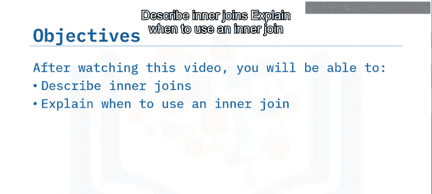


## 什么是连接操作？

连接操作基于两个或多个表之间某些列的关系，将这些表的行组合起来。

表连接主要有两种类型：**内部连接**和**外部连接**。

最常见的连接类型是内部连接，它只显示两个表中在公共列上具有匹配值的行。这个公共列通常是一个表的主键，同时也是另一个表的外键。

---

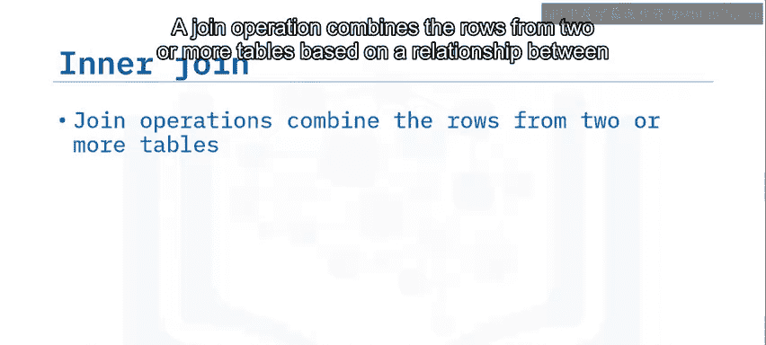

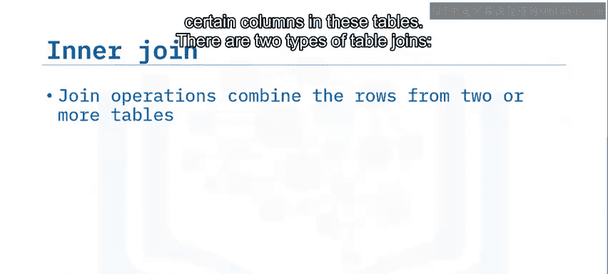

## 内部连接的语法

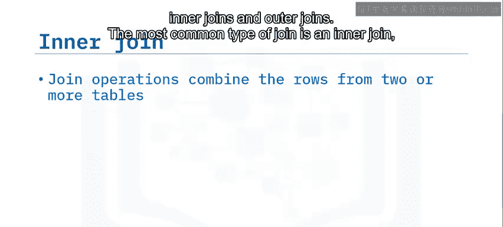

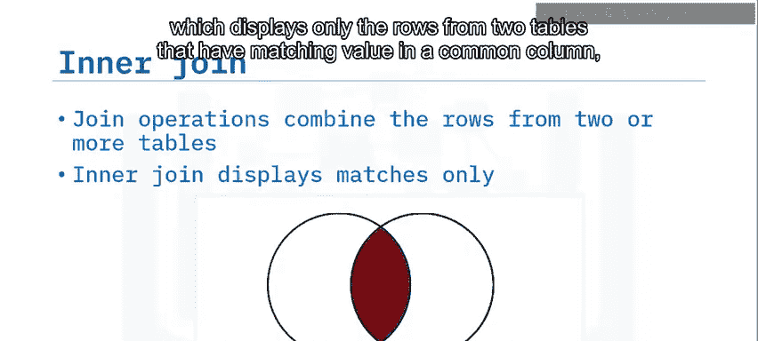

上一节我们介绍了连接操作的基本概念，本节中我们来看看内部连接的具体语法。


以下是一个内部连接SELECT语句的语法示例：

```sql
SELECT B.borrower_id, B.last_name, B.country, L.borrower_id, L.loan_date
FROM borrower AS B
INNER JOIN loan AS L
ON B.borrower_id = L.borrower_id;
```

想象一下，你想检索所有借书人及其借书日期的列表。这需要从`borrower`表和`loan`表中获取数据。

在`FROM`子句中，我们指定了`borrower`表和`loan`表之间的连接：`borrower INNER JOIN loan`。我们使用别名`B`代表`borrower`表，`L`代表`loan`表。

在`JOIN`子句左侧指定的表称为**左表**。在这个例子中，`borrower`表是左表。

对于这个连接，我们从`borrower`表中选择`borrower_id`、`last_name`和`country`列，从`loan`表中选择`borrower_id`和`loan_date`列。

在`ON`子句中，我们指定了**连接谓词**。在这个例子中，条件是`borrower`表中的`borrower_id`等于`loan`表中的`borrower_id`。

请注意，在这个连接中，每个列名前都带有字母`B`或`L`作为前缀。在SQL中，这被称为**别名**。使用别名比重复书写整个表名要方便得多。

---

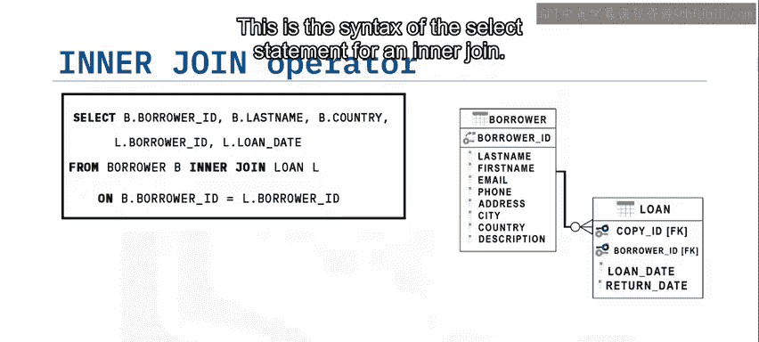

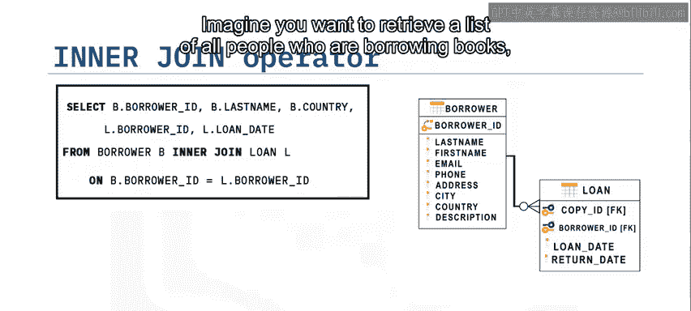

## 结果集说明

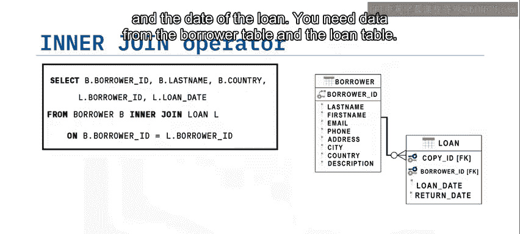

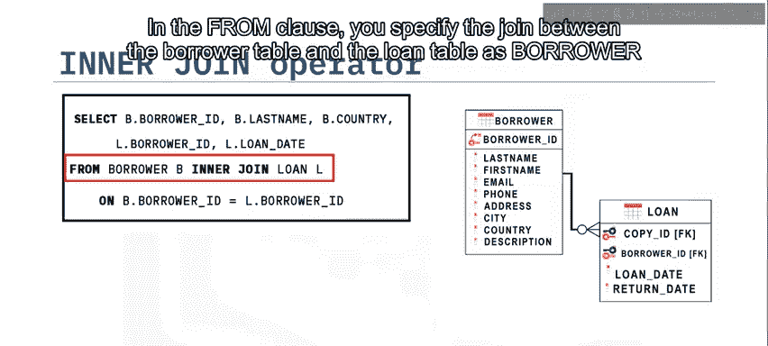

以下是内部连接查询的结果集特点：

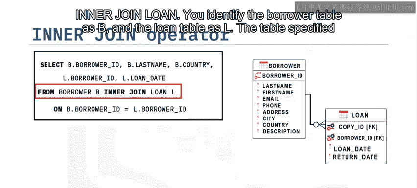

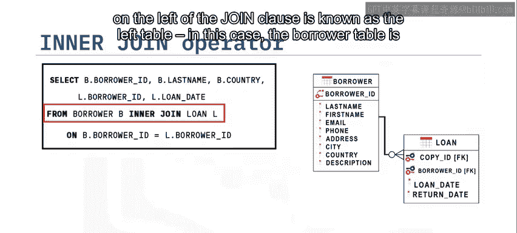

结果集仅显示两个表中具有相同`borrower_id`的行。

`borrower_id`、`last_name`和`country`列取自`borrower`表，并与来自`loan`表的`borrower_id`和`loan_date`列连接在一起。

只有当`borrower_id`匹配时，相应的行才会被显示出来。

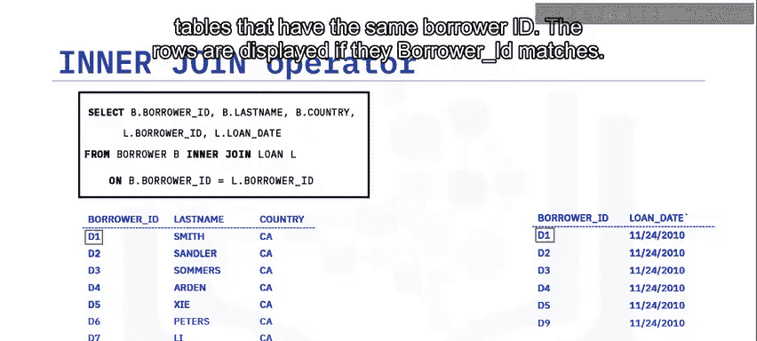

---

## 总结

本节课中我们一起学习了SQL的**内部连接**。

你了解到，内部连接只返回那些在公共列上具有匹配值的行。这个公共列通常是一个表的主键，同时作为外键存在于第二个表中。

来自连接表中没有匹配值的行，不会出现在最终的结果集中。

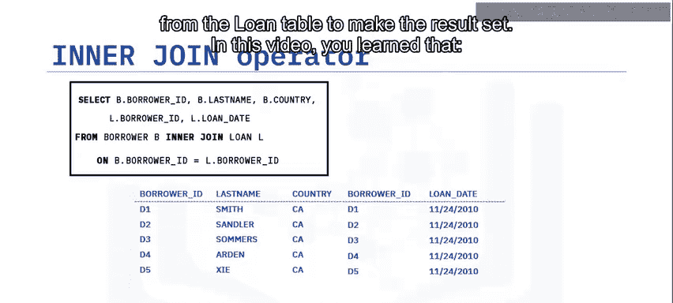

通过掌握内部连接，你能够有效地从多个相关的数据库表中组合和提取所需的信息。