# 001：《Linux命令和Shell脚本入门实践》｜课程介绍

在本节课中，我们将要学习Linux命令和Shell脚本的基础知识。课程将介绍Linux操作系统、常用命令以及如何编写Shell脚本来自动化任务。掌握这些技能对于软件开发者、数据科学家、数据工程师、系统管理员等角色都至关重要。

## 课程概述

本课程由三位讲师共同教授：来自Skill Up Technologies的资深专家Rammesh Sanarreti、IBM全球项目总监Ravahucha，以及IBM的数据科学家兼软件开发者Sam Praopchuk。课程内容涵盖Linux基础、常用命令和Bash Shell脚本编写。

学习Linux命令和Shell脚本能提升你的工作灵活性。无论你是软件开发者、数据科学家、数据工程师、系统管理员、DevOps专业人员、系统架构师还是软件工程师，一旦掌握了Bash命令，编写脚本以简化各类数据管道和应用程序工作流的构建过程就会相对容易。

## 课程内容结构

上一节我们介绍了课程的整体目标，本节中我们来看看课程的具体内容安排。

课程首先介绍Linux。你将了解Unix和Linux的起源、Linux发行版的架构，以及如何在Linux终端中完成简单任务。

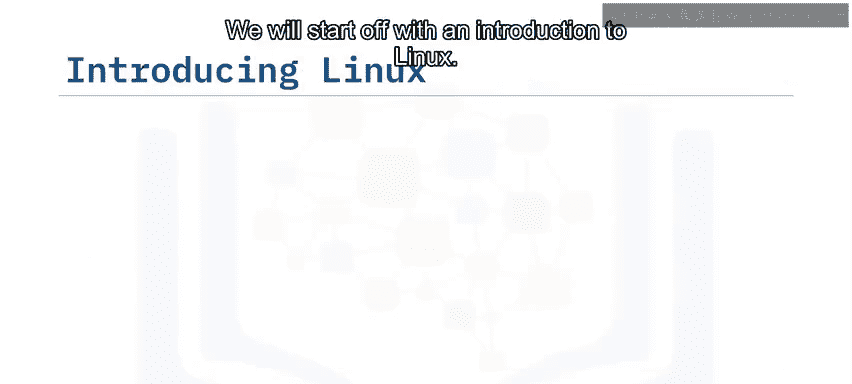

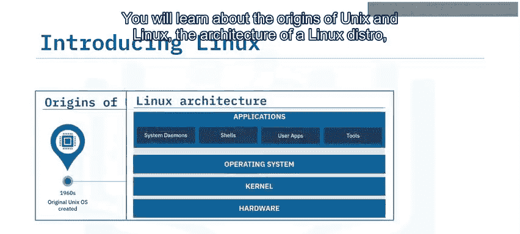

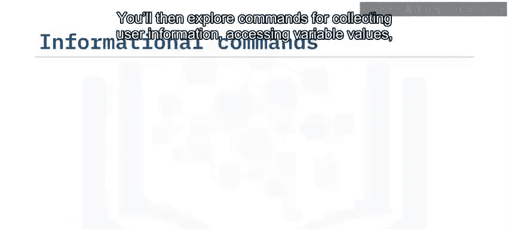

接着，你将探索用于收集用户信息、访问变量值以及向终端窗口打印有用输出的命令。

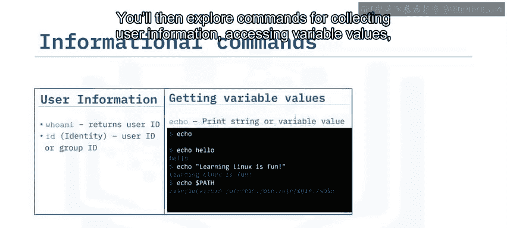

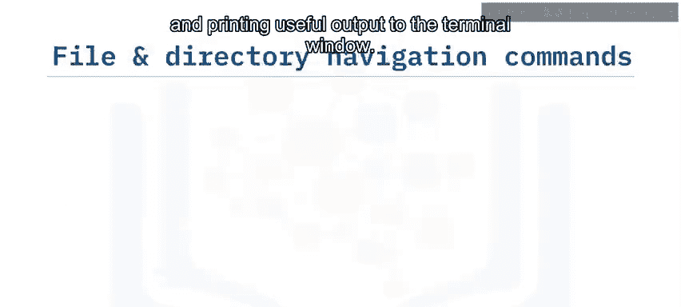

你将学习如何通过以下方式导航文件系统：列出目录及其内容、随时确定你在目录树中的位置、轻松移动到其他目录，以及快速找到所需文件。你还将学习如何管理文件和目录，包括创建新目录、删除不需要的目录、创建新文件以及复制和移动文件与目录。

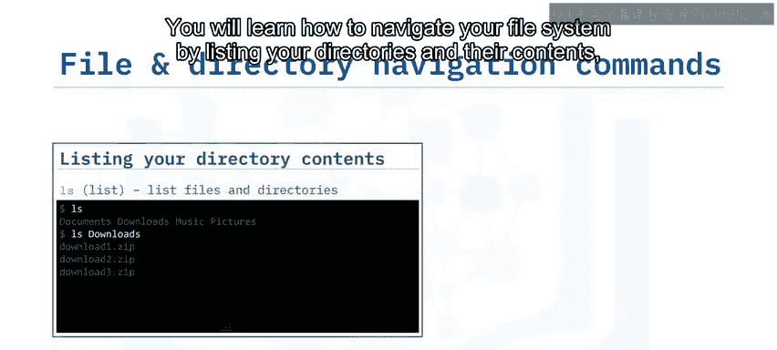

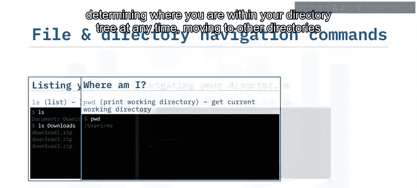

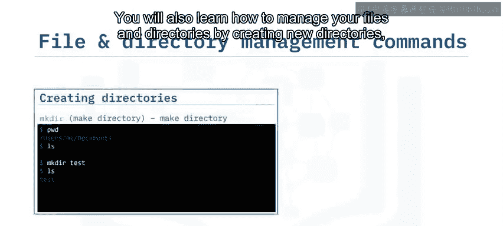

你将学习以各种方式查看文件内容，例如使用`cat`命令和`more`命令。你还将发现如何获取文件内容的有用摘要信息，并获得创建文件内容自定义视图的经验，例如按行排序内容、从视图中排除重复行以及从每行中提取特定部分。

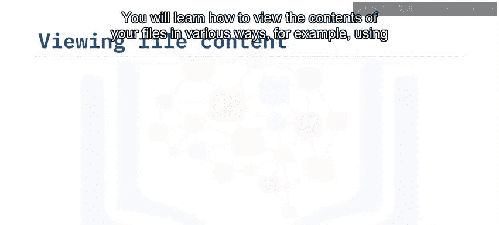

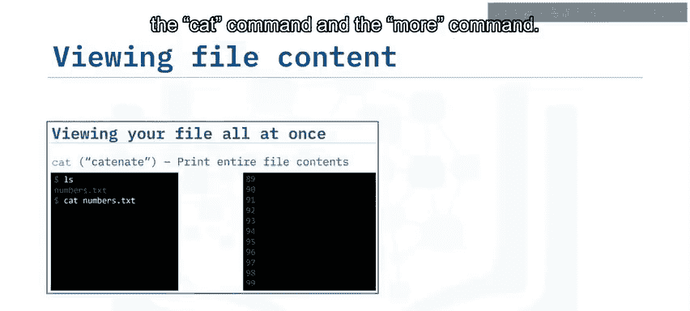

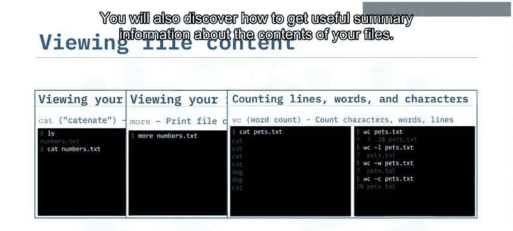

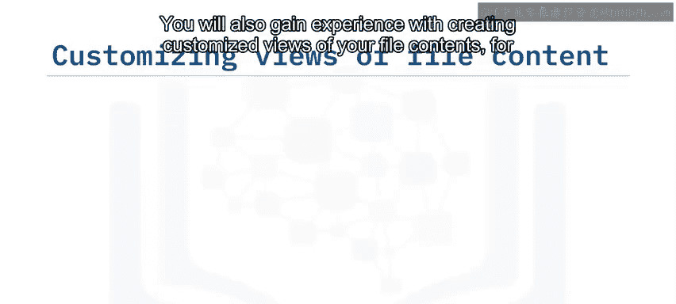

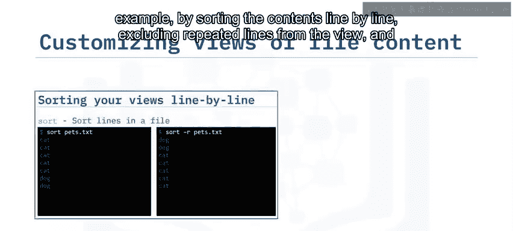

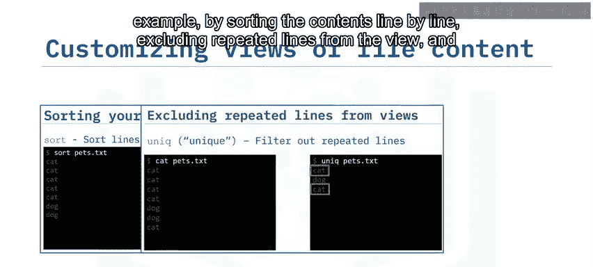

你将通过实践获得以下经验：归档目录树中的文件和目录、从归档中提取文件和文件夹、从压缩归档中提取和解压文件。你还将通过应用网络命令获得技能，例如确定主机名、获取网络配置的详细信息以及方便地从网络下载文件。

我们将继续介绍Shell脚本。你将探索脚本和Bash Shell脚本的各个方面，包括Shell脚本的用途、如何创建和运行自己的Shell脚本。你还将获得关于过滤命令以及使用管道命令将过滤器链接在一起的宝贵知识。此外，你将学习定义Shell变量和环境变量。在此过程中，你将发现Bash Shell的有用功能，包括元字符的使用、输入输出重定向以及将命令行上指定的参数传递给Shell脚本。

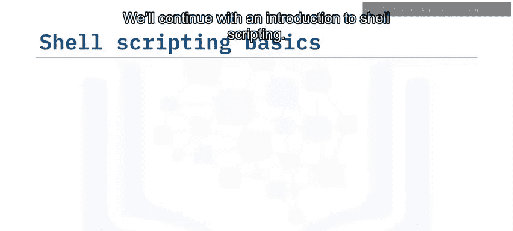

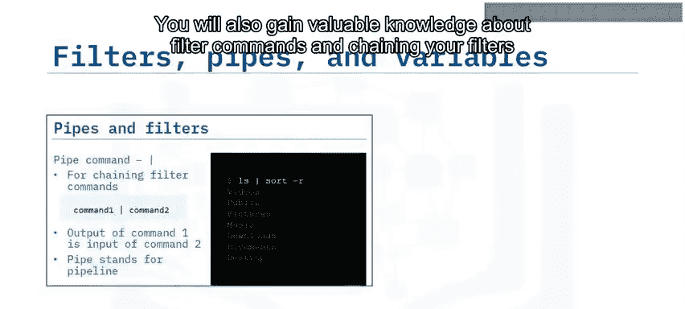

你还将通过全面了解用于运行作业的Cron服务、使用`crontab`调度作业以及查看和编辑当前在系统上运行的Cron作业，来学习如何将Shell脚本投入生产。

最后，你将通过完成一个涉及各种Linux命令和构建Shell脚本的实践项目来测试新获得的技能。

## 学习建议

为了从本课程中获得最大收益，请观看每个视频并通过测验检查学习效果，使用讨论论坛与同学和助教联系，最重要的是，确保完成实践实验以练习新技能并展示你的能力。

祝贺你开启这段激动人心的旅程的下一步，祝你好运！

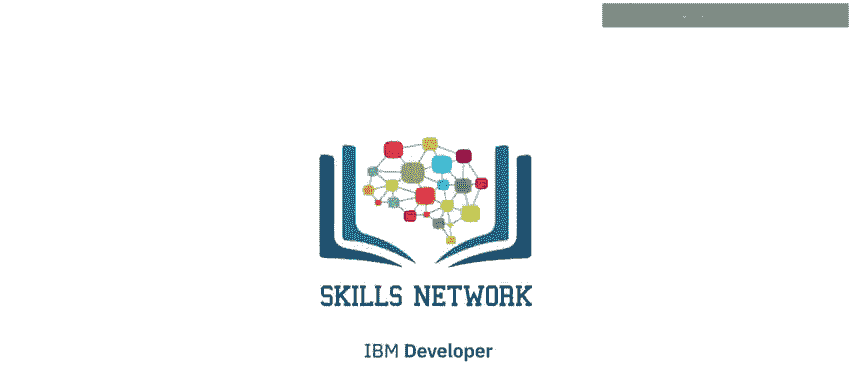

## 总结

本节课中我们一起学习了《Linux命令和Shell脚本入门实践》课程的介绍部分。我们了解了课程目标、讲师团队、核心内容结构以及学习建议。课程将从Linux基础开始，逐步深入到常用命令和Shell脚本编写，最终通过实践项目巩固所学知识。