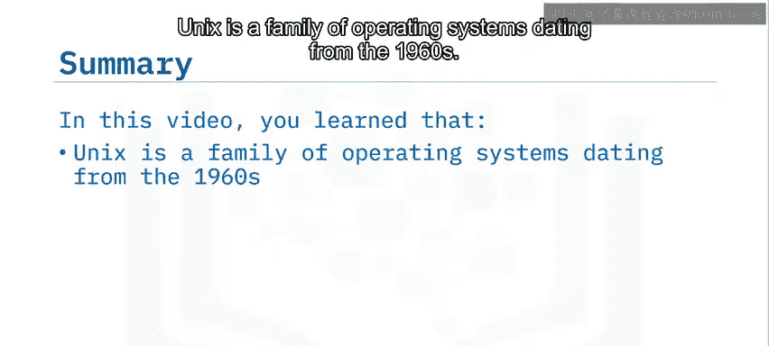
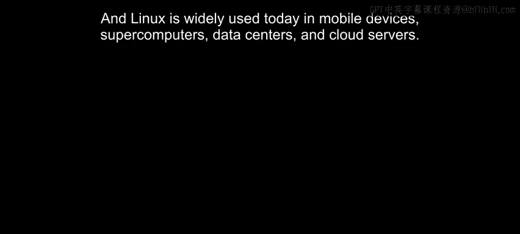

# 002：Linux与Unix介绍 🐧

在本节课中，我们将学习操作系统的基本概念，并追溯Linux与Unix操作系统的起源与发展。我们将了解它们是什么，以及它们在现代计算中的核心地位。

## 什么是操作系统？

操作系统是一种软件，它管理计算机的硬件和资源，并允许用户与硬件交互以执行有用的任务。你可以将操作系统视为计算机硬件与用户或应用程序之间的**中介**。

## Unix是什么？

Unix实际上是一个**操作系统家族**。一些流行的基于Unix的操作系统包括Oracle Solaris、OpenSolaris、FreeBSD、HP-UX、IBM AIX以及当今最流行的桌面操作系统之一——Apple Mac OS。

在20世纪60年代，最初的Unix操作系统在AT&T贝尔实验室被创造出来。然而，与当时的许多操作系统一样，它是为特定的硬件系统（PDP-7计算机）设计的。

到了70年代，Unix操作系统用C语言进行了重写，这使其区别于其他系统，并使其能够**移植**到多种硬件架构上。

随后在70年代末，加州大学伯克利分校开发了伯克利软件发行版，即BSD。它是Unix的一个附加组件，提供了额外的软件和功能。著名的Mac OS后来就是从BSD衍生而来的。

## Linux是什么？

Linux是一个**类Unix**的操作系统家族。不过，当人们提到Linux时，通常指的是某个特定的发行版或“风味”。Linux的开发初衷是为了创建一个免费、开源的Unix操作系统版本。

以下是Linux的关键特性：

*   **免费且开源**：这意味着任何人都可以查看其源代码。由于有无数双眼睛审视着代码，Linux多年来已成为最安全的操作系统。
*   **多用户**：Linux设计用于支持多个用户同时访问系统。
*   **多任务**：支持同时运行多个作业和应用程序。
*   **可移植性**：Linux已被移植到许多不同类型的设备和硬件平台上运行，从台式机到服务器再到各种设备。

## Linux是如何诞生的？

在20世纪80年代，GNU项目在麻省理工学院启动。GNU代表“GNU‘s Not Unix”，它旨在创建一套免费、开源的现有Unix系统工具。

1991年，林纳斯·托瓦兹开发了一个免费、开源的Unix内核版本，命名为**Linux**。内核是操作系统的核心组件，它使各个组件能够与机器的硬件进行通信。

> 这是林纳斯·托瓦兹著名的帖子，他在其中分享了自己制作开源类Unix内核的进展。他提到了Minix，那是当时另一个类Unix的内核。

不久之后，在1992年，人们意识到了将GNU项目与Linux内核结合起来的潜力，流行的Linux操作系统开始出现。

1996年，一位名叫拉里·尤因的计算机科学家创作了**Tux the Penguin**，后来被林纳斯·托瓦兹采纳为Linux的官方吉祥物。

## Linux的现代应用

如今，基于BSD的Mac OS运行在全球数百万台设备上。数十亿个Linux实例运行在服务器上，为我们提供着现代网络服务。特别是在开发者群体中，Ubuntu等现代Linux操作系统开始在个人电脑领域越来越受欢迎。

那么，Linux在今天最常见的用途有哪些呢？以下是其主要应用场景：

*   **智能手机**：通过使用基于Linux内核的Android操作系统，Linux运行在全球数十亿部智能手机上。
*   **超级计算机**：Linux被广泛应用于超级计算机领域，许多由Linux驱动的服务器集群在一起，用于高性能计算应用。
*   **企业与云数据中心**：企业和云数据中心也在数百万台服务器上使用Linux，运行着各种应用程序、Web服务器、数据库等。
*   **个人电脑**：Linux的各个版本可以轻松用作个人电脑的操作系统。如今，许多人安装Linux是为了学习体验，或将其作为日常使用的主力系统。

---

在本节课中，我们一起学习了：Unix是一个起源于20世纪60年代的操作系统家族；Linux最初在80年代被开发，作为Unix的免费开源替代品；Linux具有多用户、可移植和支持多任务的特性；以及Linux如今被广泛应用于移动设备、超级计算机、数据中心和云服务器中。