# 003：Linux发行版

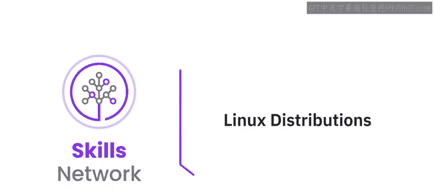

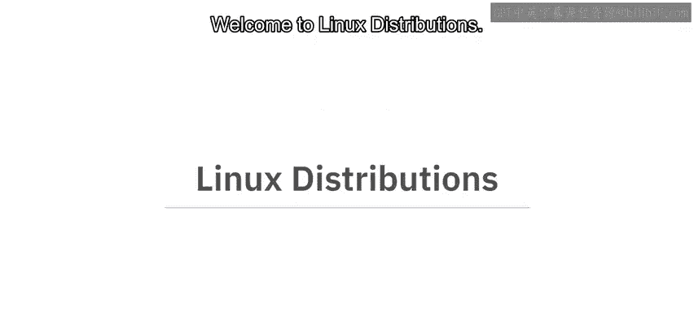

在本节课中，我们将要学习什么是Linux发行版，了解几种常见发行版之间的区别，并认识一些流行发行版的主要应用场景。

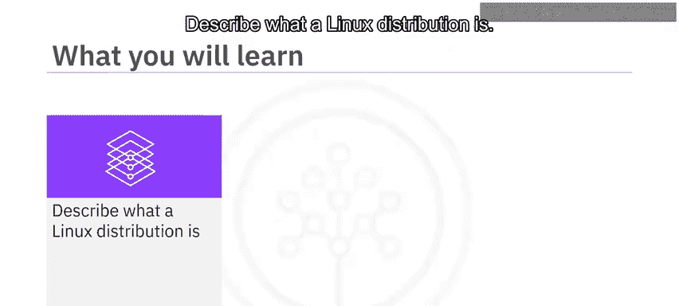

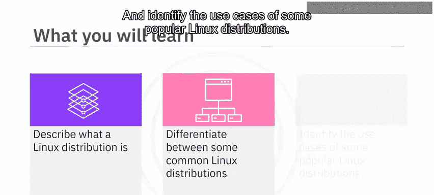

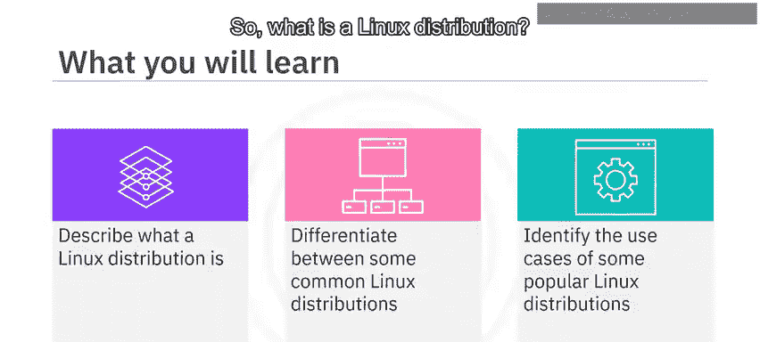

## 什么是Linux发行版？

Linux发行版是Linux操作系统的特定“风味”，也常被称为“发行版”或“distro”。所有Linux发行版都必须使用**Linux内核**。内核是Linux操作系统的核心组件，它使得系统能够正确使用计算机的硬件。如今，有数百种Linux发行版，每一种都针对特定的用户群体或任务进行了定制。

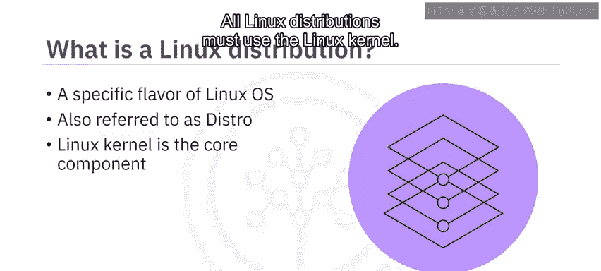

## Linux发行版之间有何不同？

上一节我们介绍了Linux发行版的基本概念，本节中我们来看看它们之间的主要区别。以下是区分不同发行版的关键因素：

*   **默认工具集**：每个发行版都包含一套独特的默认工具，这些工具是操作系统的一部分，例如预装在发行版中的命令和应用程序。
*   **图形用户界面**：每个发行版都有自己的图形用户界面，用于与操作系统交互。
*   **支持的Shell命令**：每个发行版支持一组特定的命令，可以在Shell窗口中使用这些命令进行输入和接收输出。
*   **支持模式**：发行版的支持模式各不相同。它可能是一个社区支持的项目，也可能由商业企业维护；它可能是长期支持版本，也可能是滚动更新版本。

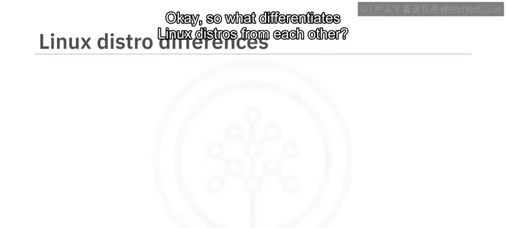

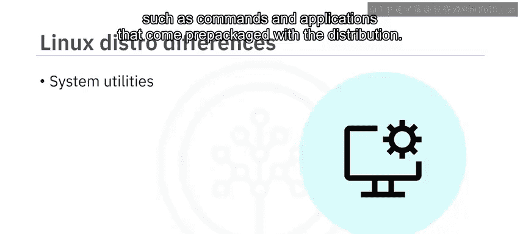

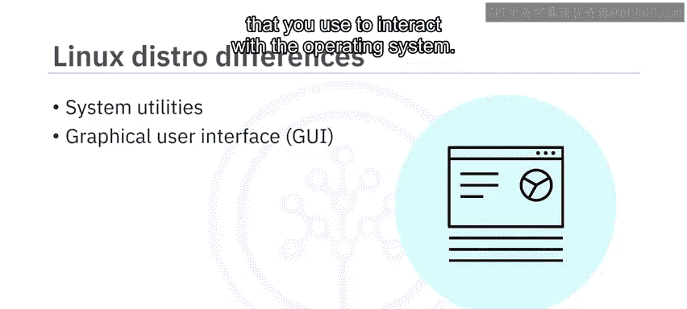

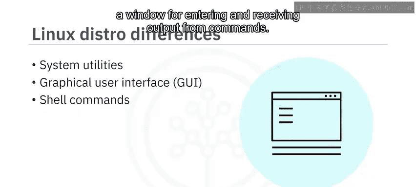

## 常见的Linux发行版

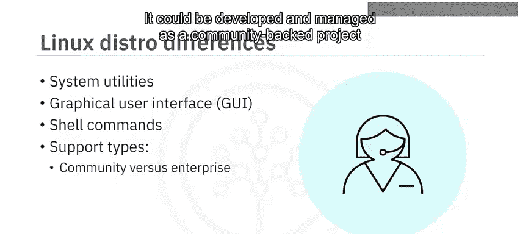

了解了发行版之间的区别后，我们来看看一些具体且流行的Linux发行版。

### Debian

Debian是最早的发行版之一，首个版本（0.01版）于1993年发布，首个官方稳定版（1.1版）于1996年发布。它以**稳定、可靠和完全开源**而闻名。它支持多种计算机架构，这些特性使得Debian在服务器领域备受推崇。此外，Debian是目前最大的社区运营发行版。

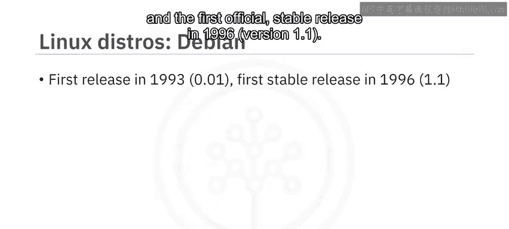

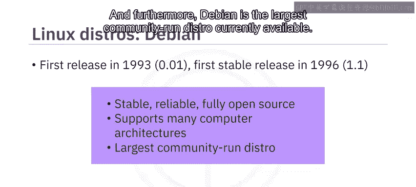

### Ubuntu

另一个流行的发行版是Ubuntu。它也是一个早期发行版，首个官方版本于2004年发布。Ubuntu是**基于Debian**的，这意味着它构建在Debian之上，并使用了许多与Debian相同的工具。Ubuntu由Canonical公司开发和管理。Ubuntu有三个官方版本：桌面版、服务器版和核心版。

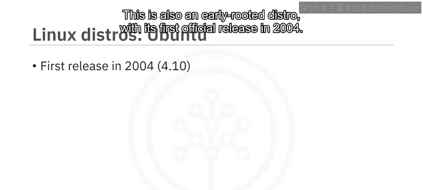

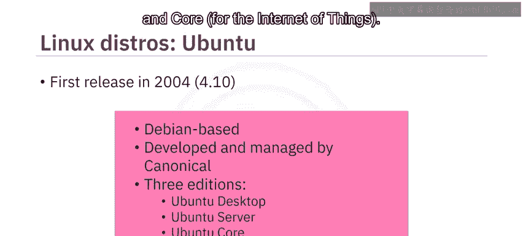

以下是Ubuntu的官方版本：

*   **桌面版**：用于个人电脑、笔记本电脑和工作站。
*   **服务器版**：用于简单的文件服务器或多节点云。
*   **核心版**：用于物联网设备。

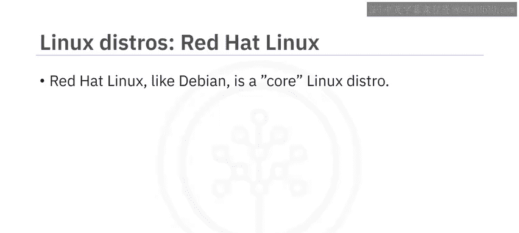

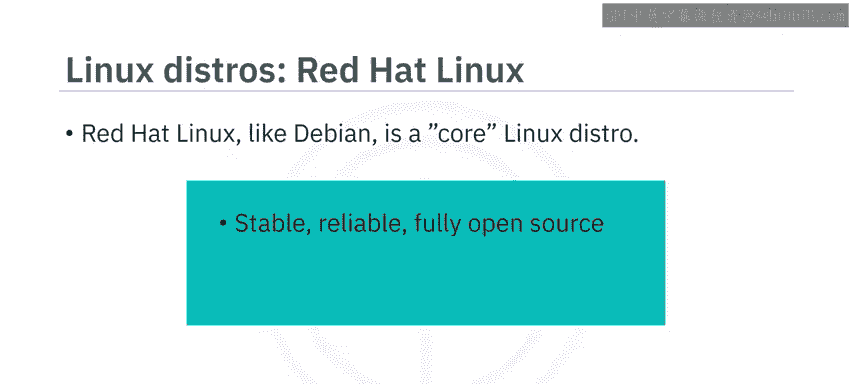

### Red Hat Enterprise Linux

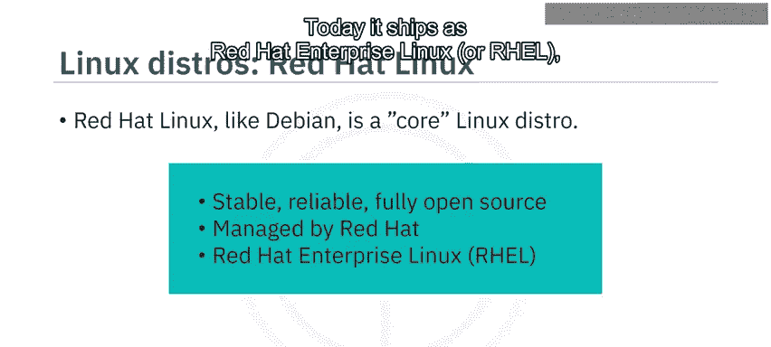

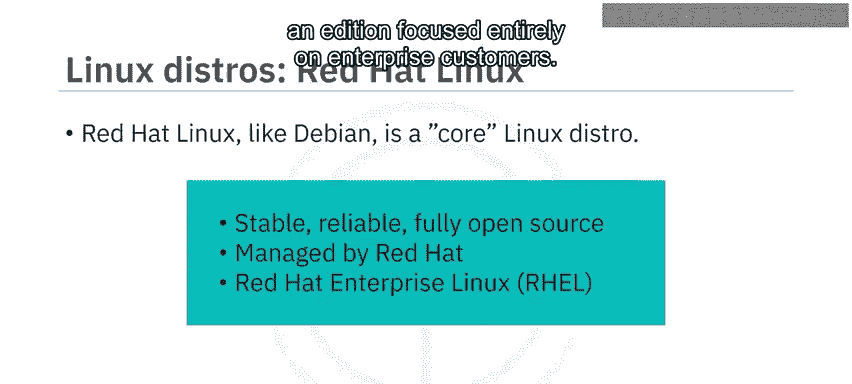

与Debian一样，Red Hat Linux是一个核心Linux发行版，这意味着它不是从其他Linux发行版派生而来。Red Hat以**稳定、可靠和完全开源**而闻名，它由Red Hat（IBM的子公司）管理。如今，它以Red Hat Enterprise Linux的形式发布，这是一个完全专注于企业客户的版本。

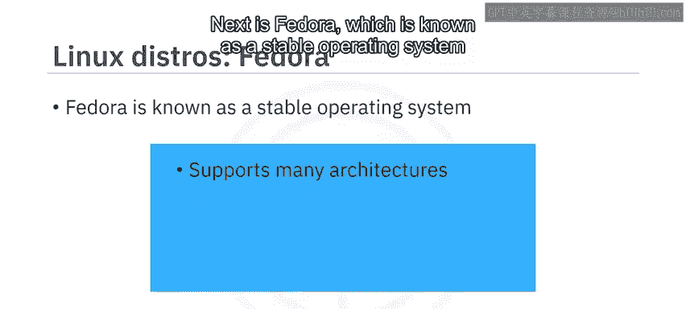

### Fedora

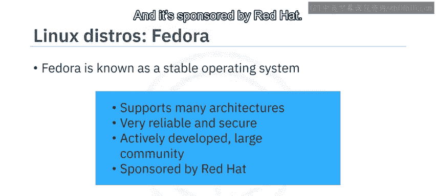

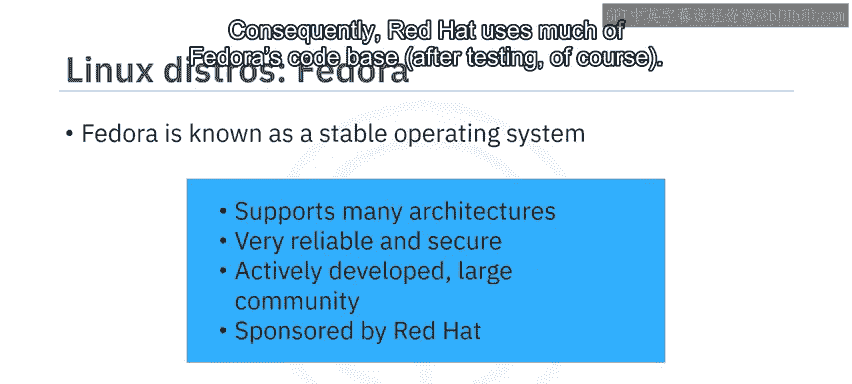

接下来是Fedora，它以一个**支持多种架构的稳定操作系统**而闻名。它也非常可靠和安全，提供独特的防火墙和安全功能。它由一个庞大且不断增长的社区积极开发，并由Red Hat赞助。值得注意的是，Red Hat在测试后会使用Fedora的大量代码库。

### SUSE Linux Enterprise

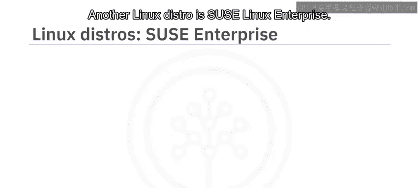

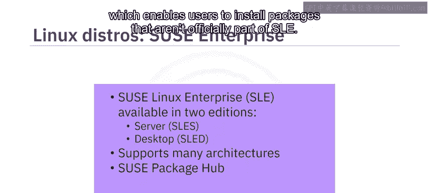

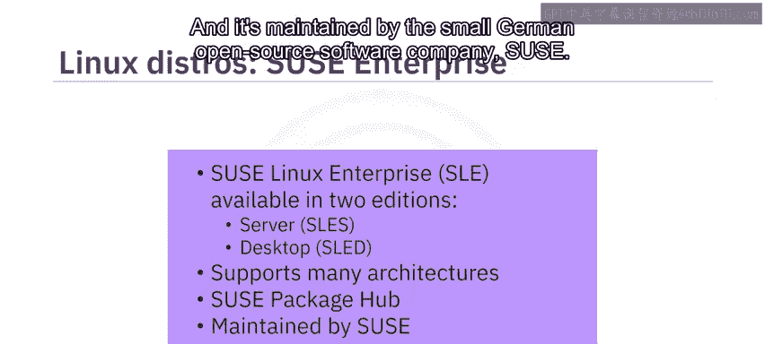

另一个Linux发行版是SUSE Linux Enterprise。SUSE Linux Enterprise有两个版本：服务器版和桌面版。它支持多种架构，并使用SUSE包中心，使用户能够安装不属于SUSE Linux Enterprise官方部分的软件包。它由德国开源软件公司SUSE维护。

以下是SUSE Linux Enterprise的版本：

*   **服务器版**：用于企业服务器环境。
*   **桌面版**：用于企业桌面环境。

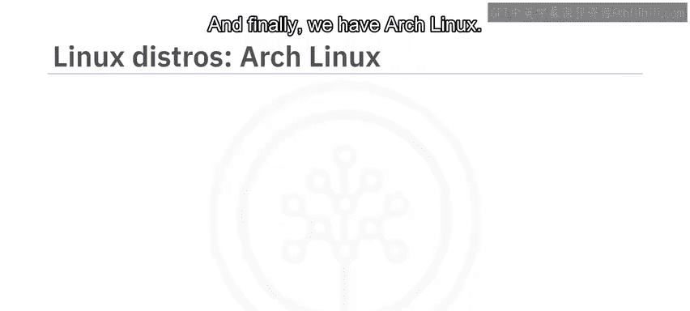

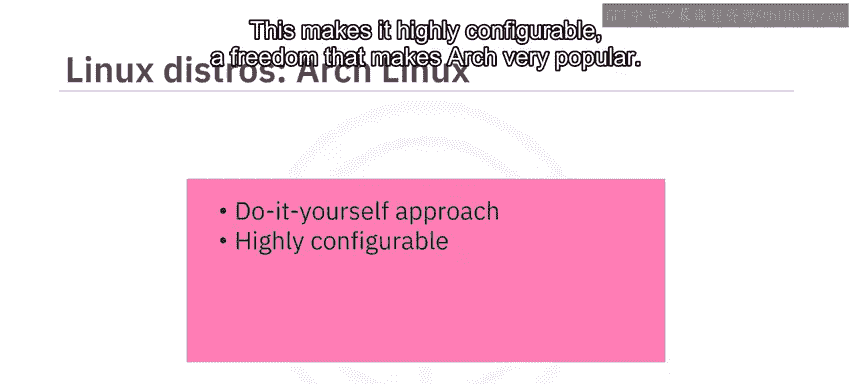

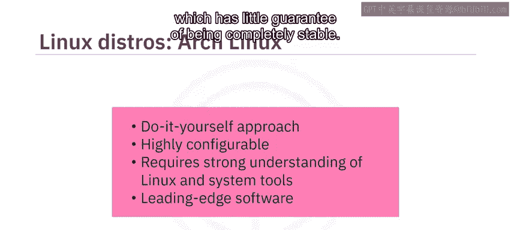

### Arch Linux

最后，我们还有Arch Linux。Arch Linux独特的“自己动手”方法允许用户自定义系统的每个部分。这使其具有**高度可配置性**，这种自由度使得Arch非常受欢迎，但这也意味着你需要对Linux和系统工具有深入的了解才能有效使用Arch。此外，由于Arch不像其他发行版那样专注于稳定性，它可以轻松获取最新的软件，但这些软件几乎没有完全稳定的保证。

## 总结

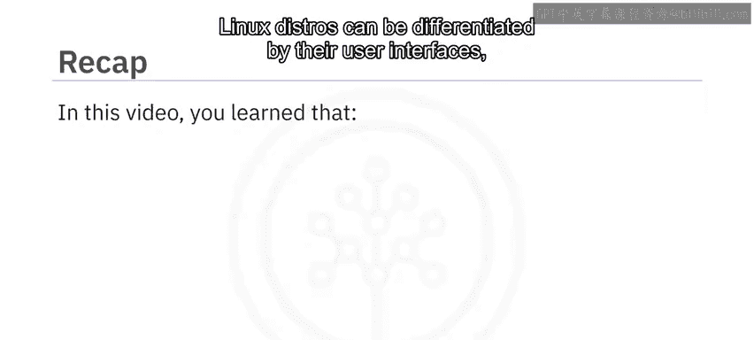

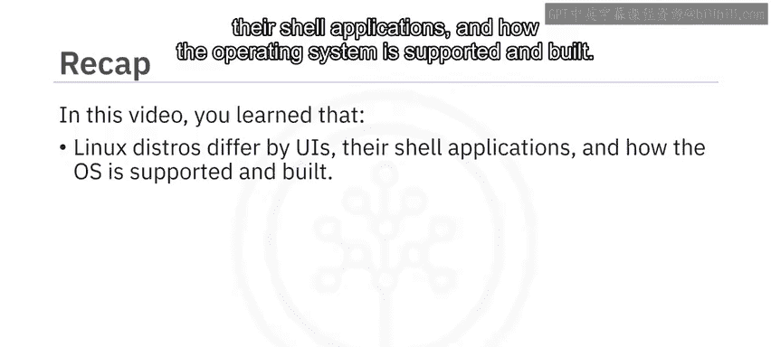

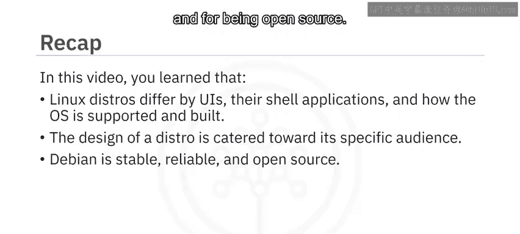

本节课中我们一起学习了Linux发行版。你了解到Linux发行版可以通过其用户界面、Shell应用程序以及操作系统的支持和构建方式来区分。Linux发行版的设计是针对特定受众的：Debian因其稳定性、可靠性和开源特性在服务器领域备受推崇；Red Hat Enterprise Linux完全专注于企业客户；而SUSE Linux Enterprise支持多种架构。