# 004：Linux架构概述 🏗️

在本节课中，我们将要学习Linux系统的整体架构。通过了解其层次结构、各层功能以及文件系统组织，你将能够清晰地理解Linux是如何工作的。

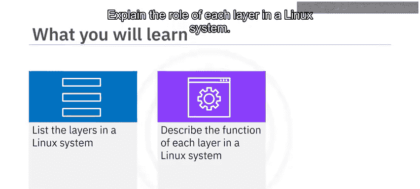

---

## 概述

Linux系统由五个不同的层次构成，从最外层的用户交互界面到最内层的物理硬件。理解这些层次及其相互关系，是掌握Linux操作系统的第一步。

---

## Linux系统的五层架构

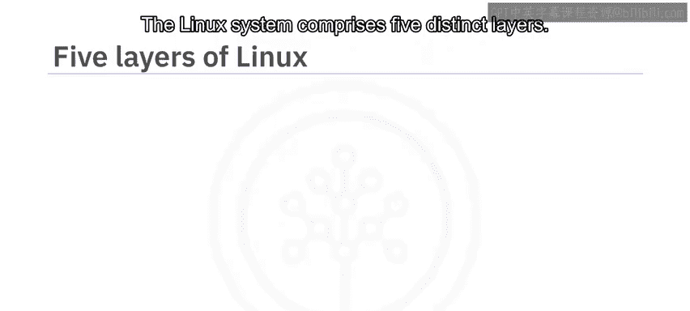

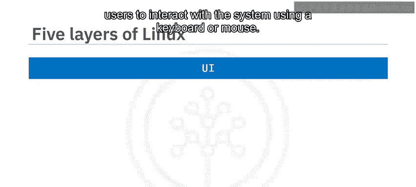

Linux架构可以形象地看作一个五层的模型，每一层都有其特定的职责。

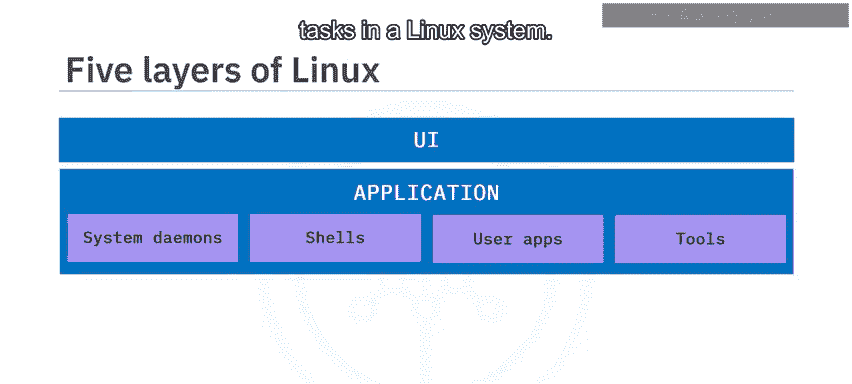

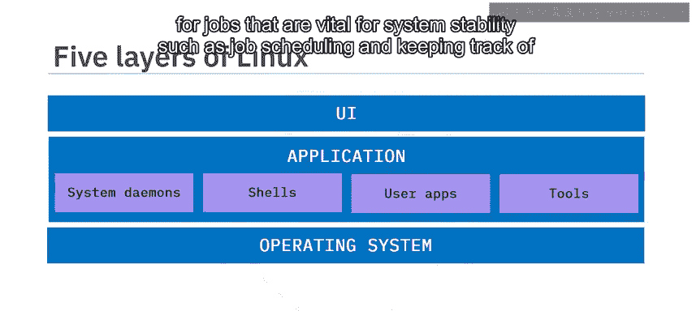

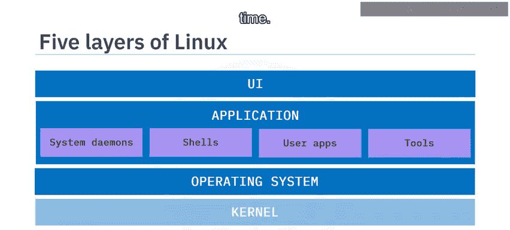

### 第一层：用户界面

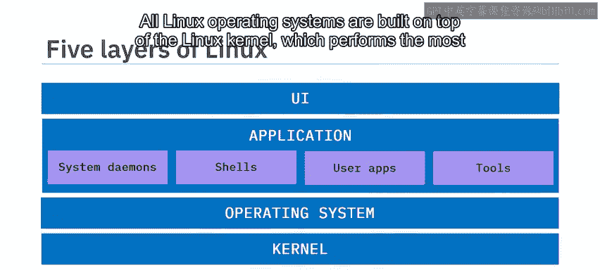

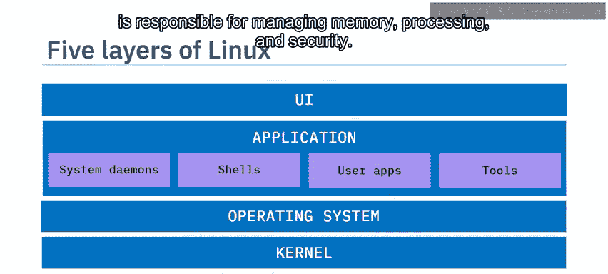

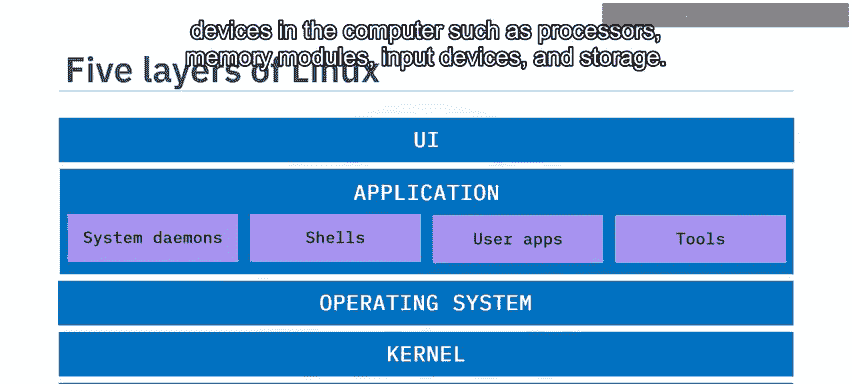

用户界面是Linux架构的最外层，它允许用户通过键盘或鼠标等控制设备与系统进行交互。

桌面版的Linux通常包含一个图形用户界面，其功能类似于微软的Windows系统。这使得用户可以使用鼠标等设备来操作应用程序。例如，你可能会在Linux机器上使用网页浏览器给朋友发送电子邮件，或者使用音乐播放器听你最喜欢的歌曲。

### 第二层：应用程序层

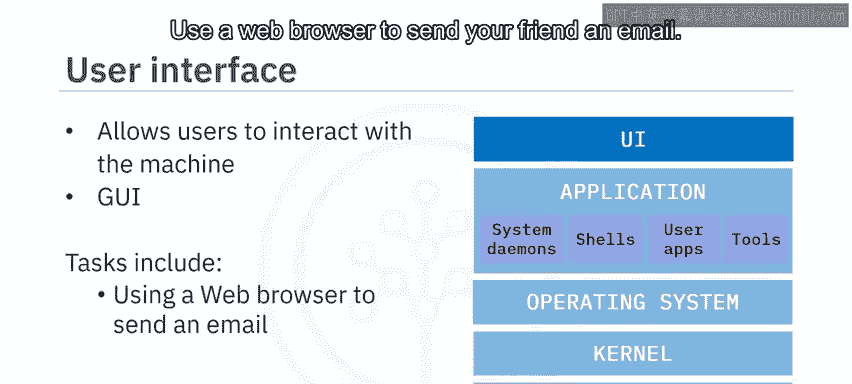

应用程序层包含了用于在Linux系统中执行任务的软件。

以下是应用程序层可能包含的内容：
*   **系统工具**：例如编译器和编程语言。
*   **Shell**：一种特殊的应用程序，通常是操作系统本身的一部分。
*   **用户应用程序**：可以是任何类型的应用，从浏览器、文本编辑器到游戏。

应用程序通过与操作系统通信来执行任务。

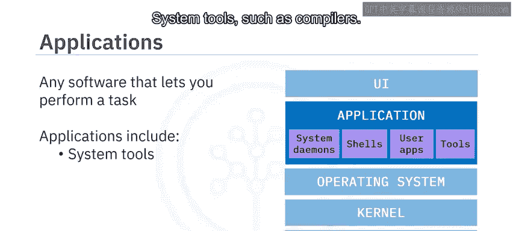

### 第三层：操作系统

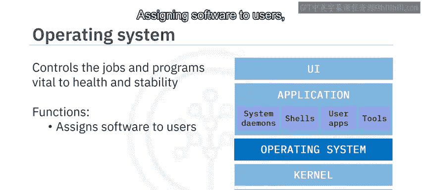

操作系统负责对系统健康和稳定至关重要的作业和程序。

它的功能还包括：
*   为用户分配软件。
*   检测错误并采取措施防止系统完全崩溃。
*   执行文件管理。

### 第四层：Linux内核

在Linux系统中，操作系统构建在Linux内核之上，内核执行最核心、最底层的操作。

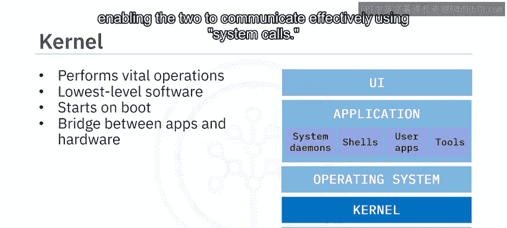

内核是Linux系统中最低级别的软件，对系统拥有完全的控制权。它在计算机启动时就开始运行，并在系统运行时一直驻留在内存中。内核还充当应用程序和机器硬件之间的桥梁，通过**系统调用**使两者能够有效通信。

内核有四个关键任务：
1.  **内存管理**
2.  **进程管理**
3.  管理设备驱动程序以提供正确的硬件支持
4.  确保系统安全

### 第五层：硬件层

Linux系统的最后一层是硬件层，它由构成计算机的物理或电子设备组成。

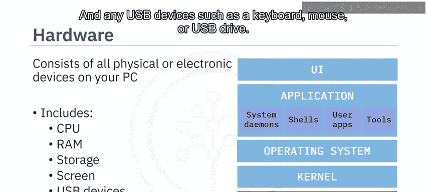

硬件层可以包括以下组件：
*   **中央处理器**：负责执行大部分计算。
*   **随机存取存储器**：一种快速存储单元，用于保存应用程序运行所需的临时信息。
*   **持久存储设备**：用于在计算机关闭后保存需要持久化的数据。
*   计算机屏幕。
*   任何USB设备，如键盘、鼠标或U盘。

---

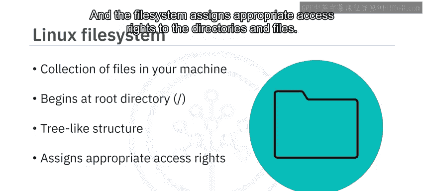

## Linux文件系统

上一节我们介绍了系统的层次结构，本节中我们来看看Linux如何组织和管理所有数据——即文件系统。

Linux文件系统是你机器上所有文件的集合。它包括运行机器和应用程序所需的文件，以及包含你工作内容的个人文件。

文件系统的顶层是**根目录**，用一个正斜杠 `/` 表示。根目录之下是一个树状结构，包含了系统中的所有目录和文件。文件系统会为这些目录和文件分配合适的访问权限。

### 关键目录介绍

根目录位于Linux文件系统的最顶端，包含许多其他目录和文件。

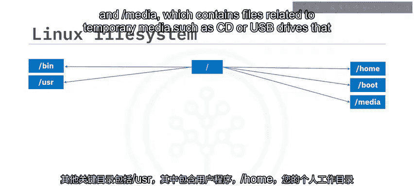

以下是几个关键目录：
*   **`/bin`**：包含用户二进制文件。二进制文件包含机器读取以运行程序和执行命令的代码。它被称为 `/bin` 表示它直接存在于根目录之下。
*   **`/usr`**：包含用户程序。
*   **`/home`**：这是你的个人工作目录，你应该在这里存储所有个人文件。
*   **`/boot`**：包含系统启动文件，即对系统启动至关重要的指令。
*   **`/media`**：包含与临时媒体相关的文件，例如连接到系统的CD或USB驱动器。

根目录中还有其他几个目录，但在本课程中你不需要访问它们。Linux系统中的所有文件和目录都根据其用途，被组织到这些指定的文件夹中。

---

## 总结

本节课中我们一起学习了Linux系统的核心架构。我们了解到，一个Linux系统由五个关键层次构成：**用户界面**使用户能够通过控制设备与应用程序交互；**应用程序**使用户能够在系统内执行特定任务；**操作系统**运行在Linux内核之上，对系统健康和稳定至关重要；**内核**是最低级别的软件，使应用程序能够与你的硬件交互；**硬件**包括你PC的所有物理和电子组件。此外，我们还了解了**Linux文件系统**是一个包含系统上所有目录和文件的树状结构。掌握这些基础知识，将为后续学习具体的Linux命令和操作打下坚实的基础。