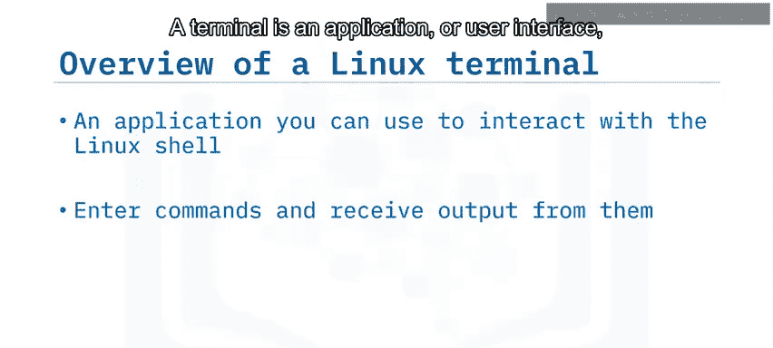
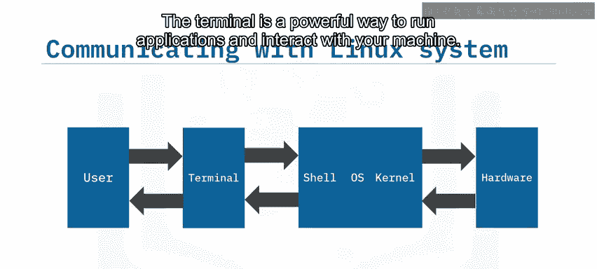
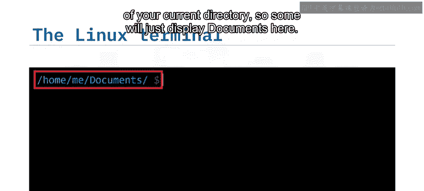
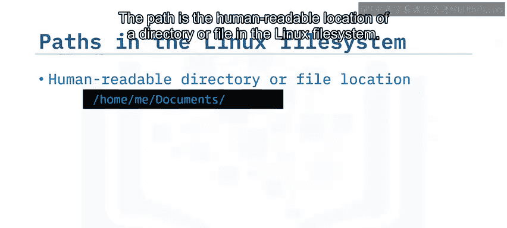
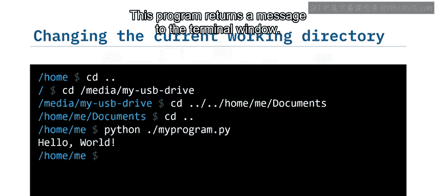
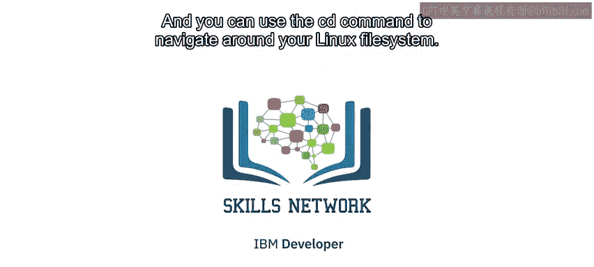

# 005：Linux终端概述 🖥️

在本节课中，我们将学习Linux终端的基础知识。你将了解什么是Linux Shell和终端，它们如何协同工作，并掌握使用终端进行目录导航的基本方法。

---

## 什么是Linux Shell？ 🐚

Linux Shell是一个操作系统级别的应用程序，用于解释用户输入的命令。在早期的Unix和Linux版本中，Shell是与操作系统交互的唯一方式。如今，虽然图形用户界面（GUI）也被广泛使用，但Shell因其灵活性和高效性，仍然是运行脚本文件和执行系统任务的流行选择。

通过Shell命令，你可以执行多种任务，例如：
*   移动和复制文件
*   写入和读取文件
*   提取和过滤数据
*   搜索数据

Shell有多种版本，例如**bash**和**csh**，但它们的基本功能大多相同。

---



## 什么是Linux终端？ 💻

上一节我们介绍了Shell，本节中我们来看看如何与Shell交互。用户通过Linux终端与Shell进行交互。终端是一个应用程序或用户界面，你可以在其中输入要运行的命令，并接收这些命令产生的任何输出。

例如，要启动Python应用程序并运行一个名为`my_program.py`的程序，你可以在终端中输入：
```bash
python my_program.py
```
当你按下回车键时，Shell就会运行这个命令。该程序可能会将“Hello world”这样的文字打印到终端上。



---

## 终端与Shell如何协同工作？ ⚙️

现在，我们来看看命令是如何被执行的。整个过程遵循以下步骤：
1.  **用户输入命令**：用户在终端中输入命令。
2.  **终端传递命令**：终端将命令传递给Shell。
3.  **内核翻译命令**：操作系统的核心组件——内核，将命令翻译成硬件可以执行的指令。
4.  **硬件执行**：硬件执行该命令。
5.  **内核读取结果**：命令执行完毕后，内核读取任何变化或结果。
6.  **结果返回用户**：内核通过Shell将结果发送回终端，最终呈现给用户。

终端是与机器交互、运行应用程序的强大方式。



---

## 终端界面与路径 📍



大多数终端都有一个类似的用户界面供你输入命令。输入命令的区域称为**命令行**，闪烁的竖线或光标称为**命令提示符**，它指示你键入的文本将显示的位置。

在命令提示符前，通常会显示**当前工作目录**。例如，提示符可能显示为`/home/me/documents$`，这表示当前位于`home`目录下的`me`目录中的`documents`目录里。当前工作目录是Shell寻找你指定要运行的命令的位置（例如上一节提到的`python`程序）。并非所有终端都显示完整路径，有些可能只显示`documents`。

**路径**是Linux文件系统中目录或文件的人类可读位置。斜杠`/`用于分隔目录层级，结构`A/B`表示名为`B`的文件或目录位于名为`A`的目录内。

以下是几个特殊的路径符号：
*   `~`：代表当前用户的**主目录**。
*   `/`：位于路径开头时，代表**根目录**。
*   `..`：代表当前目录的**父目录**。
*   `.`：代表**当前目录**。

---

## 使用终端导航目录 🧭

了解了路径的概念后，我们就可以学习如何在文件系统中移动了。你可以使用`cd`命令来改变当前工作目录。

以下是使用`cd`命令导航的示例：
*   输入`cd /`可以进入**根目录**。
*   输入`cd bin`可以从根目录进入`bin`目录。`bin`目录包含系统所需的程序。
*   在`bin`目录中，有一个名为`ls`的可执行文件。你可以通过输入`./ls`来运行它，以在终端窗口中显示当前目录内所有文件和目录的名称。

许多位于`bin`文件夹中的命令也被内置到了Shell中，因此你也可以从其他位置运行它们。例如，使用`cd ~`导航到你的主目录，即使当前工作目录`/home/me`不包含`ls`程序，你仍然可以成功运行`ls`命令。

让我们看更多例子。假设从`/home`目录开始：
*   输入`cd ..`可以将当前工作目录更改为现有目录的父目录。在这个例子中，`/home`的父目录是`/`（根目录）。
*   要导航到`/media`目录下名为`MyUSBDrive`的USB驱动器，可以输入`cd /media/MyUSBDrive`。
*   你也可以用一个命令在目录树中向上和向下导航。要向上导航到`/media`目录，再向上到根目录，可以输入`cd ../..`。
*   要向下导航到`/home/me/documents`目录，可以输入`cd /home/me/documents`，按回车提交命令即可移动到`documents`文件夹。

最后，让我们移动到`/home/me`目录，启动Python应用程序并运行该目录下的`my_program.py`程序：
```bash
cd /home/me
python my_program.py
```
这个程序会向终端窗口返回一条消息。

---



## 总结 📝

本节课中，我们一起学习了Linux终端的基础知识。我们了解到：
*   **Linux Shell**是一个操作系统级别的应用程序，可用于输入命令并查看命令输出。
*   我们使用**终端**向Shell发送命令。
*   我们可以使用`cd`命令在Linux文件系统中进行导航。



掌握这些基础知识是有效使用Linux命令行环境的第一步。