# 006：创建和编辑文本文件


在本节课中，我们将学习如何在Linux环境中创建和编辑文本文件。文本编辑器是编写代码和脚本的基础工具，掌握它们的使用对于数据工程师至关重要。

Linux提供了多种文本编辑器，主要分为两大类：命令行文本编辑器和图形用户界面（GUI）文本编辑器。

以下是几种常见的文本编辑器：

*   **GNU Nano**：一个小巧友好的非模态命令行文本编辑器。
*   **VI**：为Unix系统设计的传统命令行编辑器。
*   **VIM**：基于VI的、功能强大的模态命令行编辑器。
*   **Gedit**：GNOME桌面环境的默认GUI文本编辑器。
*   **Emacs**：一个历史悠久且仍在开发中的开源文本编辑器，可在GUI或命令行模式下使用。

## 🖥️ GUI文本编辑器：Gedit

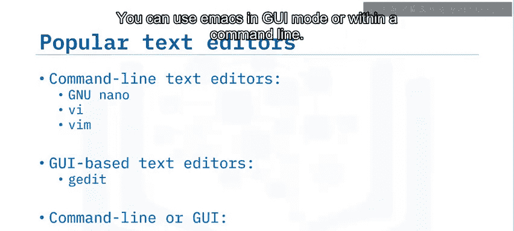

上一节我们介绍了文本编辑器的分类，本节中我们来看看一个流行的GUI编辑器——Gedit。

Gedit是一个现代的通用文本编辑器，预装在大多数Linux发行版中。它遵循GNOME项目的理念，强调简洁易用。Gedit提供了许多功能来提升文本编辑体验。

以下是Gedit的主要功能：

*   集成的文件浏览器。
*   撤销与重做功能。
*   支持在搜索字符串中使用正则表达式的查找与替换功能。
*   通过Gedit插件包实现功能扩展。
*   语法高亮显示，帮助解读代码的不同部分。

## ⌨️ 命令行文本编辑器：GNU Nano

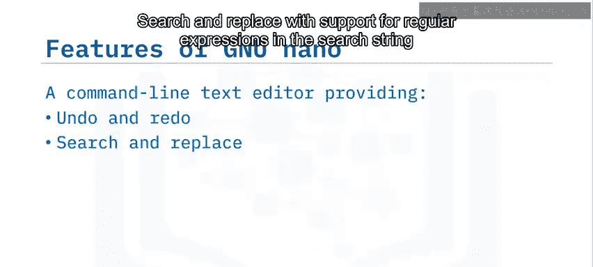

了解了GUI编辑器后，我们转向命令行环境。GNU Nano是一个命令行文本编辑器，在终端中提供了丰富的编辑功能。

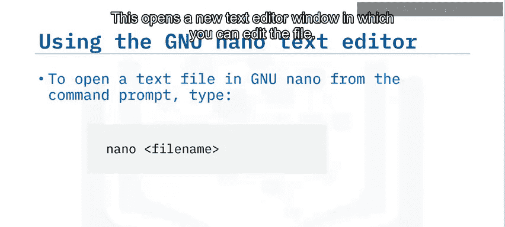

Nano提供了以下功能：

*   撤销与重做。
*   支持在搜索字符串中使用正则表达式的查找与替换。
*   语法高亮。
*   代码自动缩进。
*   显示行号。
*   逐行滚动。
*   多缓冲区支持，可同时处理多个文件。

要在Nano中打开一个文本文件，请在终端输入以下命令：

```bash
nano 文件名
```

这将打开一个新的文本编辑器窗口，你可以在其中编辑文件。

Nano应用程序界面主要分为两个区域。主区域显示打开文件的文本内容。窗口底部列出了可以在编辑器中使用的命令列表。

要使用这些命令，需同时按下`Control`键和对应的字母键。例如，按`Control + G`可以获取帮助。

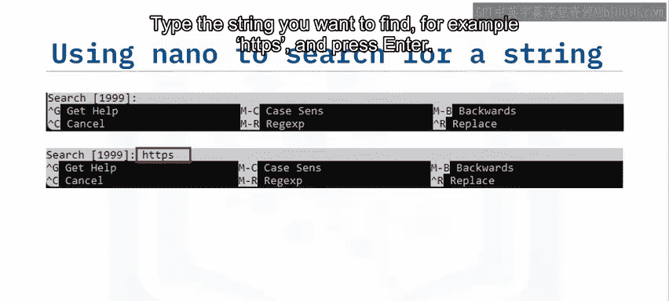

让我们看看如何使用其中几个编辑选项。

要搜索文本字符串，可以按`Control + W`使用“Where is”选项。这会在应用窗口底部打开一个新面板。在方括号内，可以看到最近搜索的字符串。输入你想要查找的字符串，例如`HTTPS`，然后按`Enter`键。光标将移动到从当前位置起找到的第一个匹配字符串处。

Nano支持许多其他编辑功能，你将在本课程的一个实验环节中进行探索。

## ⚡ 命令行文本编辑器：VIM

另一个强大但略有不同的命令行编辑器是VIM。它是一个传统且功能非常强大的命令行编辑器，需要一些时间来适应其工作方式，但通过练习，你可以快速完成所有文本编辑任务。

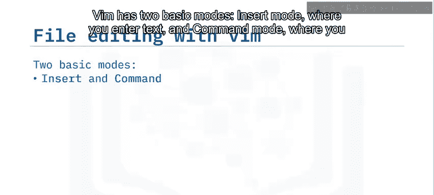

在命令提示符下输入`vim`即可打开VIM应用程序。你也可以指定文件名来编辑一个新文件或现有文件。

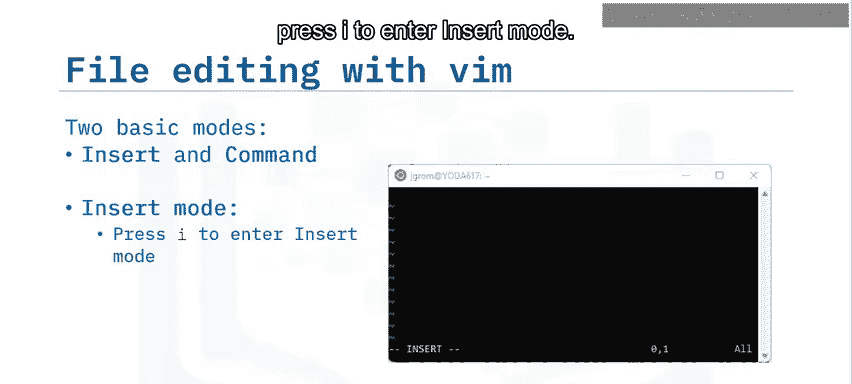

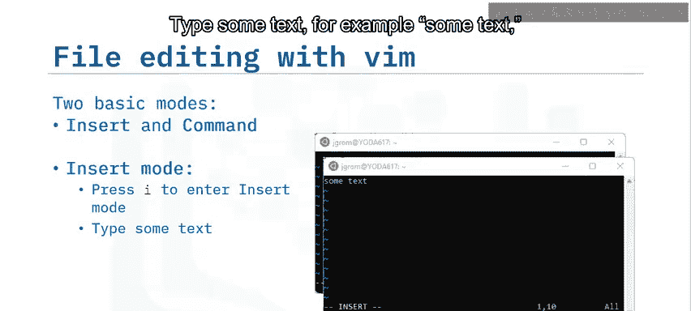

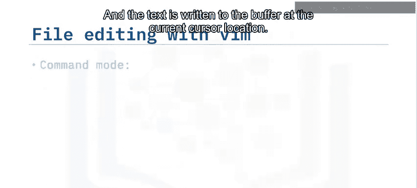

VIM有两种基本模式：**插入模式**用于输入文本，**命令模式**用于执行其他所有操作。

启动VIM会话后，按`i`键进入插入模式。输入一些文本，例如`some text`，然后按`Esc`键退出插入模式并切换到命令模式。文本会被写入当前光标位置的缓冲区中。

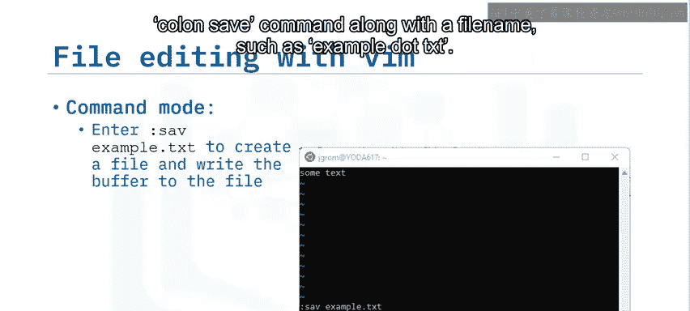

现在你回到了命令模式，可以使用`:save`命令加上文件名（例如`:save example.txt`）来保存文件。缓冲区内容将被写入文件，并显示一条消息，表明文件已成功写入。

现在你的文件已经存在，你可以使用更常见的`:w`命令将任何更改写入文件。

要退出VIM会话，请输入`:q`。要退出并放弃自上次写入操作以来的所有更改，请加上感叹号，即`:q!`。

这只是对VIM的一个简短介绍，但你可以使用许多命令来导航文本缓冲区并执行搜索、复制、粘贴和移动文本等操作。你将在接下来的实验课中练习其中一些命令。

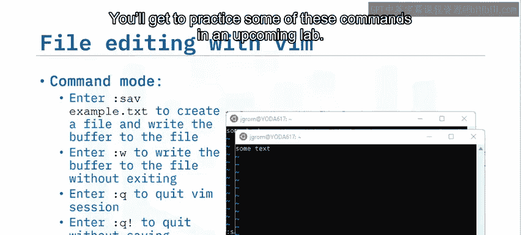

## 📚 总结

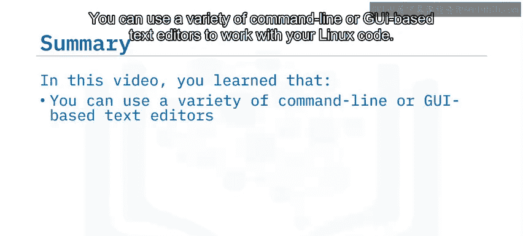

本节课中我们一起学习了如何在Linux中使用各种命令行或基于GUI的文本编辑器来处理代码。

*   **Gedit**是一个基于GUI的编辑器，提供了许多简化工作的功能。
*   **GNU Nano**是一个命令行编辑器，以命令行格式提供了类似的功能。
*   **VIM**是另一个命令行编辑器，它使用插入模式输入数据，使用命令模式处理文件。

你已经了解了如何使用文本编辑器处理现有文件，这将有助于你学习如何使用Linux命令创建文件并向其中追加文本。