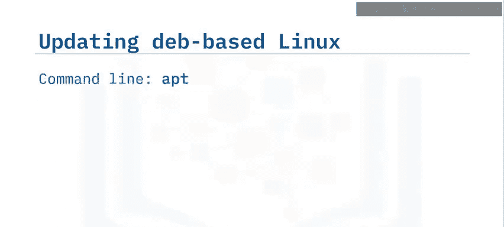
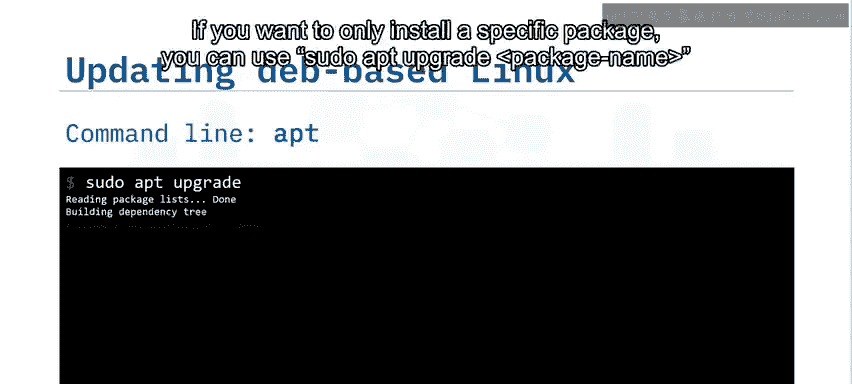
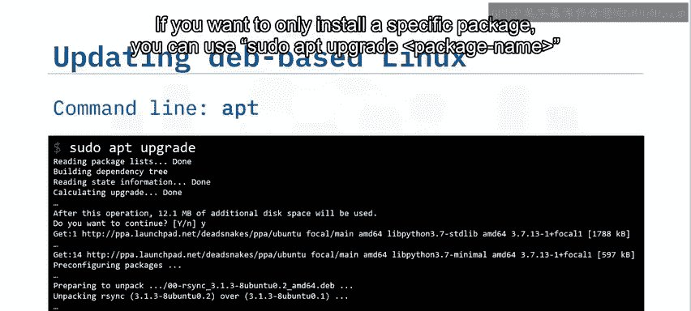
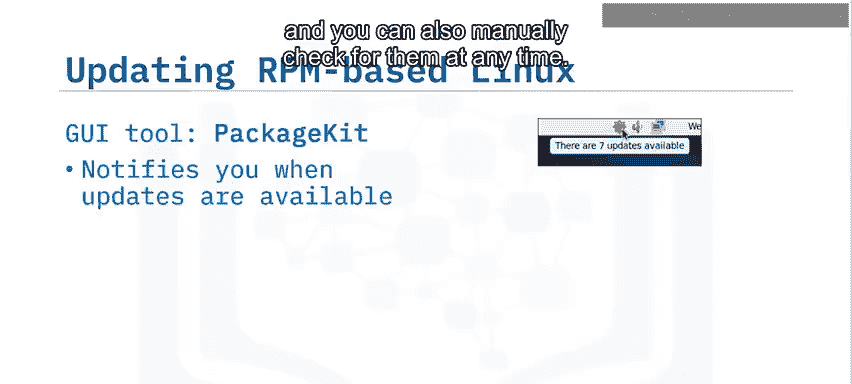
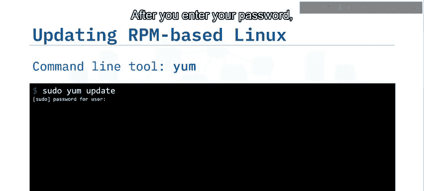
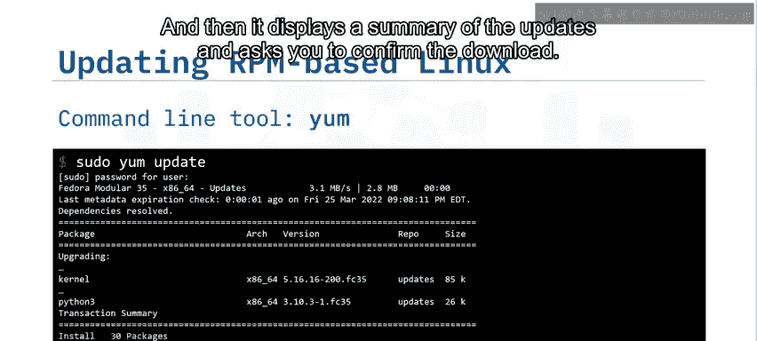
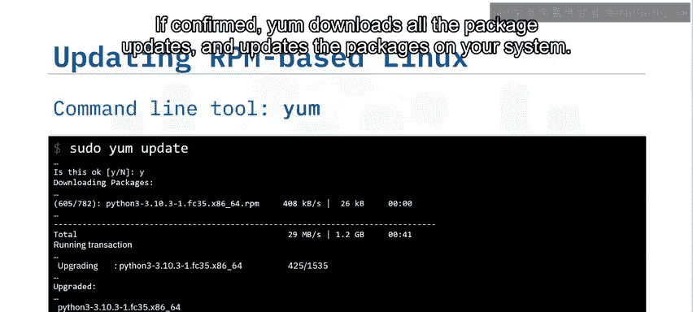
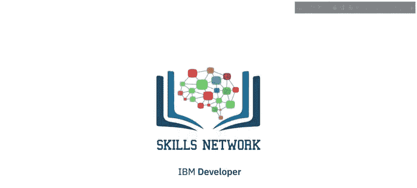

# 007：安装软件与更新

在本节课中，我们将学习Linux系统中软件包和包管理器的基本概念，掌握如何使用包管理器来安装软件和更新系统。我们将了解两种主要的软件包格式（Deb和RPM），并分别介绍基于图形界面和命令行的包管理工具。

---

## 软件包与包管理器

Linux操作系统的软件更新和安装文件通过一种称为“软件包”的文件进行分发。软件包是归档文件，包含了安装新软件或更新现有软件所需的全部组件。您需要使用“包管理器”来管理这些软件包的下载和安装。

不同的Linux发行版提供了不同的包管理器，有些是基于图形界面的，有些则是命令行工具。

---

## Deb与RPM软件包

Deb和RPM是Linux操作系统中包管理器使用的两种主要软件包格式。它们是包含不同Linux发行版软件或更新的不同文件类型。

*   **.deb文件**用于基于Debian的发行版，例如Debian、Ubuntu和Mint。Deb代表Debian。
*   **.rpm文件**用于基于Red Hat的发行版，例如CentOS、Red Hat Enterprise Linux、Fedora和openSUSE。RPM代表Red Hat Package Manager。

Deb和RPM格式在功能上是等效的，但通常不能直接互换使用。

---

## 软件包格式转换

如果您发现所需的软件包仅提供另一种格式，可以使用`alien`工具进行转换。

以下是转换命令示例：

*   将RPM格式包转换为Deb格式：
    ```bash
    sudo alien package-name.rpm
    ```
*   将Deb格式包转换为RPM格式：
    ```bash
    sudo alien -r package-name.deb
    ```

---

## 包管理器的优势

包管理器提供了多项便利功能：

*   自动解析软件包之间的依赖关系。
*   在有可用更新时通知您。
*   基于图形界面的包管理器可以定期自动检查安全和软件更新。
*   可以自动安装更新，或让您选择并安装特定的更新。

---

## 基于Debian系统的包管理器

上一节我们介绍了包管理器的通用概念，本节中我们来看看针对Debian系统的具体工具。

### 图形界面工具：更新管理器

更新管理器是用于更新基于Debian的Linux系统的图形界面工具。

默认情况下，更新管理器每天检查软件更新，并自动下载和安装所有安全更新。其他更新每周显示一次。您也可以随时手动检查更新。

以下是使用更新管理器的步骤：



1.  当有软件更新可用时，更新管理器会通知您。
2.  选择您想要安装的更新。
3.  点击“安装更新”。
4.  如果提示，请输入您的用户密码并点击“确定”。
5.  更新管理器将在后台安装更新，您可以继续工作。

### 命令行工具：APT

APT是用于更新基于Debian的Linux系统的命令行工具。

*   使用以下命令查找适用于您发行版的可用软件包：
    ```bash
    sudo apt update
    ```
    此命令的输出会列出每个可用软件包，构建依赖关系树，并告知您有多少个软件包可以升级。
*   要安装所有可升级的软件包，请使用：
    ```bash
    sudo apt upgrade
    ```
*   如果只想安装特定的软件包，可以使用：
    ```bash
    sudo apt upgrade package-name
    ```



---



## 基于RPM系统的包管理器

了解了Debian系统的工具后，我们再来看看RPM系统的包管理器。

### 图形界面工具：PackageKit

PackageKit是用于更新基于RPM的Linux系统的图形界面工具。

当有更新可用时，PackageKit会在通知区域显示一个星形图标。它会在可配置的时间间隔自动检查更新，您也可以随时手动检查。

以下是使用PackageKit的步骤：



1.  点击星形图标打开“软件更新”窗口，该窗口会列出所有可用的软件更新。
2.  选择您想要安装的更新。
3.  然后点击“安装更新”。
4.  如果需要，请输入密码并点击“确定”。
5.  PackageKit将在后台安装更新，您可以继续工作。

### 命令行工具：YUM

YUM是用于更新基于RPM的系统的命令行工具。YUM代表Yellowdog Updater, Modified。

要更新系统中的所有软件包，请按以下步骤操作：





1.  输入命令：
    ```bash
    sudo yum update
    ```
2.  输入密码后，YUM会获取所有可用的软件包更新。
3.  然后，它会显示更新摘要并要求您确认下载。
4.  如果确认，YUM将下载所有软件包更新并更新您系统中的软件包。
5.  完成后，它会显示成功消息“Complete!”。

---



## 安装新软件

您也可以使用命令行工具来安装新软件。

*   在基于Debian的系统上，使用带有`install`参数的`apt`命令来安装软件包：
    ```bash
    sudo apt install package-name
    ```
*   在基于RPM的系统上，使用带有`install`参数的`yum`命令来安装软件：
    ```bash
    sudo yum install package-name
    ```

---

## 其他包管理器示例

许多软件应用程序使用自己的包管理器，例如用于管理Python环境的流行工具PIP或Conda。

例如，假设您已经有一个Python环境和相关的PIP包，您可以轻松安装用于Python数据处理的流行`pandas`库。

输入以下命令，指示PIP包管理器执行以下操作：
```bash
pip install pandas
```
1.  搜索最新的`pandas`软件包。
2.  下载`pandas`软件包。
3.  检查依赖关系并根据需要进行更新。
4.  安装`pandas`软件包。

安装完成后，包管理器会显示新软件的版本号。

---

## 总结

本节课中我们一起学习了以下核心内容：

*   **.deb**和**.rpm**是Linux操作系统中包管理器使用的两种不同的文件类型。
*   Deb和RPM格式可以使用`alien`工具相互转换。
*   **更新管理器**和**PackageKit**分别是基于Deb和RPM的发行版中流行的图形界面包管理器。
*   **APT**和**YUM**分别是基于Deb和RPM的发行版中流行的命令行包管理器。



通过掌握这些工具，您将能够有效地在Linux系统上管理软件安装和系统更新。