# 008：常见Linux Shell命令概述

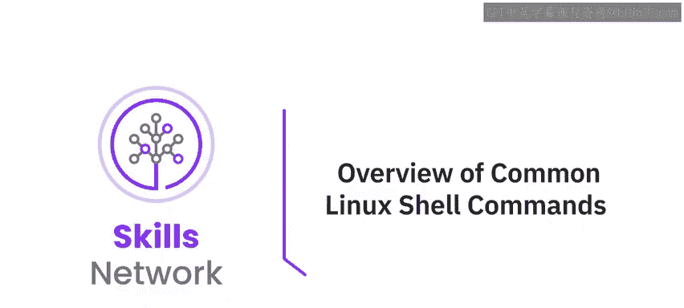

在本节课中，我们将学习Linux Shell的基本概念，并概述一系列常用的Shell命令及其应用场景。通过本课，你将能够理解Shell是什么，列举其应用，并回忆常见的Shell命令。

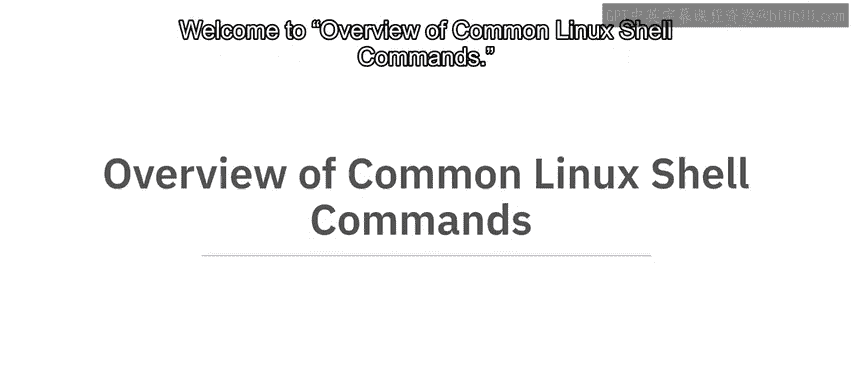

---

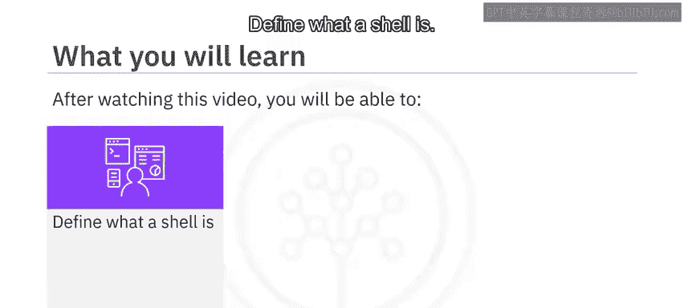

## 🐚 什么是Shell？

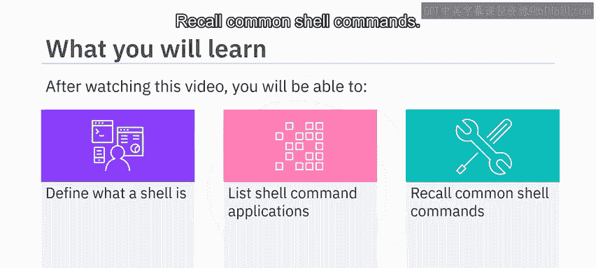

Shell是类Unix操作系统的一个强大用户界面。它可以解释命令并运行其他程序。Shell不仅是一个能够访问文件、实用程序和应用程序的交互式语言，也是一种脚本语言，可用于自动化任务。

Linux系统上默认的Shell通常是**bash**。其他Shell包括B shell、C shell、Korn shell、Z shell和fish等。

在本课程中，我们将只使用**bash**（Bourne Again Shell）。要查看你的默认Shell，可以在命令行中输入以下命令：

```bash
printenv SHELL
```

该命令会返回默认Shell程序的路径。如果你的默认Shell不是bash，可以通过在命令行中输入 `bash` 来切换到它。

在本课程中，我们将使用美元符号 `$` 来代表命令提示符。在其他地方，你可能会看到使用大于符号 `>` 达到相同目的。

---

## 🛠️ Shell命令的应用

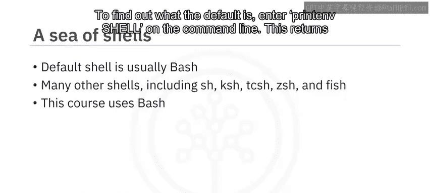

Shell命令的应用范围广泛，主要包括以下几个方面：

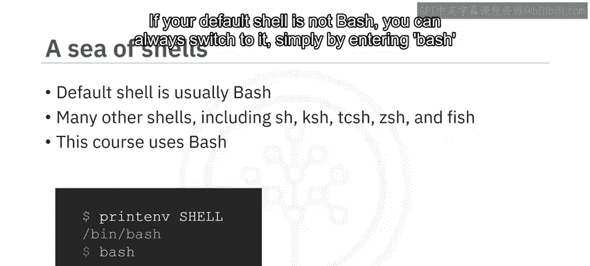

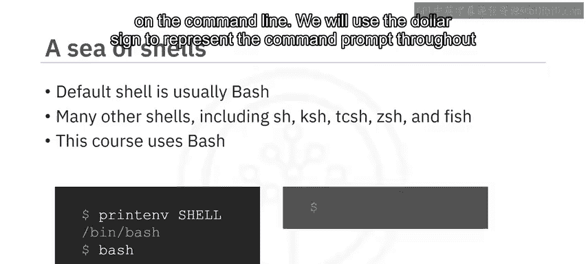

*   **获取信息**
*   **导航和处理文件与目录**
*   **打印文件和字符串内容**
*   **文件压缩与归档**
*   **执行网络操作**
*   **监控系统、组件及应用程序的性能和状态**
*   **运行批处理作业**，例如ETL操作

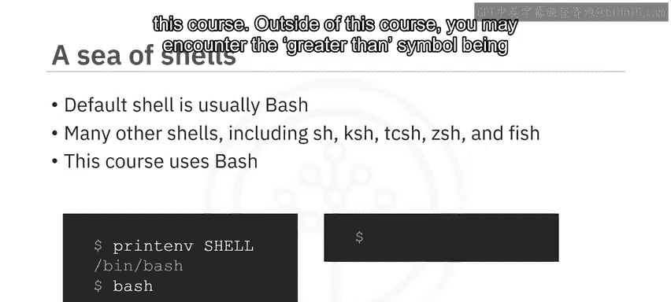

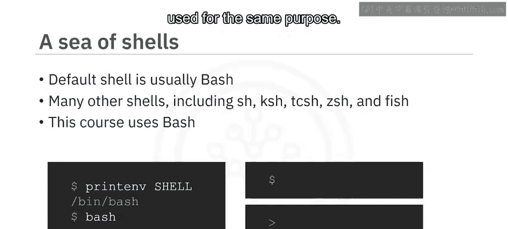

接下来，我们将逐一介绍这些类别中的常见命令。

---

## ℹ️ 获取信息的命令

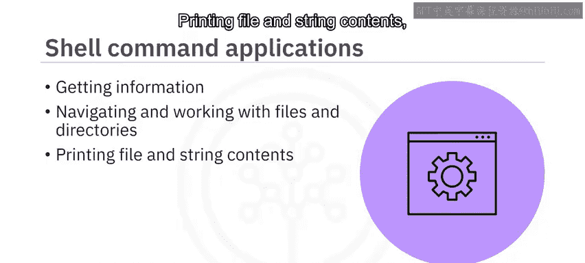

以下是一些用于获取系统或用户信息的常见Shell命令：

*   **`whoami`**：返回当前用户的用户名。
*   **`id`**：返回当前用户和所属组的信息。
*   **`uname`**：返回操作系统名称。
*   **`ps`**：显示正在运行的进程及其ID。
*   **`top`**：显示正在运行的进程及资源使用情况，包括内存、CPU和I/O。
*   **`df`**：显示已挂载文件系统的信息。
*   **`man`**：获取任何Shell命令的参考手册。
*   **`date`**：打印当前日期。

---

## 📄 处理文件的命令

上一节我们了解了如何获取系统信息，本节中我们来看看如何操作文件。以下是用于处理文件的常见命令：

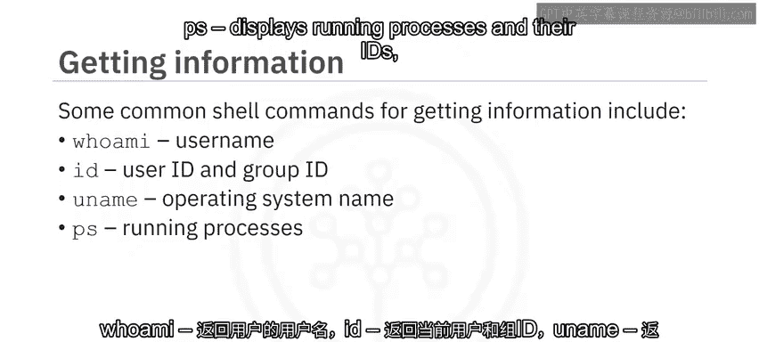

*   **`cp`**：复制文件。
*   **`mv`**：移动文件或重命名文件。
*   **`rm`**：删除文件。
*   **`touch`**：创建空文件或更新文件的时间戳。
*   **`chmod`**：更改或修改文件权限。
*   **`wc`**：获取文件的行数、单词数和字符数。
*   **`grep`**：返回文件中匹配指定模式的行。

---

## 📁 导航和处理目录的命令

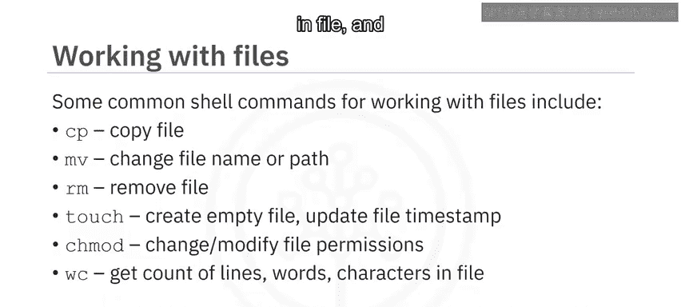

处理文件离不开目录操作。以下是用于导航和处理目录的非常常见的命令：

*   **`ls`**：列出当前目录中的文件和目录。
*   **`find`**：用于在当前目录树中查找匹配模式的文件。
*   **`pwd`**：打印当前工作目录。
*   **`mkdir`**：创建新目录。
*   **`cd`**：将当前目录更改为另一个目录。
*   **`rmdir`**：删除整个目录。

---

## 🖨️ 打印文件内容或字符串的命令

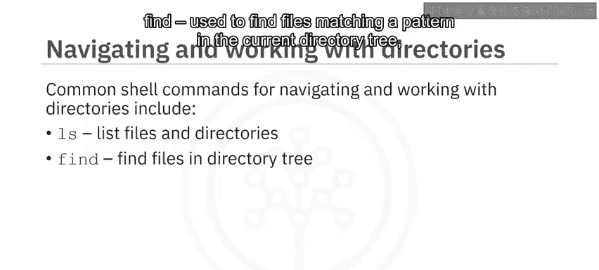

有时我们需要查看文件内容或输出文本。以下是相关的常见命令：

*   **`cat`**：打印文件的全部内容。
*   **`more`**：逐页打印文件内容。
*   **`head`**：仅打印文件的前N行。
*   **`tail`**：打印文件的最后N行。
*   **`echo`**：一个非常常用的命令，它通过打印来“回显”输入的字符串。它也可以回显变量的值。

---

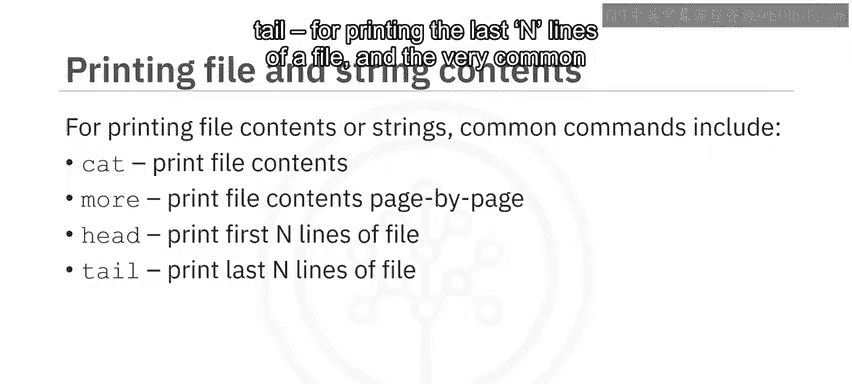

## 📦 文件压缩与归档的命令

对于文件管理，压缩和归档是重要功能。以下是相关的Shell命令：

*   **`tar`**：用于归档一组文件。
*   **`gzip`**：压缩一组文件。
*   **`unzip`**：从压缩的zip归档文件中提取文件。

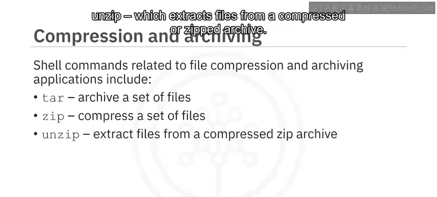

---

## 🌐 网络操作命令

Shell同样能胜任基本的网络任务。网络应用包括以下命令：

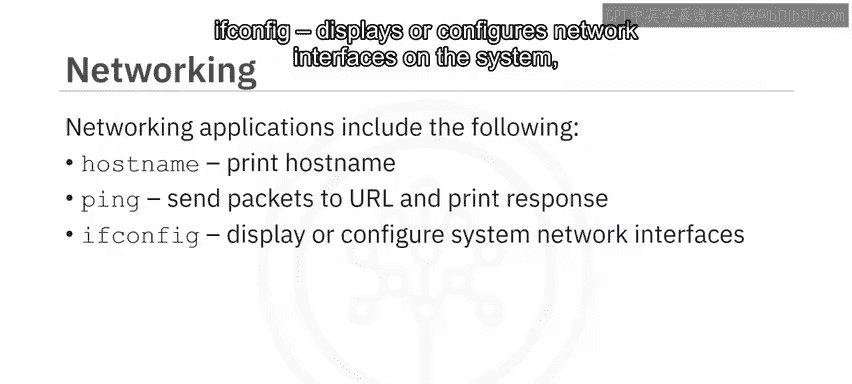

*   **`hostname`**：打印主机名。
*   **`ping`**：向URL发送数据包并打印响应。
*   **`ifconfig`**：显示或配置系统上的网络接口。
*   **`curl`**：显示位于URL的文件内容。
*   **`wget`**：可用于从URL下载文件。

---

## 💻 在Windows上运行Linux的说明

我们应该提到，如果你在Windows机器上运行并希望使用Linux，可以通过多种方式实现。

*   Linux可以安装在单独的硬盘分区上，但这需要在两个操作系统之间重启以进行切换。
*   或者，你可以在虚拟机上安装Linux。
*   也可以安装Linux模拟器，如Cygwin。
*   或者使用**Windows Subsystem for Linux (WSL)**，这是一个在Windows上原生运行Linux二进制可执行文件的兼容层。

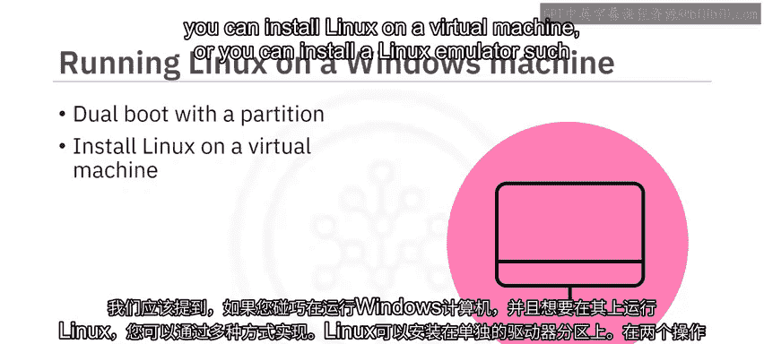

---

## 📝 总结

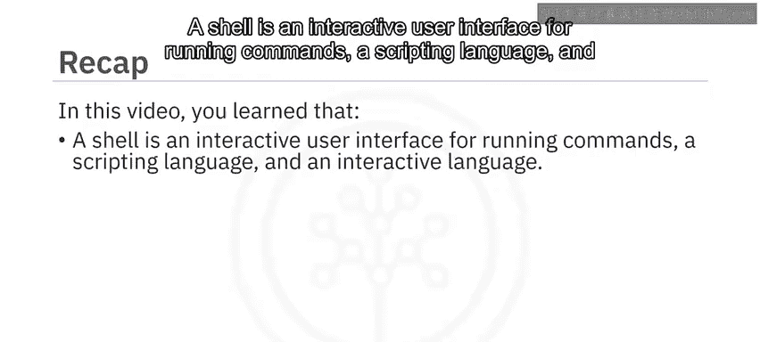

本节课中我们一起学习了Shell的核心概念和常用命令。

你了解到，Shell是一个用于运行命令的交互式用户界面，同时也是一种脚本语言和交互式语言。

Shell命令可用于导航和处理文件与目录、进行文件压缩。`curl`和`wget`命令分别用于显示和从URL下载文件，`echo`命令用于打印字符串或变量值，而`cat`和`tail`命令则用于显示文件内容。