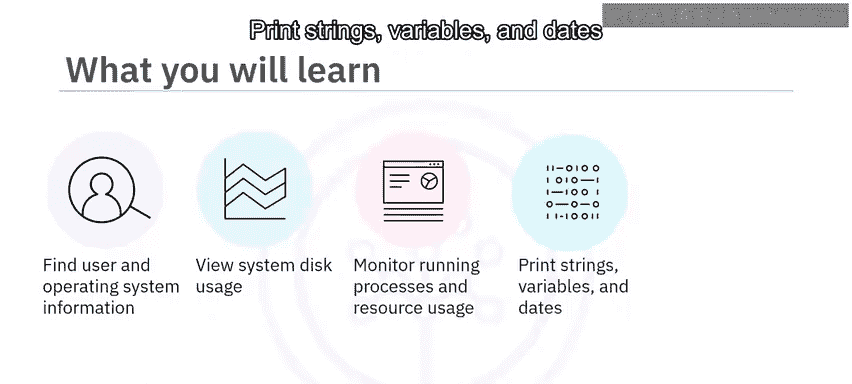
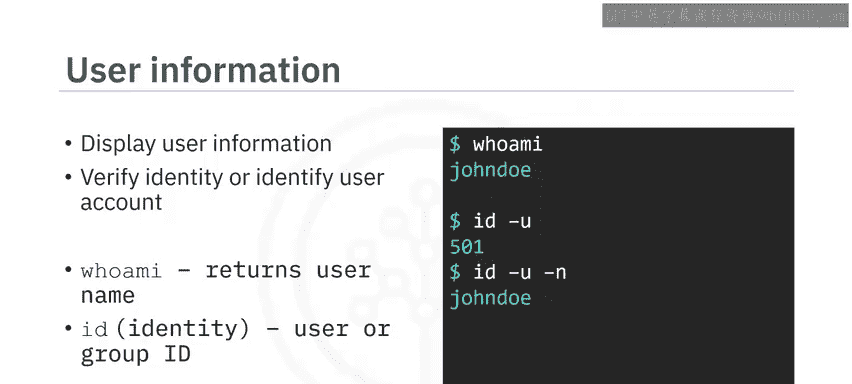
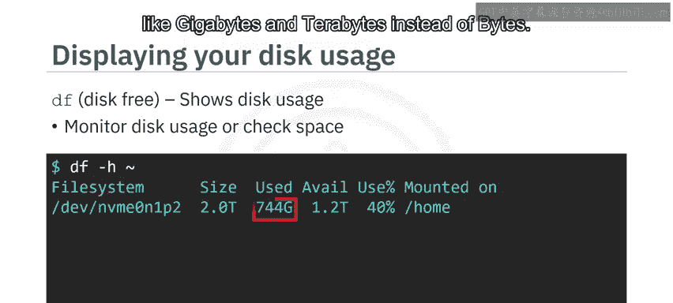
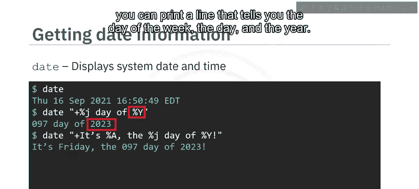
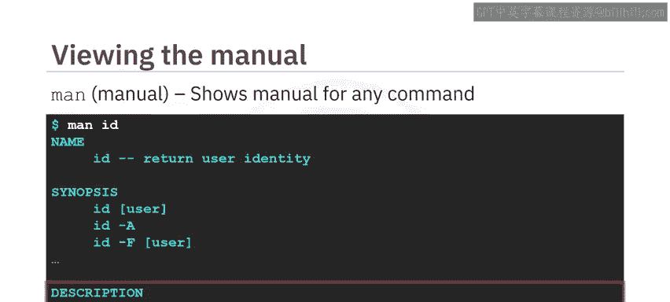

# 009：信息命令 📊



在本节课中，我们将学习一系列用于获取系统信息的Linux命令。这些命令能帮助我们查看用户身份、操作系统详情、磁盘使用情况、运行进程，以及打印文本和日期信息。掌握这些命令是有效管理和排查Linux系统问题的基础。

## 用户与系统信息 👤

上一节我们介绍了课程概述，本节中我们来看看如何获取用户和操作系统的基本信息。信息命令在需要验证当前用户身份或确定特定命令由哪个账户运行时非常有用。

以下是获取用户信息的命令：



*   **`whoami`**：此命令显示当前用户的用户名。它不接受任何参数或选项。
    ```bash
    whoami
    ```
*   **`id`**：此命令返回用户或组的ID（UID/GID），这是Linux系统中分配给每个用户或组的数字标识。
    *   使用 `-u` 选项可返回用户的数字ID。
        ```bash
        id -u
        ```
    *   若想查看与数字ID对应的用户名，可添加 `-n` 选项。
        ```bash
        id -un
        ```

接下来，我们可以使用 `uname` 命令来获取操作系统信息。`uname` 代表“Unix名称”，它可以返回内核名称和版本号等信息，有助于识别系统类型或诊断相关问题。

以下是 `uname` 命令的用法：

*   **`uname`**：单独使用可返回操作系统名称（例如 Darwin、Linux）。
    ```bash
    uname
    ```
*   **`uname -sr`**：结合 `-s`（系统名称）和 `-r`（内核版本）选项，可同时显示操作系统名称及其版本。
    ```bash
    uname -sr
    ```
*   **`uname -v`**：使用 `-v` 选项可以查看更详细的版本信息。
    ```bash
    uname -v
    ```

## 磁盘使用情况 💾

了解了如何查看系统身份后，我们来看看如何监控磁盘空间。`df`（disk free）命令用于显示系统的磁盘使用情况，在需要监控磁盘使用率或检查特定文件系统的可用空间时非常有用。



以下是 `df` 命令的示例：


*   **`df -h ~`**：此命令显示用户家目录（由 `~` 符号表示）的磁盘使用情况表。`-h` 选项使输出更易读，使用GB、TB等单位而非字节。在Linux中，磁盘可以挂载到目录上，这意味着该磁盘的文件系统可通过该目录访问。该表还会显示每个磁盘已使用的存储百分比。
    ```bash
    df -h ~
    ```
*   **`df -h`**：如果不指定目录，此命令将显示所有文件系统的磁盘使用情况。输出包括每个文件系统的大小、已用容量和可用空间。
    ```bash
    df -h
    ```

## 进程监控 🔍

查看完磁盘状态，我们转向系统运行的动态部分——进程。`ps`（process status）命令用于查看系统上当前运行的进程，这在需要监控或管理进程时很有帮助。

以下是 `ps` 命令的用法：

*   **`ps -e`**：结合 `-e` 选项，`ps` 会列出系统上运行的所有进程，无论启动它们的用户是谁。该命令显示的信息包括每个运行进程的名称、进程ID（PID）以及每个进程已运行的时间（分和秒）。
    ```bash
    ps -e
    ```

`top`（table of processes）命令则像一个任务管理器，它会显示一个运行进程及其资源使用情况的动态表格。当需要监控系统性能或识别消耗大量资源的进程时，这个命令就派上用场了。

以下是 `top` 命令的示例：

*   **`top -n 3`**：此示例使用 `-n` 选项和数字3来显示前三个运行任务（例如 Chrome, top, Spotify）。默认情况下，任务按CPU使用率排序。`top` 命令还提供许多其他细节，如内存使用情况和可执行文件位置。
    ```bash
    top -n 3
    ```

## 打印与日期 📅

监控进程让我们了解了系统的实时状态，现在我们来学习一些用于输出信息的实用命令。Linux中的 `echo` 命令是一个强大的工具，用于在终端或Shell脚本中显示文本或变量。

以下是 `echo` 命令的用法：

*   **`echo`**：单独使用 `echo` 会输出一个空行。
    ```bash
    echo
    ```
*   **`echo hello`**：打印单个单词。
    ```bash
    echo hello
    ```
*   **`echo "Learn Linux is fun!"`**：打印带空格的字符串。虽然不加引号 `echo` 也能工作，但最佳实践是加上引号。
    ```bash
    echo "Learn Linux is fun!"
    ```
*   **`echo $PATH`**：查看变量的值，例如系统的 `PATH` 变量。这在故障排除或脚本编写时很有帮助。输出中，路径由冒号分隔。
    ```bash
    echo $PATH
    ```

另一个有用的命令是 `date`，它用于显示当前系统日期和时间。

以下是 `date` 命令的用法：



*   **`date`**：返回默认日期格式，包括星期几、日、月、年、时间和时区。
    ```bash
    date
    ```
*   **`date "+%j day of %Y"`**：可以提取日期的特定部分进行打印。要格式化输出，需在引号内使用以加号开头的文本和控制字符组合。格式控制符以百分号 `%` 指示。此例中，`%j` 和 `%Y` 分别输出一年中的第几天和年份本身。该命令会打印类似“97 day of 2023”的结果。
    ```bash
    date "+%j day of %Y"
    ```
*   **`date "+Today is %A, day %j of %Y."`**：此示例展示了如何进一步将格式控制符与文本结合，打印出独特的字符串。`%A` 代表完整的星期几名称。
    ```bash
    date "+Today is %A, day %j of %Y."
    ```

## 命令手册 📖

最后，如果你想深入了解任何命令的用法，可以使用 `man`（manual）命令。所有默认的Linux命令都附带一个手册，你可以使用 `man` 来显示它。

以下是 `man` 命令的示例：



*   **`man id`**：输入此命令将显示 `id` 命令的手册。手册会提供命令功能的基本摘要（例如“返回用户身份”），列出命令的选项（方括号 `[]` 表示可选参数，如 `[user]` 允许你指定用户名），并提供更详细的描述。
    ```bash
    man id
    ```
*   **`man man`**：`man` 命令甚至有自己的手册页，你可以用它来了解更多关于手册命令本身及其用途的信息。
    ```bash
    man man
    ```

## 总结 ✨


本节课中我们一起学习了多个关键的Linux信息命令。我们掌握了如何使用 `whoami` 和 `id` 命令获取用户信息；使用 `uname` 命令获取操作系统信息；使用 `df` 命令检查系统磁盘使用情况；使用 `ps` 和 `top` 命令监控进程及其资源使用情况；使用 `echo` 命令打印字符串或变量值；使用 `date` 命令打印和提取日期信息；以及使用 `man` 命令阅读任何命令的手册。这些命令是日常系统管理和故障诊断的基石，希望你通过实践能熟练运用它们。