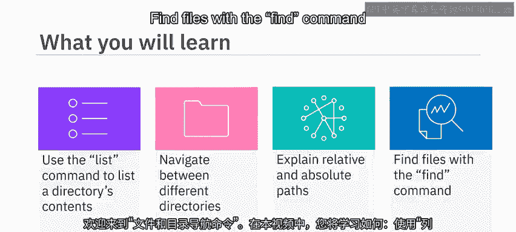
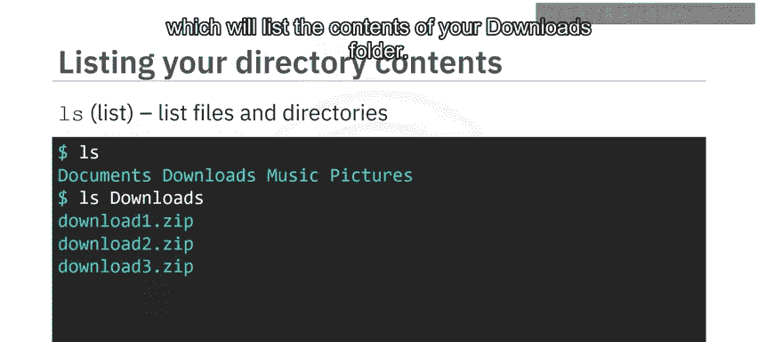
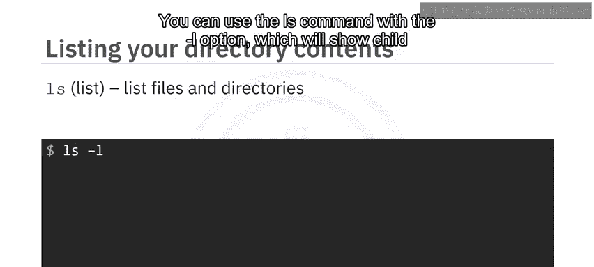
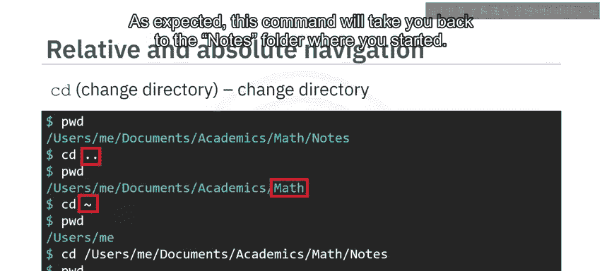
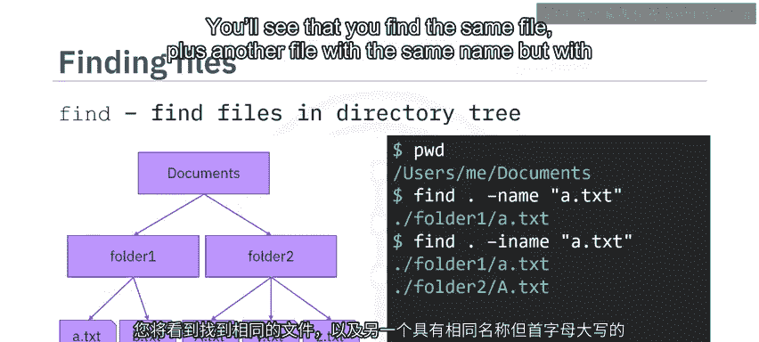

# 010：文件和目录导航命令

在本节课中，我们将学习如何使用Linux命令来浏览和管理文件系统。具体内容包括：使用`ls`命令列出目录内容，使用`cd`命令在不同目录间切换，理解相对路径与绝对路径的区别，以及使用`find`命令查找文件。

---

## 📄 列出目录内容：`ls`命令

`ls`（list）命令用于列出指定目录中的文件和子目录。



如果直接在终端输入`ls`，它会显示当前工作目录下的所有文件和目录。

```bash
ls
```

你也可以将目录名作为参数传递给`ls`命令，以查看特定目录的内容。例如，要查看“下载”文件夹的内容，可以输入：

```bash
ls downloads
```



---

## 🔍 获取详细信息：`ls -l`选项

`ls`命令支持多种选项，用于显示额外信息。例如，`-l`选项可以以长格式列出文件和目录的详细信息。

假设你当前位于“文档”文件夹，并希望查看该文件夹内文件的详细信息，可以输入：

```bash
ls -l
```

终端将列出所有子文件和目录，并显示详细信息，如权限、最后修改日期和所有者。

---



## 🗺️ 查看当前目录：`pwd`命令

有时，你需要知道当前正在哪个目录中工作。这时，可以使用`pwd`（print working directory）命令。

在命令行中输入`pwd`，终端会显示当前工作目录的完整路径。

```bash
pwd
```

例如，输出可能是：`/home/yourusername`


---

## 🚶 切换目录：`cd`命令

`cd`（change directory）命令用于更改当前工作目录。

假设你当前在用户主目录，并希望切换到其中的“文档”子目录，只需输入：

```bash
cd documents
```

现在，如果你再次输入`pwd`，会发现当前目录已变为“文档”文件夹。

`cd`命令允许你使用相对路径或绝对路径来切换目录。

---

## 🧭 理解路径：相对路径与绝对路径

相对路径是相对于你当前所在目录的路径。例如，从“文档/笔记”文件夹切换到其父目录“文档”，可以使用：

```bash
cd ..
```

这里的`..`代表上一级目录。

绝对路径则是从根目录开始的完整路径。要直接切换到用户主目录，可以使用波浪号`~`：

```bash
cd ~
```

`~`符号代表用户主目录的绝对路径。

你也可以直接提供完整的绝对路径来切换目录：



```bash
cd /home/yourusername/documents/notes
```

---

## 🔎 查找文件：`find`命令

`find`命令是一个强大的工具，用于根据用户指定的条件查找文件并返回其路径。

假设你的“文档”文件夹结构如下：包含两个子文件夹，每个子文件夹中有几个文件。

如果你在“文档”文件夹中工作，并希望查找当前目录下所有名为“a.txt”的文件，可以输入：

```bash
find . -name a.txt
```

这里的`.`参数表示“在当前目录中搜索”。

要进行不区分大小写的搜索，可以使用`-iname`选项：

```bash
find . -iname a.txt
```



这将找到所有名为“a.txt”或“A.txt”的文件。

---

## 📝 总结

在本节课中，我们一起学习了Linux中用于文件和目录导航的核心命令：

*   `ls`命令用于列出目录中的文件和子目录。
*   `cd`命令用于在不同目录之间导航。
*   相对路径是相对于当前工作目录的路径，而绝对路径是从根目录开始的完整路径。
*   `find`命令用于在目录树中根据名称或其他条件查找文件。


掌握这些命令是有效使用Linux命令行环境的基础。