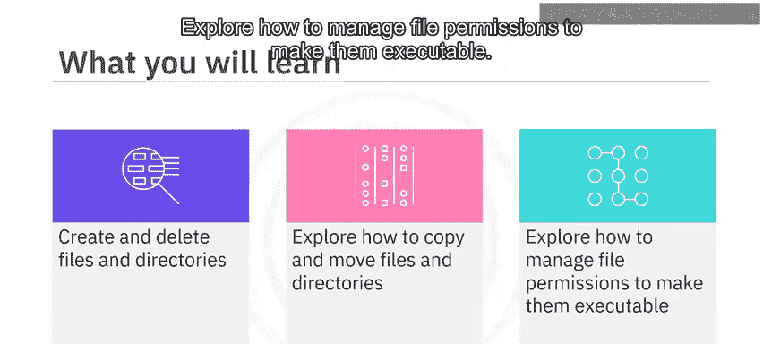
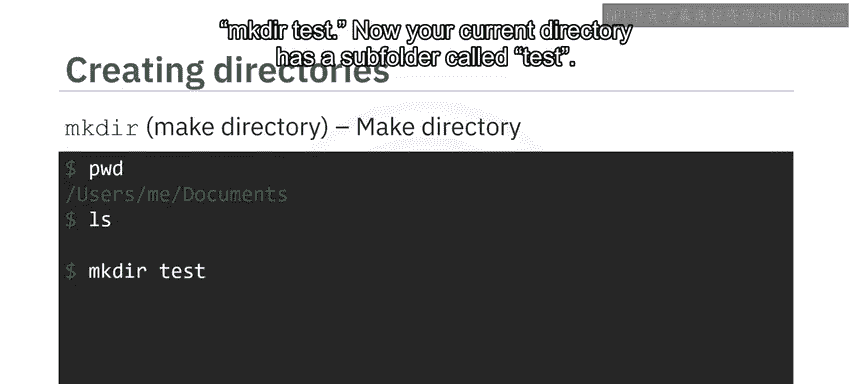
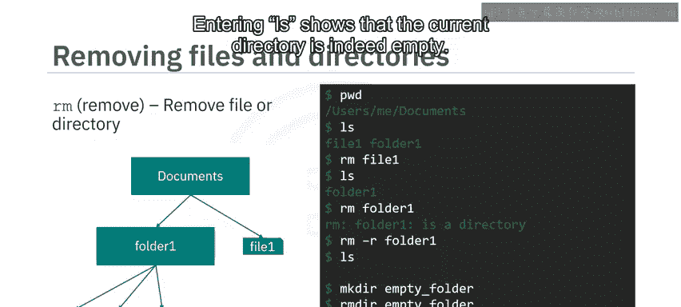
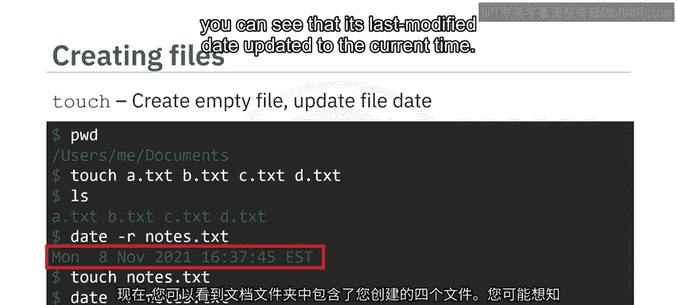
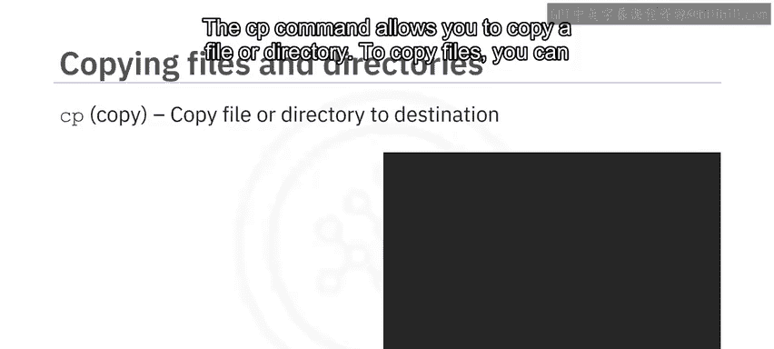
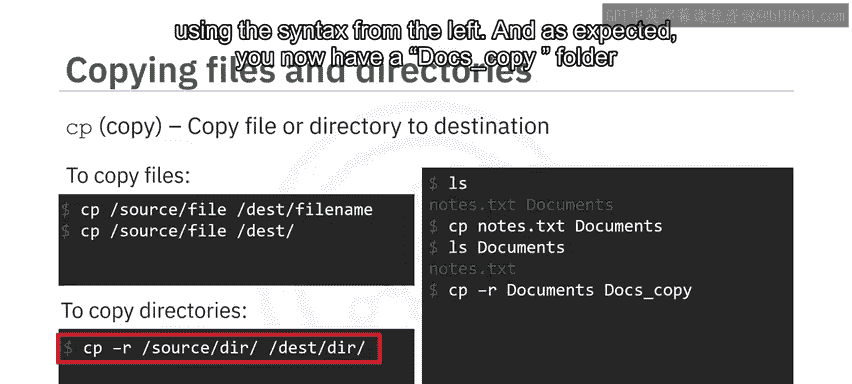
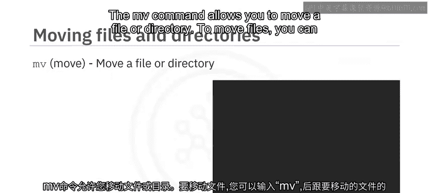
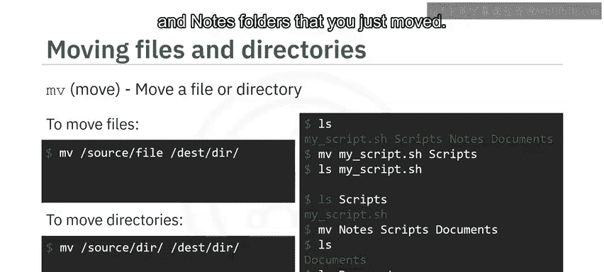
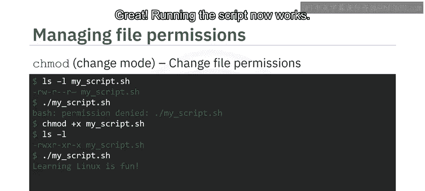
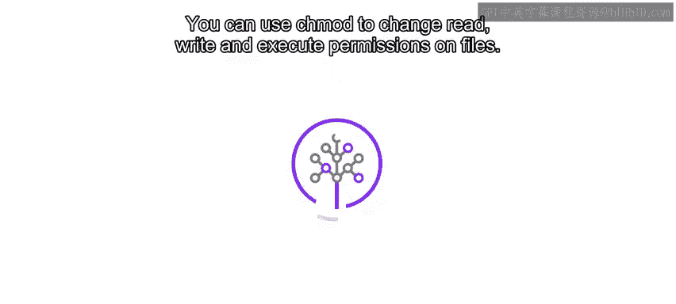

# 011：文件和目录管理命令

在本节课中，我们将学习Linux系统中用于管理文件和目录的核心命令。你将掌握如何创建、删除、复制、移动文件和目录，以及如何管理文件权限。

---

## 🗂️ 创建和删除目录

`mkdir` 命令用于创建目录。假设你当前位于空的 `Documents` 文件夹中，要创建一个名为 `test` 的文件夹，只需输入 `mkdir test`。现在，你的当前目录下就有一个名为 `test` 的子文件夹了。

`rm` 命令允许你删除文件或目录。假设你有一个如左图所示的文件结构，并且你当前位于 `Documents` 文件夹中，希望删除 `file1`。你可以通过输入 `rm file1` 来实现。现在，你可以看到只剩下 `folder1`。

你不能简单地删除 `folder1`，因为它可能包含其他文件。然而，你可以通过使用带 `-r` 选项的 `rm` 命令来轻松解决这个问题。`-r` 选项表示你想删除目录及其所有子文件对象。现在你的 `Documents` 文件夹是空的了。因此，在使用带 `-r` 选项的 `rm` 命令时，你应该始终小心。很容易意外删除包含重要数据的文件夹。

现在，假设你使用 `mkdir` 命令创建了一个空目录，然后决定删除它。不推荐使用 `rm -rf` 命令。相反，你应该使用 `rmdir` 命令，它专门用于删除空目录。这确保了你永远不会意外删除任何重要的文件或目录。输入 `ls` 显示当前目录确实是空的。

---

## 📄 创建和更新文件

`touch` 命令可用于创建空文件。假设你位于空的 `Documents` 文件夹中，并希望创建一些空的文本文件。你可以通过输入 `touch` 后跟一些文件名（例如 `A.txt`、`B.txt`、`C.txt` 和 `D.txt`）来实现。现在，你可以看到你的 `Documents` 文件夹包含了你创建的四个文件。

你可能想知道 `touch` 命令对现有文件有什么作用。假设你的当前目录包含一个名为 `notes.txt` 的文件。你可以使用 `date -r notes.txt` 查看它最后修改的时间。如果你对 `notes.txt` 使用 `touch` 命令，你可以看到它的最后修改日期更新为当前时间。

---

## 📋 复制文件和目录

`cp` 命令允许你将文件或目录复制到另一个位置。要复制文件，你可以从源目录复制文件，并在目标目录中指定文件名，或者直接省略目标文件名，默认保持相同的文件名。要复制整个目录，你需要给 `cp` 命令加上 `-r` 选项，以便它知道递归地复制所有子目录和文件。

让我们看一些例子。假设你的工作目录中有一个名为 `notes.txt` 的文件和一个名为 `documents` 的文件夹。你可以使用 `cp notes.txt documents/` 将 `notes.txt` 复制到你的 `documents` 文件夹中。现在你可以看到你的 `documents` 文件夹包含了一份 `notes.txt` 的副本。注意，你不需要指定源目录，因为 `cp` 默认使用你的当前目录。

接下来，你可以使用左侧的语法创建一个名为 `docs_copy` 的 `documents` 文件夹副本。正如预期的那样，你现在有了一个 `docs_copy` 文件夹，其内容与原始的 `documents` 文件夹相同。

---

## 🚚 移动文件和目录

`mv` 命令允许你移动文件或目录。要移动文件，你可以输入 `mv`，后跟要移动的文件路径，然后是你要移动到的文件夹路径。同样，要移动目录，你可以输入 `mv`，后跟要移动的目录路径，然后是你要移动到的路径和目录。

让我们看一个例子。假设你有一个名为 `my_script.sh` 的文件，以及三个名为 `scripts`、`notes` 和 `documents` 的文件夹。你可以使用左侧的语法将 `my_script.sh` 移动到你的 `scripts` 文件夹中。因此，输入 `ls my_script.sh` 没有返回结果，但输入 `ls scripts/` 显示你已成功将 `my_script.sh` 移动到了 `scripts` 文件夹中。

接下来，你可以使用左侧的语法将你的 `notes` 和 `scripts` 文件夹移动到你的 `documents` 文件夹中。你可以看到你的目录现在只包含你的 `documents` 文件夹，并且你的 `documents` 文件夹包含了你刚刚移动的 `scripts` 和 `notes` 文件夹。

---

## 🔐 管理文件权限

`chmod` 代表 “change mode”，用于更改文件的读、写和执行权限。假设你的当前目录中有一个名为 `my_script.sh` 的 Shell 脚本文件，其内容为 `echo "Learning Linux is fun"`。输入 `ls -l my_script.sh` 显示你的 Shell 脚本具有读和写权限（由 `r` 和 `w` 字符表示），但如果你尝试执行该文件，你会得到一个 “permission denied” 错误。

为了使你的脚本可执行，你可以使用 `chmod +x my_script.sh` 命令调用 `chmod`。现在输入 `ls -l my_script.sh` 显示 `my_script.sh` 具有可执行权限（由 `x` 字符表示）。很好，现在运行脚本可以正常工作了。

---

## 📝 总结

本节课中，我们一起学习了以下核心的Linux文件和目录管理命令：

*   你学会了使用 `touch` 命令创建新文件或更新现有文件的最后修改日期。
*   你学会了使用 `mkdir` 命令创建目录，以及使用 `rmdir` 命令删除空目录。
*   你学会了使用 `cp` 和 `mv` 命令来复制、移动和重命名文件与目录。
*   你学会了使用 `chmod` 命令来更改文件的读、写和执行权限。

掌握这些命令是有效使用Linux系统进行日常文件操作的基础。