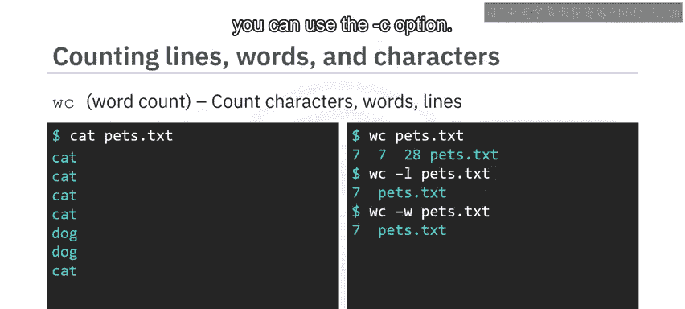

# 012：查看文件内容

在本节课中，我们将学习如何应用操作文件的命令，以多种有用的方式查看文件内容，并确定文件的行数、单词数和字符数。

---


## 🖨️ 使用 `cat` 命令查看完整文件

首先，你可以使用 `cat` 命令将整个文件内容打印到标准输出。

假设你的当前目录下有一个名为 `numbers.txt` 的文件，你可以通过输入 `ls` 命令来确认它的存在。要打印这个文件的内容到标准输出，你可以输入：

```bash
cat numbers.txt
```

这将产生如下所示的输出，包含数字 0 到 99。你可以看到输出占满了整个终端窗口。实际上，这个文件比这里显示的 12 行长得多，因此你可能并不总是想用 `cat` 来查看内容。幸运的是，针对这种情况，还有其他替代命令。

---

## 📄 使用 `more` 命令分页查看

`more` 命令允许你以逐页格式查看文件内容。输入 `more numbers.txt`，你将在第一页看到数字 0 到 8。这里的“页”指的是当前终端窗口的显示区域。如果你垂直扩展终端窗口，页的大小也会增加。按下空格键，你将看到下一页，显示数字 9 到 17。输入 `q` 可以退出 `more` 程序并返回到命令提示符。

---

## 🔝 使用 `head` 命令查看文件开头

你可以使用 `head` 命令来打印文件的前 10 行。输入 `head numbers.txt` 会返回前 10 行，即数字 0 到 9。


你可以使用 `-n` 选项来指定 `head` 命令返回的行数。例如，输入：

```bash
head -n 3 numbers.txt
```

你将得到 `numbers.txt` 文件的前三行：0, 1, 2。

---

## 🔚 使用 `tail` 命令查看文件末尾

`tail` 命令用于打印文件的最后 10 行。输入 `tail numbers.txt` 会返回 `numbers.txt` 文件的最后 10 行，即数字 90 到 99。

与 `head` 命令类似，你也可以使用 `-n` 选项来改变返回的行数。输入：

```bash
tail -n 3 numbers.txt
```


你将得到 `numbers.txt` 文件的最后三行：97, 98, 99。

---

## 📊 使用 `wc` 命令统计文件信息

你可以使用 `wc` 命令来统计文件中的字符数、单词数或行数。

假设你有一个名为 `pets.txt` 的文件。输入 `cat pets.txt` 显示该文件每行包含单词“cat”或“dog”。输入 `wc pets.txt`，你会得到结果 `7 7 28 pets.txt`。这表示你的文件包含 **7 行**、**7 个单词**和 **28 个字符**。

你可能会疑惑：7 个单词乘以 3 个字母等于 21，为什么 `wc` 会统计出 28 个字符？因为它也计算了换行符。虽然你看不见，但文件中有 7 个换行符，每个换行符在文件中都表示为一个字符。

以下是 `wc` 命令的常用选项：

*   要仅查看行数，可以使用 `-l` 选项：`wc -l pets.txt` 返回 `7 pets.txt`。
*   要仅查看单词数，可以使用 `-w` 选项。
*   要仅查看字符数，可以使用 `-c` 选项。



---

## 📝 课程总结


在本节课中，我们一起学习了如何应用 `cat`、`more`、`head` 和 `tail` 命令以多种方式查看文件内容，并使用 `wc` 命令来确定文件的行数、单词数和字符数。