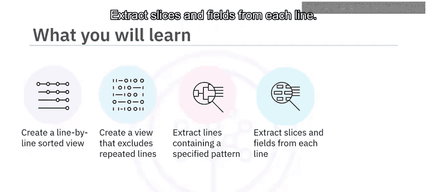
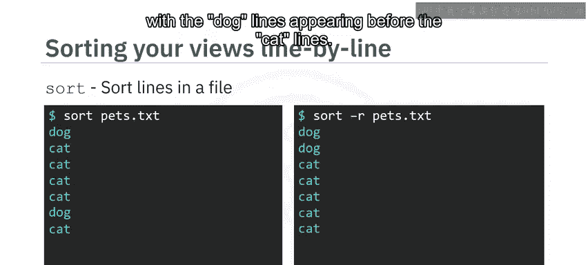
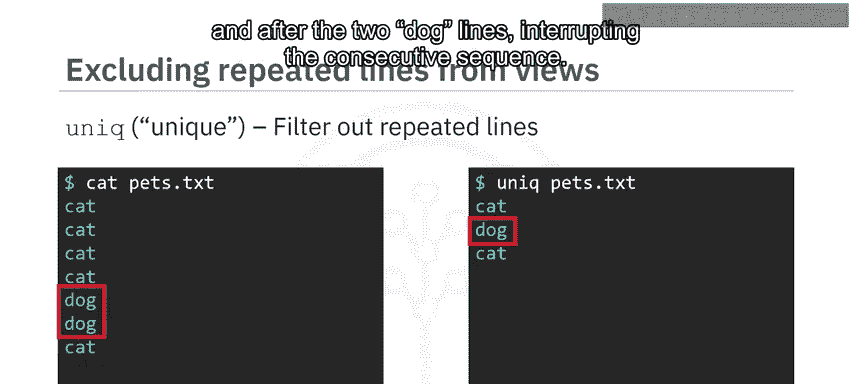
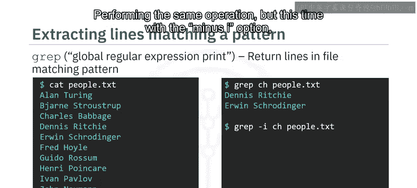
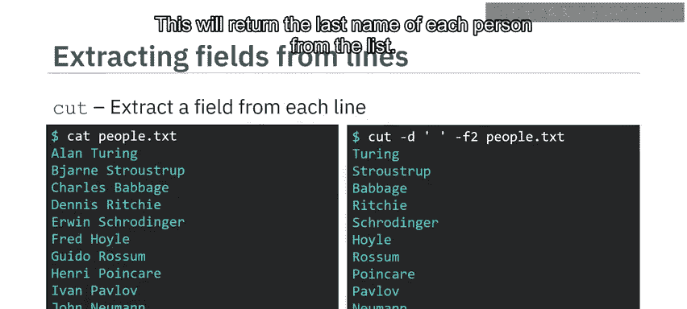
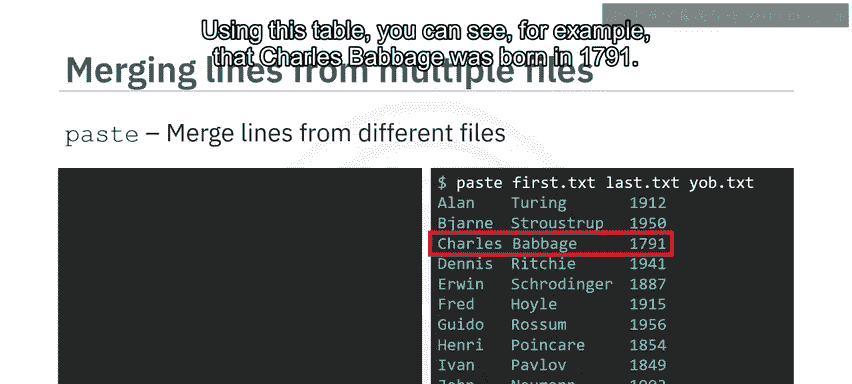
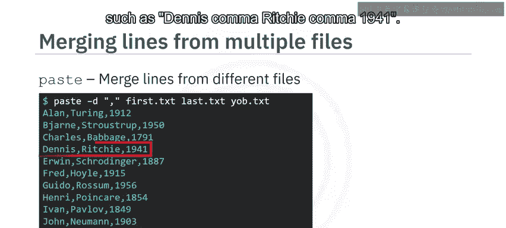

# 013：12个用于整理文本文件的有用命令 📝

在本节课中，我们将学习如何运用一系列命令来高效地整理和操作文本文件。具体来说，我们将掌握如何对文件内容进行逐行排序、去除重复行、筛选特定模式的行、从每行中提取特定部分，以及合并来自多个文件的行。

---



## 使用 `sort` 命令进行排序

上一节我们介绍了课程概述，本节中我们来看看如何对文本文件的内容进行排序。`sort` 命令能够按字母数字顺序对文件的行进行排序，并将结果输出到标准输出。

**命令格式**：
```bash
sort [选项] 文件名
```



例如，输入 `sort pets.txt`，你将得到按字母顺序排序的输出。假设 `pets.txt` 的内容中 `cat` 重复了五次，`dog` 重复了两次，排序后它们会按顺序排列。

如果你想进行反向排序，可以使用 `-r` 选项。输入 `sort -r pets.txt`，你会得到反向排序的结果，`dog` 行会出现在 `cat` 行之前。

---

## 使用 `uniq` 命令去除重复行



了解了排序之后，我们来看看如何清理文件中的重复内容。`uniq` 命令可以过滤掉文件中重复的行。

**命令格式**：
```bash
uniq [选项] 文件名
```

首先，通过输入 `cat pets.txt` 来回顾文件内容。然后，输入 `uniq pets.txt`，你将得到 `cat`、`dog` 和 `cat`。需要注意的是，`uniq` 命令**仅会移除连续出现的重复行**。因此，单词 `cat` 在这里出现了两次，因为它被两行 `dog` 隔开，打断了连续的序列。

---

## 使用 `grep` 命令搜索模式

处理完重复行，我们常常需要从文件中筛选出包含特定内容的行。`grep`（全局正则表达式打印）命令可以返回文件中匹配指定模式（如正则表达式）的行。



假设你有一个存储名人姓名的文件，可以通过输入 `cat people.txt` 来查看。

以下是使用 `grep` 的基本步骤：
*   你可以使用 `grep` 来查找 `people.txt` 中包含连续字符 “ch” 的所有行。
*   为此，你输入 `grep ch people.txt`。输出返回两个结果：`Dennis Ritchie` 和 `Irwin Schrodinger`，它们都包含小写的 “ch”。
*   如果执行相同的操作，但这次加上 `-i` 选项（`grep -i ch people.txt`），则会返回一个额外结果：`Charles Babbage`，它包含大写的 “C”。`-i` 选项通过使搜索不区分大小写来扩展模式匹配。

---

## 使用 `cut` 命令提取字段

有时我们需要从每行中提取特定的部分，这时 `cut` 命令就派上用场了。它可以从文件的每一行中提取指定的字符或字段。

再次看到名人列表，例如 `Alan Turing` 和 `Charles Babbage`。

**提取字符切片**：
你可以使用 `cut` 命令提取每行的第2到第9个字符。输入 `cut -c 2-9 people.txt`，可以看到 `Alan Turing` 被返回为 `lan Tur`。

**提取字段（更实用的例子）**：
假设你只想提取列表中每个人的姓氏。你知道列表的每一行都由两个字段组成：名和姓，它们之间用一个空格分隔。



以下是提取第二个字段（姓氏）的方法：
*   使用 `-d ‘ ‘` 选项指定字段分隔符（即表示字段间分隔的字符）为空格。
*   使用 `-f 2` 选项返回每行的第二个字段。
*   完整的命令是：`cut -d ‘ ‘ -f 2 people.txt`。这将返回列表中每个人的姓氏。

---

## 使用 `paste` 命令合并文件

最后，我们学习如何将多个文件的内容合并到一起。`paste` 命令可以合并来自多个文件的行。

想象你有以下三个行数相同的文本文件：
1.  名为 `first.txt` 的文本文件，包含人名。
2.  名为 `last.txt` 的文本文件，包含对应人物的姓氏。
3.  第三个文本文件 `yob.txt`，列出了每个人的出生年份。



你可以通过输入 `paste first.txt last.txt yob.txt`，以表格形式查看这些文件。注意，这三列是对齐的，因为 `paste` 默认使用制表符作为分隔符。通过这个表格，你可以看到，例如，`Charles Babbage` 出生于1791年。

**指定自定义分隔符**：
你可以使用 `-d` 选项为 `paste` 命令指定制表符以外的分隔符。

例如，你可以使用逗号作为分隔符，输入命令：
```bash
paste -d ‘,‘ first.txt last.txt yob.txt
```
正如你所见，这将创建一个用逗号分隔每个字段的表格，例如 `Dennis,Ritchie,1941`。

---



## 总结 🎯

本节课中我们一起学习了五个强大的文本处理命令：
1.  使用 `sort` 按字母数字顺序查看文件行。
2.  使用 `uniq` 从视图中移除重复行。
3.  使用 `grep` 获取文件中符合指定条件的行。
4.  使用 `cut` 从行中提取字符切片和字段。
5.  使用 `paste` 合并来自不同文件的行。


掌握这些命令将极大地提升你在Linux环境下处理和分析文本数据的效率。