# 015：文件存档与压缩命令

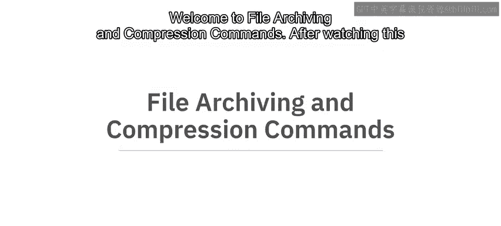

在本节课中，我们将学习Linux系统中文件存档与压缩的核心概念和实用命令。我们将了解存档与压缩的区别，并掌握如何使用 `tar` 和 `zip` 命令来创建、解压、压缩和解压缩文件。

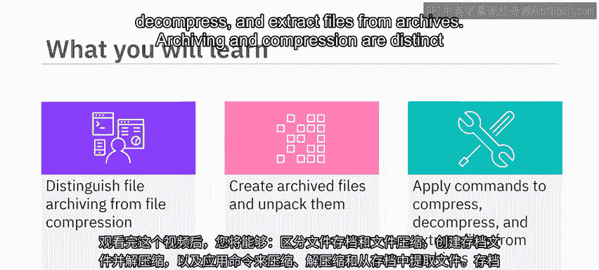

---

## 概述：存档与压缩的区别

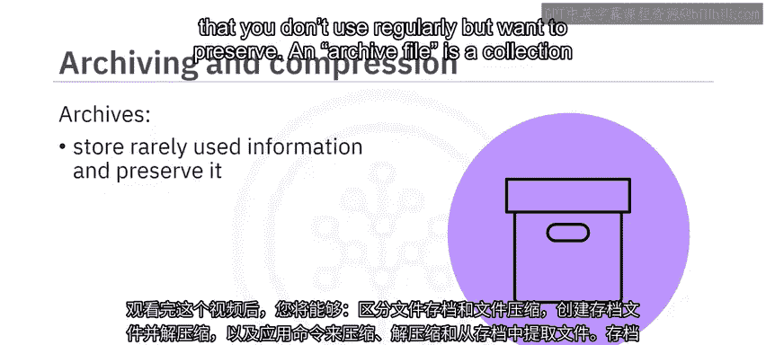

存档与压缩是两个不同但常结合使用的过程。

存档是将不经常使用但希望保留的信息存储起来的过程。一个存档文件是多个数据文件和目录的集合，它们被存储为一个单一文件。存档使文件集合更便于携带，并可作为丢失或损坏时的备份。

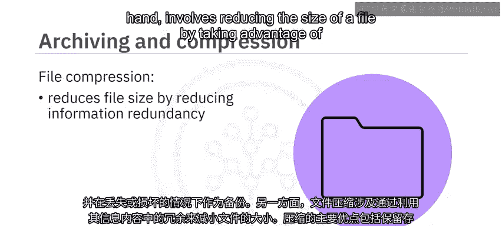

文件压缩则是通过利用文件信息内容中的冗余来减小文件大小。压缩的主要优点包括节省存储空间、加快文件传输速度以及减少带宽负载。

---

## 创建与查看存档文件

假设你创建了一个名为 `notes` 的目录来存放课程资料，并决定将其存档以备将来使用。该目录结构如下：它包含两个名为 `math` 和 `physics` 的子文件夹，每个子文件夹内都有名为 `week1` 和 `week2` 的文件。

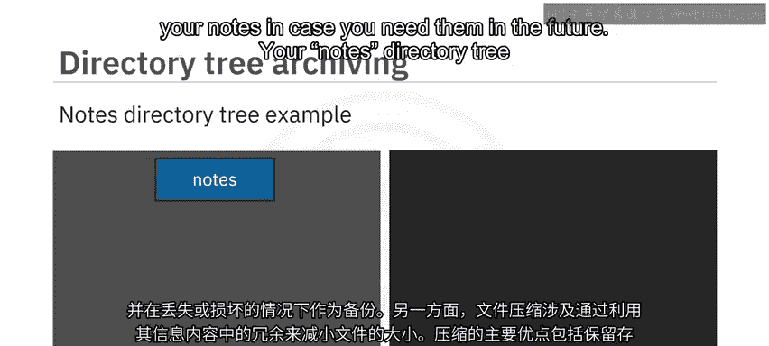

使用带 `-R` 选项的 `ls` 命令，可以递归地列出当前目录树中的所有目录和文件，其结构与图形表示一致。

### 使用 `tar` 命令存档

`tar`（磁带存档）命令可用于存档和解档文件及目录。一个已存档的 `tar` 文件常被称为“tarball”。

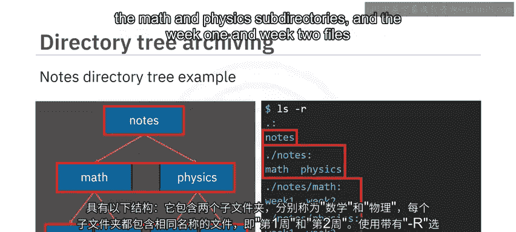

要存档整个 `notes` 目录（包括其子目录和所有文件），请输入以下命令：
```bash
tar -cf notes.tar notes
```
其中，`-c` 选项表示创建新存档，`-f` 标志告诉 `tar` 从文件（而非默认的标准输入）读取输入。

执行 `ls` 命令后，可以看到当前目录中既包含原始的 `notes` 文件夹，也包含新创建的 `notes.tar` 存档文件。

### 创建压缩存档

如果你还希望存档被压缩，可以输入相同的命令，但额外加上 `-z` 选项。该选项会通过名为 `gzip` 的压缩程序过滤存档。为输出文件名添加 `.gz` 后缀有助于其他系统（如Windows）正确识别文件类型。
```bash
tar -czf notes.tar.gz notes
```
执行 `ls` 命令后，可以看到已创建压缩的 `notes.tar.gz` 文件。

### 查看存档内容

你可以使用 `tar` 命令的 `-t`（列表）选项来检查存档文件的内容：
```bash
tar -tf notes.tar
```
这会列出 tarball 中的所有文件和目录。正如预期，其结构与原始 `notes` 文件夹相同。

---

## 解压与提取存档文件

上一节我们介绍了如何创建存档，本节中我们来看看如何解包或解档存档文件。

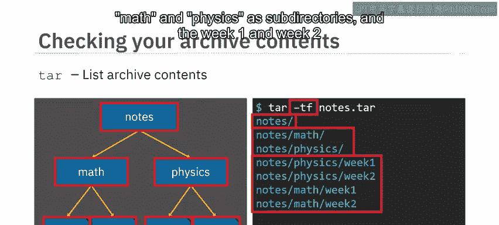

### 解档 `tar` 文件

使用 `tar` 命令解档存档文件。输入以下命令：
```bash
tar -xf notes.tar
```
`-x` 选项告诉 `tar` 从存档中提取文件和目录对象。命令后的 `notes` 是可选的目标文件夹名称（此处为默认值）。

输入 `ls -R`，可以看到存档的 `notes` 文件夹已被解档到一个名为 `notes` 的父文件夹中，其中包含 `math` 和 `physics` 子文件夹以及最初的四个周文件。这验证了原始目录结构的完整性。

### 解压并提取 `.tar.gz` 文件

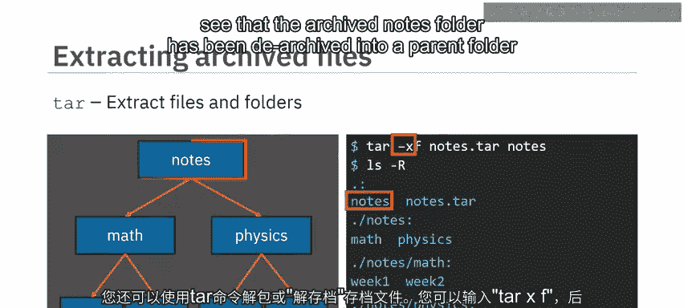

同样，你可以解压缩 `.tar.gz` 文件并从中提取文件。要解包并解压缩 `notes.tar.gz` 文件，请输入：
```bash
tar -xzf notes.tar.gz
```
再次输入 `ls -R`，可以看到目录和文件已按预期解包。

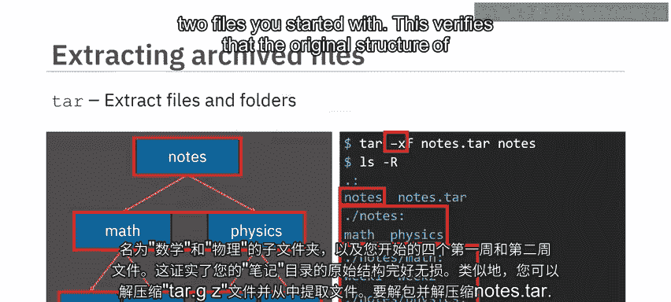

---

## 使用 `zip` 和 `unzip` 命令

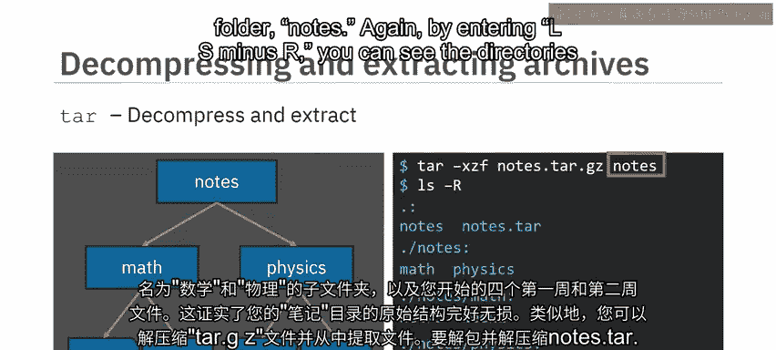

`zip` 命令用于压缩文件目录并将其打包成单个存档。请注意 `zip` 实现的操作顺序：它先压缩文件，然后再打包。而 `tar` 加 `-z` 选项则是先打包整个 tarball，然后再对其应用 `gzip` 压缩。

### 创建 `zip` 存档

要压缩 `notes` 目录并将其打包成 `zip` 文件，请输入：
```bash
zip -r notes.zip notes
```
输入 `ls` 后，可以看到已创建 `notes.zip` 存档。

### 解压 `zip` 存档

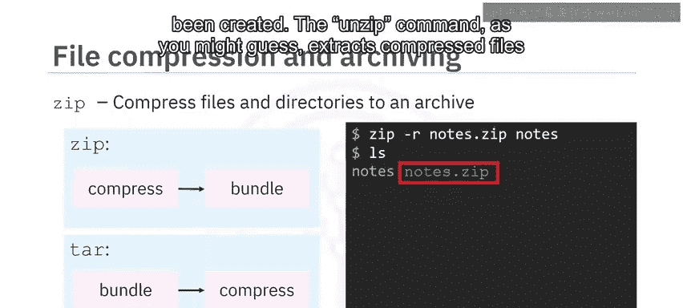

`unzip` 命令，顾名思义，用于从 `zip` 存档中提取压缩文件并解压缩它们。

要解压 `notes.zip` 文件，只需输入：
```bash
unzip notes.zip
```
输入 `ls -R` 后，可以看到 `unzip` 已创建 `notes` 文件夹，并按预期解包了目录和周文件。

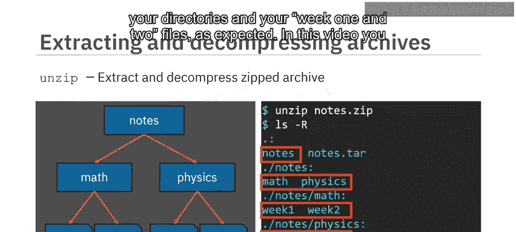

---

## 总结

本节课中我们一起学习了文件压缩的主要优点，包括节省存储空间、加快文件传输速度和减少带宽负载。

我们掌握了以下关键命令：
*   使用 `zip` 命令压缩文件目录并将其打包成单个压缩文件存档。
*   使用 `tar` 命令将文件目录存档成 tarball，并可选择使用 `gzip` 压缩该 tarball 文件。
*   使用 `unzip` 命令解包和解压缩 `zip` 存档。
*   使用 `tar` 命令解压缩和解包 `.tar.gz` 存档。

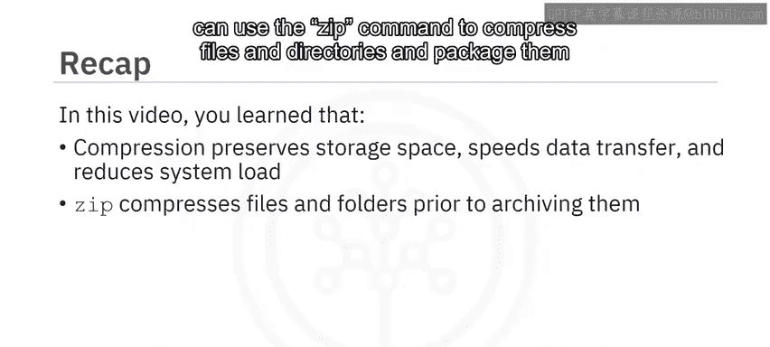

通过掌握这些命令，你可以有效地在Linux系统中管理、备份和传输文件集合。