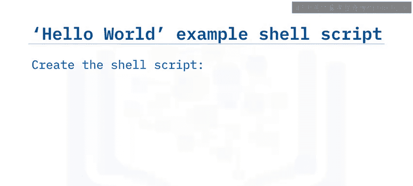
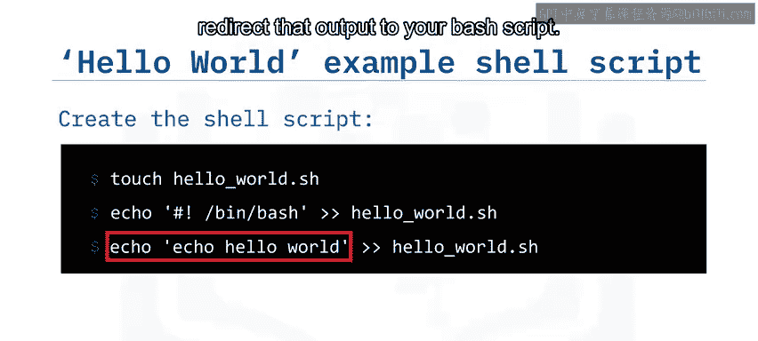
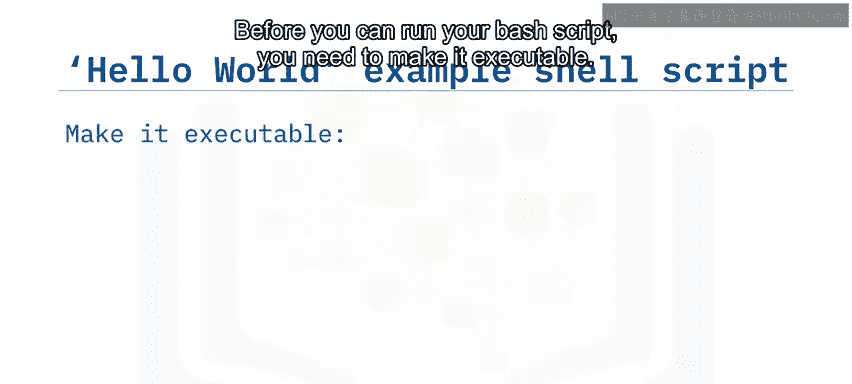
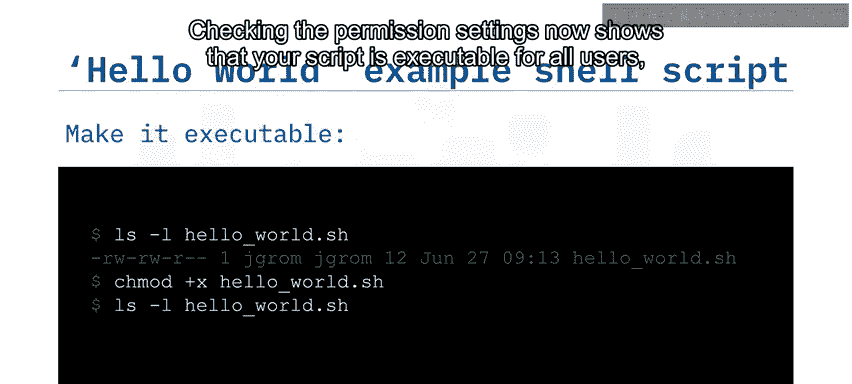
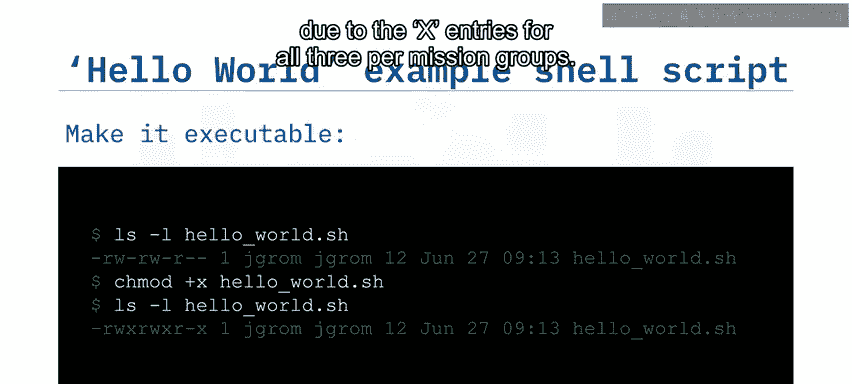
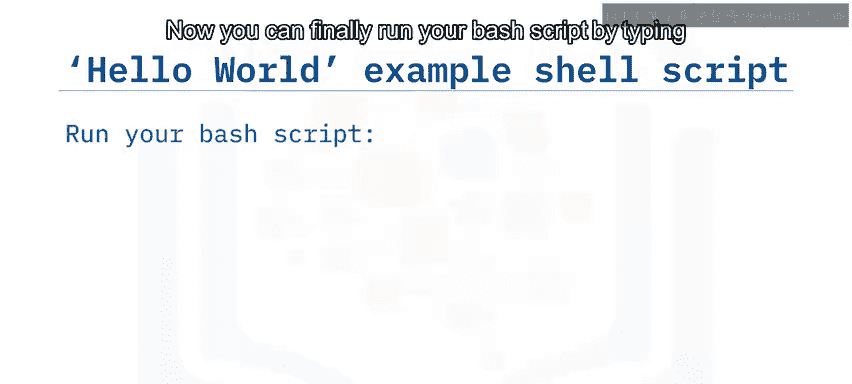
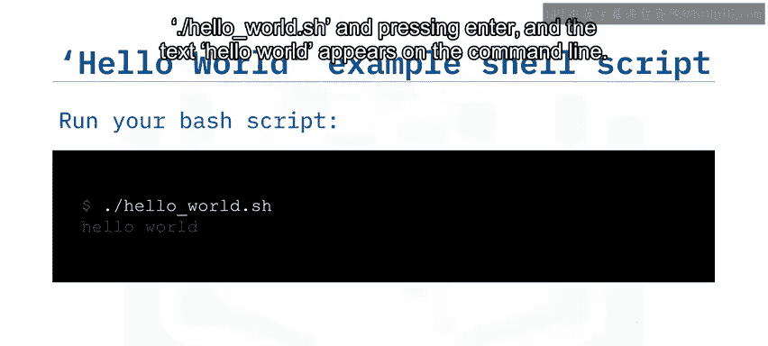
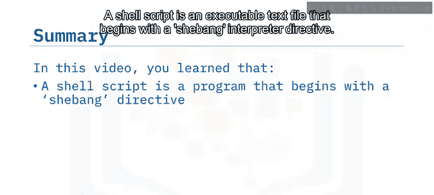

# 016：Shell脚本基础入门

在本节课中，我们将学习Shell脚本的基础知识。我们将了解什么是脚本、脚本的常见用途、如何编写一个简单的Shell脚本，以及如何运行它。通过本课的学习，你将能够掌握Shell脚本的基本概念和操作步骤。

---

## 什么是脚本？

脚本是一系列命令的列表，可以由一种称为脚本语言的程序解释并运行。这些命令可以交互式地在命令行中输入，也可以逐行列在文本文件中。

脚本语言通常不需要编译，它们在运行时被解释。因此，脚本的运行速度通常比编译型语言慢，但开发和修改脚本更加容易和快速。

---

## 脚本的常见用途

脚本被广泛用于自动化各种过程。以下是脚本的一些常见用途：

*   **ETL作业**：用于数据的提取、转换和加载。
*   **文件备份和归档**：自动化文件的备份和整理。
*   **系统管理任务**：执行日常的系统维护和管理操作。
*   **应用程序集成**：连接不同的应用程序或服务。
*   **插件和Web应用开发**：用于开发扩展功能或Web应用。

你可以使用脚本来完成几乎任何计算任务。

---

## Shebang解释器指令

Shell脚本是一个可执行的文本文件，其第一行通常是一个解释器指令，也称为Shebang指令。

Shebang指令的形式如下：
`#! interpreter [optional-argument]`



其中：
*   `interpreter` 是一个可执行程序的绝对路径。
*   `[optional-argument]` 是一个可选的字符串参数。

Shell脚本是调用Shell程序的脚本。例如：
*   `#!/bin/sh` 调用位于`/bin`目录下的Bourne Shell或其他兼容的Shell程序。
*   `#!/bin/bash` 调用Bash Shell。

Shebang指令不仅限于Shell程序。例如，你可以创建一个Python脚本，其指令为：`#!/usr/bin/env python3`。

---

## 创建并运行一个简单的Shell脚本

上一节我们介绍了Shebang指令，本节中我们来看看如何创建一个简单的“Hello World”Shell脚本并运行它。





以下是创建和运行脚本的步骤：

1.  **创建脚本文件**：使用`touch`命令创建一个名为`hello_world.sh`的空文本文件。`.sh`扩展名是一种约定，用于表明该文件是一个Shell脚本。
    ```bash
    touch hello_world.sh
    ```

2.  **添加Shebang指令**：通过`echo`命令输出Bash的Shebang指令，并使用双大于号`>>`（Bash的输出重定向追加操作符）将其添加到文件中。
    ```bash
    echo ‘#!/bin/bash’ >> hello_world.sh
    ```

3.  **添加脚本内容**：再次使用`echo`命令，将打印“Hello World”的语句添加到脚本中。
    ```bash
    echo ‘echo “Hello world”’ >> hello_world.sh
    ```



4.  **设置执行权限**：在运行脚本之前，需要使其可执行。首先，使用`ls -l`命令检查脚本当前的权限设置。
    ```bash
    ls -l hello_world.sh
    ```
    输出中的`r`和`w`表示文件可读和可写，但没有`x`意味着它不可执行。这些权限适用于三个用户组：所有者（你）、所属组和其他所有用户。使用`chmod +x`命令为所有用户添加执行权限。
    ```bash
    chmod +x hello_world.sh
    ```
    再次检查权限，现在所有三个权限组都有了`x`条目，表示脚本对所有用户都可执行。



5.  **运行脚本**：最后，通过输入`./hello_world.sh`并按回车键来运行你的Bash脚本。命令行将显示文本“Hello world”。
    ```bash
    ./hello_world.sh
    ```



---



## 总结

本节课中我们一起学习了Shell脚本的基础知识。我们了解到：



*   Shell脚本是一个以Shebang解释器指令开头的可执行文本文件。
*   Shell脚本可用于执行命令以及运行其他程序。
*   脚本语言不需要编译，它们在运行时被解释。
*   编译型语言可能比脚本语言运行得更快，但通常需要更多的开发时间。

通过掌握这些基础，你已经迈出了使用Shell脚本自动化任务的第一步。