# 017：管道、变量和过滤器 📖

在本节课中，我们将要学习Bash Shell脚本的三个核心特性：过滤器、管道以及Shell变量与环境变量。掌握这些概念是编写高效Shell脚本的基础。

## 概述

本节内容将分为三个主要部分。首先，我们将介绍什么是过滤器及其作用。接着，我们将探讨如何使用管道将多个过滤器命令连接起来。最后，我们会讲解Shell变量与环境变量的定义、设置和使用方法。

## 过滤器 🔍

过滤器是Shell命令或程序，它们从标准输入（通常是键盘）读取数据，并将处理结果输出到标准输出（通常是终端）。我们可以将过滤器视为一个数据转换器。

以下是常见的过滤器命令示例：
*   `wc` (word count)：统计字数、行数。
*   `cat`：连接并显示文件内容。
*   `more`：分页显示文件内容。
*   `head`：显示文件开头部分。
*   `sort`：对文本行进行排序。
*   `grep`：在文件中搜索指定模式。

过滤器的强大之处在于它们可以被串联使用，这就引出了“管道”的概念。

## 管道操作符 `|` 🔗

管道操作符由一个竖线符号 `|` 表示，它极大地扩展了Shell的功能。管道允许你将一系列过滤器命令连接成一个处理链。其使用模式如下：

```bash
command1 | command2 | command3
```

相应地，`command1` 的输出会成为 `command2` 的输入，依此类推。顾名思义，“pipe”就是“管道”或“流水线”的意思。

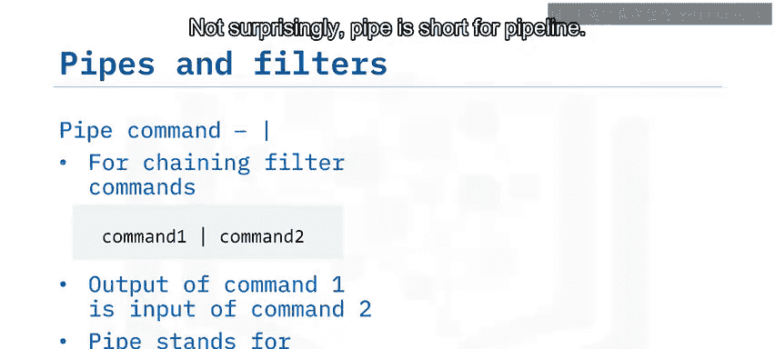

例如，你可以将 `ls` 命令的输出通过管道传递给带 `-r` 选项的 `sort` 命令，从而得到一个反向排序的目录内容列表。

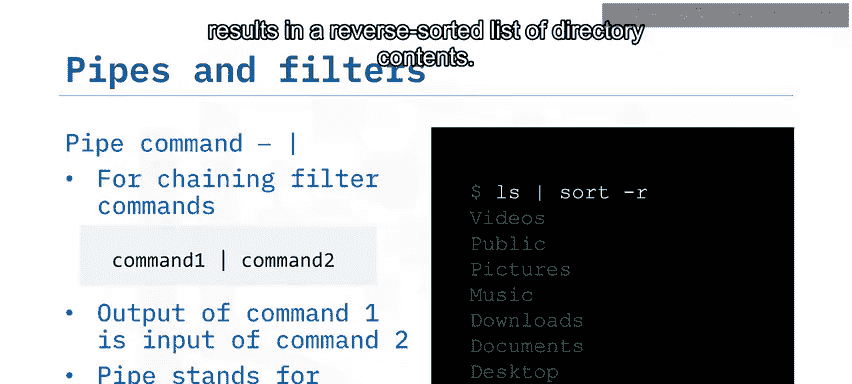

```bash
ls | sort -r
```

## Shell变量 💾

Shell变量是其作用域仅限于创建它的Shell本身的变量。根据定义，不同的Shell进程无法看到彼此的Shell变量。你可以使用 `set` 命令来列出当前Shell可见的所有变量及其定义。

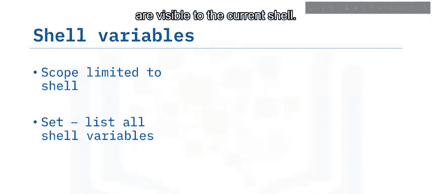

```bash
set
```

由于该命令会列出大量信息，你可以将其输出通过管道传递给 `head` 命令，以便只显示前几个变量定义。

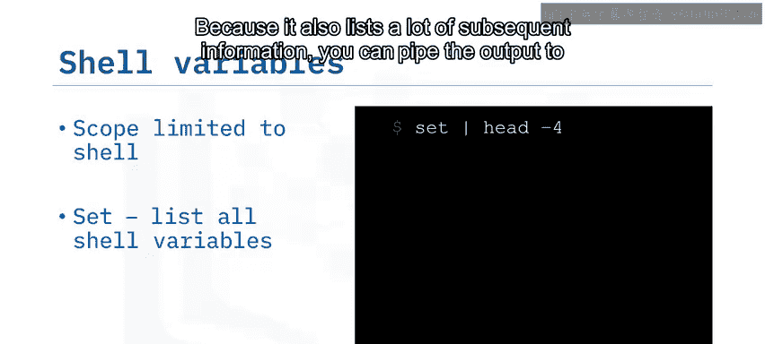

```bash
set | head -4
```

要定义一个新的Shell变量，只需使用等号为你选择的变量名赋值。请注意，等号周围不能有空格。

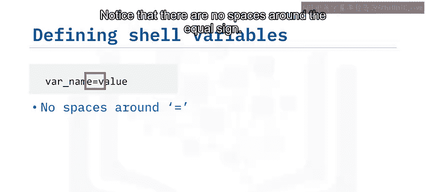

```bash
变量名=值
```

例如，我们定义一个名为 `greetings` 的Shell变量，用于存储字符串 “Hello”。

```bash
greetings=Hello
```

要查看新变量 `greetings` 的内容，需要使用美元符号 `$` 来访问其值，然后通过 `echo` 命令将其回显出来。

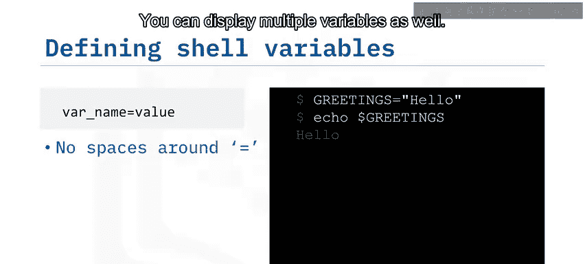

```bash
echo $greetings
```

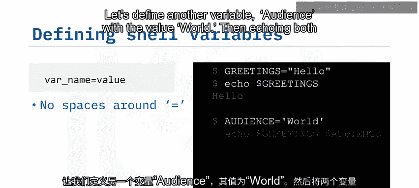

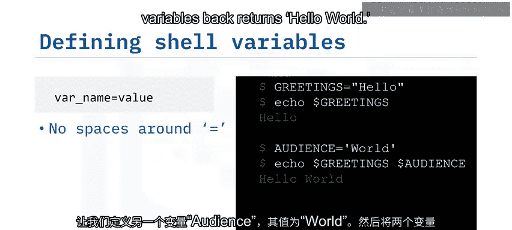

你也可以同时显示多个变量。让我们再定义一个变量 `audience`，其值为 “world”。

```bash
audience=world
```

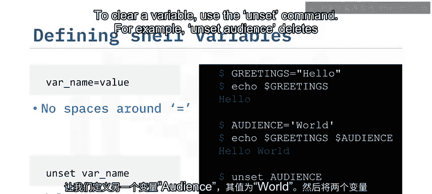

然后同时回显这两个变量，将得到 “Hello world”。

```bash
echo $greetings $audience
```

要清除一个变量，请使用 `unset` 命令。例如，`unset audience` 会删除变量 `audience`。

```bash
unset audience
```

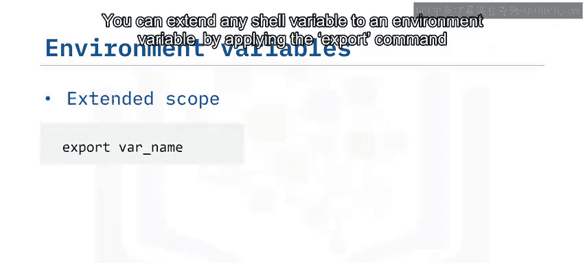

## 环境变量 🌍

环境变量与Shell变量类似，但它们的**作用域更广**。环境变量会持续存在于由创建它的Shell所派生的任何子进程中。

你可以通过 `export` 命令将任何Shell变量扩展为环境变量。例如，`export greetings` 会使 `greetings` 成为一个环境变量。

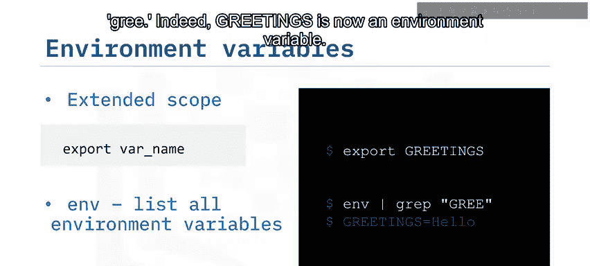

```bash
export greetings
```

要列出所有环境变量，请使用 `env` 命令。让我们通过将 `env` 的输出传递给 `grep` 命令，并使用模式 “greet” 过滤结果，来检查 `greetings` 是否已被导出为环境变量。

```bash
env | grep greet
```

结果显示，`greetings` 现在确实是一个环境变量。

## 总结

本节课中我们一起学习了：
1.  **过滤器**是如 `wc`、`cat`、`sort` 等的Shell命令或程序，它们对提供的输入数据进行转换。
2.  **管道操作符** `|` 可用于创建过滤器命令链（管道），使一个命令的输出成为另一个命令的输入。
3.  **Shell变量**可以通过简单的等号赋值，使用 `set` 命令列出，其作用域限于当前Shell。
4.  **环境变量**是作用域扩展到其所在Shell的所有子进程的Shell变量，它们使用 `export` 命令创建，并使用 `env` 命令列出。


掌握管道、变量和过滤器是构建复杂且自动化Shell脚本的关键步骤。