# 018：Bash Shell 实用功能 🛠️

在本节课中，我们将学习Bash Shell脚本的几个核心功能。掌握这些功能将帮助你更高效地编写和运行Shell脚本。

## 概述

Bash Shell提供了一系列强大的功能，包括元字符、引用、输入输出重定向、命令替换、命令行参数以及批处理与并发执行模式。理解这些概念是编写有效Shell脚本的基础。

## 元字符

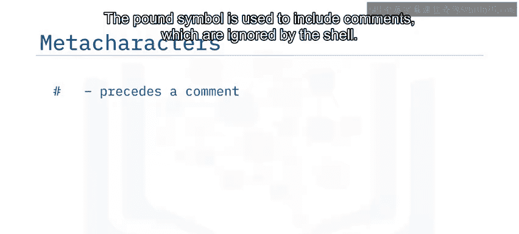

元字符是对Shell具有特殊含义的字符。

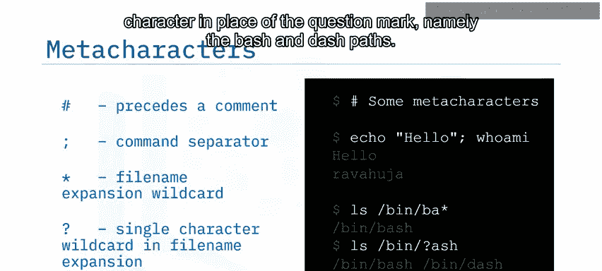

以下是几种常见的元字符及其用途：

*   **井号 `#`**：用于添加注释，Shell会忽略注释内容。
    *   例如：`# 这是一个注释` 不会返回任何结果。
*   **分号 `;`**：用于在同一行中分隔多个命令。
    *   例如：`echo “第一行”; echo “第二行”` 会分两行输出结果。
*   **星号 `*`**：在文件名模式中，代表任意数量的连续字符。
    *   例如：`ls /bin/ba*` 会列出 `/bin` 目录下所有以 `ba` 开头的文件，例如 `bash`。
*   **问号 `?`**：在文件名模式中，代表任意单个字符。
    *   例如：`ls /bin/b?sh` 会列出 `/bin` 目录下符合 `b?sh` 模式的文件，例如 `bash` 和 `dash`。

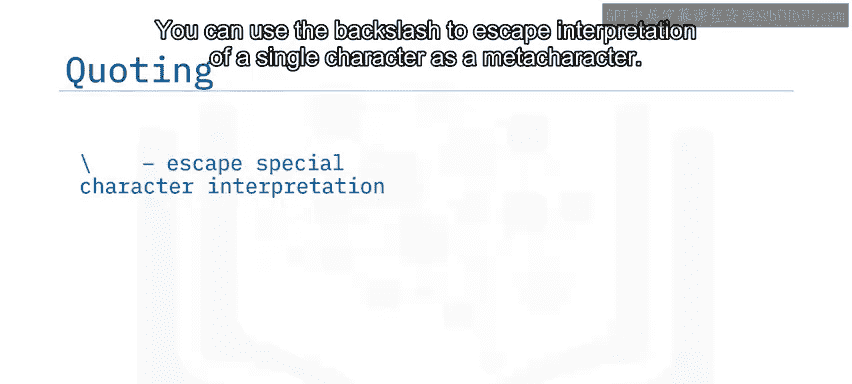

## 引用

引用用于指定Shell是否应将特殊字符解释为元字符，或者将其转义。

*   **反斜杠 `\`**：用于转义单个字符，使其不被解释为元字符。
    *   例如：`echo \$1 each` 中的 `\$` 会让Bash将美元符号 `$` 视为普通文本，而不是变量名。因此输出是字面量的 `$1 each`。
*   **双引号 `“`**：会按字面解释文本，但其中的元字符（如 `$`）仍保留其特殊含义。
    *   例如：`echo “$1 each”` 中的 `$1` 会被解释为一个变量。如果变量 `$1` 未定义或为空，则输出仅为 `each`。
*   **单引号 `‘`**：会将所有内容都解释为字面字符，不进行任何特殊解释。
    *   例如：`echo ‘$1 each’` 会直接输出 `$1 each`。

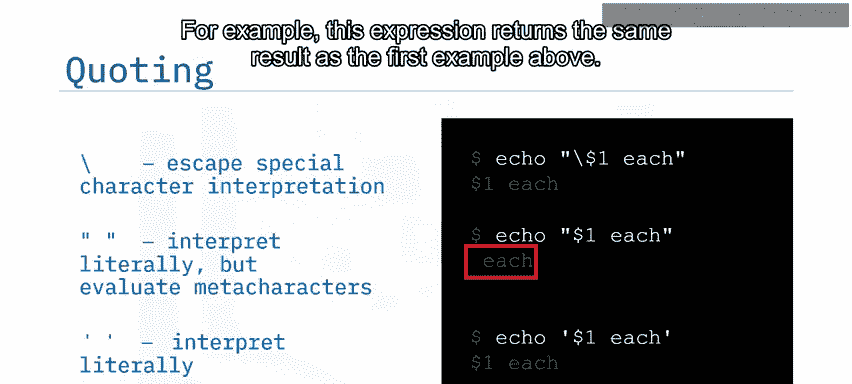

## 输入输出重定向

输入输出重定向是一组用于重定向标准输入或标准输出的功能。

以下是几种重定向操作符：

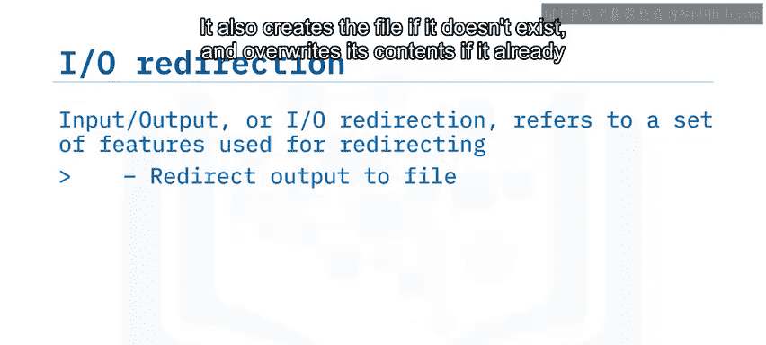

*   **大于号 `>`**：将命令的标准输出重定向到文件。如果文件不存在则创建，如果存在则覆盖其内容。
    *   例如：`echo “内容” > file.txt`
*   **双大于号 `>>`**：将命令的标准输出追加到文件末尾，避免覆盖原有内容。
    *   例如：`echo “新内容” >> file.txt`
*   **`2>`**：将错误信息重定向到文件。
    *   例如：`command_not_found 2> error.log`
*   **`2>>`**：将错误信息追加到文件。
    *   例如：`command_not_found 2>> error.log`
*   **小于号 `<`**：将文件内容作为标准输入传递给命令。
    *   例如：`sort < input.txt`

现在，让我们通过一些例子来实践。你可以先创建一个文件并写入文本：
```bash
echo “第一行” > example.txt
```
然后查看文件内容：
```bash
cat example.txt
```
接下来，尝试向文件追加另一行：
```bash
echo “第二行” >> example.txt
```
再次查看，可以看到文件包含了你添加的两行。

输入一个不存在的命令会产生错误：
```bash
garbage_command 2> error.txt
```
这个表达式捕获了错误信息并将其重定向到 `error.txt` 文件。

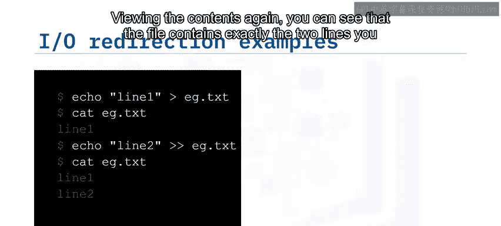

## 命令替换

当你希望用命令的输出结果来替换该命令本身时，可以使用命令替换。

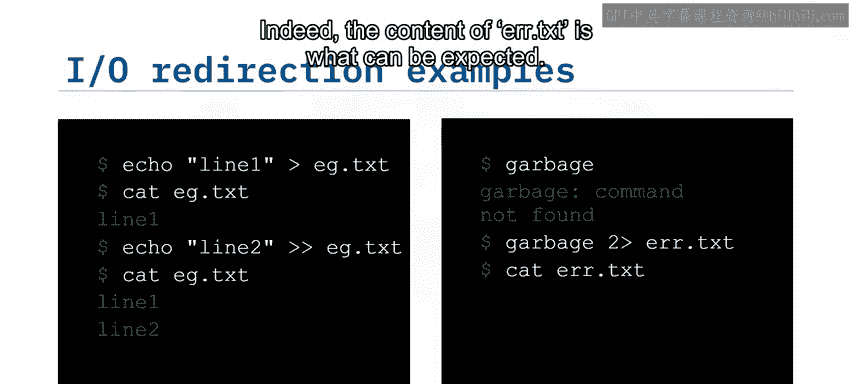

有两种等效的表示方法：
1.  `$(command)`
2.  `` `command` ``（反引号）

假设你想将当前目录路径存储在一个名为 `here` 的变量中，你可以对 `pwd` 命令使用命令替换来捕获其输出：
```bash
here=$(pwd)
```
或者：
```bash
here=`pwd`
```
然后，输出该变量的值：
```bash
echo $here
```
这将显示当前目录的路径。

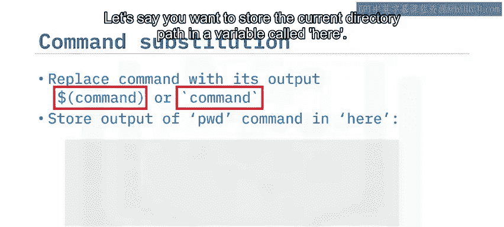

## 命令行参数

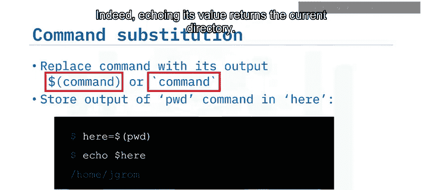

命令行参数是在命令行上为程序指定的参数。它们提供了一种向Shell脚本传递参数的方式。

Bash脚本的命令行参数按以下方式引用：
*   `$0`：脚本名称
*   `$1`：第一个参数
*   `$2`：第二个参数
*   … 以此类推

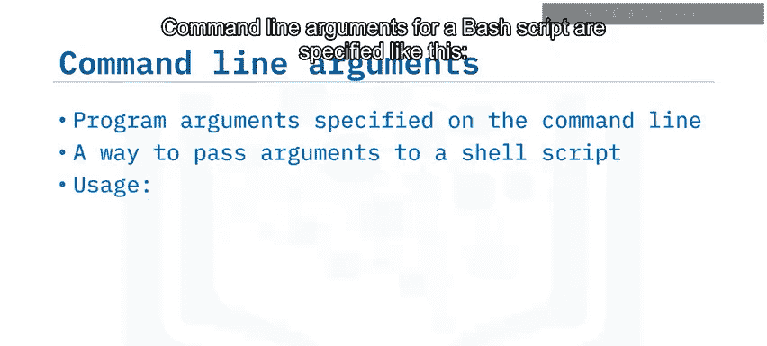

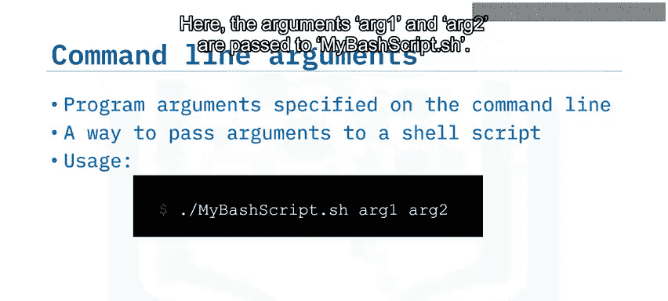

例如，如果你这样运行脚本：
```bash
./mybashscript.sh arg1 arg2
```
那么在脚本内部，`$1` 的值是 `arg1`，`$2` 的值是 `arg2`。

## 执行模式

Bash主要有两种操作模式：

*   **批处理模式**：这是通常的模式，命令按顺序执行。
    *   例如：`command1; command2`。`command2` 只有在 `command1` 完成后才会运行。
*   **并发模式**：命令并行运行。在 `command1` 后面加上 `&` 运算符，会使 `command1` 在后台运行，同时将控制权交给前台的 `command2`。
    *   例如：`command1 & command2`。`command1` 和 `command2` 会同时开始执行。

## 总结


本节课我们一起学习了Bash Shell的几项实用功能。我们了解了**元字符**是Shell中的特殊字符；**引用**用于控制Shell对特殊字符的解释方式；**输入输出重定向**可以改变命令的输入源和输出目标；**命令替换**允许我们将命令的输出作为值来使用；**命令行参数**使得我们可以向脚本传递信息；最后，**并发模式**让多个命令能够同时运行。掌握这些功能是成为高效Shell脚本用户的关键一步。