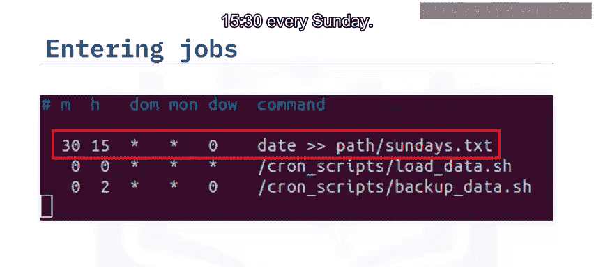
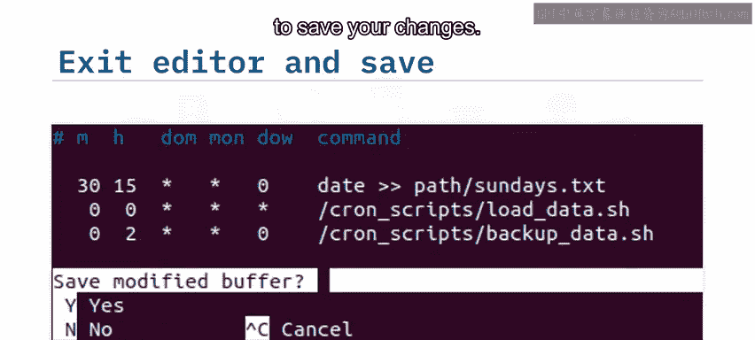

# 019：使用Cron调度作业 ⏰

在本节课中，我们将学习如何使用Cron工具在Linux和类Unix操作系统上自动调度和运行任务。这对于系统管理员、数据工程师或开发者来说，是一项非常有用的技能。

---

## 概述

Cron是一个强大的工具，允许你安排脚本或命令在特定时间自动执行。例如，你可以设置一个数据加载脚本每天午夜运行，或者一个备份脚本每周日凌晨2点运行。接下来，我们将了解Cron的核心组件、语法以及如何管理这些定时任务。

---

## Cron的核心概念

Cron系统主要由以下几个部分组成：

*   **Cron**：这是运行调度作业的工具的总称。
*   **Crond**：这是一个守护进程或服务，它每分钟检查一次CronTab文件，并在预定时间提交相应的作业给Cron执行。
*   **CronTab**：这既是一个包含作业和调度数据的文件，也是一个用于编辑该文件的命令。

---

## 编辑Cron作业

要创建或编辑Cron作业，我们需要使用 `crontab` 命令。

在命令行中输入 `crontab -e` 会打开默认的文本编辑器（例如 `nano` 或 `vi`）。在编辑器中，你可以指定新的调度时间和要执行的命令。

Cron作业的语法格式如下：
```
* * * * * command_to_execute
```
这五个星号位置分别代表：
*   **分钟** (0-59)
*   **小时** (0-23)
*   **月份中的日期** (1-31)
*   **月份** (1-12)
*   **星期几** (0-7，其中0和7都代表星期日)

每个位置必须填入一个数字，或者使用星号 `*`（这是一个通配符，表示“任何”值）。

**命令**可以是任何Shell命令，包括调用一个Shell脚本。


例如，以下语法表示在每个星期日的15点30分，将当前日期追加到文件 `Sundays.txt` 中：
```
30 15 * * 0 date >> Sundays.txt
```

---

## 一个CronTab编辑示例

上一节我们介绍了Cron的基本语法，本节中我们来看看一个具体的编辑示例。

输入 `crontab -e` 后，编辑器会打开。为了方便用户，文件中通常包含一些以 `#` 开头的注释行作为使用说明。

以下是一个CronTab文件内容的例子。为了提升可读性，可以将条目与表头对齐成列（额外的空格会被忽略）：
```
# m h  dom mon dow   command
30 15 * * 0   date >> Sundays.txt
0 0 * * *     /home/user/scripts/load_data.sh
0 2 * * 0     /home/user/scripts/backup_data.sh
```

以下是这三个条目的解释：
1.  第一行：在每个星期日的15:30，将当前日期追加到 `Sundays.txt` 文件。
2.  第二行：在每天午夜（00:00），运行 `load_data.sh` 脚本。
3.  第三行：在每个星期日的02:00，运行 `backup_data.sh` 脚本。

编辑完成后，按 `Ctrl+X` 退出编辑器，然后输入 `Y` 确认保存更改。这样，作业就进入生产状态，会按照设定时间自动执行。



---



## 查看和删除Cron作业

学会了如何创建Cron作业后，管理已有的作业同样重要。以下是查看和删除作业的方法。

运行 `crontab -l` 命令可以列出当前用户的所有Cron作业及其调度时间。
```
crontab -l
```

如果要删除某个作业，只需再次运行 `crontab -e` 打开编辑器，删除对应的任务行，然后保存并退出即可。

---

## 总结


本节课中，我们一起学习了如何使用Cron调度周期性任务。我们了解到，Cron作业可以通过 `分钟 小时 日 月 星期 命令` 的语法格式进行定义。使用 `crontab -e` 命令可以编辑作业列表，而 `crontab -l` 命令则可以列出Cron表中的所有作业。掌握这些技能，将帮助你自动化日常的系统管理或数据处理任务。