# 001：数据库管理员的一天 👨‍💻

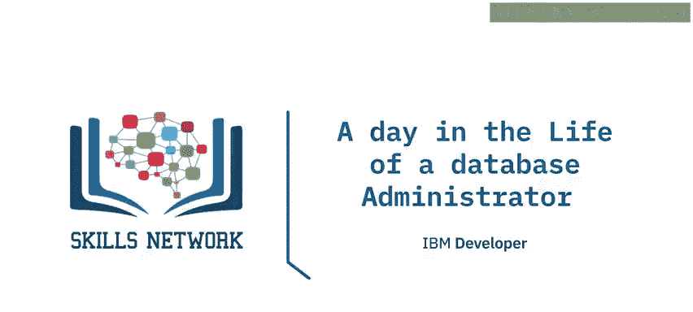

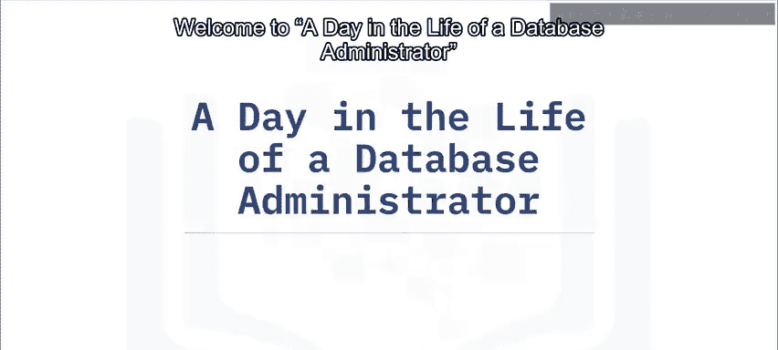

在本节课中，我们将通过一个虚拟人物Rigel的日常工作，了解数据库管理员（DBA）的典型一天。你将能够描述DBA的日常工作流程，并识别他们执行的核心任务。

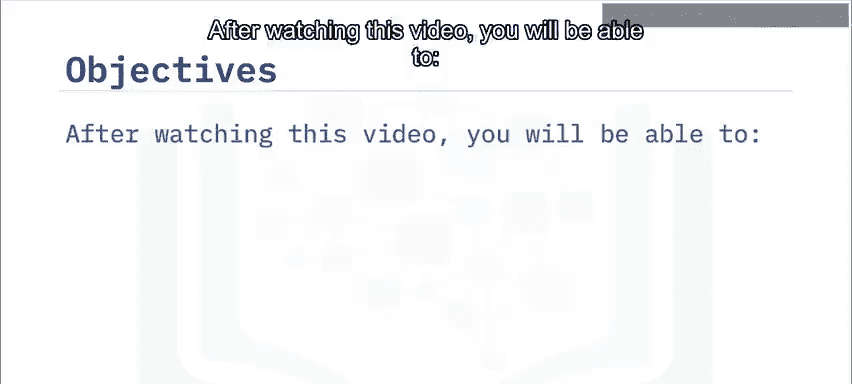

## 概述：DBA的一天从何开始？ ☕

Rigel是一名数据库管理员。他的一天从一杯咖啡开始，首要任务是检查他所负责的所有数据库是否都在正常运行，且没有错误。他使用预配置的仪表板来快速、轻松地获取最关键的信息。

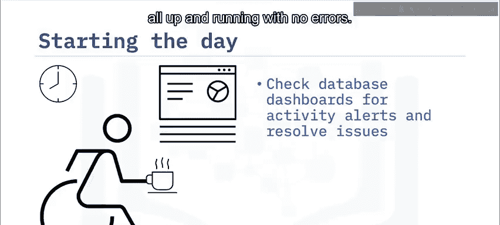

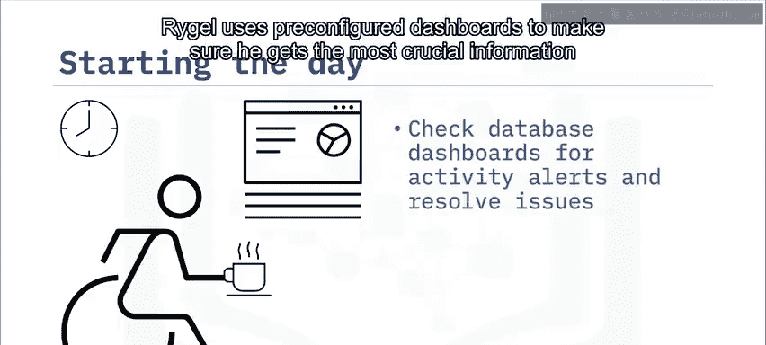

今天是个好日子，只有一个轻微警报，Rigel顺利地解决了它。

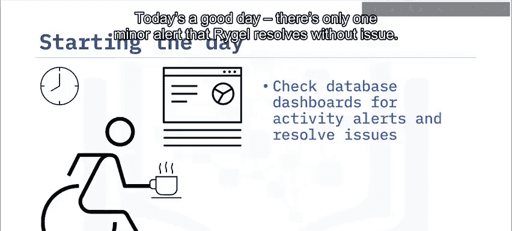

## 检查例行任务与备份 📋

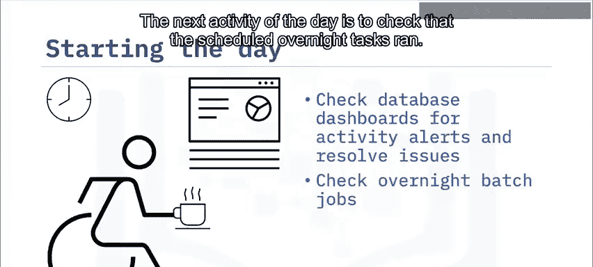

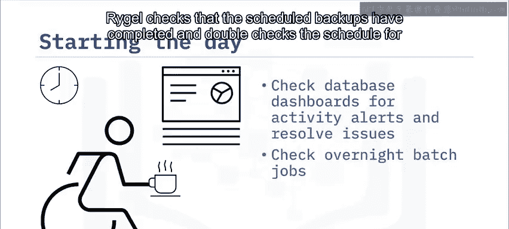

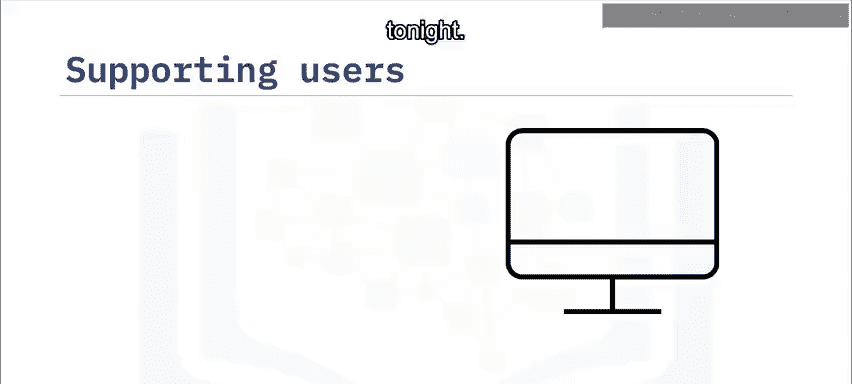

上一节我们介绍了DBA如何开始一天的工作，本节中我们来看看他如何确保系统的持续稳定。

接下来，Rigel检查预定的夜间任务是否已执行。他确认了计划备份已经完成，并再次核对了今晚的备份计划。

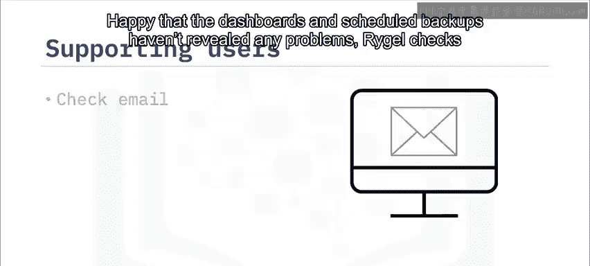

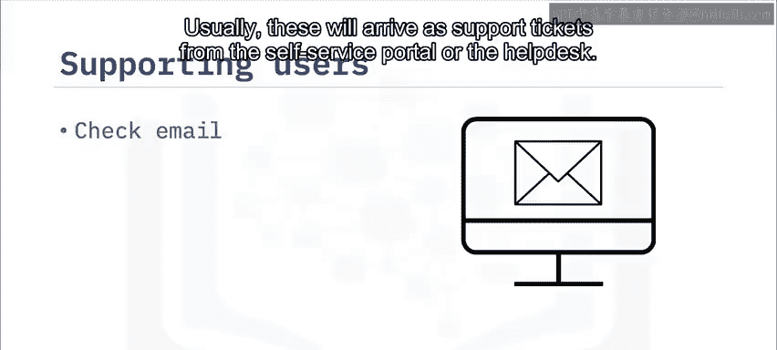

在确认仪表板和计划备份都没有问题后，Rigel开始查看他的电子邮件，寻找用户请求。这些请求通常以自助服务门户或服务台的工单形式出现。今天，他发现了四个支持工单，以及一封来自市场部开发人员的邮件，请求对某个功能进行改进。

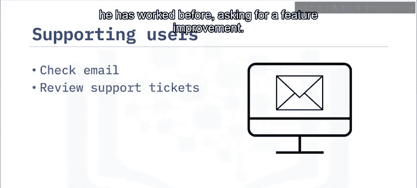

## 处理用户请求与优化工作 ⚙️

在确认系统状态后，DBA需要处理来自用户和开发者的各种请求。以下是Rigel处理这些请求的步骤：

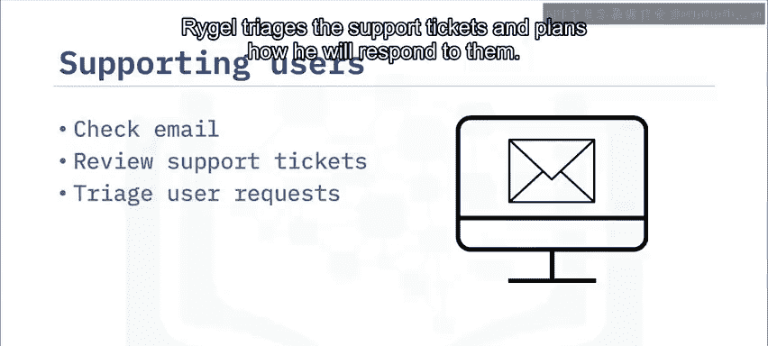

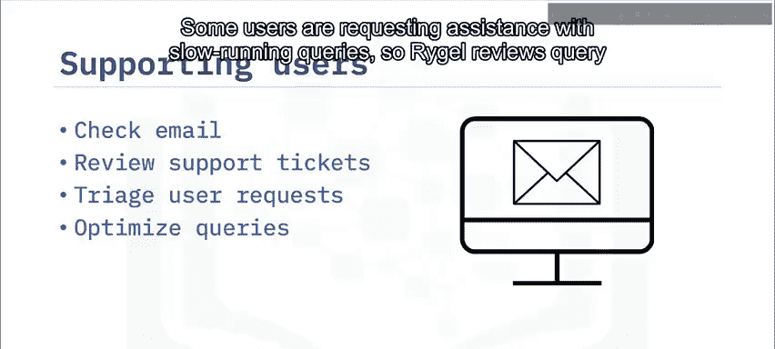

Rigel对这些支持工单进行分类，并计划如何回应。一些用户请求协助解决运行缓慢的查询，因此Rigel会审查查询计划并提供查询优化帮助。市场部的开发人员请求为一个追踪营销活动结果的数据库添加额外字段。Rigel与她讨论了所需的数据模式更改，并请她通过自助服务门户提交请求，以便跟踪和记录处理过程。

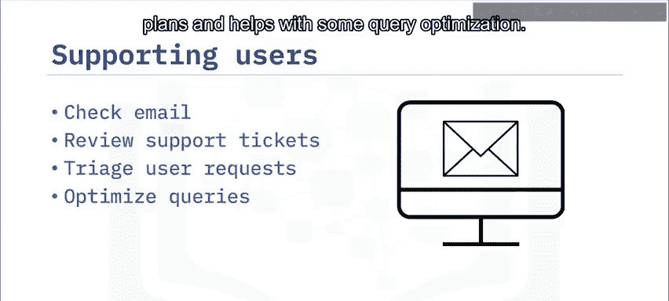

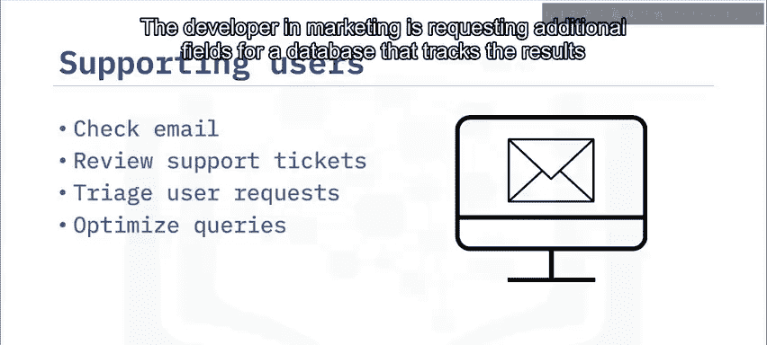

## 参与规划与资源配置会议 🤝

处理完上午的请求后，Rigel在快速午餐后参加了一个新数据库的规划会议。与会者包括开发人员、数据工程师和数据架构师。他正与他们合作设计一个数据库，旨在确保商业智能工作负载的高读取性能。Rigel将确保为未来的用户增长分配适当的资源，并制定压力测试场景，以找出数据库能承受的最大负载。

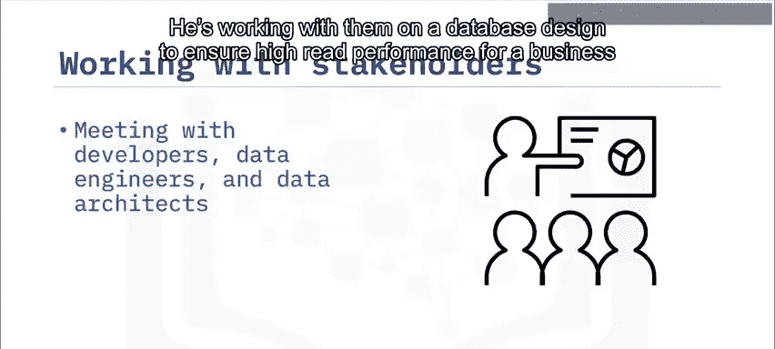

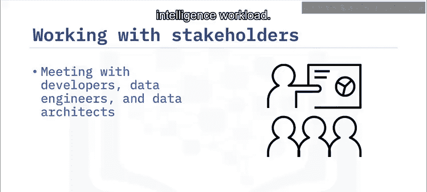

像Rigel这样的DBA会使用分析来确定适当的服务器资源，例如存储空间、内存、处理能力和日志文件大小。

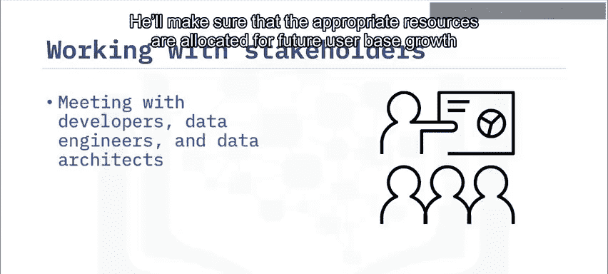

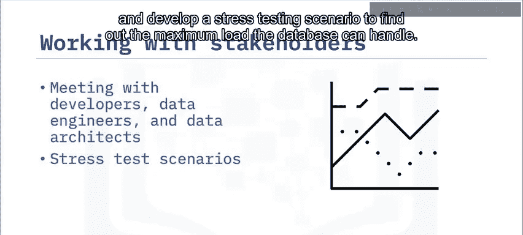

## 配置监控与结束一天的工作 📱

会议结束后，Rigel回到办公桌前完成一天的工作。他花了一些时间配置一个警报，以便在触发时发送到他的手机。这样，他就能立即知晓任何问题。

在他工作时，他持续关注着电子邮件，留意新的支持工单。在收拾东西回家之前，又有几个工单到达，Rigel迅速处理了它们。最后，Rigel做了一些最终检查：他再次查看了仪表板，并确认已正确安排了夜间任务。

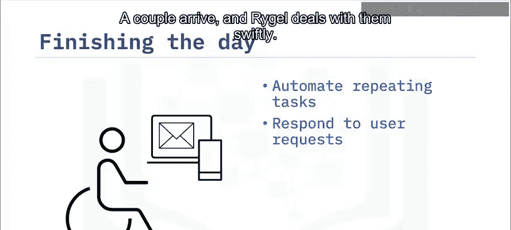

对充实的一天感到满意后，Rigel回家了。明天又是新的一天。

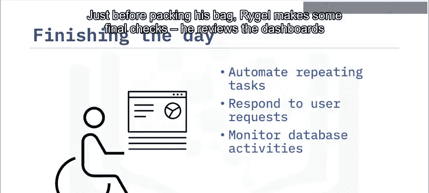

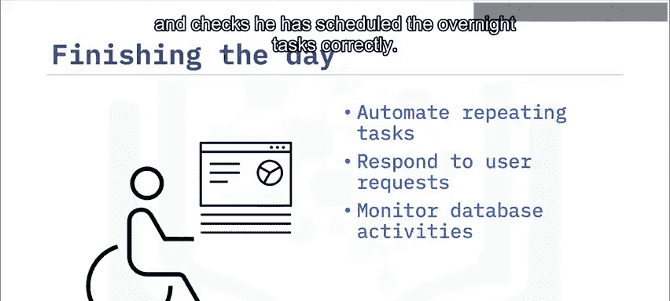

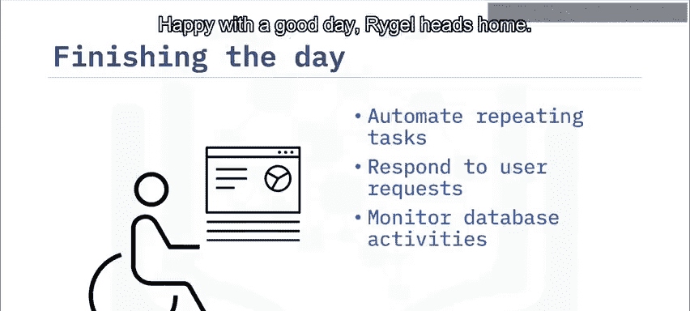

## 总结 📝

本节课中，我们一起学习了数据库管理员典型一天的工作内容。这包括：
*   检查数据库状态并解决问题。
*   响应支持工单和用户请求。
*   与开发人员及其他利益相关者会面协作。
*   监控数据库活动并配置警报。

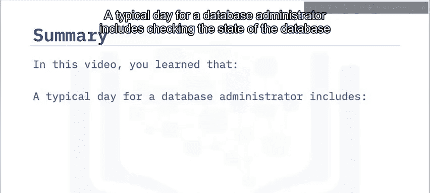

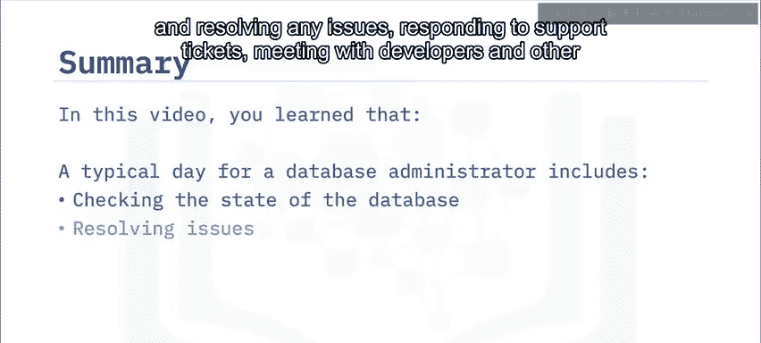

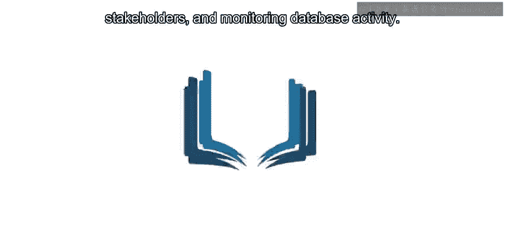

这些任务共同确保了数据库系统的稳定性、安全性和高性能。