# 004：系统对象与数据库配置 🛠️

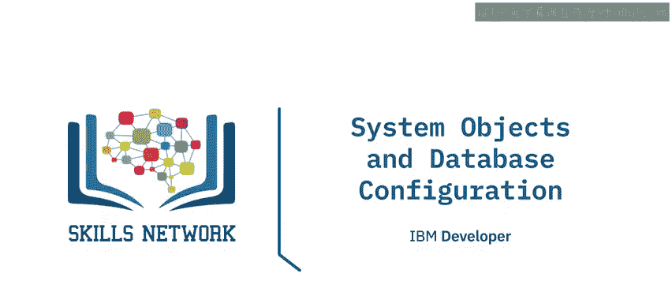

在本节课中，我们将要学习关系数据库管理系统（RDBMS）中的系统对象和数据库配置。我们将了解系统对象如何存储数据库的元数据，以及如何通过配置文件来初始化和调整数据库的运行参数。

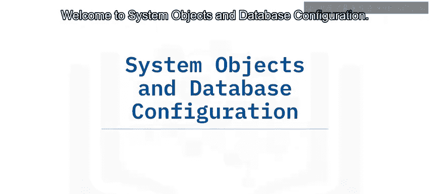

## 系统对象与元数据 📊

上一节我们介绍了数据库的基本管理任务，本节中我们来看看数据库如何存储关于自身的信息。

无论你是想了解新索引是否有帮助、特定时间点的数据库事务量，还是当前连接到数据库的用户，能够反映数据库运行状态的数据都至关重要。RDBMS将关于其数据库的信息（称为元数据）存储在特殊的数据库、模式或目录中。它们存储特定类型的数据库信息，例如数据库或表的名称、列的数据类型或访问权限，这些信息统称为元数据。

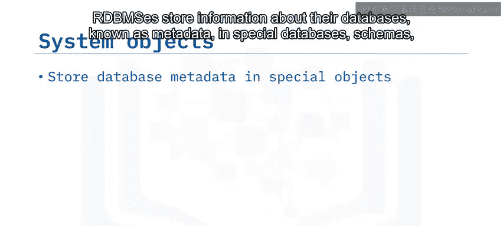

用于此信息存储的其他术语包括**数据字典**和**系统目录**。RDBMS控制和更新这些系统对象，但你可以查询元数据表来发现数据库中对象的信息。

不同的RDBMS对其元数据存储使用不同的名称。

以下是几种常见RDBMS的元数据存储方式：

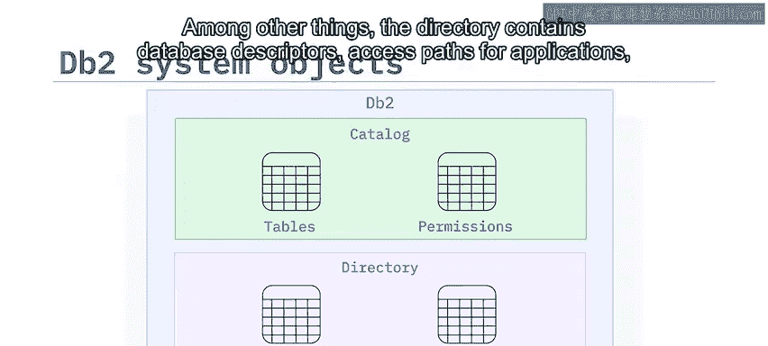

*   **DB2**：使用**目录**和**目录**。目录由描述DB2系统中所有已定义对象的表组成。当用户创建、更改或删除任何对象时，DB2会插入、更新或删除描述该对象及其与其他对象关系的目录行。目录包含DB2在正常操作期间使用的内部控制数据，其中包括数据库描述符、应用程序的访问路径以及恢复和实用程序状态信息。
*   **MySQL**：使用**系统模式**来存储数据库元数据。例如，每个新的MySQL实例都有四个系统数据库：`information_schema`、`mysql`、`performance_schema`和`sys`。每个系统数据库都包含多个只读表。
*   **PostgreSQL**：使用**系统目录**，这是一个包含表和视图的模式，其中包含数据库中所有其他对象及更多信息的元数据。通过它，你可以发现各种操作何时发生、如何访问表或索引，以及数据库系统是从内存读取信息还是需要从磁盘获取数据。

## 配置文件与初始化设置 ⚙️

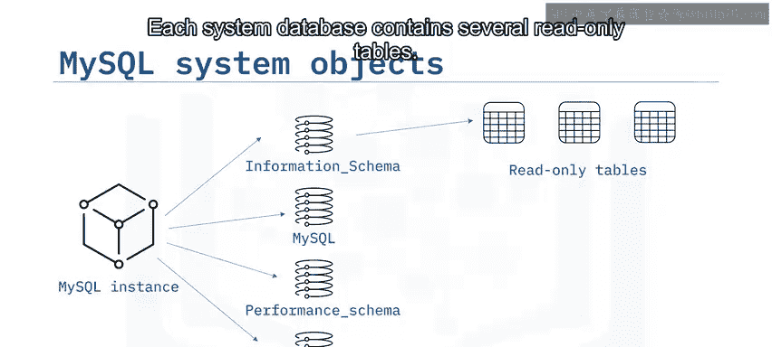

了解了如何查询数据库的元数据后，我们来看看数据库启动时如何获取其初始设置。

在任何数据库安装过程中，你都需要提供参数，例如数据目录的位置、服务监听连接的端口号、内存分配等等。你可以接受默认选项，也可以提供自定义值以适应环境。

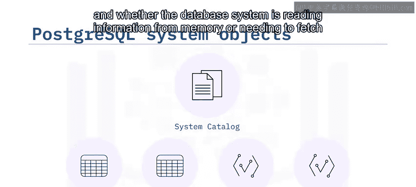

数据库安装过程将这些信息保存到称为**配置文件**或**初始化文件**的文件中。数据库在启动时使用这些文件中的信息来设置参数。

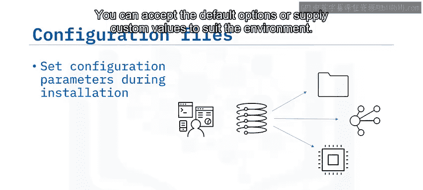

同样，不同的RDBMS使用不同的文件、文件位置和设置。尽管如此，它们都服务于相同的目的：为数据库启动和运行提供初始配置信息。

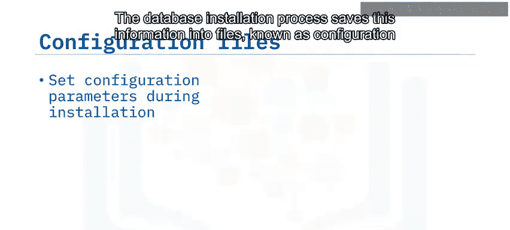

配置信息可以包括常规设置，如数据和日志文件的位置以及服务器监听请求的端口。配置信息也可以更侧重于性能，包括内存分配、连接超时和最大数据包大小等设置。

以下是不同RDBMS用于存储配置信息的文件：

*   **DB2**：使用 `SQLDB.CONF` 文件。
*   **MySQL**：在基于Windows的系统上使用 `my.ini` 文件，在基于Linux的系统上使用 `my.cnf` 文件。
*   **PostgreSQL**：使用 `postgresql.conf` 文件。

## 修改配置：本地与云端部署 🔄

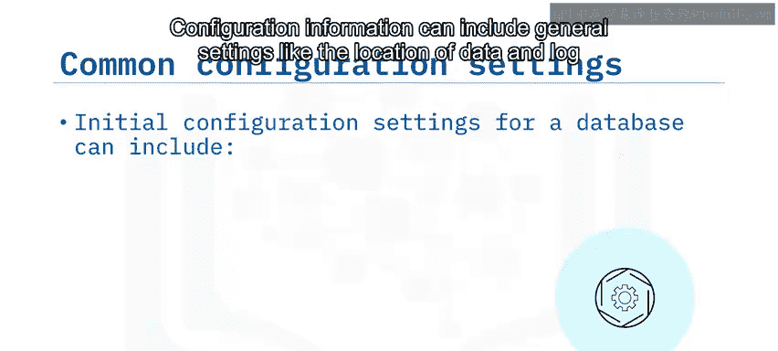

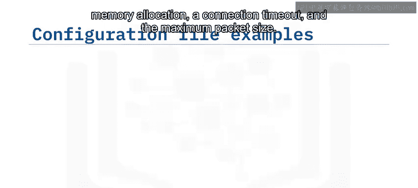

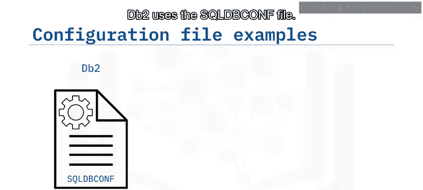

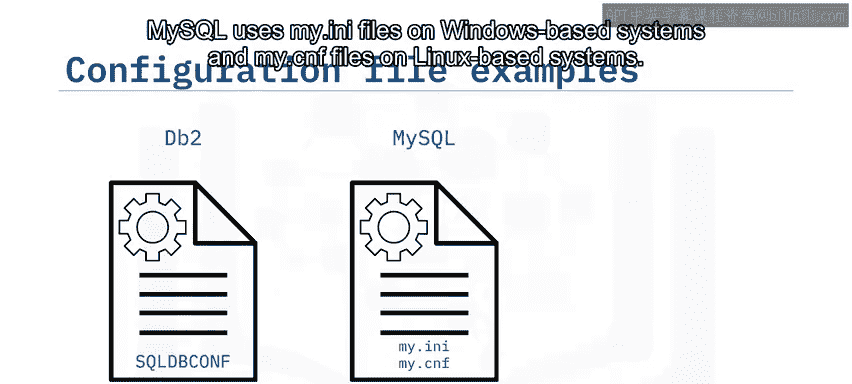

现在，假设你想在数据库启动后修改这些参数。

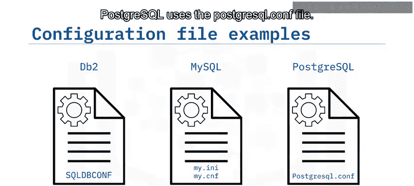

在**本地部署的RDBMS**中，你需要停止数据库服务，修改配置文件，然后重新启动服务，从而使数据库读取修改后的设置。

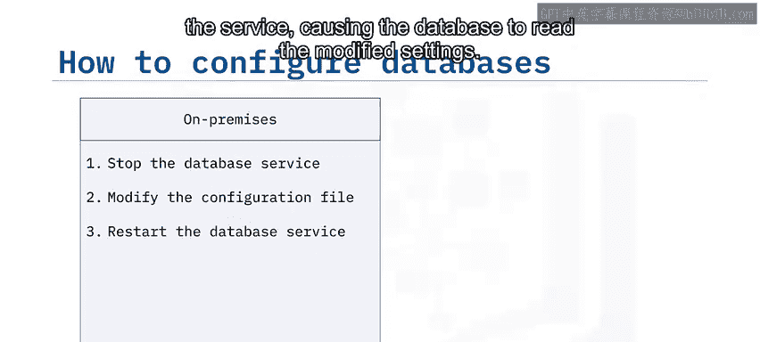

在**基于云的RDBMS**中，你在创建数据库时选择配置选项。基于云的系统的一个优势是，你可以在服务运行时通过图形界面扩展许多配置选项，例如存储大小和计算能力，而无需编辑配置文件。

## 总结 📝

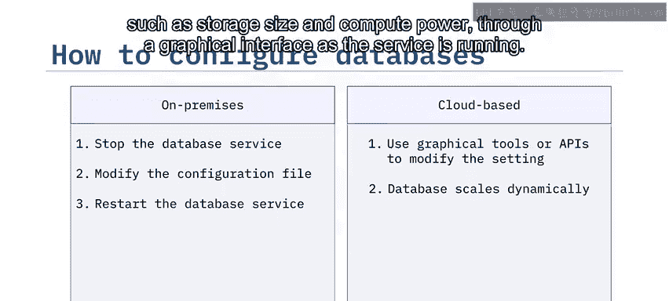

本节课中我们一起学习了系统对象和数据库配置的核心概念。

你了解到系统对象存储了数据库的元数据，你可以查询这些对象以获取有关数据库配置和性能的信息。不同的RDBMS对其系统对象使用不同的名称，大多数使用系统模式、系统表、目录或目录等术语。

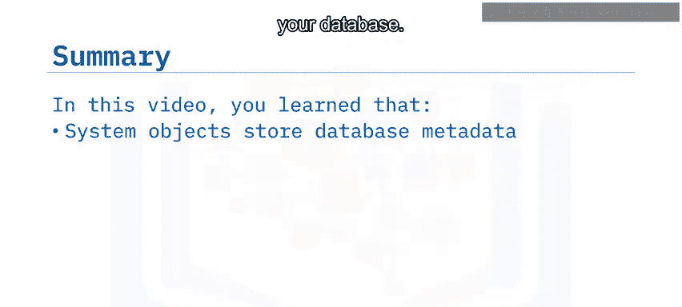

配置文件存储数据库初始化时所需的信息。同样，不同的RDBMS对配置文件使用不同的名称，例如 `SQLDB.CONF`、`my.ini` 或 `postgresql.conf`。

在本地部署的RDBMS中，你通过编辑配置文件来更改设置。而在基于云的RDBMS中，你可以动态地扩展设置。