# 005：数据库存储

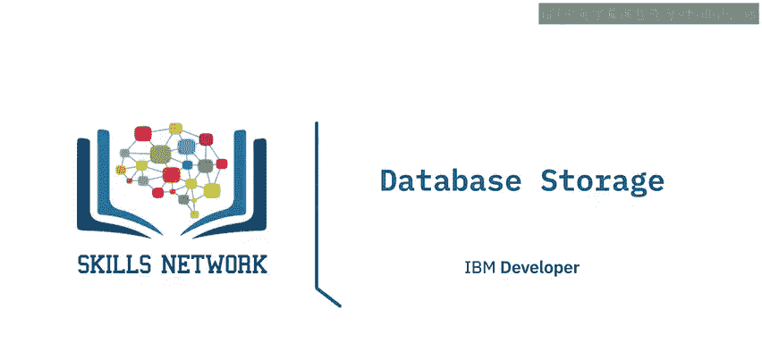

在本节课中，我们将要学习数据库存储的核心概念。我们将探讨物理存储与逻辑存储的区别，并深入了解表空间、存储组和分区这三种关键的管理结构及其作用。

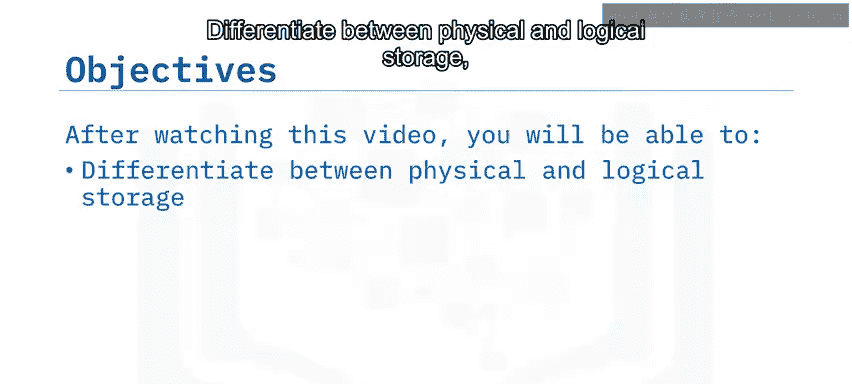

## 🧱 物理存储与逻辑存储

作为数据库管理员，您需要确保数据库拥有足够的存储空间来容纳所有需要存储的数据。您必须确定数据库所需的容量并规划其增长。

在基于云的数据库中，通过API或图形控制台即可扩展存储空间。使用云数据库的优势之一，就是可以非常轻松地按需扩展或缩减存储空间。

在自管理或本地环境中，您同样可以规划存储空间以提升性能，例如将存在资源竞争的组件存储在不同的磁盘上。

关系数据库管理系统将磁盘上数据文件的**物理存储**与数据库的**逻辑设计**分离开来，这为管理数据库文件提供了更大的灵活性。您可以通过逻辑对象来管理数据，而无需关心物理存储的细节。

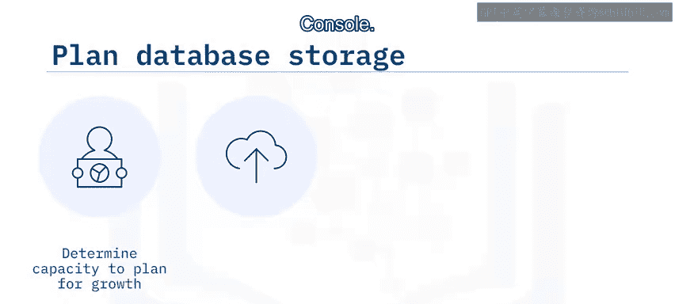

例如，您可以发出备份整个数据库的命令，而无需指定存储该数据库的所有物理磁盘。

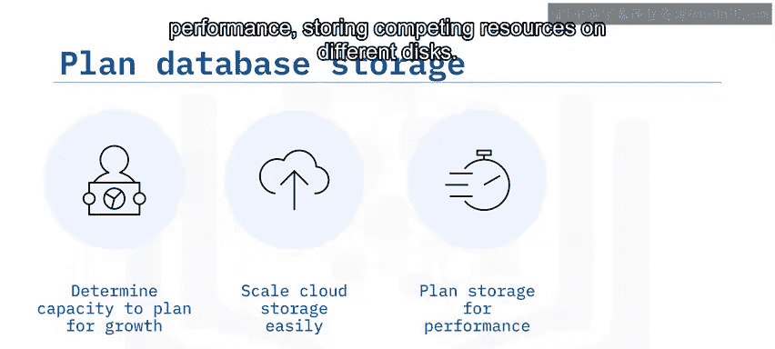

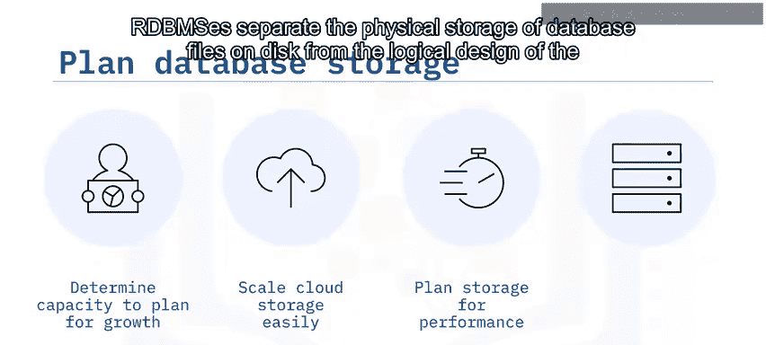

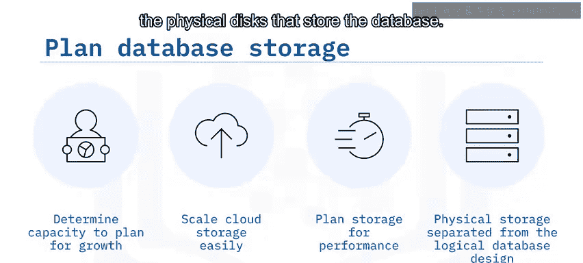

## 📦 表空间及其优势

上一节我们介绍了物理与逻辑存储的分离，本节中我们来看看实现这一分离的核心结构：表空间。

**表空间**是包含数据库对象（如表、索引、大对象和长数据）的结构。数据库管理员使用表空间，根据数据存储位置来逻辑地组织数据库对象。

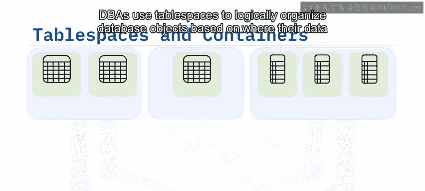

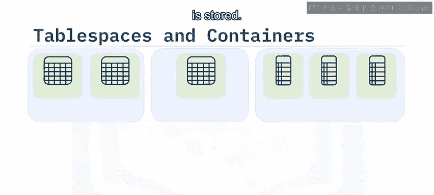

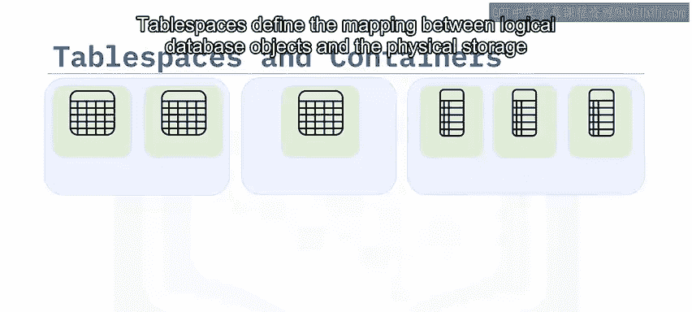

表空间定义了逻辑数据库对象与承载这些对象数据的**物理存储容器**之间的映射关系。一个存储容器可以是一个数据文件、一个目录或一个原始设备。

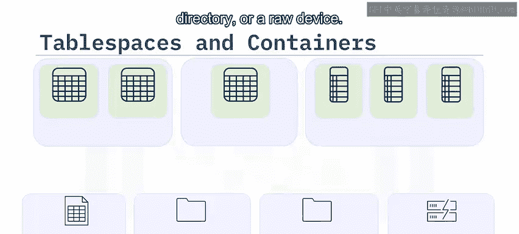

表空间包含一个或多个数据库对象。例如：
*   `Tablespace1` 可能包含多个小表。
*   `Tablespace2` 可能只包含一个大型表。
*   `Tablespace3` 可能包含频繁使用的索引。

数据库管理员会配置一个或多个存储容器来存储每个表空间。例如：
*   `Container1` 存储 `Tablespace1`。
*   `Container2` 和 `Container3` 共同存储 `Tablespace2`。
*   `Container4` 存储 `Tablespace3`。

通过结合使用表空间和容器，您可以将逻辑数据库存储与物理存储分开，并管理数据库及其对象的磁盘布局。这带来了以下几大好处：

以下是表空间的主要优势：

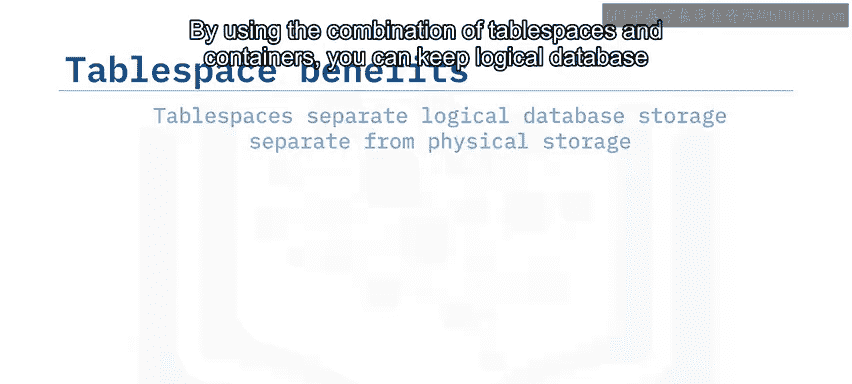

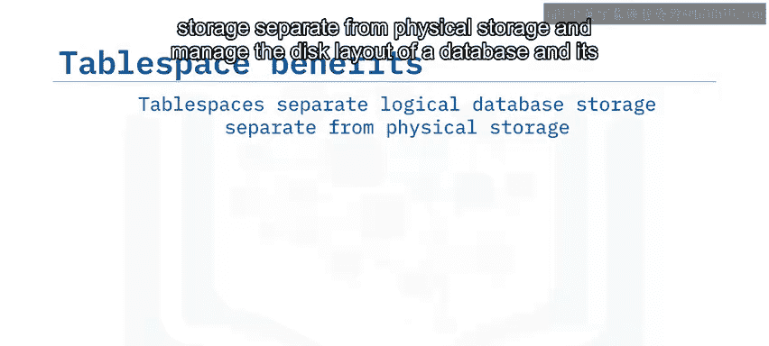

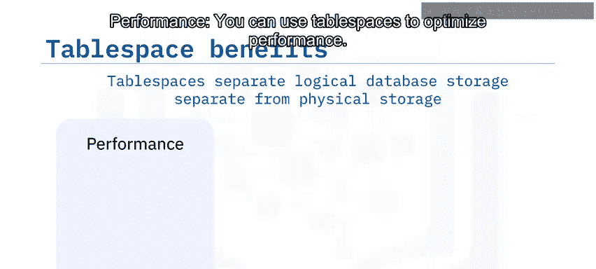

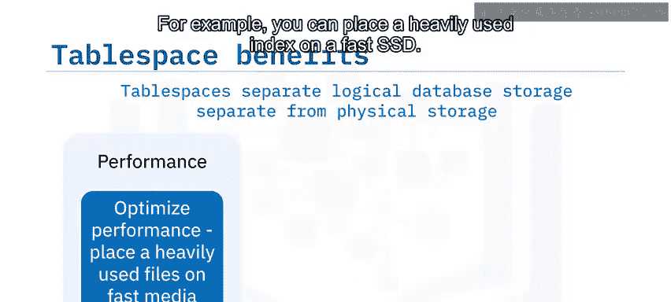

1.  **性能优化**：您可以使用表空间来优化性能。例如，可以将频繁使用的索引放在快速的SSD上；反之，可以将包含很少访问或已归档数据的表存储在更便宜但速度较慢的机械硬盘上。
2.  **可恢复性**：表空间使备份和恢复操作更加便捷。使用一条命令，您就可以备份或恢复所有数据库对象，而无需担心每个对象或表空间存储在哪个存储容器上。
3.  **存储管理**：关系数据库管理系统会根据需要创建和扩展数据文件或容器。必要时，您也可以通过向表空间添加另一个存储路径或容器来手动扩展存储空间。

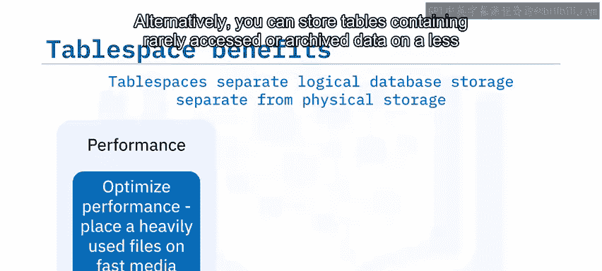

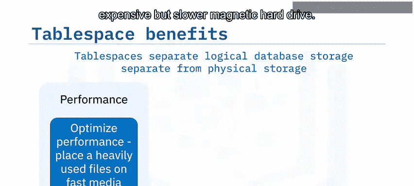

## 🌡️ 存储组及其功能

上一节我们了解了如何用表空间组织数据，本节中我们来看看如何根据数据特性进一步分组管理存储。

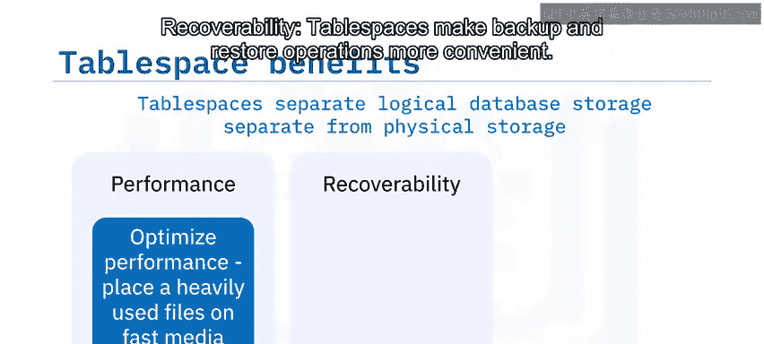

一些关系数据库管理系统提供了**存储组**功能。存储组是根据相似的性能特征对存储路径或容器进行的分组。这使您可以更轻松地执行**多温数据管理**。

在此上下文中，“温度”指的是数据访问的频率：
*   **热数据**：访问非常频繁。
*   **温数据**：访问较为频繁。
*   **冷数据**：很少被访问。

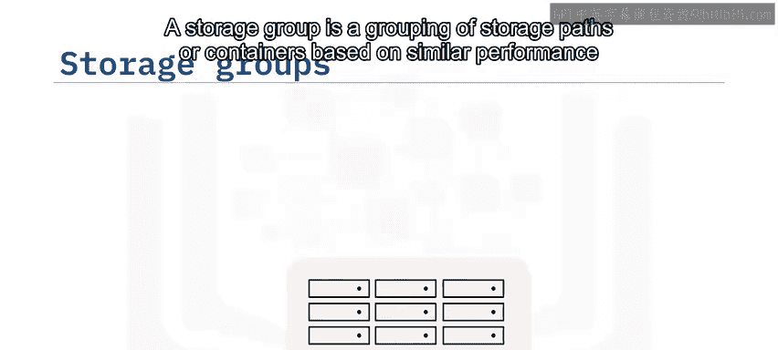

通过使用存储组，您可以基于温度来组织数据和存储。例如：
*   访问非常频繁的热表可以放在表空间 `H` 中，该表空间分布在一组快速的存储设备上。
*   访问较为频繁的表可以放在表空间 `W1` 和 `W2` 中，存储在一个温存储组里。
*   访问最不频繁的表可以放在表空间 `C` 中，存储在速度较慢、成本较低的冷存储组设备上。

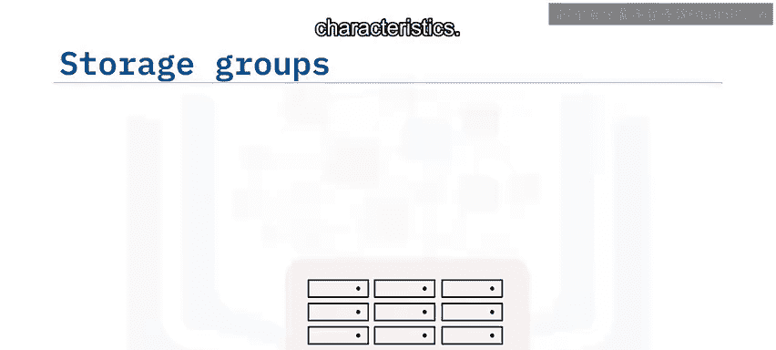

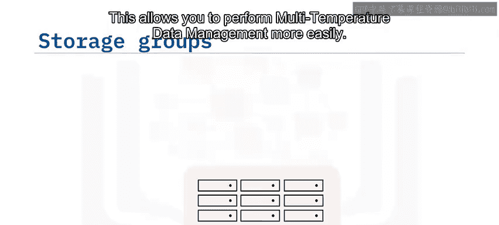

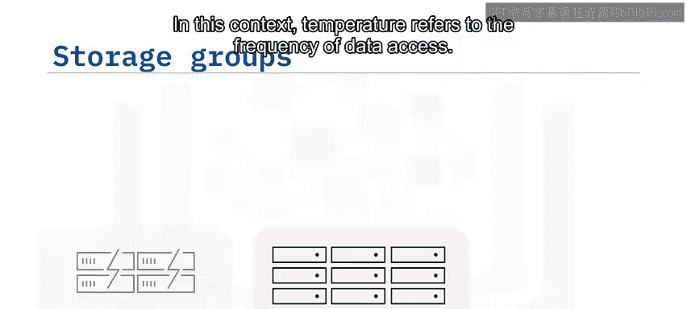

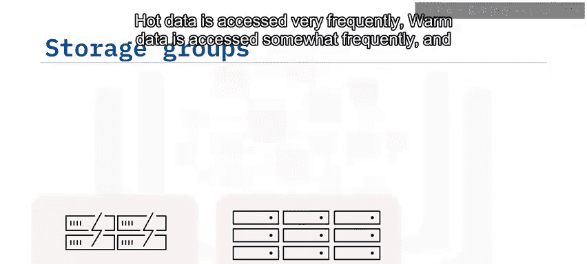

使用存储组有助于优化频繁访问数据的性能，并降低存储不常访问数据的成本。

## 🧩 数据库分区及其应用场景

在管理超大规模数据时，仅仅分组可能还不够。本节我们将探讨一种更高级的技术：数据库分区。

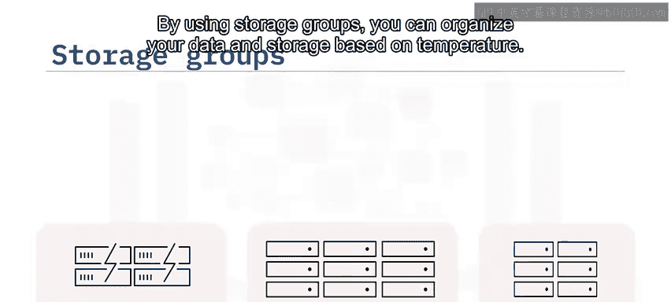

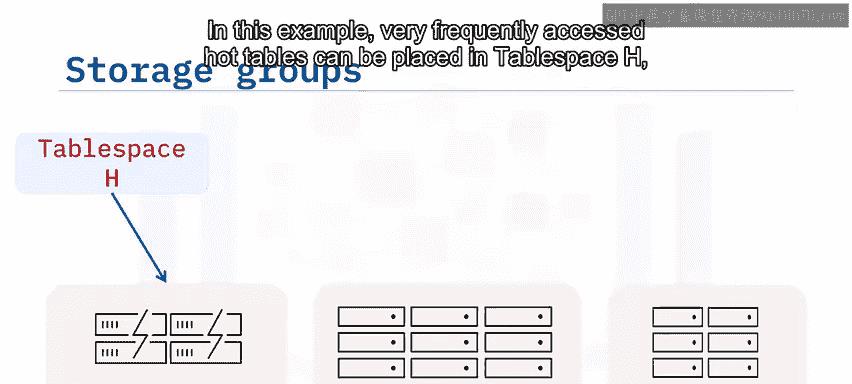

**分区关系数据库**是指其数据跨多个数据库分区进行管理的关系数据库。您可以将需要包含大量数据的表划分为多个逻辑分区，每个分区包含整体数据的一个子集。

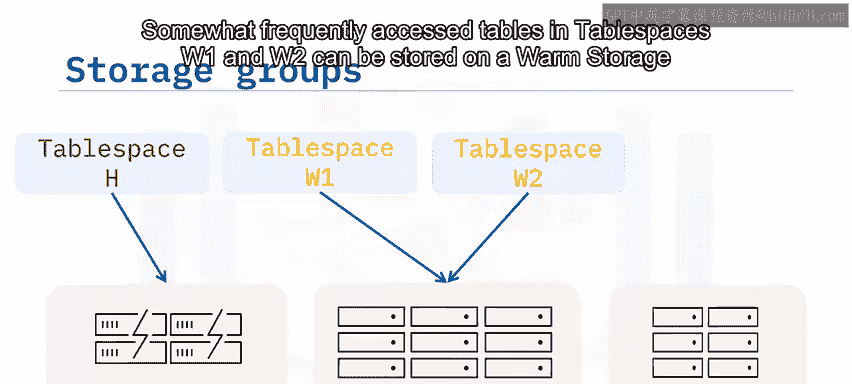

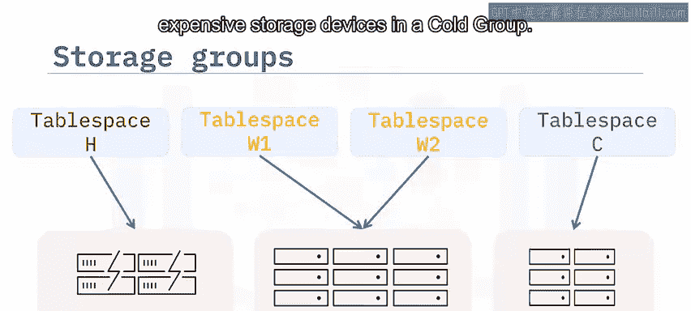

数据库分区常用于涉及海量数据的场景，例如数据仓库和商业智能数据分析。

## 📝 总结

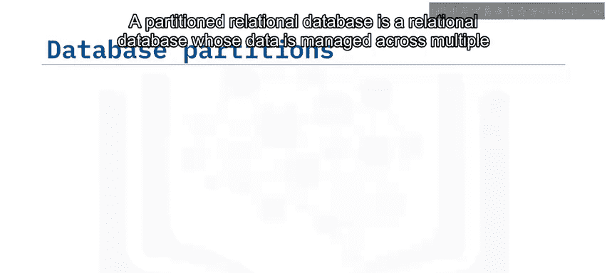

本节课中我们一起学习了数据库存储管理的核心概念。

我们了解到，数据库存储通过逻辑数据库对象和物理磁盘文件进行管理。**表空间**是根据数据存储位置来组织数据库对象的结构。**存储组**是根据相似性能特征对存储路径或容器进行的分组，便于实施多温数据管理。而**分区**则用于存储超大型数据库的数据子集，以提升性能。

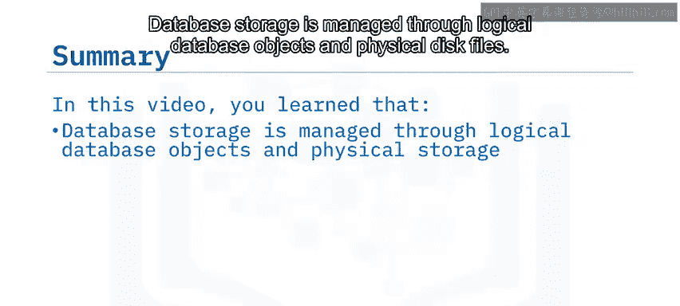

掌握这些概念，将帮助您更有效地规划、优化和管理数据库的存储资源。