# 006：备份与恢复简介 💾

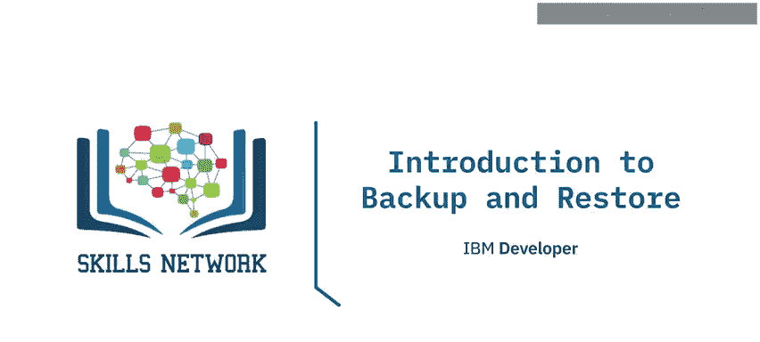

在本节课中，我们将要学习数据库管理中至关重要的一个环节：备份与恢复。我们将了解其常见应用场景、不同类型的备份方式，以及执行备份与恢复操作时需要考虑的关键因素。

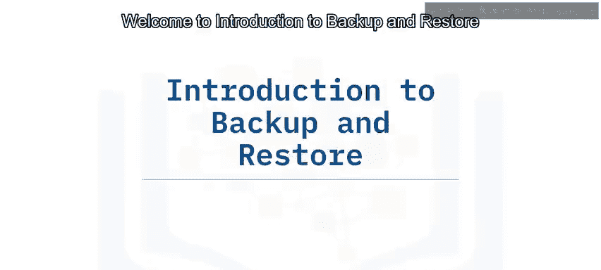

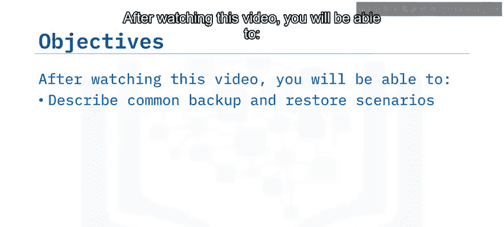

## 概述

备份与恢复是数据库领域的核心话题。它不仅是防止数据丢失的关键手段，也是数据迁移、系统测试等场景下的常用操作。理解其原理和最佳实践，对于保障数据安全与业务连续性至关重要。

## 备份与恢复的应用场景

上一节我们介绍了备份与恢复的基本概念，本节中我们来看看它的具体应用场景。

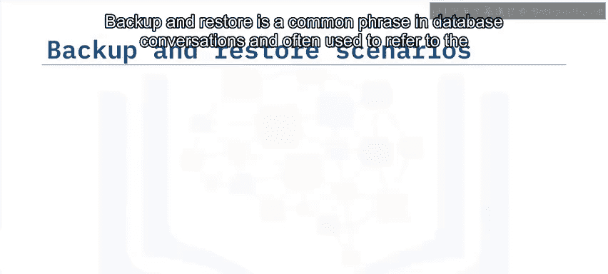

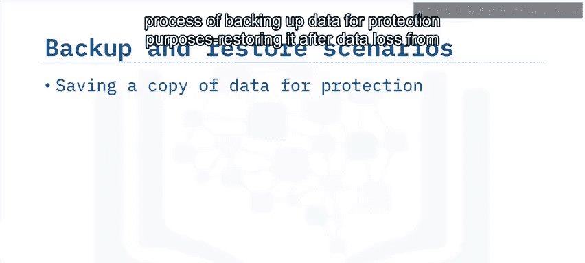

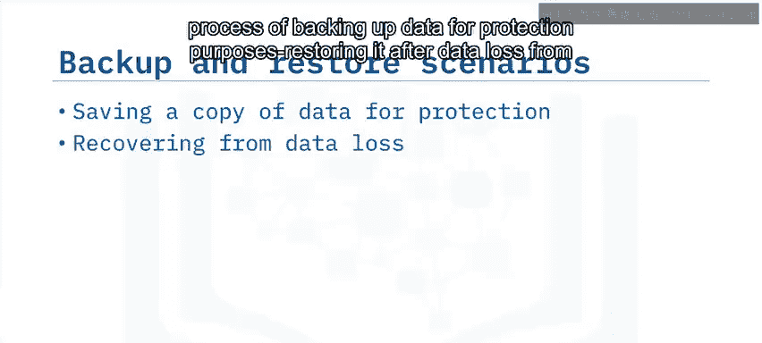

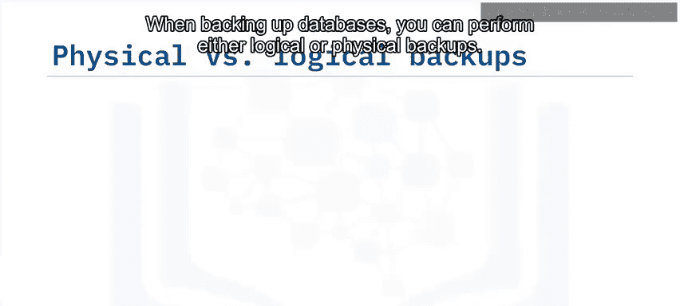

通常，备份与恢复用于在意外停机、误删除或数据损坏后恢复数据。然而，作为数据工程师，您可能还会在其他场景下进行这些操作。

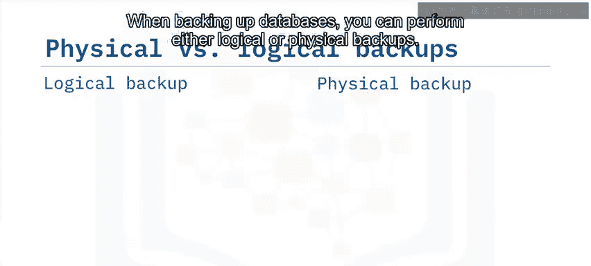

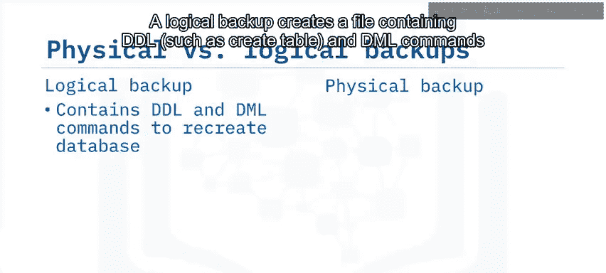

以下是备份与恢复的几种常见用途：
*   将数据从一个数据库迁移到另一个数据库。
*   更换关系数据库管理系统。
*   与业务伙伴共享数据或从其加载数据。
*   为开发或测试环境创建数据副本。

## 物理备份与逻辑备份

了解了应用场景后，我们来探讨两种主要的备份类型：物理备份和逻辑备份。理解它们的区别有助于您根据实际情况选择最合适的策略。

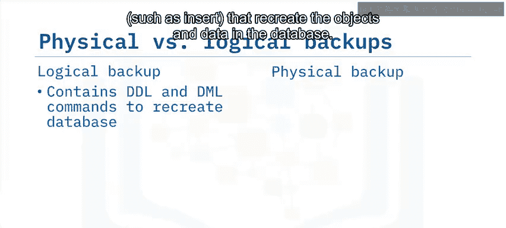

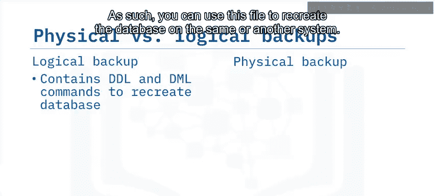

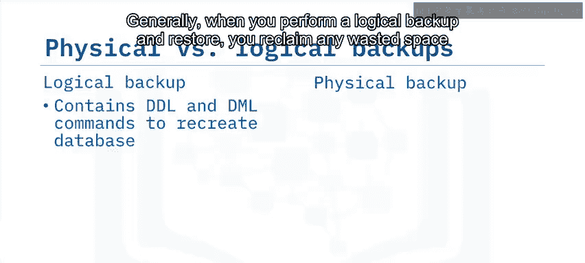

**逻辑备份**会创建一个包含**DDL**（如 `CREATE TABLE`）和**DML**命令（如 `INSERT`）的文件，用于在数据库中重新创建对象和数据。因此，您可以使用此文件在相同或不同的系统上重建数据库。

逻辑备份的特点如下：
*   **恢复过程会创建表的“干净”版本，从而回收原数据库中的浪费空间。**
*   **对于大型数据库，备份可能耗时较长，并可能影响其他并发查询的性能。**
*   **支持细粒度备份，例如可以单独备份某个数据库或表。**
*   **通常使用 `BACKUP`、`RESTORE`、`IMPORT`、`EXPORT`、`DUMP` 和 `LOAD` 等实用程序来执行。**

**物理备份**（或称原始备份）会复制属于表、数据库或其他对象的所有物理存储文件和目录，包括数据文件、配置文件和用于辅助时间点恢复的日志文件。

物理备份的特点如下：
*   **通常比逻辑备份更小、更快。**
*   **适用于需要快速恢复的大型或重要数据库。**
*   **类似于备份物理系统上的任何其他类型文件。**
*   **如果物理文件包含多个对象的数据，则无法轻松恢复单个表或数据库对象。**
*   **备份文件与特定的RDBMS相关，通常只能恢复到相似的系统。**
*   **这种存储级快照的方法常见于使用专用存储系统的数据库和云环境中。**

## 可备份的对象与策略考量

现在我们已经了解了两种备份类型，接下来看看在数据库中具体可以对哪些对象进行备份，以及制定备份策略时需要考虑哪些因素。

根据您使用的RDBMS和执行的备份类型，您可以备份以下内容：
*   整个数据库。
*   一个模式（Schema）中的所有内容。
*   数据库中的一个或多个表。
*   数据库一个或多个表中的数据子集。
*   数据库中的其他对象集合。

同时，您还可以选择备份的频率和类型，从而定制完全符合需求的备份策略。

在执行备份与恢复时，请记住以下几点：
*   **必须检查备份文件是否有效，并确保恢复计划能够成功执行。** 这在将备份恢复作为灾难恢复计划的一部分时至关重要，无效的备份或无法恢复将导致数据丢失。
*   **必须确保备份文件在传输和存储过程中的安全级别，与数据库内数据的安全级别相同。**

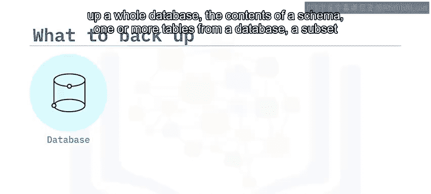

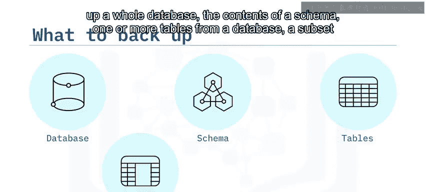

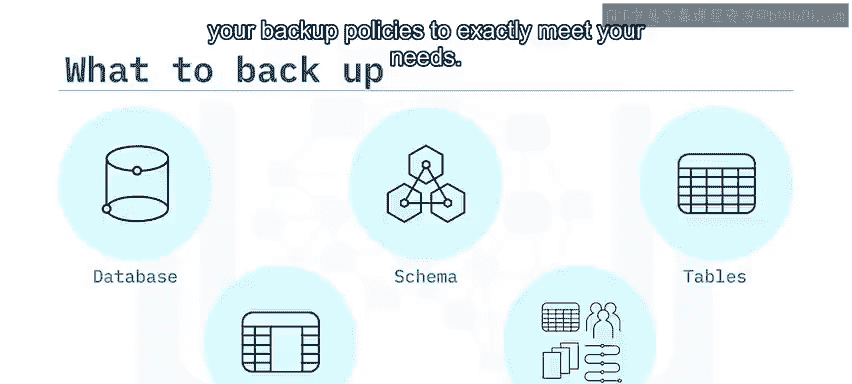

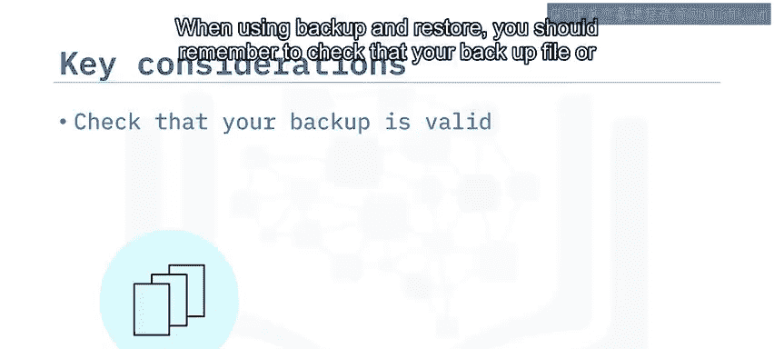

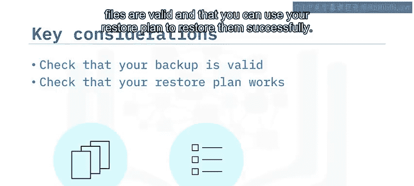

## 高级备份选项

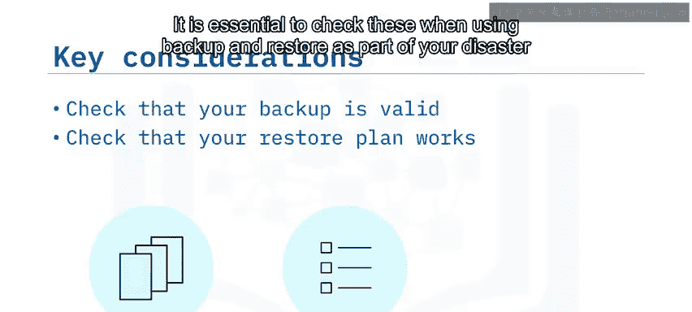

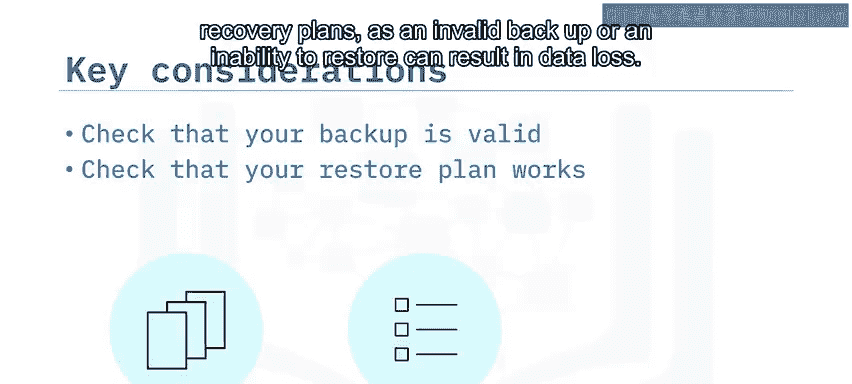

除了基本操作，一些RDBMS还支持额外的备份选项，可以帮助您优化备份过程。

以下是两种常见的高级选项：
*   **压缩**：您可以配置备份文件的压缩级别。压缩会减小输出文件的大小，这对于大型数据库或备份到远程位置非常有用。但代价是会增加执行备份和恢复过程所需的时间。
*   **加密**：您可以加密备份文件以降低数据泄露的风险。同样，这也会增加备份和恢复所需的时间。

## 总结

本节课中我们一起学习了数据库备份与恢复的核心知识。

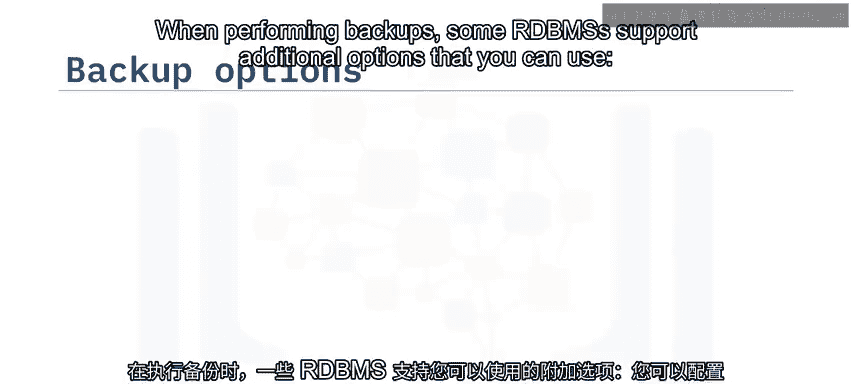

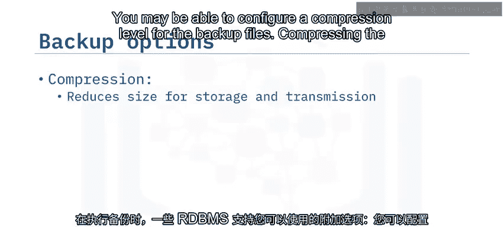

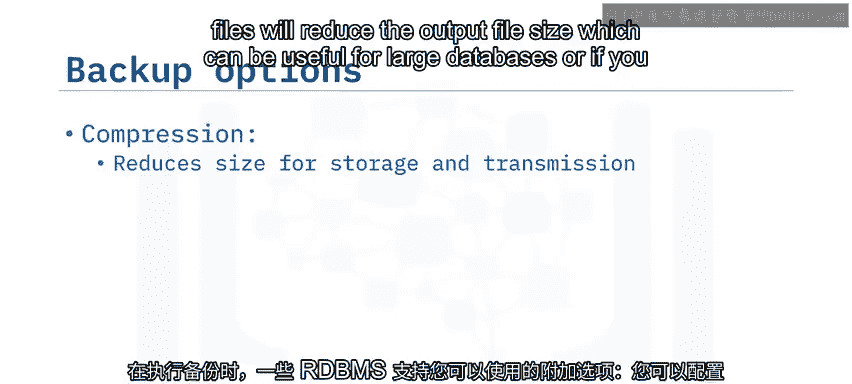

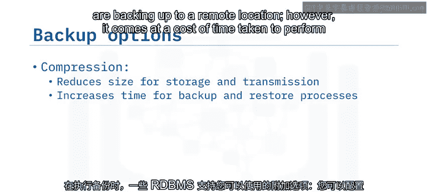

我们了解到，备份与恢复不仅用于数据恢复，还可用于数据迁移等多种目的。**物理备份**复制原始的数据库存储文件和目录，而**逻辑备份**则以特殊格式从数据库中提取数据。您可以备份整个数据库或其内部对象。务必确保备份安全可用，且恢复计划有效可行。此外，还可以利用压缩或加密等备份选项来优化操作。

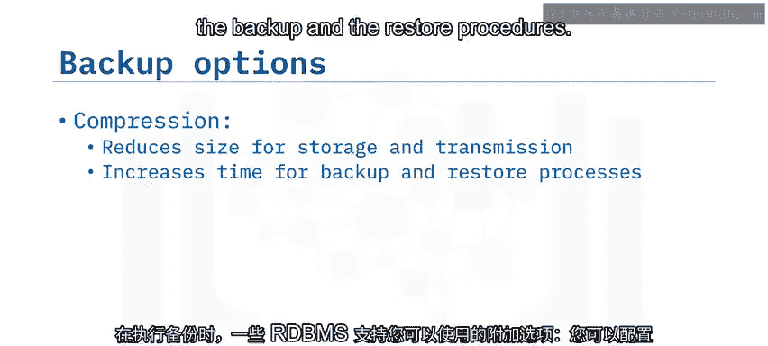

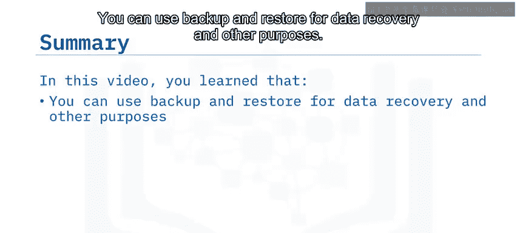

掌握这些基础知识，是您实施可靠数据保护策略的第一步。