# 007：备份类型 💾

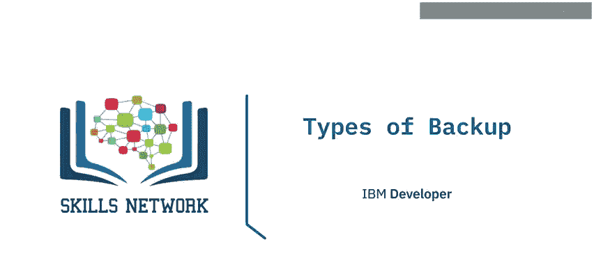

在本节课中，我们将要学习数据库备份的几种常见类型。我们将了解每种备份方式的工作原理、优点和缺点，帮助你为你的数据库系统选择合适的备份策略。

## 概述

备份是数据库管理中的核心任务，旨在保护数据免受意外丢失或损坏。根据数据量、变化频率和恢复时间目标的不同，可以选择不同类型的备份策略。常见的备份类型包括完全备份、时间点恢复、差异备份和增量备份。

## 完全备份

完全备份会创建你所备份对象中所有数据的完整副本。

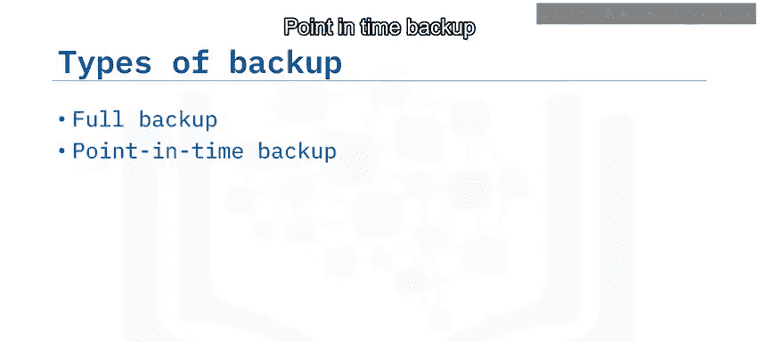

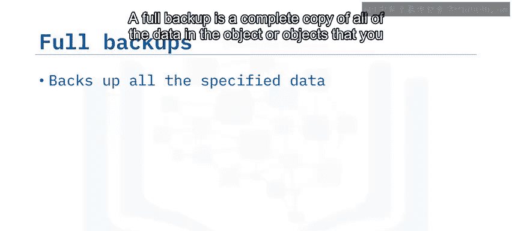

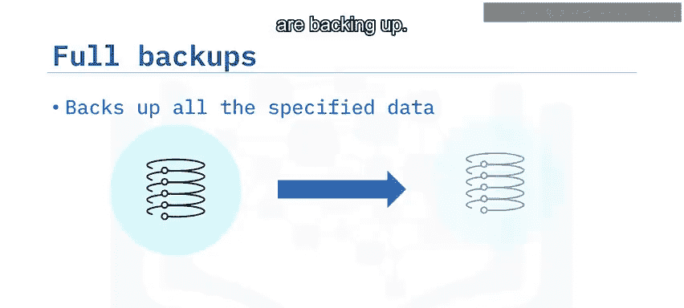

**核心概念**：`完全备份 = 数据库在备份时刻的完整快照`

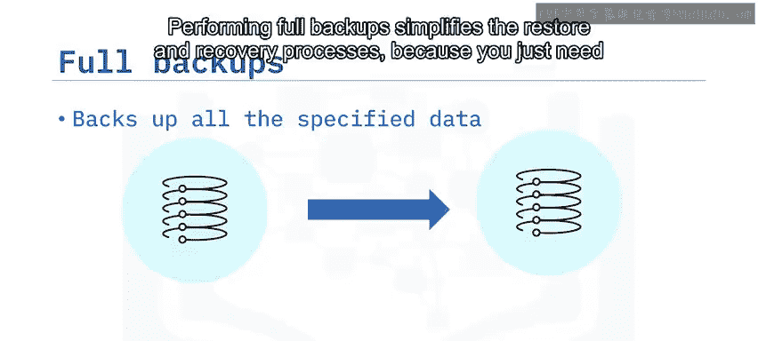

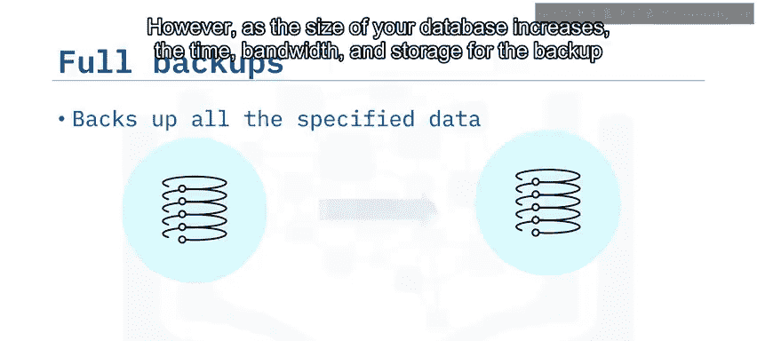

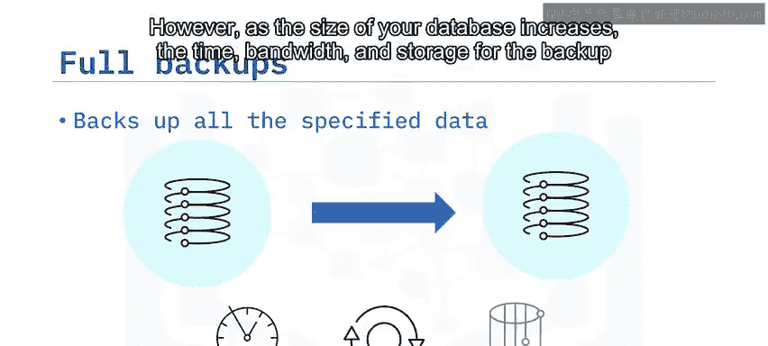

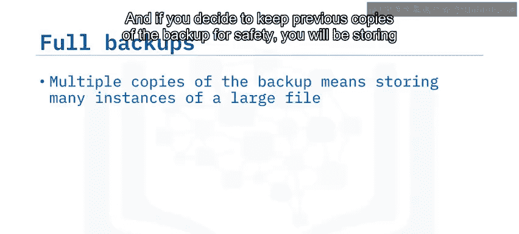

完全备份简化了恢复过程，因为你只需要找到最新的完全备份文件并恢复它即可。然而，随着数据库规模的增长，备份所需的时间、网络带宽和存储空间也会相应增加。

以下是完全备份的主要优缺点：

*   **优点**：恢复过程简单直接。
*   **缺点**：备份和存储成本高，尤其是对于大型数据库；如果只保留一份备份，文件损坏将导致无法恢复。

将数据的完整副本存储在数据库管理系统之外，意味着你必须确保其得到充分保护，防止未授权用户访问。当你恢复一个完全备份时，数据库将回到备份被创建时的状态。但自备份以来数据库可能已经处理了许多事务，理想情况下这些事务也应该被恢复。

## 时间点恢复

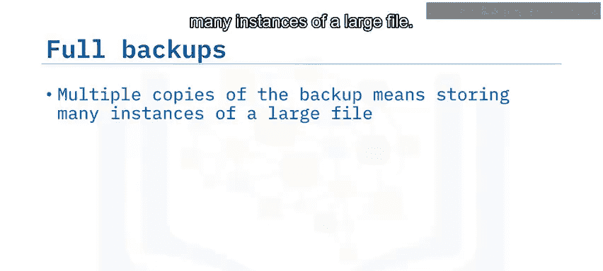

为了解决上述问题，一种方法是在数据库中启用事务日志记录。然后，你可以利用日志文件中的信息，在恢复的数据库上重新应用这些事务。

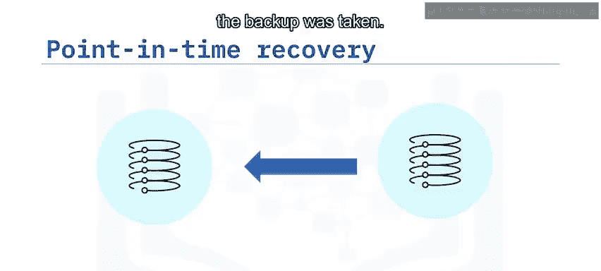

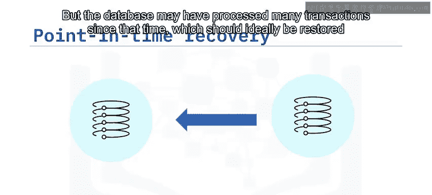

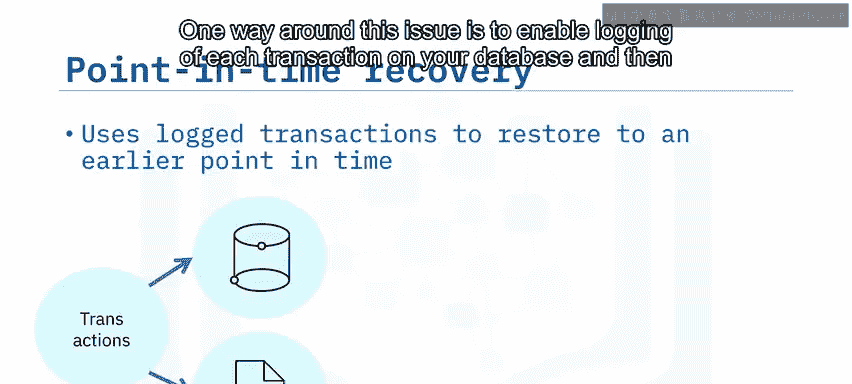

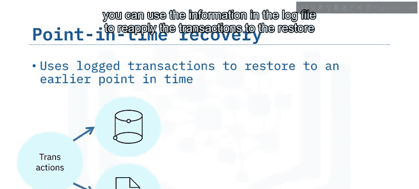

**核心概念**：`恢复后状态 = 完全备份状态 + 应用至特定时间点的事务日志`

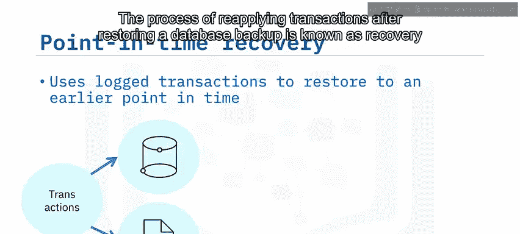

在恢复数据库备份后重新应用事务的过程被称为“恢复”。它使你能够将数据恢复到某个特定时间点的状态，因此得名“时间点恢复”。

例如，如果你知道在上午11:05运行的一条DELETE语句错误地删除了某些数据，你可以恢复最新的完全备份，然后重新应用截至该时间点的事务，从而最大限度地减少从上次完全备份到错误数据被删除之间发生的数据变更损失。

不同的数据库系统对包含事务信息的日志使用不同的术语：
*   MySQL 称之为 **二进制日志**。
*   PostgreSQL 称之为 **预写日志**。
*   DB2 on Cloud 称之为 **事务日志**。

## 差异备份

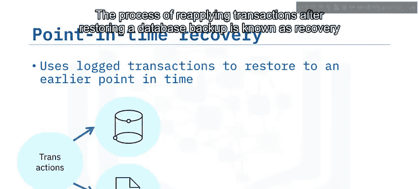

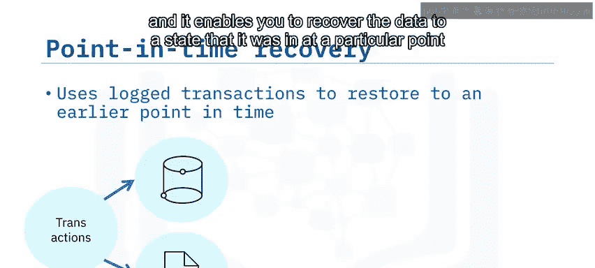

由于完全备份可能需要大量的时间、带宽和存储空间，一种替代方案是将其与差异备份结合使用。

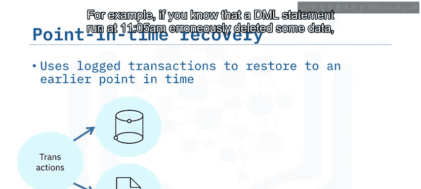

差异备份包含自上次完全备份以来发生更改的任何数据的副本。

**核心概念**：`差异备份内容 = 自上次完全备份以来的所有数据变更`

这使得差异备份文件比完全备份文件小得多，从而减少了备份所需的时间、带宽和存储，同时仍能让你恢复数据的近期副本。

例如，你可以在每周日执行一次完全备份，然后在周内的每一天运行一次差异备份。每个差异备份都包含自周日完全备份以来的所有变更。

因此，如果你需要在周二恢复数据库，你需要先恢复周日的完全备份，然后恢复周二的差异备份。你不需要恢复周一的差异备份，因为该文件中的所有变更也包含在周二的差异备份中。

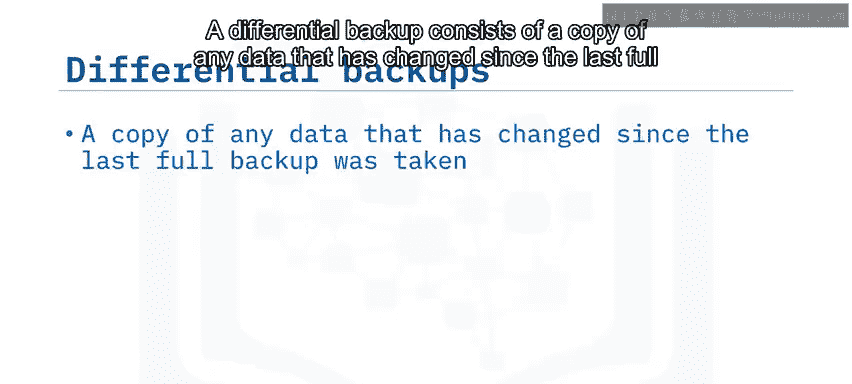

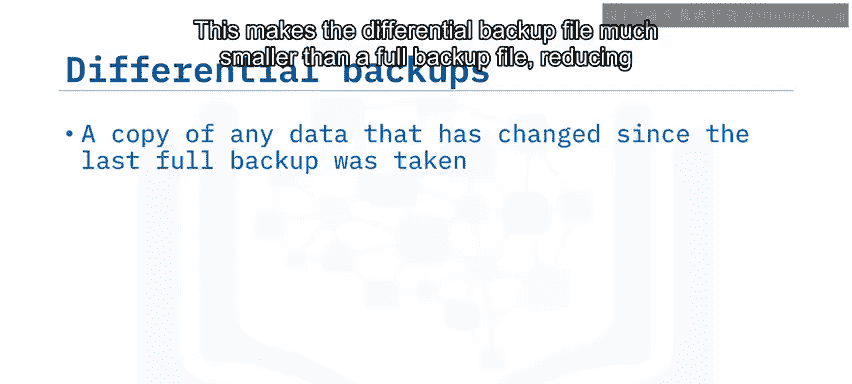

从完全备份和差异备份恢复数据比仅恢复一个完全备份需要更长的时间。但由于你恢复数据的频率远低于备份频率，总体来看你很可能节省了时间。

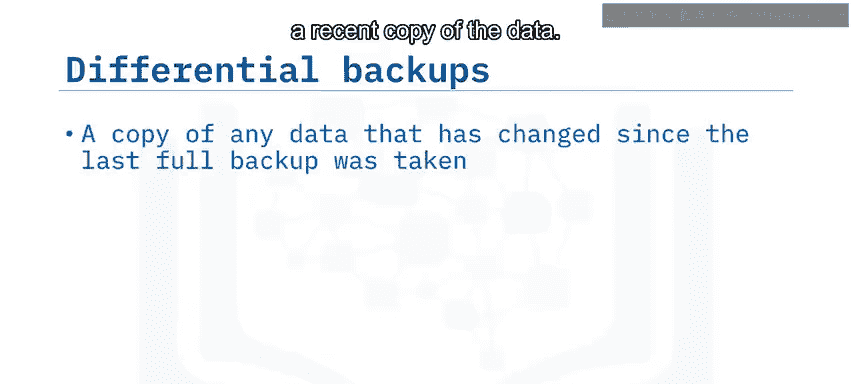

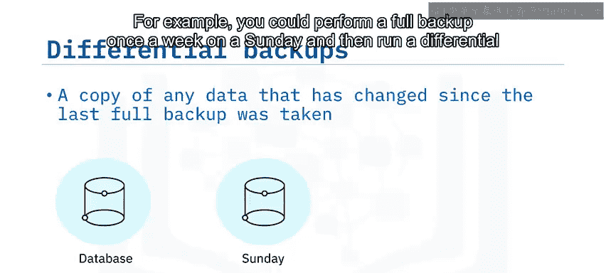

## 增量备份

增量备份与差异备份类似，但它只包含自上次任何类型的备份以来发生更改的数据。

**核心概念**：`增量备份内容 = 自上次备份（无论何种类型）以来的数据变更`

例如，你可以在每周日执行一次完全备份，然后在周内的每一天运行一次增量备份。每个增量备份只包含自前一天备份以来的变更。

因此，如果你需要在周二恢复数据库，你需要先恢复周日的完全备份，然后恢复周一的增量备份，最后恢复周二的增量备份。

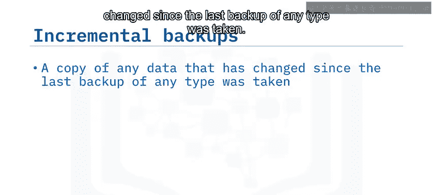

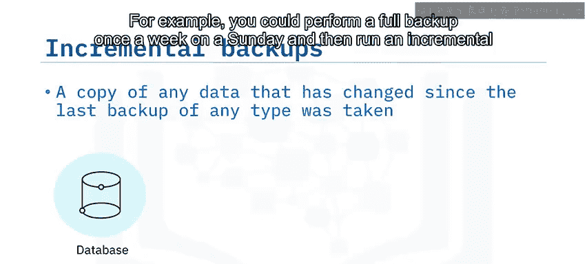

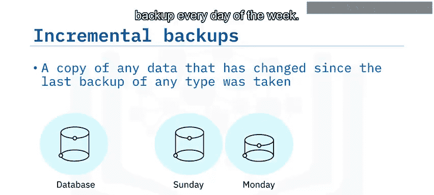

从完全备份和增量备份恢复数据比仅恢复一个完全备份或恢复差异备份需要更长的时间。但执行增量备份所需的时间可能比执行差异备份更少。

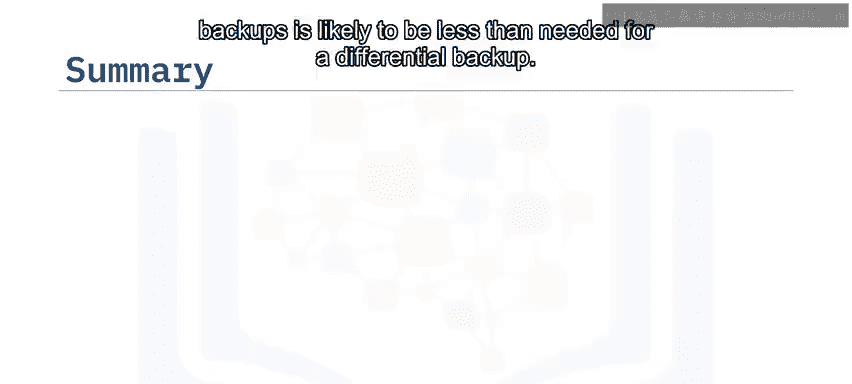

## 总结

本节课中我们一起学习了四种主要的数据库备份类型：
1.  **完全备份**：创建简单，恢复直接，但执行速度慢且生成的文件大。
2.  **时间点恢复**：通过结合事务日志，提供了比仅使用完全备份更精细的恢复模型。
3.  **差异备份**：比完全备份执行更快，但恢复过程可能更耗时。
4.  **增量备份**：执行速度最快，但恢复过程可能最耗时。

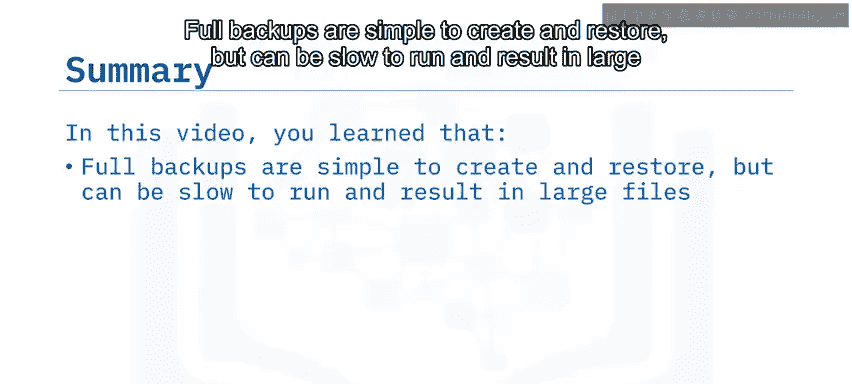

理解这些备份类型的区别，有助于你根据具体的业务需求、数据变化率和恢复时间目标，设计出高效、可靠的数据库备份与恢复策略。