# 008：备份策略

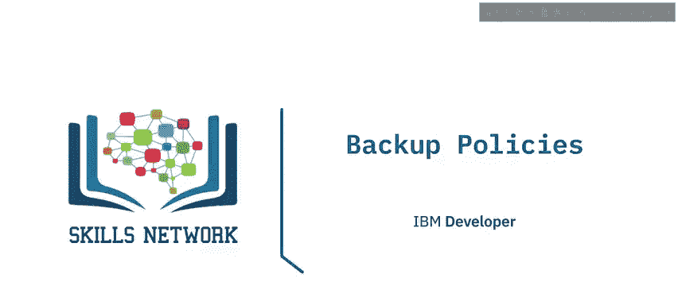

在本节课中，我们将要学习数据库备份策略的核心概念，包括热备份与冷备份的区别，以及如何根据业务需求制定合适的备份策略。

---

## 🔥 热备份与❄️ 冷备份

上一节我们介绍了备份的基本类型，本节中我们来看看两种主要的备份执行方式：热备份和冷备份。

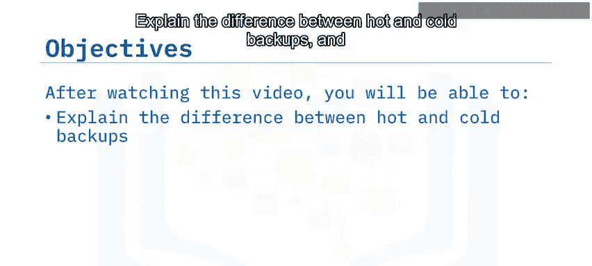

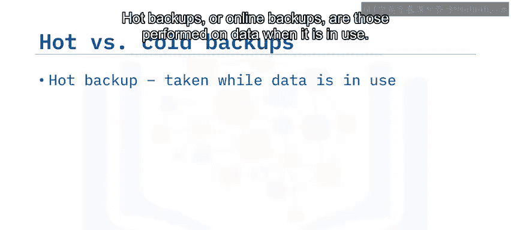

**热备份**，也称为在线备份，是在数据库处于活动和使用状态时执行的备份。其核心优势在于备份期间不影响数据库的可用性，用户可以持续进行业务操作。然而，热备份也存在一些挑战：备份过程可能导致用户性能下降，并且如果备份期间数据发生变更，可能影响备份数据的完整性。

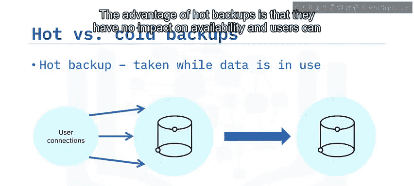

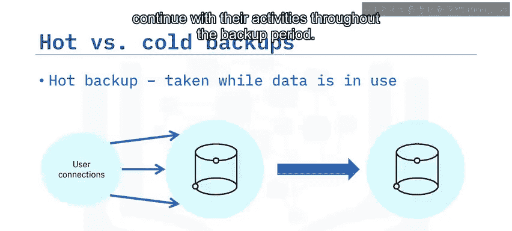

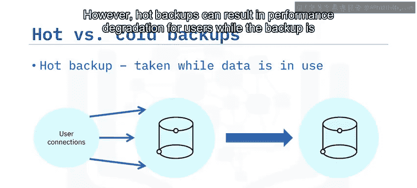

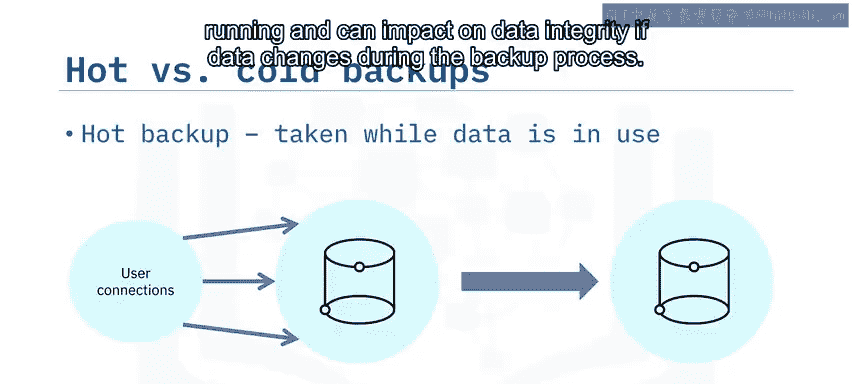

**冷备份**，也称为离线备份，是在数据库完全离线、停止服务时执行的备份。这种方式彻底消除了热备份中数据变更带来的完整性风险。但其主要缺点是备份期间用户无法访问数据库，因此不适用于需要7x24小时不间断运行的环境。

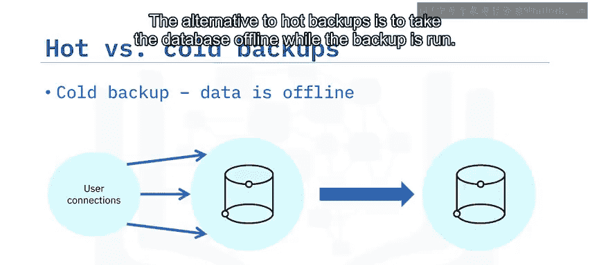

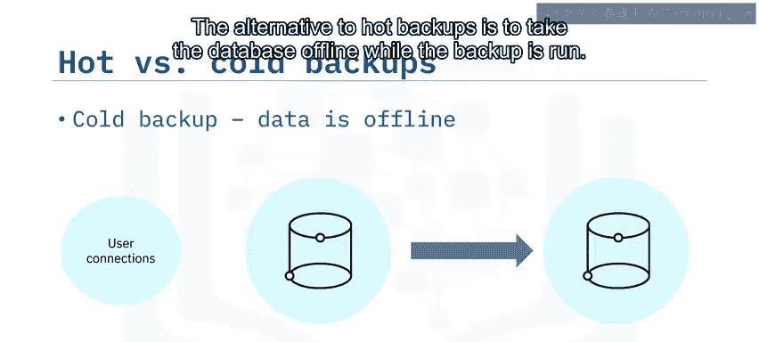

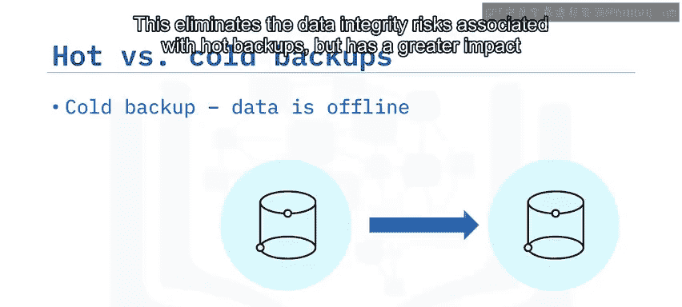

---

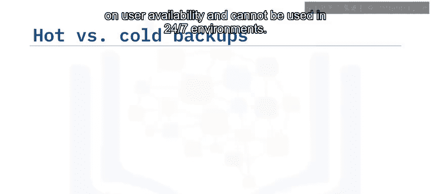

## 💾 备份存储与恢复考量

了解了备份的执行方式后，我们需要考虑备份数据的存储位置及其对恢复的影响。

热备份通常存储在**可用的备用服务器**上，并且会定期从生产数据库接收更新。这种安排使得当生产服务器发生故障时，可以快速将备用服务器上线，从而保障业务的持续可用性。

冷备份则倾向于存储在**外部驱动器**上，或存储在两次备份操作之间处于关机状态的服务器上。这种方式通常能提供更高的数据安全性，但也意味着**恢复过程所需的时间会比热备份更长**。

---

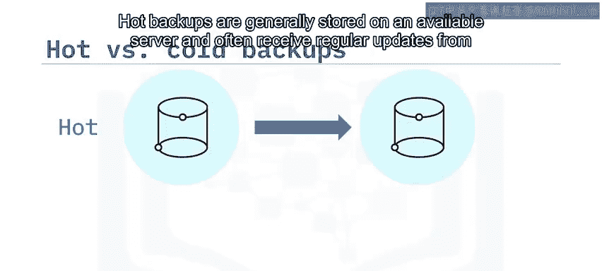

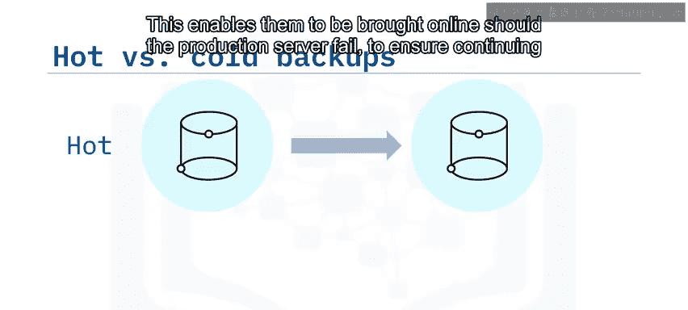

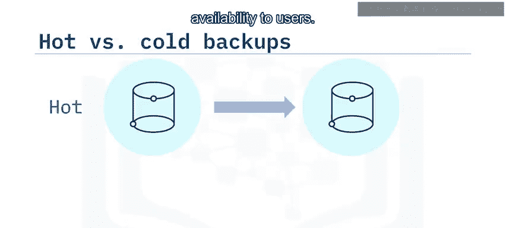

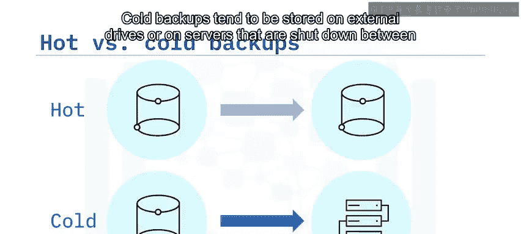

## ⚙️ 制定备份策略的关键决策

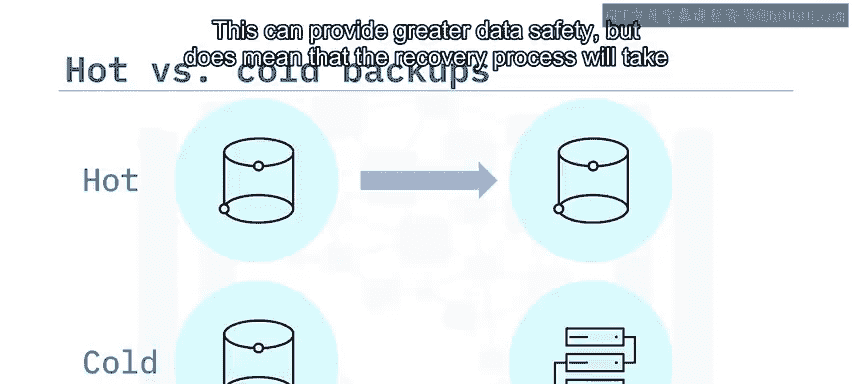

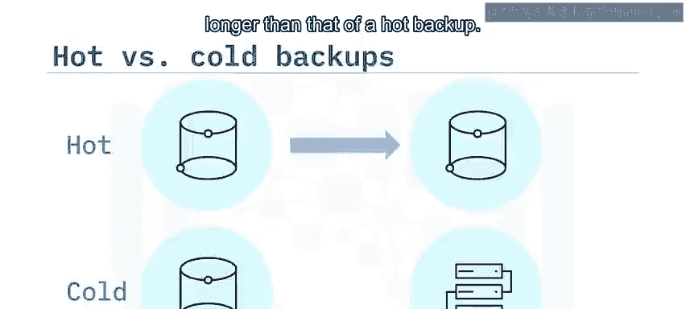

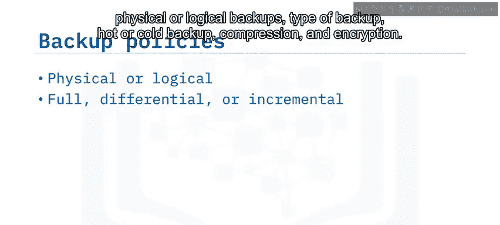

制定备份和恢复策略时，你需要做出多项决策。以下是需要考虑的核心要素列表：

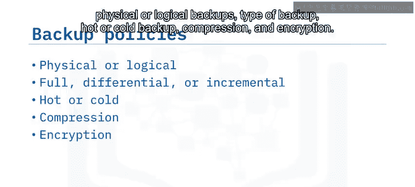

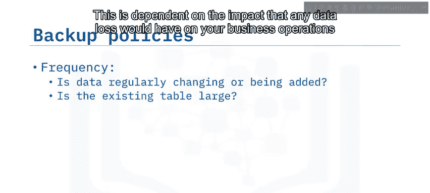

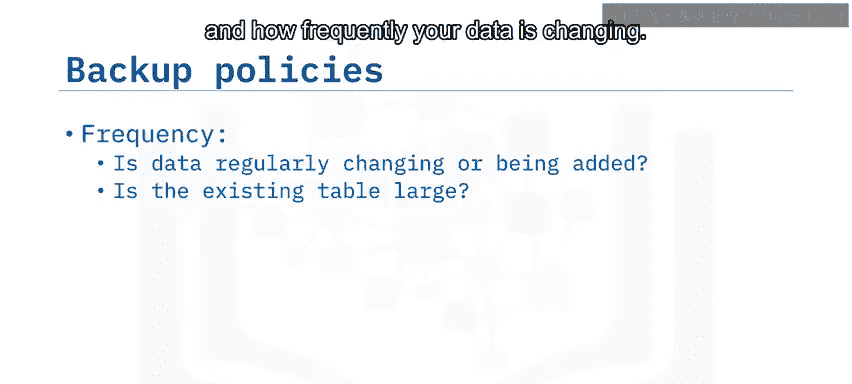

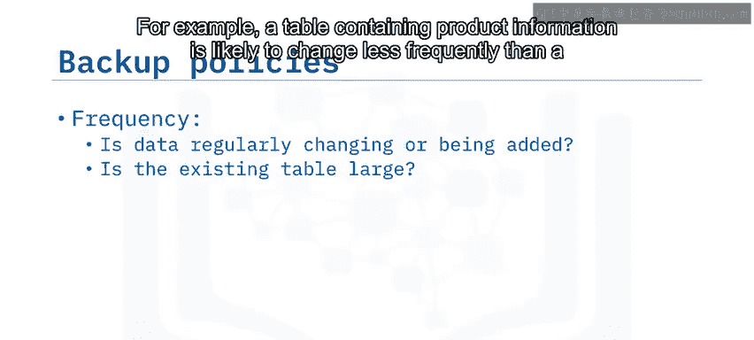

*   **备份方式**：选择物理备份或逻辑备份。
*   **备份类型**：决定使用完全备份、差异备份还是增量备份。
*   **执行方式**：采用热备份还是冷备份。
*   **数据处理**：是否对备份数据进行压缩和加密。

除了上述技术选择，你还需要考虑以下业务层面的因素：

*   **备份频率**：这取决于数据丢失对业务的影响程度，以及数据变化的频率。例如，产品信息表的变化频率通常低于客户订单表，因此可以降低前者的备份频率。对于数据量庞大的订单表，频繁进行完全备份并不现实，应考虑使用差异备份或增量备份。
*   **备份时机**：如果数据主要在一个时区的工作时间内被访问，应将备份安排在非工作时间进行。对于全天候访问的数据，可以考虑在周末执行完全备份，在工作日进行增量或差异备份。
*   **自动化**：备份是一项常规任务，如果关系数据库管理系统支持调度或自动化备份功能，应充分利用。

---

## ☁️ 云数据库的备份

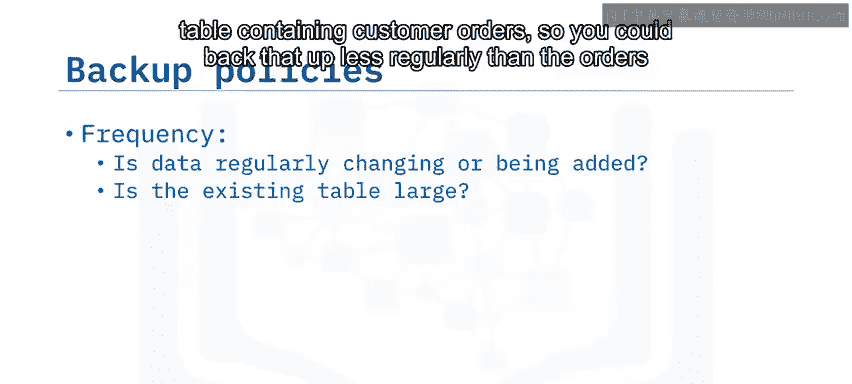

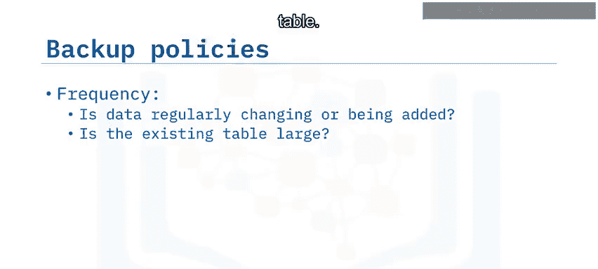

将数据库部署在云端时，备份同样至关重要。根据所使用的具体关系数据库管理系统和云服务商，备份的实现方式可能有所不同。

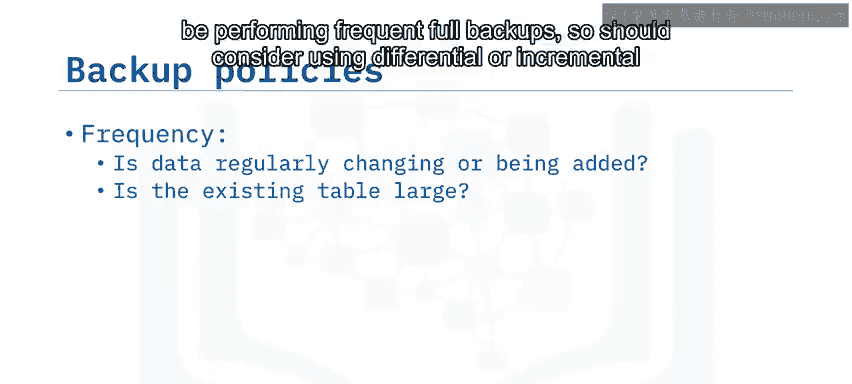

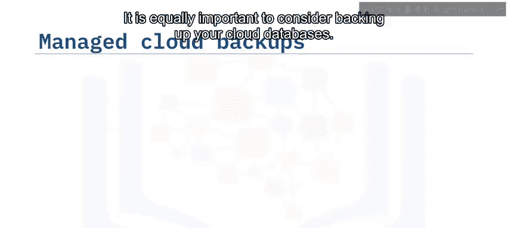

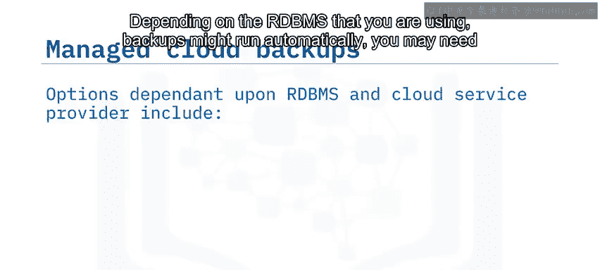

*   在某些情况下，备份可能**自动运行**。
*   你可能需要**手动启用**自动备份功能。
*   你也可能需要**执行手动备份**，或者运用本节课学到的知识来运行自己的备份策略。

例如：
*   **Db2 on Cloud** 的付费计划每天会自动执行一次加密备份。在企业版或标准版计划中，你还可以运行手动备份并执行时间点恢复。
*   在使用 **Google Cloud SQL**（支持 MySQL、PostgreSQL 和 SQL Server）时，你可以启用自动增量备份，也可以执行按需备份。

> 如果你的特定关系数据库管理系统和云服务商组合不支持上述任何选项，市场上也有可供购买的第三方备份工具。

---

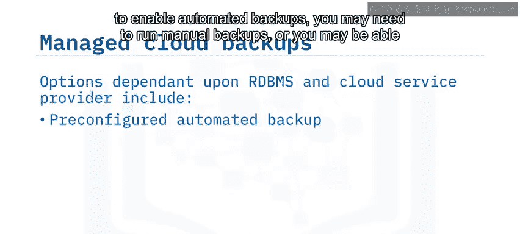

## 📝 课程总结

本节课中，我们一起学习了数据库备份策略的核心内容。

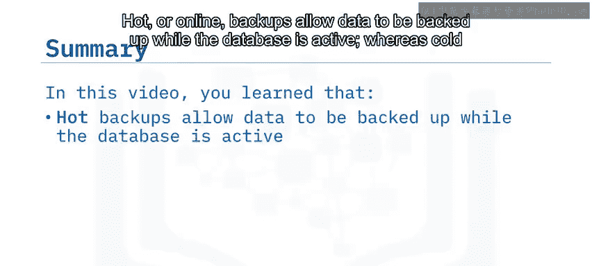

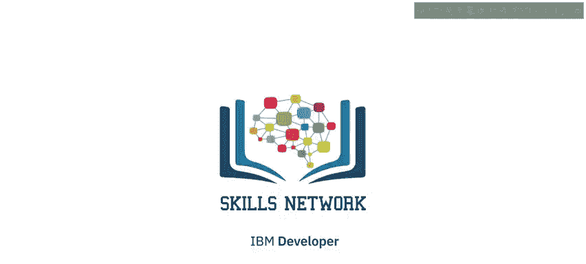

我们了解到，**热备份（在线备份）** 允许在数据库活动时进行备份，而**冷备份**则要求数据库离线。你的备份策略应根据恢复需求、可用性要求以及数据使用模式来确定。最后，大多数托管的云数据库服务都提供了自动备份功能，并带有一些可配置的选项，这大大简化了备份管理工作。