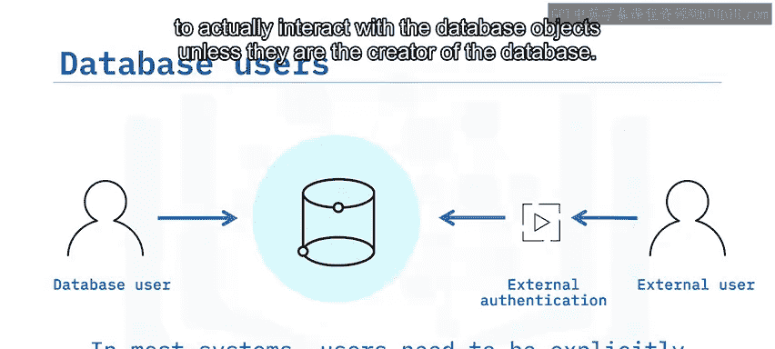
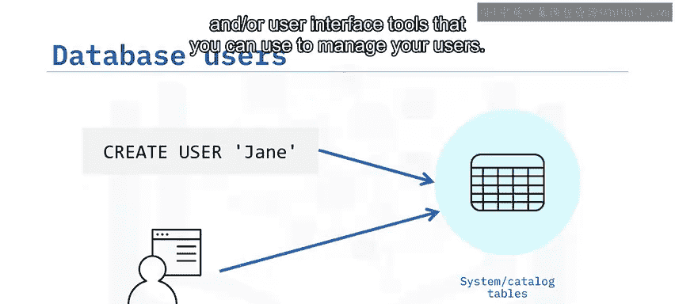
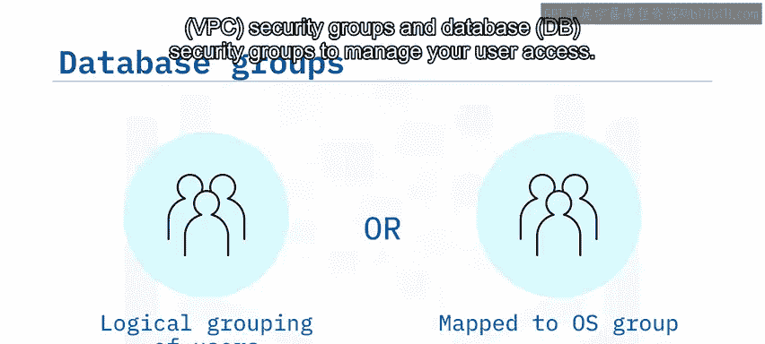
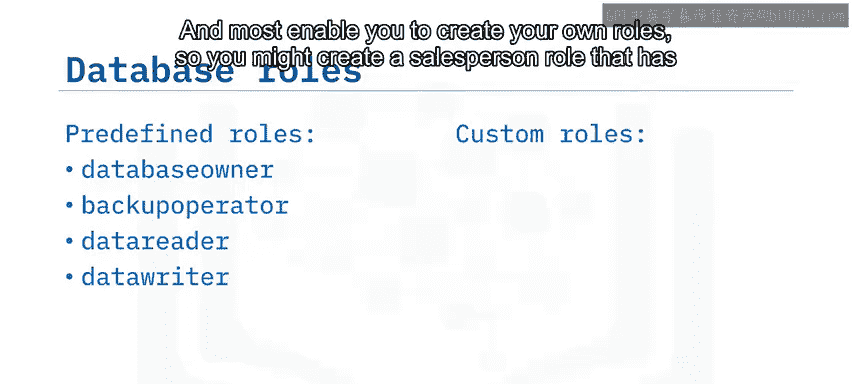
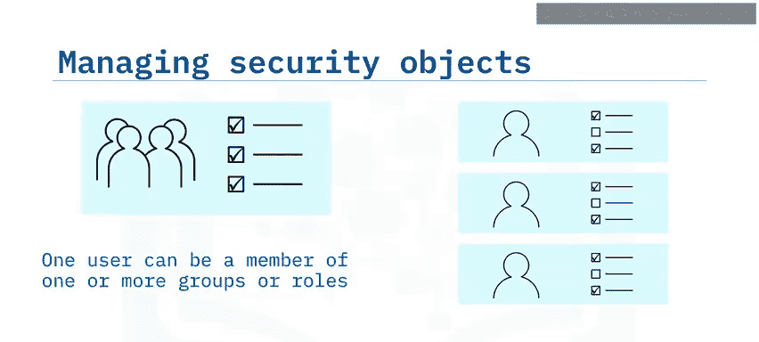
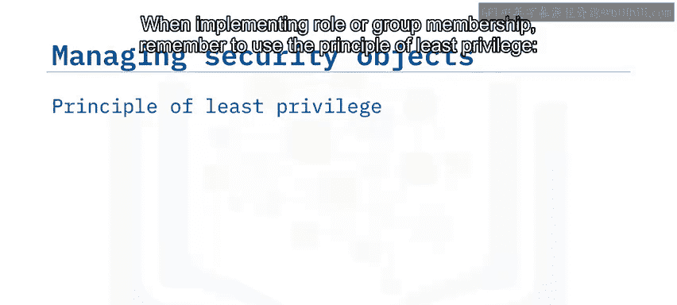
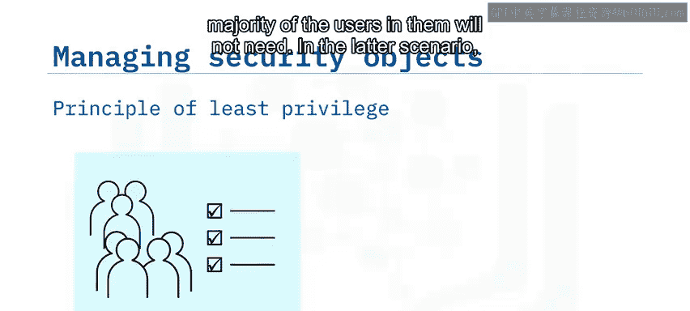
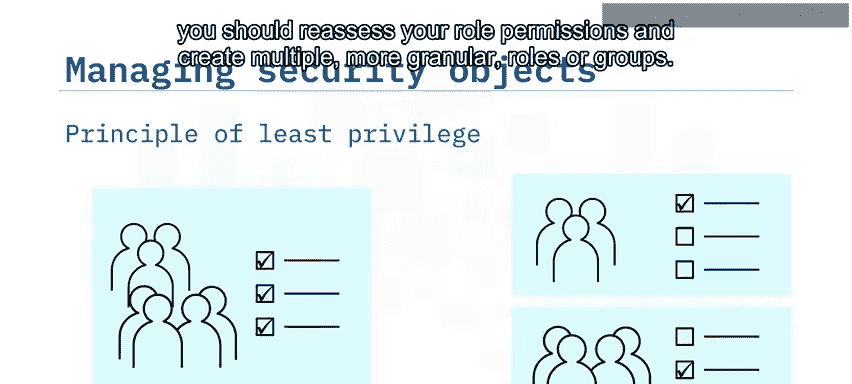
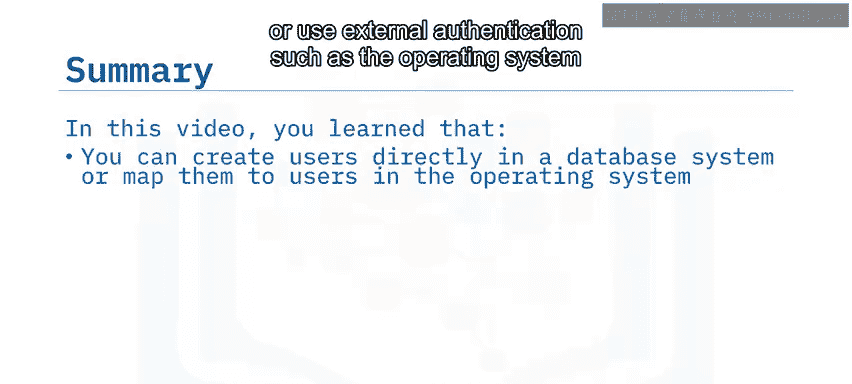

# 011：用户、组与角色 🔐

在本节课中，我们将学习数据库安全管理的核心概念：用户、组与角色。我们将了解它们各自的定义、如何协同工作，以及如何利用它们来高效管理数据库安全对象。

---

## 👤 数据库用户

数据库用户是被允许访问特定数据库对象的用户账户。根据数据库管理系统（DBMS）和安全策略的不同，用户可能直接在数据库系统中被显式创建和认证，也可能在外部创建，并使用外部认证方式进行认证，例如操作系统或外部身份管理服务（如Kerberos、LDAP和云IAM）。

当首次创建用户时，除非他们是数据库的创建者，否则通常几乎没有任何实际与数据库对象交互的权限。

用户名称存储在系统表或目录表中，不应尝试直接编辑这些表。所有关系型数据库管理系统（RDBMS）都会提供SQL命令和/或用户界面工具，供您管理用户。

---

## 👥 用户组

上一节我们介绍了单个用户，本节中我们来看看如何将用户组织起来。一些RDBMS支持用户组的概念。在某些情况下，例如PostgreSQL，您在数据库中定义组，它们是用户的逻辑分组，旨在简化用户管理。在其他系统（如SQL Server和DB2）中，您可以将数据库组映射到底层操作系统中的管理组。当您使用该操作系统对用户进行身份验证时，这尤其有用。

类似地，如果您在Amazon关系数据库服务（RDS）等平台上运行数据库，则可以使用虚拟私有云（VPC）安全组和数据库（DB）安全组来管理用户访问。

以下是用户组的主要作用：
*   简化权限管理，将权限分配给组而非单个用户。
*   便于基于组织结构或职能划分用户。
*   在某些系统中，可以与外部身份管理系统集成。

---

## 🎭 数据库角色

数据库角色与数据库组类似，它们将权限和访问权授予该角色的所有用户。数据库角色定义了在数据库中执行特定角色所需的一组权限。例如，备份操作员角色将拥有访问数据库和执行备份功能的权限。

一些RDBMS提供了一组预定义角色供您分配给用户，例如数据库所有者或备份操作员角色。大多数系统还允许您创建自定义角色。因此，您可以创建一个“销售人员”角色，该角色拥有销售人员对数据库中相关表所需的所有权限。

---

## ⚙️ 组与角色的协同工作

将权限分配给组或角色，而非单个用户，可以极大地简化安全管理任务。如果您知道一组用户都需要相同的功能来完成其工作角色，您可以将这些用户放入一个组，并将相关权限分配给该组。如果未来工作角色发生变化，向组添加新权限比向单个用户添加更快、更容易且更不易出错。

同样，如果有新员工加入团队，您只需将其添加到相应的角色或组中，而无需逐一分配所有单独的权限。一个用户可以是一个或多个角色的成员。例如，销售团队的负责人可以是“团队负责人”角色和“销售人员”角色的成员。

在实施角色或组成员资格时，请记住遵循最小权限原则：只将用户添加到他们需要成为成员的组中，并确保您的角色不包含其中大多数用户不需要的任何权限。在后一种情况下，您应重新评估角色权限，并创建多个更细粒度的角色或组。

---

## 📝 总结

本节课中我们一起学习了数据库安全管理的基础。我们了解到，根据数据库的不同，您可以直接在数据库系统中创建和认证用户，或使用操作系统等外部认证。在一些系统中，您在数据库中定义组来管理用户；而在另一些系统中，您可以将数据库组映射到操作系统组。您可以使用预定义的数据库角色为常见的数据库用户集分配权限，也可以根据自身需求定义自定义角色。最重要的是，组和角色的使用极大地简化了用户管理，提高了安全策略的效率和一致性。