# 015：数据库监控概述 📊

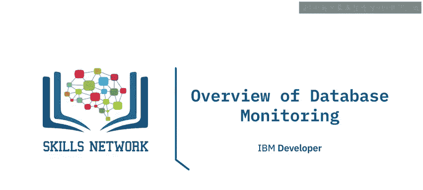

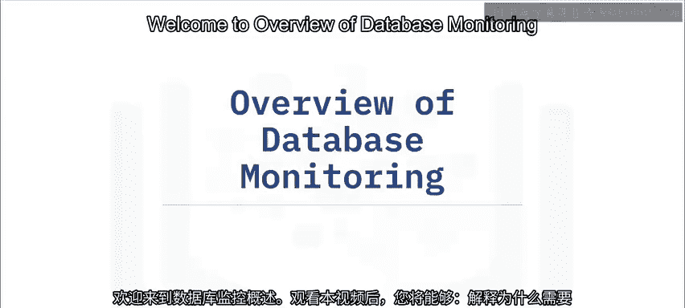

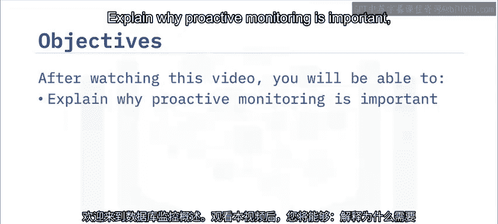

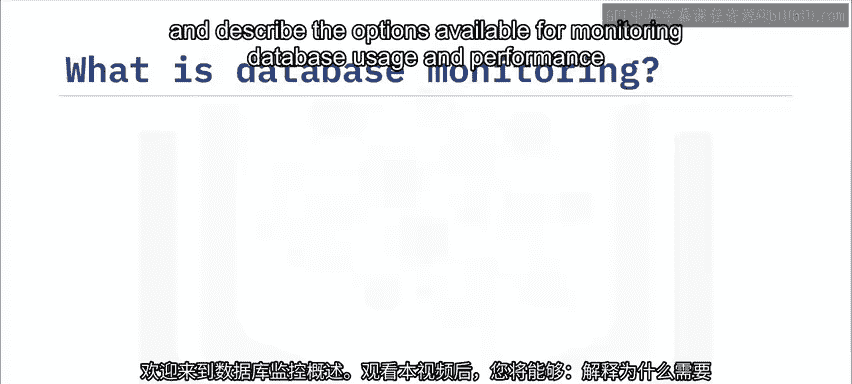

在本节课中，我们将要学习数据库监控的核心概念、重要性以及实施方法。数据库监控是数据库管理的关键环节，它帮助我们确保数据库系统的健康、性能与可用性。

---

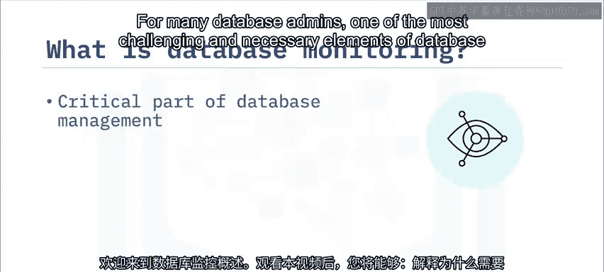

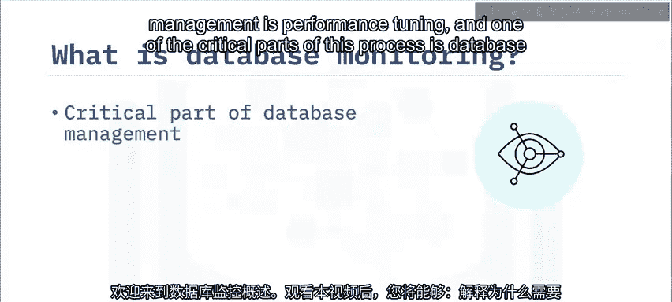

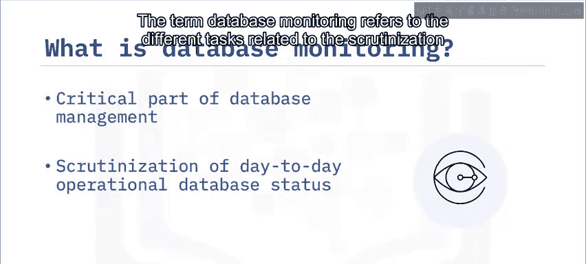

对于许多数据库管理员而言，数据库管理中最具挑战性且必要的环节之一是性能调优，而数据库监控是此过程的关键部分。数据库监控这一术语，指的是与审查数据库日常运行状态相关的各项任务。无论您使用哪家供应商的数据库产品，数据监控对于维护关系数据库管理系统的健康与性能都至关重要。

当您执行定期的数据库监控时，它有助于及时发现问题，从而维护数据库系统的健康与可访问性。如果您不执行此监控功能，那么数据库中的问题和故障可能在为时已晚之前都未被察觉。这可能导致您的用户和客户对您的服务失去信心，并且您的组织可能因此失去客户和收入。大多数关系数据库管理系统都提供了工具，使您能够观察数据库的当前状态，并随着时间的推移跟踪其在不同情况下的性能。

作为数据库管理员，您可以利用这些信息来执行多项数据库监控任务。

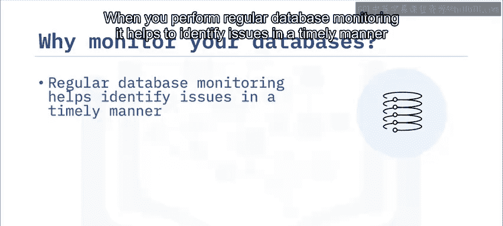

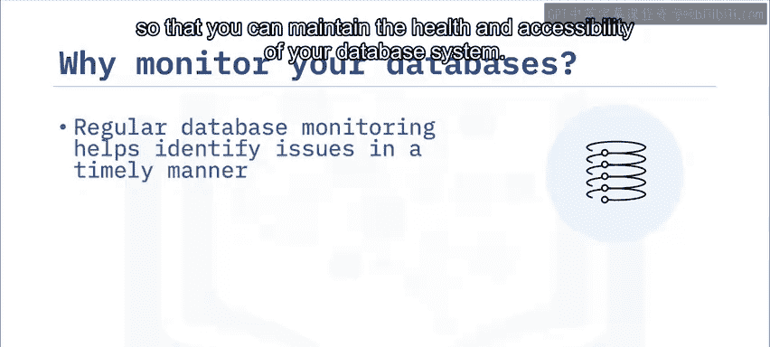

以下是数据库监控的主要任务：

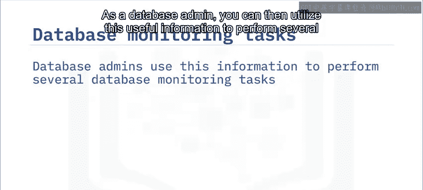

*   基于数据库使用模式预测未来的硬件需求。
*   分析单个应用程序或数据库查询的性能。
*   跟踪索引和表的使用情况。
*   确定任何系统性能下降的根本原因。
*   优化数据库元素以提供最佳性能。
*   评估任何优化活动的影响。

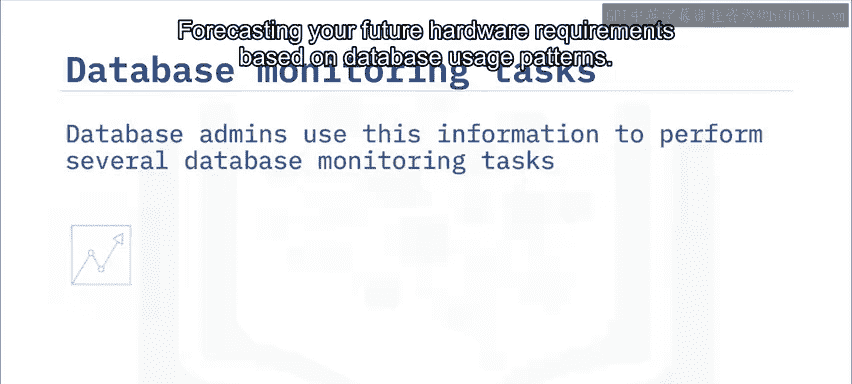

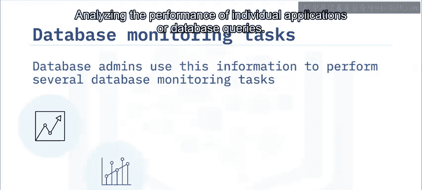

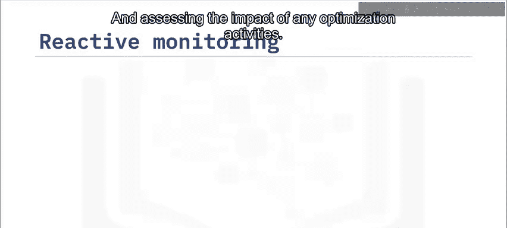

---

在讨论主动监控的重要性之前，我们需要将其与被动监控区分开来。被动监控是在问题发生后进行的，您直接针对该问题采取行动，例如修复配置设置或增加资源。被动监控最常见的情况是：数据库安全遭到破坏时、数据库性能达到极低水平时，或者发生其他严重影响业务的重大数据库事件并需要尽快解决时。

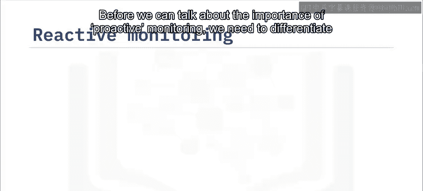

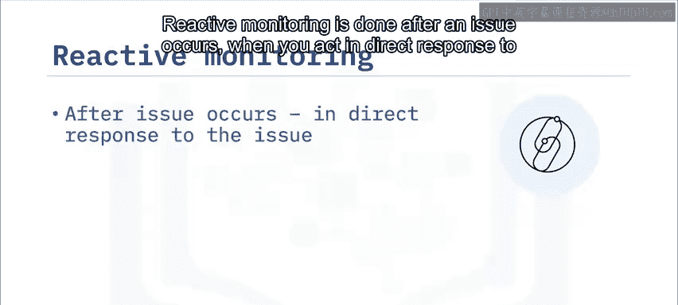

相比之下，主动监控策略旨在通过在小问题演变成大问题之前识别它们，来避免这种被动的恐慌。这主要通过观察数据库的特定指标来实现，如果这些指标的值达到异常水平，则向相关方发送警报。主动监控通常利用自动化流程来执行任务，例如定期验证数据库系统是否在线且可访问、验证配置更改不会对数据库系统的性能产生不利影响，以及确保数据库系统在可接受的水平上运行和表现。这种主动方法被广泛认为是更好的策略，并且是大多数数据库管理员的首选。

---

为了确定您的数据库系统是否以最佳状态运行，您首先需要为数据库系统的性能建立一个基线。为此，您需要在给定时间段内定期记录关键性能指标。

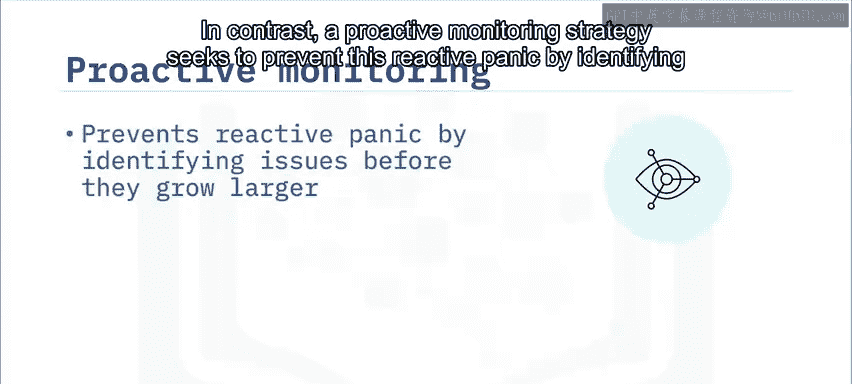

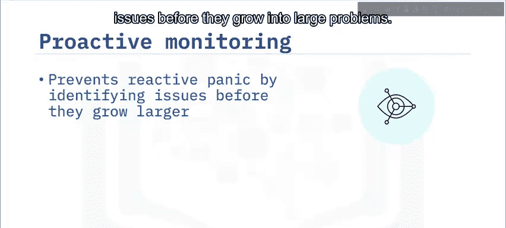

一旦建立了数据库系统性能基线，您就可以随时将这些基线统计数据与数据库系统的当前性能进行比较。如果您的比较表明当前性能测量值显著高于或低于性能基线，那么这些就可能成为进一步分析和调查的潜在目标。

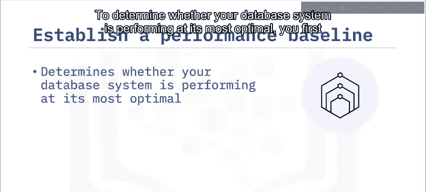

从这些调查中，您可能会确定某些数据库元素需要重新配置或优化。即使在一切运行良好且符合预期的情况下，您仍然可以使用性能基线数据来帮助确定操作规范。

以下是基线数据可帮助确定的操作规范：

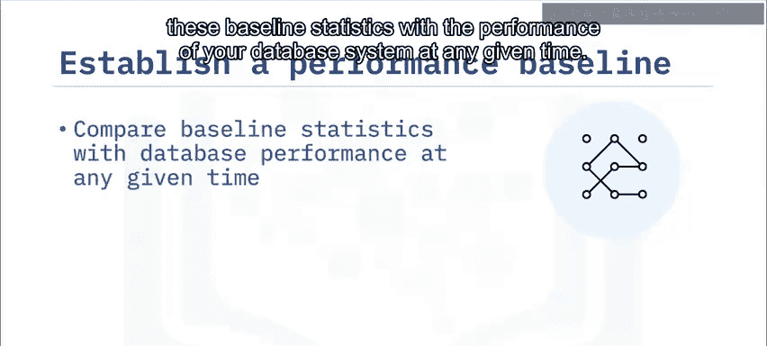

*   运营的高峰时段和非高峰时段。
*   运行查询和处理批处理命令的典型响应时间。
*   执行数据库备份和恢复操作所需的时间。

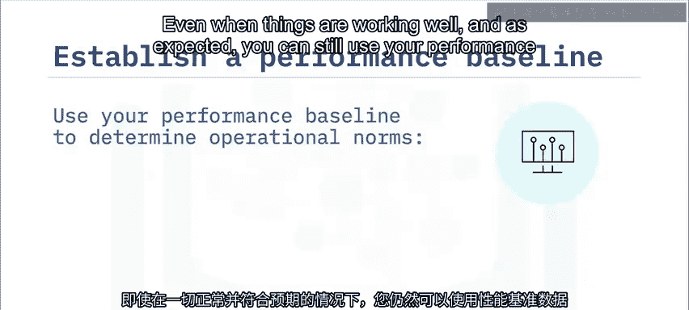

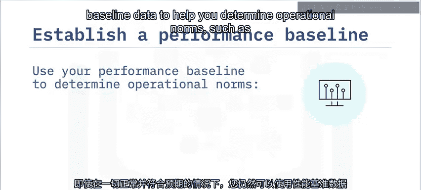

---

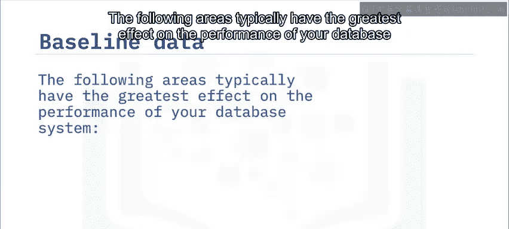

以下领域通常对数据库系统的性能影响最大：

*   系统硬件资源
*   网络架构
*   操作系统
*   数据库应用程序
*   客户端应用程序

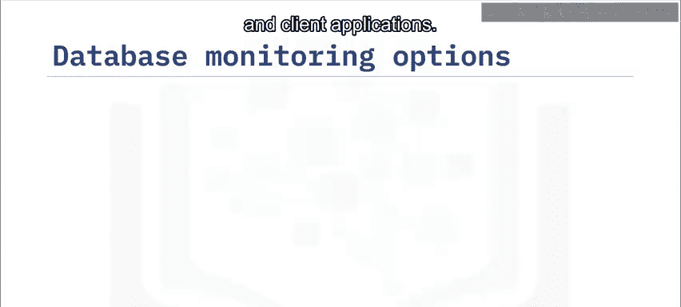

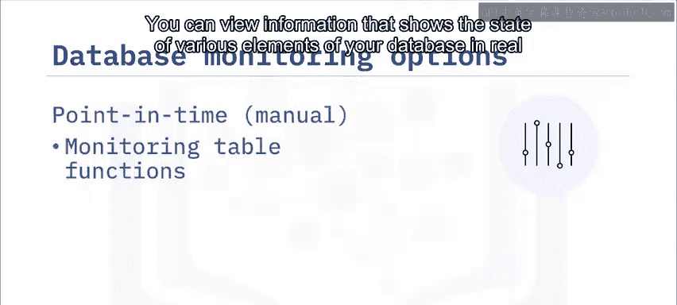

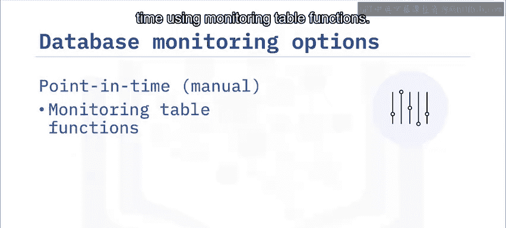

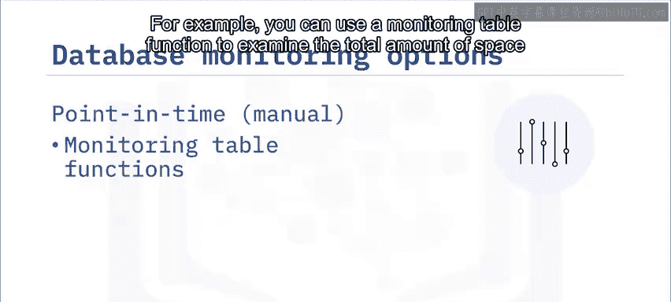

---

有两种方法可以监控数据库中的操作。您可以使用监控表函数查看实时显示数据库各元素状态的信息。例如，您可以使用监控表函数来检查表中使用的总空间量。这些表函数允许您检查报告数据库操作几乎所有方面的监控元素和指标。监控表函数使用轻量级、高速的监控基础设施。

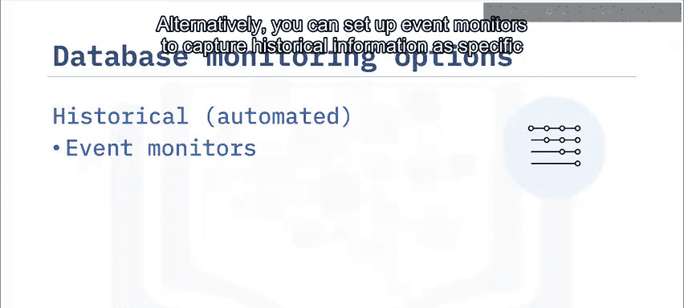

或者，您可以设置事件监视器，以在特定类型的数据库事件在给定时间段内发生时捕获历史信息。事件监视器在特定类型的事件发生时，随时间捕获有关数据库操作的信息。例如，您可以创建一个事件监视器来捕获系统中发生锁和死锁时的信息。或者，您可能创建一个事件监视器来记录当您指定的阈值（例如，应用程序或工作负载使用的总处理器时间）被超过时的情况。

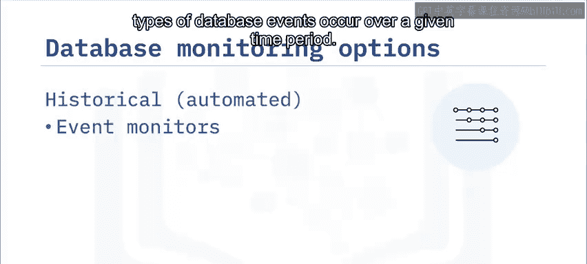

事件监视器以不同格式生成输出，并可以将此输出写入常规表，有些甚至具有额外的输出选项。

---

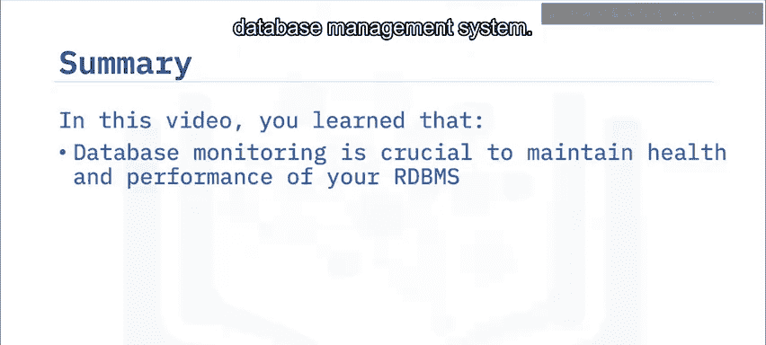

本节课中我们一起学习了数据库监控的核心知识。我们了解到，数据库监控对于维护关系数据库管理系统的健康与性能至关重要。主动监控旨在通过在小问题演变成大问题之前识别它们来避免被动恐慌。您需要为数据库系统的性能建立基线，以确定其是否以最佳状态运行。要监控数据库中的操作，您既可以查看特定时间点数据库各元素的状态，也可以设置事件监视器来捕获特定类型数据库事件随时间发生时的历史信息。