# 016：监控使用和性能 第 1 部分 📊

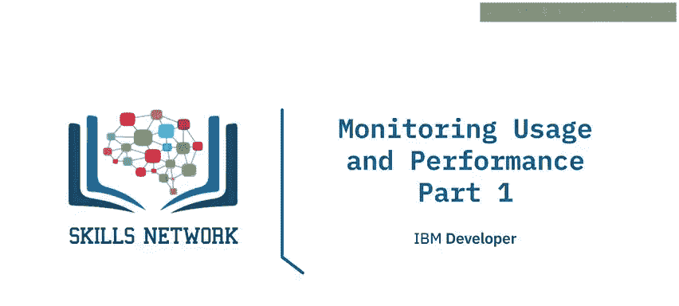

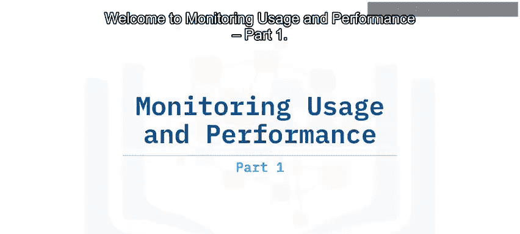

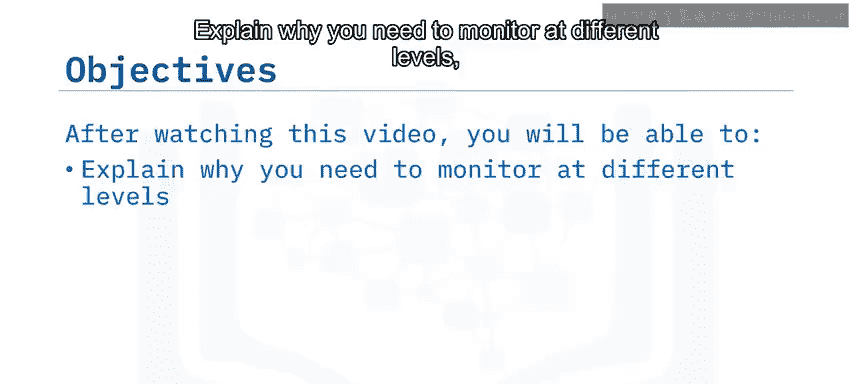

欢迎来到《监控使用和性能》第一部分。在本节课中，我们将学习为何需要在不同层级进行监控，并描述数据库监控的四个关键层级。

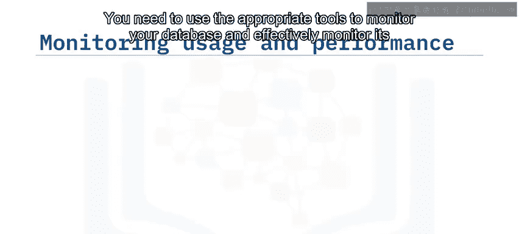

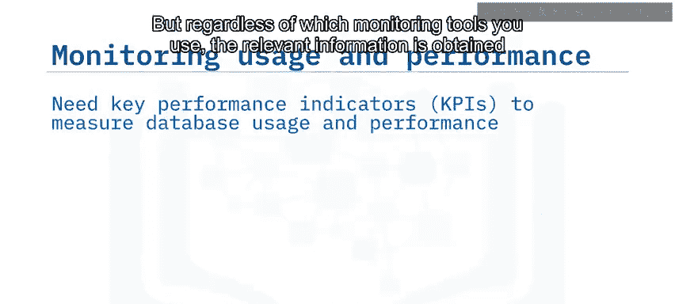

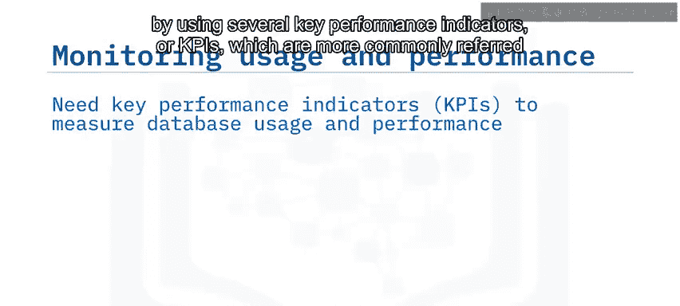

你需要使用合适的工具来监控数据库并有效监控其性能。无论使用哪种监控工具，相关信息都是通过几个关键性能指标（KPIs）获取的，这些指标通常被称为**指标**。

数据库性能通过使用这些关键的数据库性能指标来衡量。这些指标使数据库管理员能够有效优化其组织的数据库，以获得最佳性能。除了性能监控，定期监控对于运维和安全目的也很有用。监控的最终目标是识别并防止问题对数据库性能产生不利影响。

然而，出现的一些问题可能由硬件、软件、网络连接、执行的查询或其他未知因素引起。关键在于，问题可能出现在数据库环境的多个领域。因此，为了高效、成功地监控数据库的使用和性能，你需要在数据库环境内的几个不同层级进行监控。

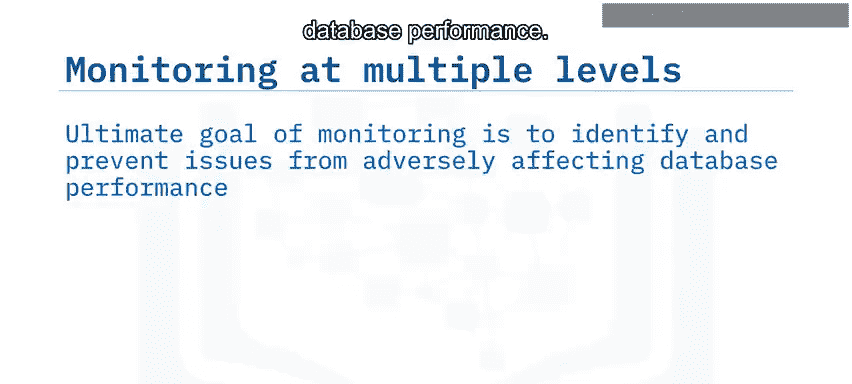

这四个监控层级分别是：基础设施层、平台层（或实例层）、查询层以及用户或会话层。

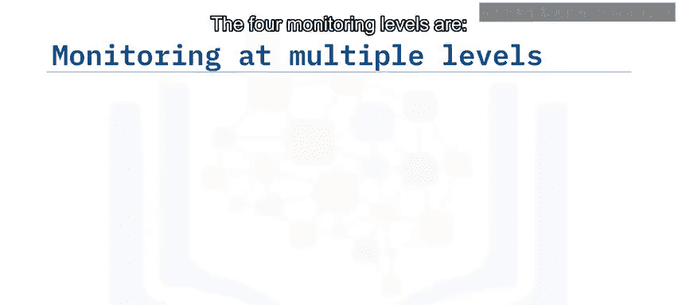

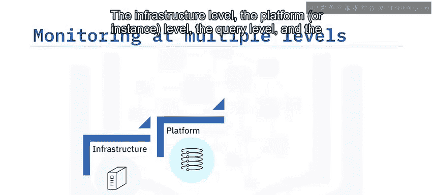

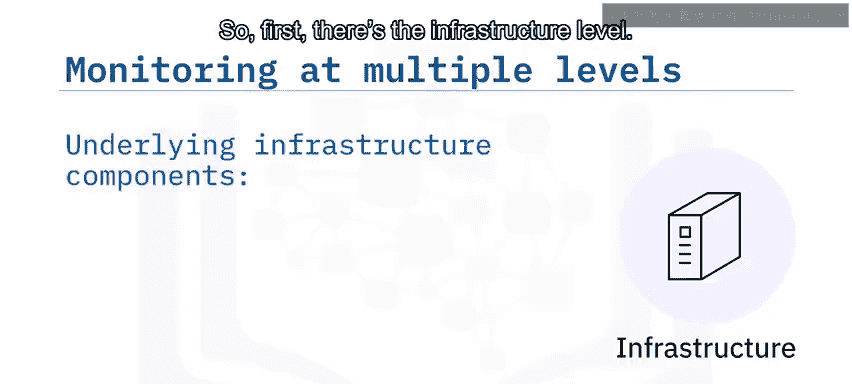

首先，是基础设施层。所有底层基础设施组件，如操作系统、服务器、存储硬件资源和网络组件，都必须在数据库平台和查询的底层高效运行，这一点至关重要。

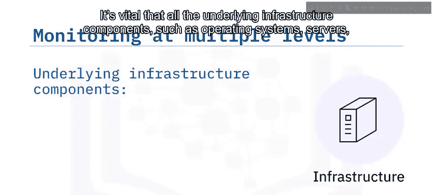

接下来，是实例或数据库平台层。无论你管理的是关系数据库系统（如DB2、PostgreSQL、MySQL或任何其他类型的关系数据库系统），还是同时管理多个系统的组合，每个平台在性能方面都需要考虑。平台级的数据库监控至关重要，因为它提供了维持数据库性能一致性所需的所有要素的整体洞察。

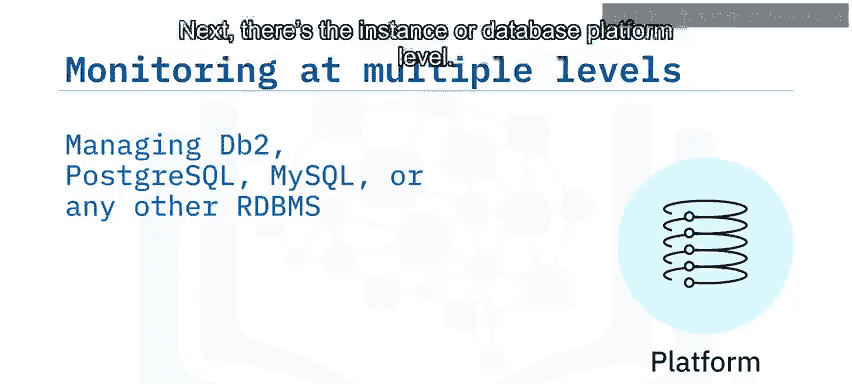

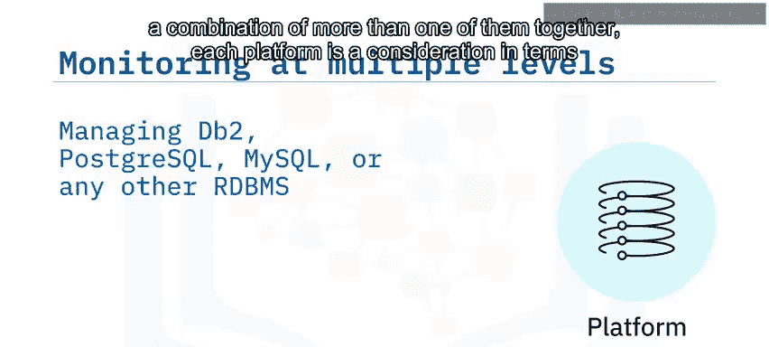

然后是查询层。通常，你的业务线应用程序会反复对数据库实例运行查询，然后将这些查询的相关结果格式化并返回给用户。此层级可能出现的大多数瓶颈主要源于低效的查询语句，这些语句可能导致延迟、错误处理不当，并降低查询吞吐量和并发性。

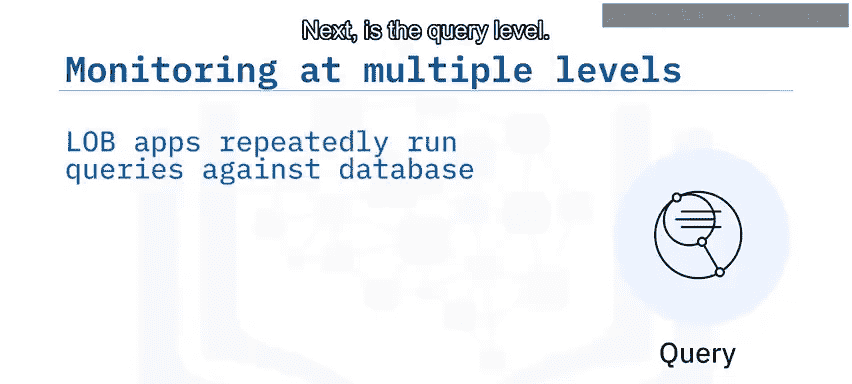

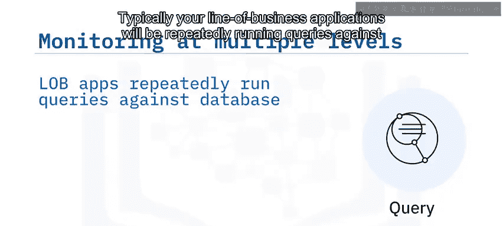

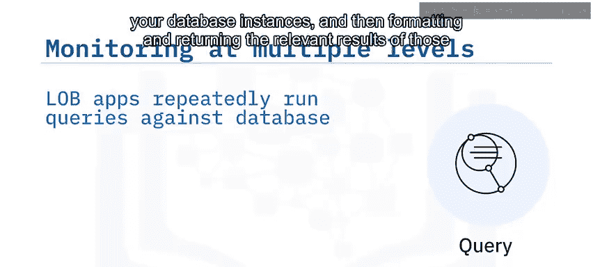

最后，是用户或会话层。这个层级常常是所有监控层级中最具误导性的。因为如果用户抱怨某些功能无法使用，你可以获取他们遇到问题的更多信息，进行调查并修复。但是，如果你的用户目前没有抱怨功能问题，你是否就可以假设一切运行正常，高枕无忧了呢？不幸的是，答案是否定的。仅仅因为现在可能没有问题，并不意味着问题不会在下一刻出现。真正成功的监控意味着以主动和持续的方式，不断监控数据库系统的使用、性能和行为。数据库监控的理想境界是，在用户甚至意识到问题之前，就主动识别出问题。监控所有这四个层级对于维持服务级别协议（SLAs）至关重要，例如确保数据库的**高可用性**、**高正常运行时间**和**低延迟**。

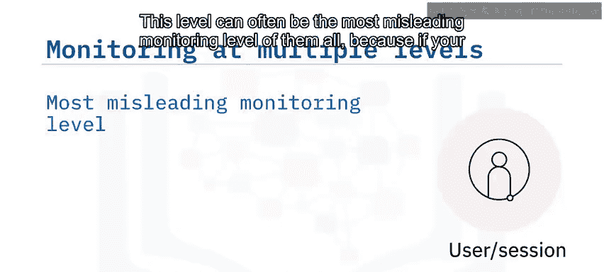

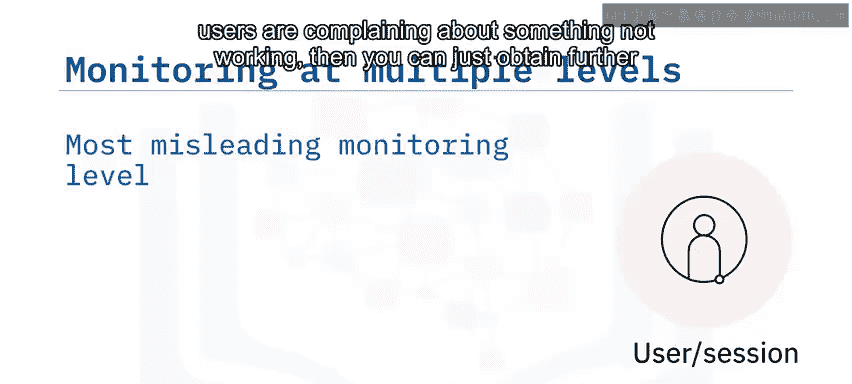

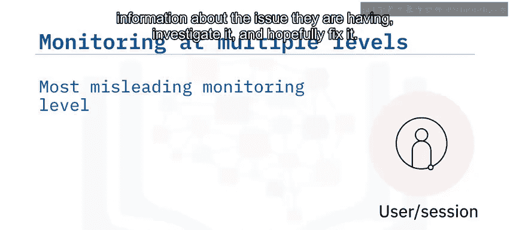

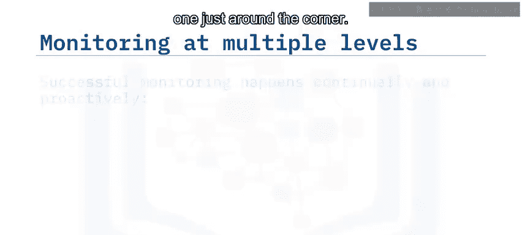

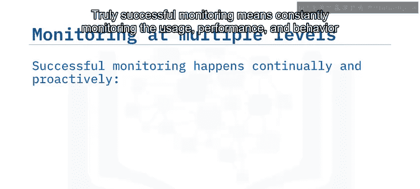

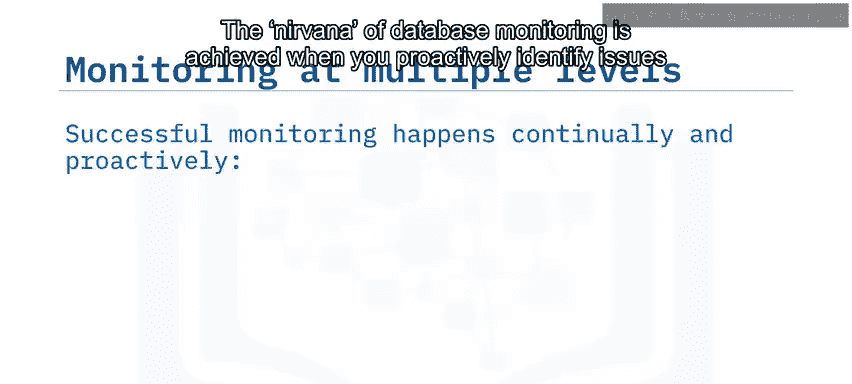

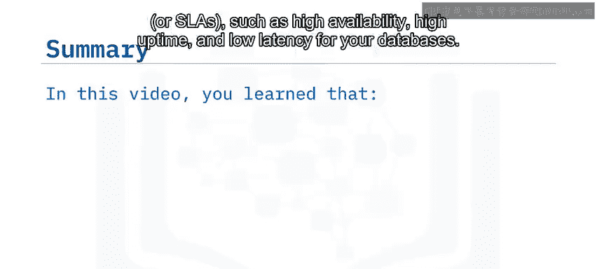

在本视频中，你学习了数据库性能是通过称为**指标**的关键性能指标来衡量的。指标使DBA能够优化组织的数据库以获得最佳性能。成功的数据库性能监控意味着在多个层级进行监控。你应该在基础设施层、平台层、查询层和用户层进行监控。

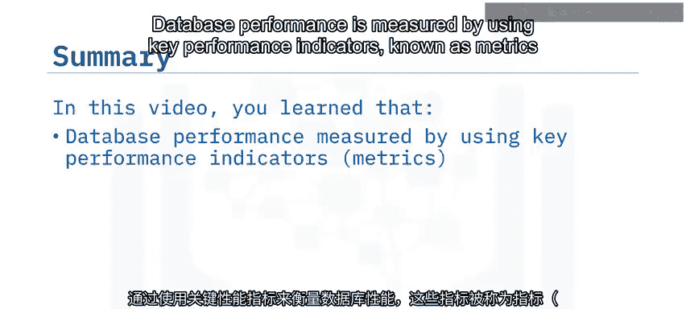

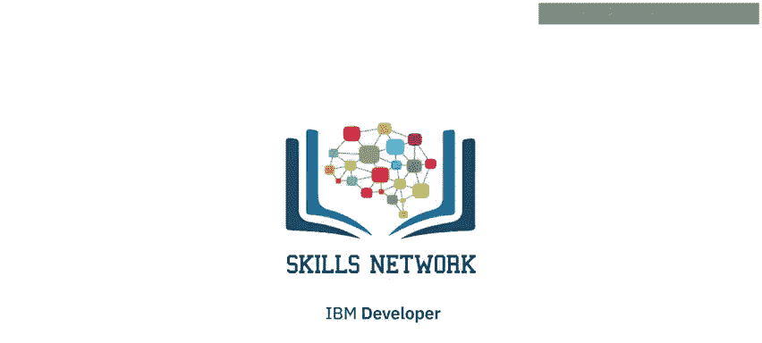

## 总结

本节课中，我们一起学习了数据库监控的重要性。我们了解到，有效的监控需要依赖**关键性能指标（KPIs）**，并且必须在四个不同的层级进行：**基础设施层**、**平台层**、**查询层**和**用户层**。通过这种分层、主动和持续的监控方法，数据库管理员可以提前发现问题，优化性能，并确保满足服务级别协议的要求。