# 018：数据库优化 🛠️


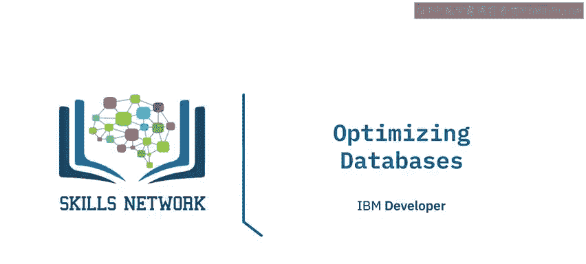

在本节课中，我们将学习为何需要优化数据库，并了解三种主流关系型数据库（MySQL、PostgreSQL、DB2）中用于优化数据库性能的核心命令。

随着数据库中存储的数据量和工作负载的增加，数据可能会变得**碎片化**。数据页可能留空或部分留空，从而导致数据库性能下降。通过优化数据库，可以识别瓶颈、优化数据库查询，并最终减少用户的数据库响应时间。

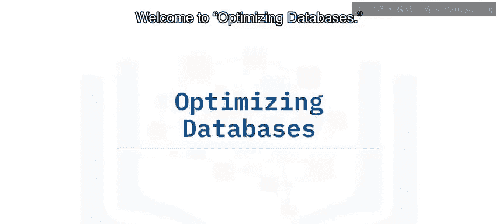

---

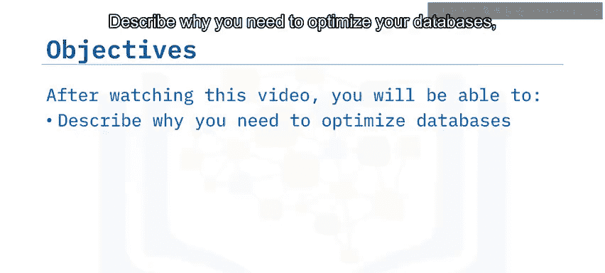

## 为何需要优化数据库？🤔

上一节我们提到了数据库性能可能下降。本节中，我们来看看具体原因。

随着数据库中存储的数据量和操作工作负载的不断增加，数据会变得碎片化。数据页可能留空或部分留空，从而导致数据库性能下降。通过优化数据库，可以识别瓶颈、优化数据库查询，并最终减少用户的数据库响应时间。

---


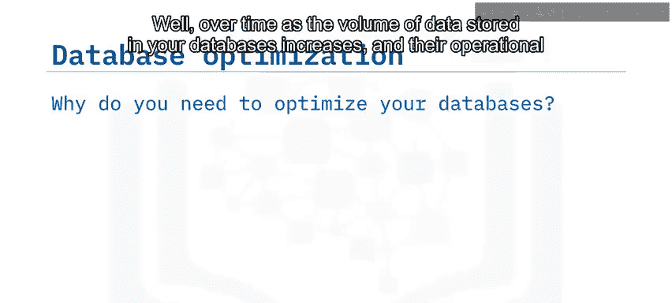

## 各数据库的优化命令概览 📊

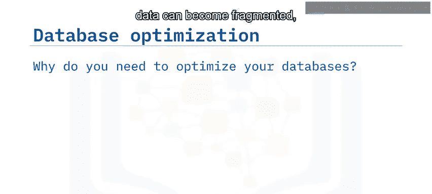

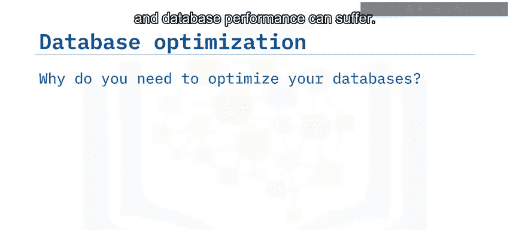

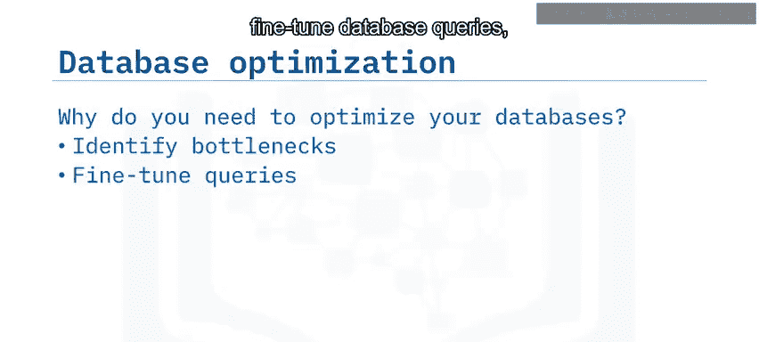

每个关系数据库系统都有其自己的实用程序或命令来优化其数据库。

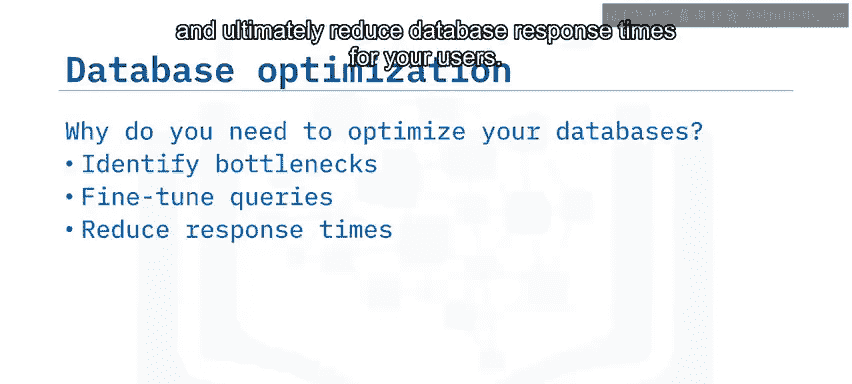

以下是不同数据库系统的主要优化命令：
*   **MySQL**：使用 `OPTIMIZE TABLE` 命令。
*   **PostgreSQL**：使用 `VACUUM` 和 `REINDEX` 命令。
*   **DB2**：使用 `RUNSTATS` 和 `REORG` 命令。

接下来，我们将逐一详细了解这些命令。

---

## MySQL 优化：`OPTIMIZE TABLE` 命令

在 MySQL 中，可以使用 `OPTIMIZE TABLE` 命令来优化表。

如果 MySQL 数据库接收了大量插入、更新或删除操作，可能会导致数据文件**碎片化**。这意味着会浪费大量未使用的空间，进而影响数据库性能。因此，建议数据库管理员定期对 MySQL 表进行碎片整理。

在 MySQL 中，`OPTIMIZE TABLE` 命令会重新组织表数据和相关索引数据的物理存储，以减少存储空间并提高访问表时的输入/输出效率。

要使用 `OPTIMIZE TABLE` 命令，您需要对正在处理的表拥有 `SELECT` 和 `INSERT` 权限。

以下是一个命令示例，它可以在一次操作中优化三个不同的表：

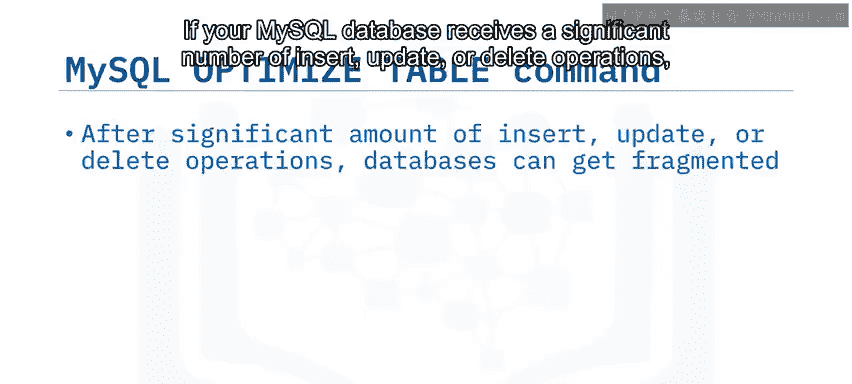

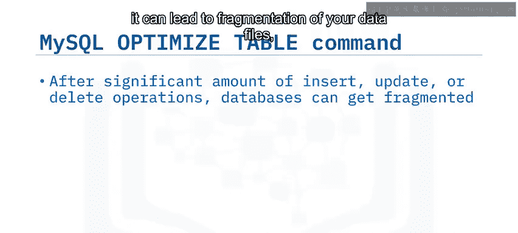

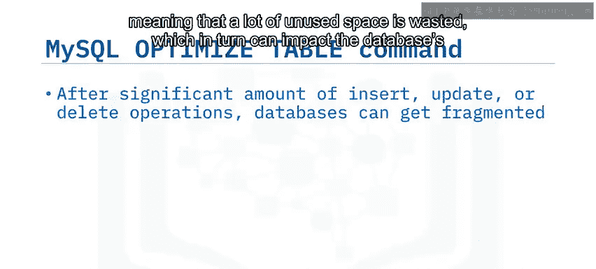

```sql
OPTIMIZE TABLE table1, table2, table3;
```

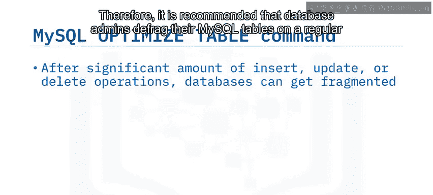

您也可以使用图形化工具（如 phpMyAdmin）来优化 MySQL 中的表。

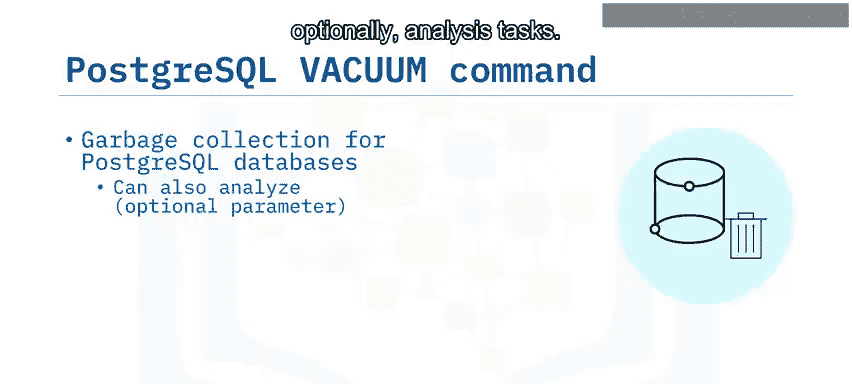

---

## PostgreSQL 优化：`VACUUM` 命令

在 PostgreSQL 中，`VACUUM` 命令用于执行垃圾回收和可选的统计分析任务。

`VACUUM` 会回收由**死元组**占用的存储空间。这些死元组在删除或因更新而失效后，并未从数据库表中物理移除。在常规的 PostgreSQL 操作中，定期回收这些丢失的存储空间有助于提高数据库的整体性能。

请注意，如果启用了 `autovacuum` 功能，PostgreSQL 将自动为您执行 `VACUUM` 维护过程。

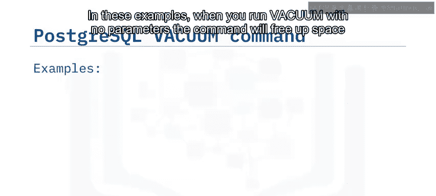

以下是 `VACUUM` 命令的使用示例：

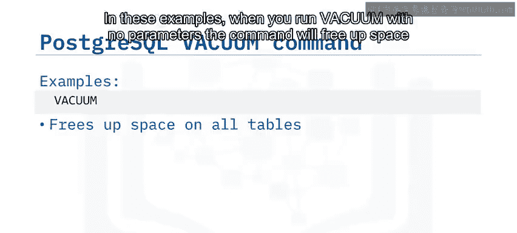

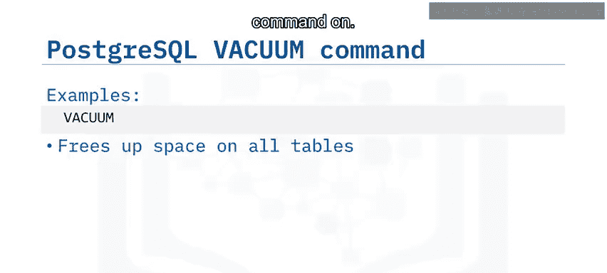

当不带参数运行 `VACUUM` 时，该命令将释放当前用户有权执行此操作的每个数据库中每个表上的空间。

```sql
VACUUM;
```

如果指定了表名，则该命令将仅处理并释放该表上的空间。

```sql
VACUUM my_table;
```

如果不使用 `FULL` 参数，`VACUUM` 命令可以与正常的读写表操作同时运行，因为它不需要排他锁。任何回收的空间都会保留在已清理的表内供将来重用。

然而，如果指定了 `FULL` 参数，该命令将创建表内容的完整副本，并将其无空闲空间地写入磁盘，从而允许操作系统回收空间。因此，使用 `FULL` 参数可以回收更多空间，但运行时间要长得多，并且在处理每个表时需要排他锁。

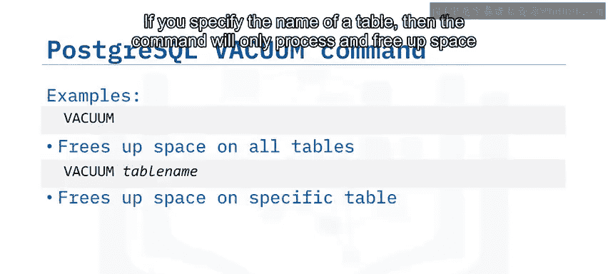

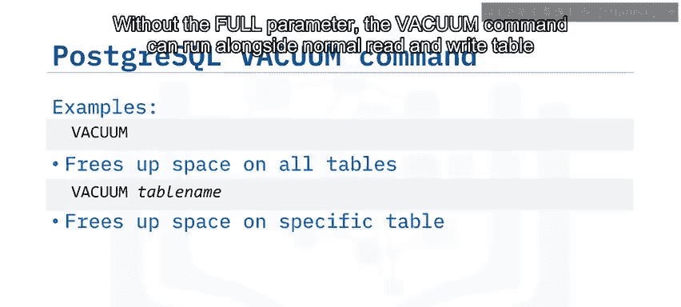

```sql
VACUUM FULL my_table;
```

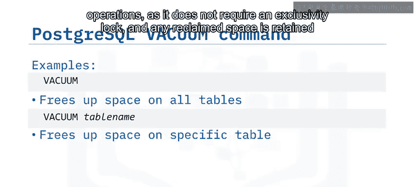

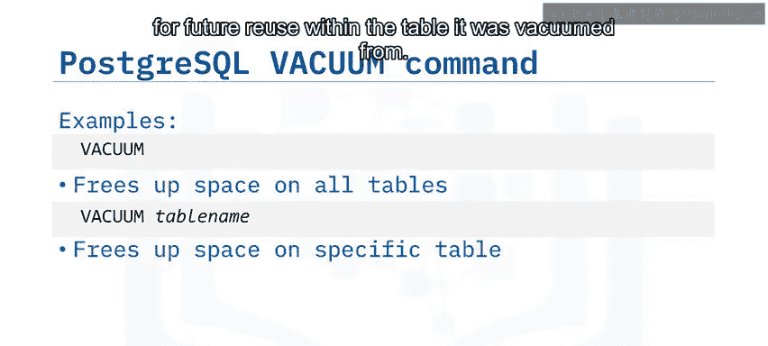

---

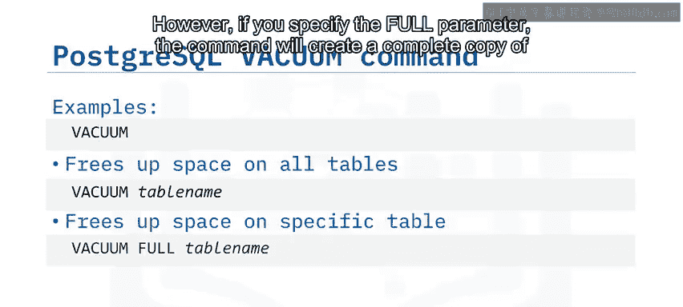

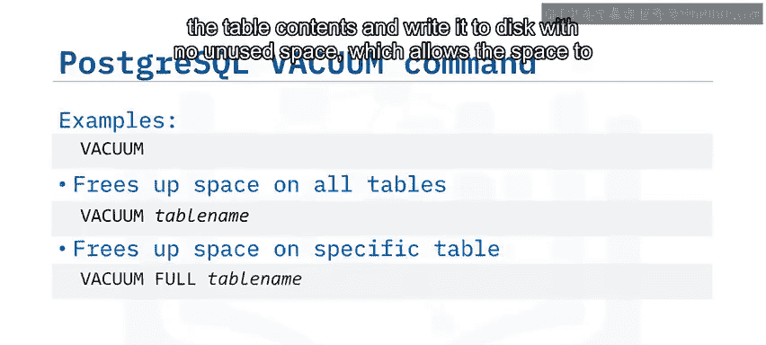

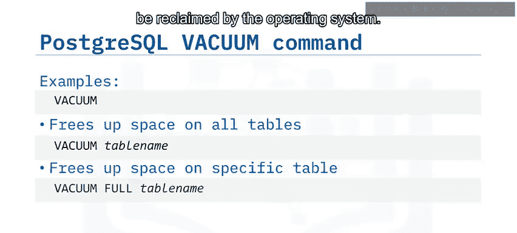

## PostgreSQL 优化：`REINDEX` 命令

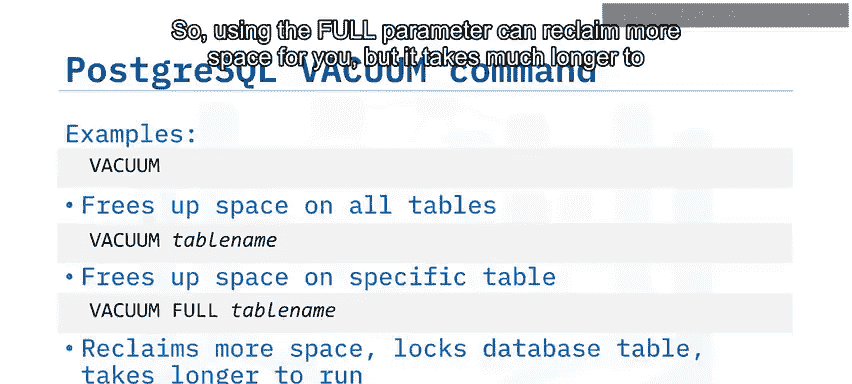

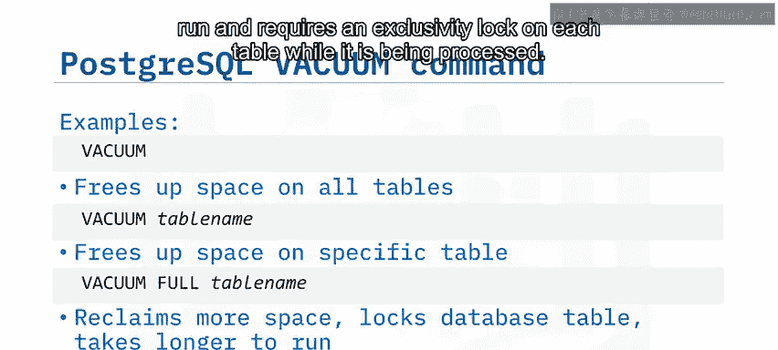

在 PostgreSQL 中，可以使用 `REINDEX` 命令重建一个或多个索引。

`REINDEX` 使用索引对应表中存储的数据重建索引，并替换旧版本的索引。当软件错误或硬件故障损坏了索引，或者索引变得臃肿并包含大量空页或接近空页时，可以使用此命令。您需要是索引、表或数据库的所有者才能重建索引。

使用 `REINDEX` 时，它会从头开始构建索引内容，因此其效果与删除并重新创建索引非常相似。但是，它们在读写锁的处理方式上有所不同。

以下是一些 `REINDEX` 的使用示例。

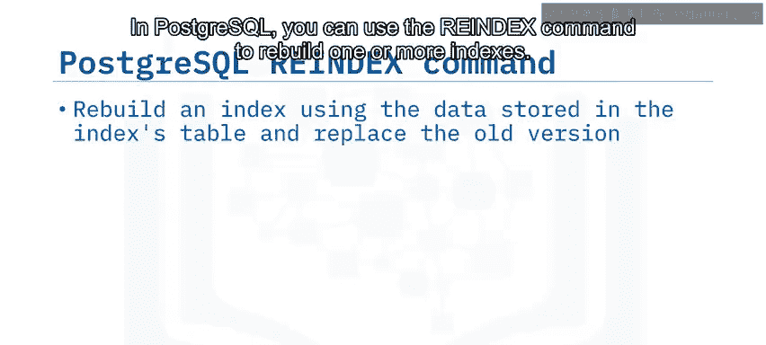

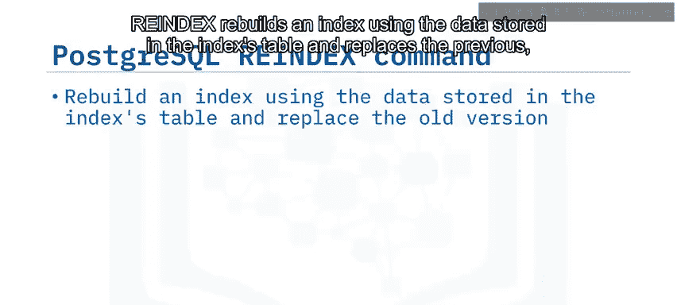

第一个示例将重建名为 `my_index` 的索引：

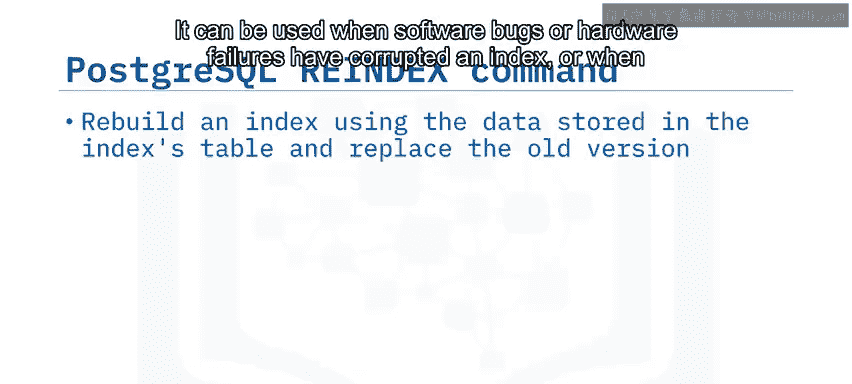

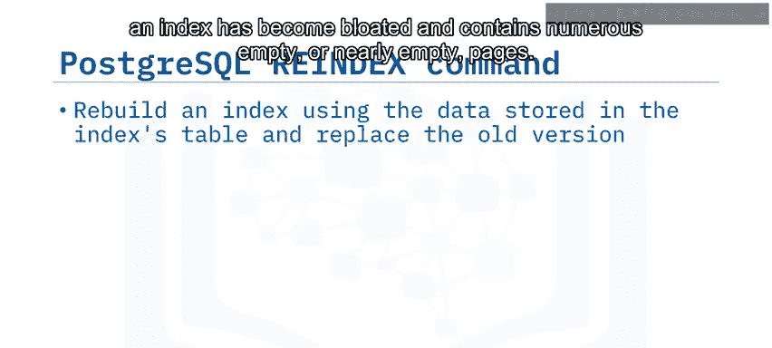

```sql
REINDEX INDEX my_index;
```

第二个示例将重建名为 `my_table` 的表上的所有索引：

```sql
REINDEX TABLE my_table;
```

---

## DB2 优化：`RUNSTATS` 命令

在 DB2 中，`RUNSTATS` 命令更新系统目录中关于表、相关索引或统计视图特征的统计信息。这些特征包括记录数、页数和平均记录长度。优化器使用这些统计信息来确定数据的访问路径。

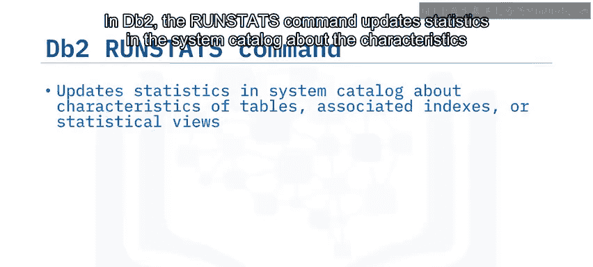

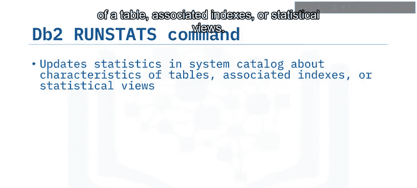

以下是针对不同对象调用 `RUNSTATS` 命令的时机：

*   **对于表**：当表进行了大量更新后，或在表重组后，调用 `RUNSTATS` 命令。对于表，此命令从调用它的数据库分区收集表的统计信息。
*   **对于统计视图**：当底层表的更改严重影响视图返回的行时，调用 `RUNSTATS` 命令。该视图必须事先已通过 `ALTER VIEW` 语句启用以用于查询优化。对于视图，此命令使用来自所有参与数据库分区上表的数据来收集统计信息。

以下是一些使用示例。

第一个示例仅收集表的统计信息，并包含 `employee_id` 和 `employee_name` 列的分布统计信息：

```sql
RUNSTATS ON TABLE employees WITH DISTRIBUTION ON COLUMNS (employee_id, employee_name);
```

第二个示例收集一组索引的统计信息：

```sql
RUNSTATS ON TABLE employees FOR INDEXES ALL;
```

---

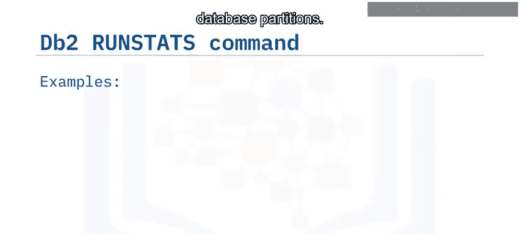

## DB2 优化：`REORG` 命令

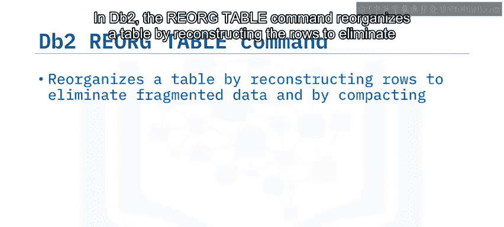

在 DB2 中，`REORG TABLE` 命令通过重建行以消除碎片化数据并压缩信息来重组表。

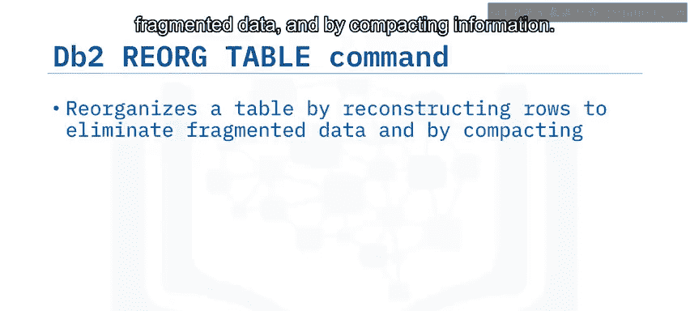

在分区表上，可以重组单个分区。就范围而言，`REORG TABLE` 命令会影响数据库分区组中的所有数据库分区。

以下是一个简单的使用示例。此示例将使用名为 `my_tmp_tbsp` 的临时表空间来重组表以回收空间：

```sql
REORG TABLE employees USE my_tmp_tbsp;
```

在 DB2 中，`REORG INDEX` 命令用于重组索引。

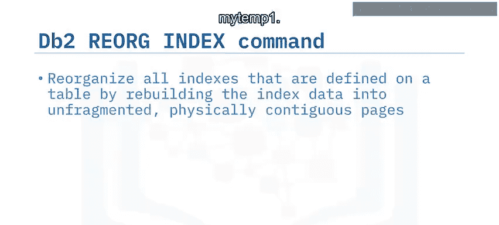

您可以通过将索引数据重建到无碎片、物理连续的页中来重组表上定义的所有索引。

在数据分区表上，可以重组分区表上的特定非分区索引，或者如果指定了数据分区，则可以重组该分区上的所有分区索引。

如果指定了索引子句的 `CLEANUP` 选项，则无需重建索引即可执行清理。您可以清理表上的特定索引，也可以清理表上的所有索引。就范围而言，`REORG INDEX` 命令会影响数据库分区组中的所有数据库分区。

---

## 总结 📝

本节课中，我们一起学习了数据库优化的重要性及具体方法。

我们了解到，优化数据库可以提高响应时间并提升整体性能。各关系数据库管理系统提供了自己的实用程序或命令来优化数据库：
*   在 **MySQL** 中，可以使用 `OPTIMIZE TABLE` 命令。
*   在 **PostgreSQL** 中，可以使用 `VACUUM` 和 `REINDEX` 命令。
*   在 **DB2** 中，可以使用 `RUNSTATS` 和 `REORG` 命令。

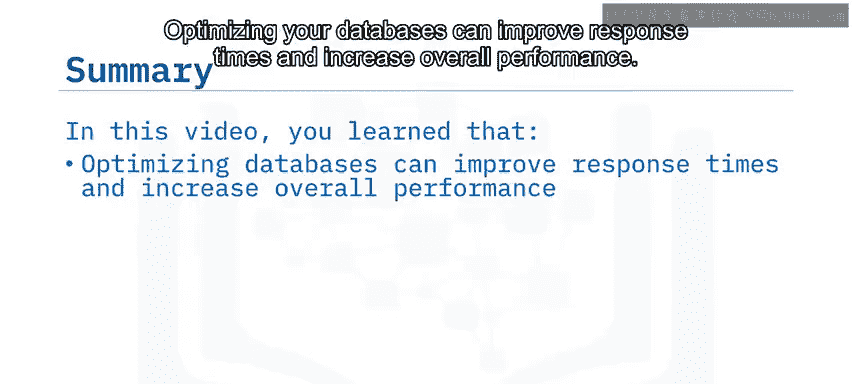

定期使用这些工具是维护数据库健康和高性能运行的关键任务之一。