# 020：排除常见问题 🔧

在本节课中，我们将学习如何识别和解决数据库管理中常见的性能、配置和连接问题。我们将了解问题的根源、基本的故障排除步骤以及用于诊断和预防问题的工具。

---

## 什么是故障排除？🔍

故障排除是一个识别和解决问题的过程。这个过程通常从回答以下几个关键问题开始：

*   **症状是什么？**
*   **谁或什么报告了问题？**
*   **问题发生在哪里？** 它是否特定于某个平台、环境或应用程序？
*   **问题何时发生？** 是在特定时间、多次发生，还是在特定条件下发生？
*   **问题是否可重现？**

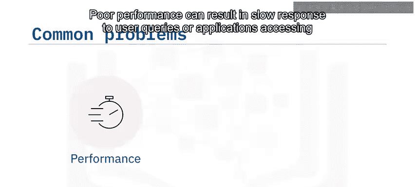

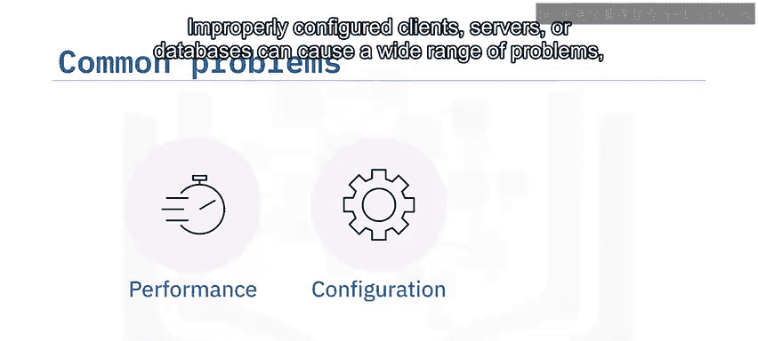

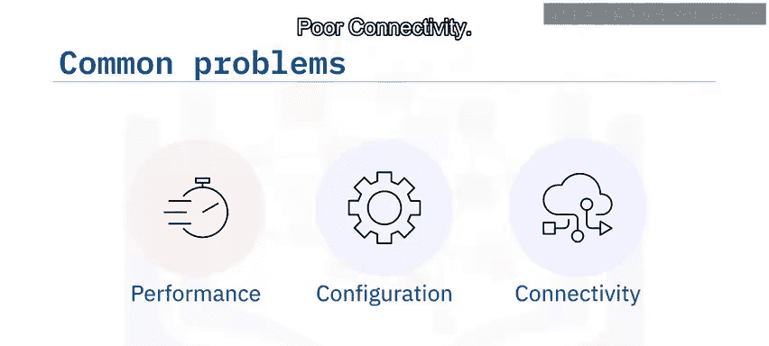

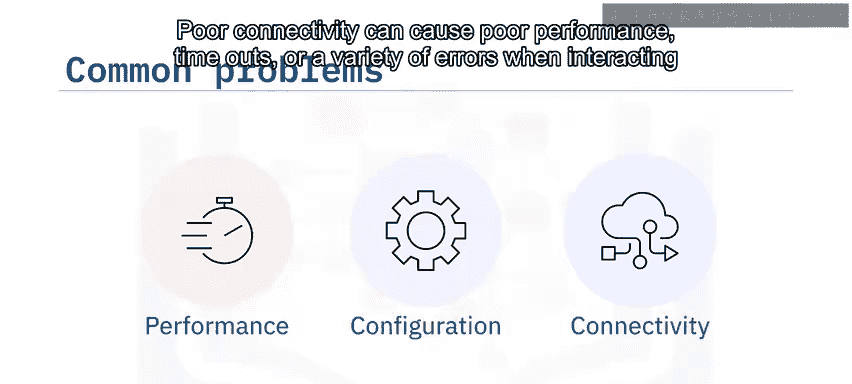

通过系统地回答这些问题，我们可以缩小问题范围，找到根本原因。

---

## 数据库常见问题类型 📉

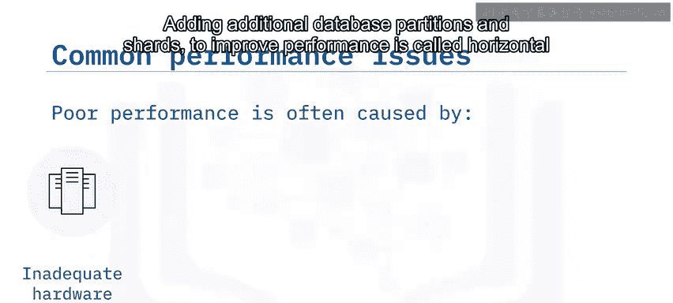

上一节我们介绍了故障排除的基本思路，本节中我们来看看数据库最常见的三类问题。

数据库最常见的问题通常由以下一个或多个原因引起：

*   **性能低下**：这会导致用户查询或访问数据库的应用程序响应缓慢。
*   **配置不当**：客户端、服务器或数据库配置不当会导致各种问题，包括性能低下、崩溃、错误甚至数据库损坏。
*   **连接问题**：连接不畅会导致性能低下、超时或与数据库交互时出现各种错误。

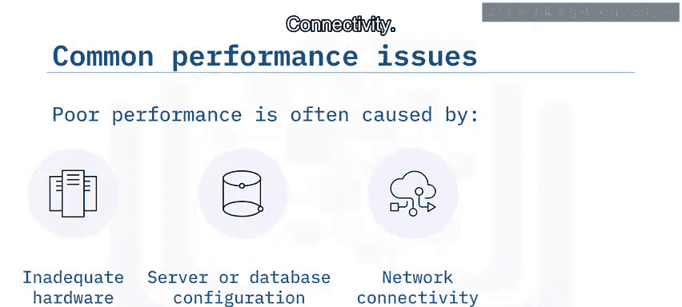

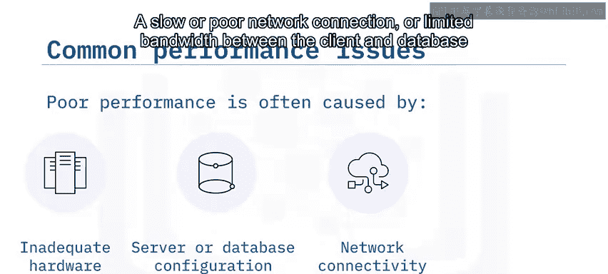

---

## 性能低下问题分析 🐌

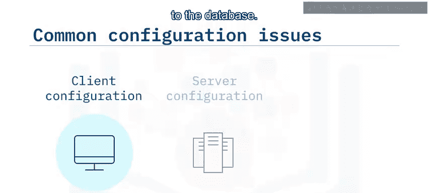

性能低下通常由磁盘读写延迟高、服务器处理时间慢或服务器与客户端之间连接不畅引起。这些问题可能根源于以下几个方面：

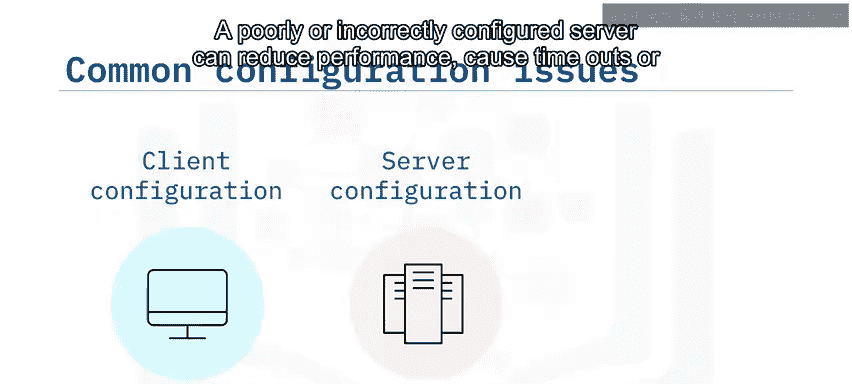

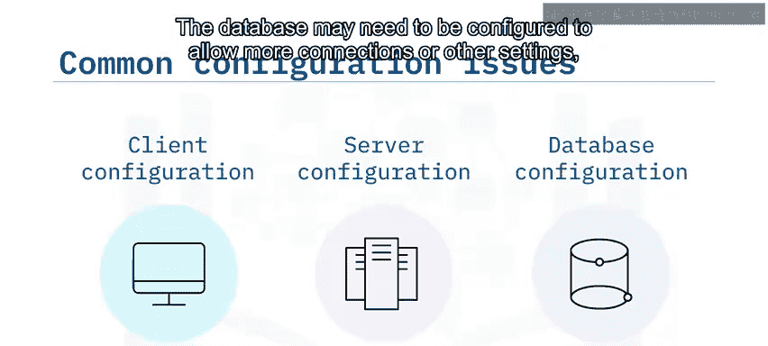

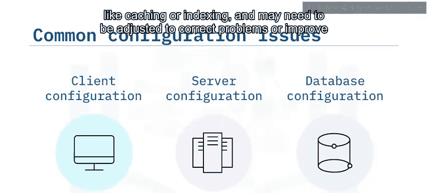

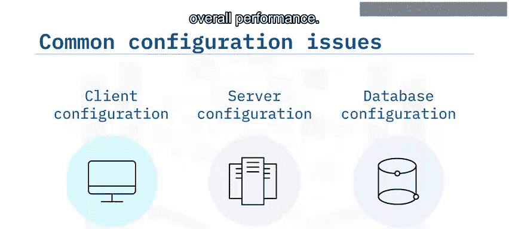

以下是性能问题的常见根源：

1.  **服务器硬件或配置**：例如，服务器可能磁盘空间、内存或处理能力不足。在数据库服务器上增加这些资源称为**垂直扩展**。添加额外的数据库分区和分片以提高性能称为**水平扩展**。
2.  **配置不当**：配置不当的数据库可能仍在运行，但无法满足需求。例如，它可能需要允许更多连接，或者可能需要更改其缓冲和索引设置，以跟上查询速度并快速返回结果。
3.  **连接性**：客户端和数据库之间缓慢或不良的网络连接或有限的带宽会导致高延迟和处理时间。
4.  **查询和应用程序逻辑**：编写不当的数据库查询或不正确的应用程序逻辑（例如不必要地锁定数据库对象）也会导致性能问题。

---

## 配置问题详解 ⚙️

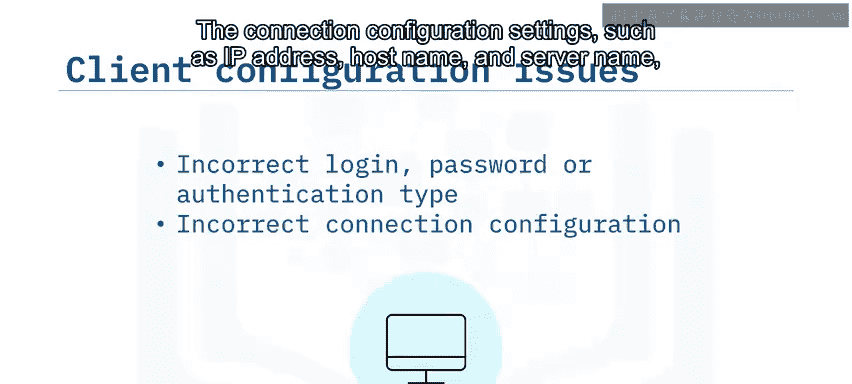

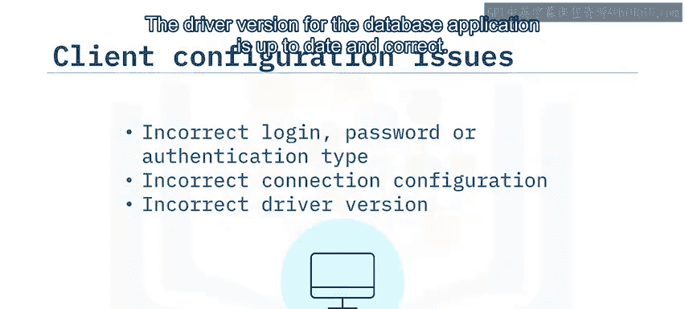

配置不当或未优化的客户端、服务器或数据库可能导致以多种方式显现的无数问题。

以下是配置问题的具体表现和检查点：

*   **客户端配置**：配置错误的客户端或驱动程序可能导致用户无法连接到数据库。常见原因包括：
    *   登录凭据不正确。
    *   主机名或IP地址错误。
    *   连接驱动程序损坏或过时。
    *   要修复这些问题，请检查客户端的驱动程序配置并验证以下内容：
        *   连接设置中指定的用户名和密码正确。确保客户端也配置为使用正确的身份验证类型（例如Windows或SQL身份验证）。
        *   连接配置设置（如IP地址、主机名和服务器名）正确。
        *   数据库应用程序的驱动程序版本是最新且正确的。

*   **服务器配置**：服务器配置也显著影响性能和操作。你可能需要更改或配置以下内容来改善性能或纠正问题：
    *   添加更多物理RAM或增加分配给服务器的内存。
    *   添加更多物理磁盘空间或为服务器分配额外的磁盘空间。
    *   考虑升级CPU或为服务器分配更多处理能力。
    *   考虑对硬盘进行**碎片整理**，碎片化的数据会降低整体性能。
    *   有时，适当配置存储系统可以缓解性能问题，例如将频繁访问的表放在更快的磁盘上。
    *   操作系统或RDBMS软件中的错误可能导致错误和服务器崩溃，因此请确保定期应用软件补丁和安全更新以防止这种情况。

*   **数据库配置**：你需要监控并持续评估数据库的配置，以确保其满足需求。你可能需要更改或纠正的配置设置示例如下：
    *   增加数据库允许的连接数以满足不断增长的需求。
    *   更改数据库缓冲以提高性能。
    *   更改数据库索引以提高性能。

---

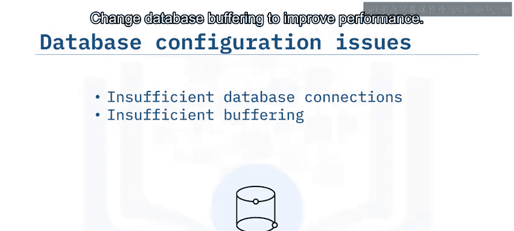

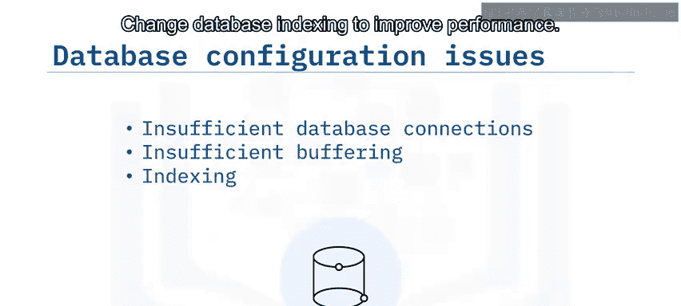

## 连接问题排查 🌐

客户端和数据库服务器之间的连接不畅会导致各种问题，包括性能低下、错误消息或功能丧失。

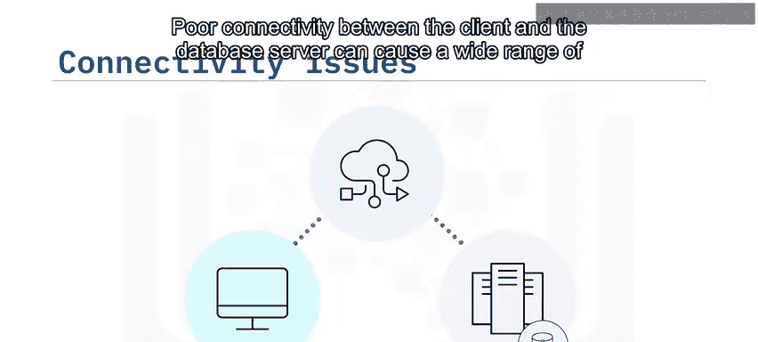

最常见的连接问题通常由以下原因之一引起：

1.  数据库服务器无法访问或未正常运行。
2.  服务器上的数据库实例未正常运行。
3.  客户端登录凭据不正确或缺少安全设置（例如SSL连接）。
4.  客户端配置不正确。

以下是一些帮助排查和解决基本连接问题的常用方法：

*   **验证数据库服务器是否正常运行**：具体步骤取决于你的配置和环境。例如，你可能需要物理检查本地服务器，或者需要验证云服务中的虚拟机是否正在运行。
*   **验证服务器上的数据库实例是否正在运行**：此过程因操作系统和数据库而异。例如，在基于Windows的系统上，你可以使用任务管理器来验证实例是否正在运行；在DB2配置中，你可以运行`db2cmd`，然后在命令行中发出命令。
*   **验证客户端是否可以访问数据库**：一个常见的方法是使用客户端的`ping`命令与服务器的IP地址或主机名通信。
*   **验证客户端连接驱动程序配置是否正确**：例如，确保连接的用户名和密码正确，并且IP地址、主机名或安全加密协议等设置也正确。

---

## 监控与日志工具 📊

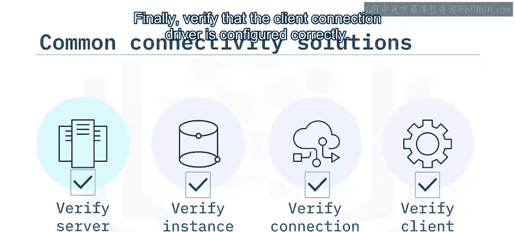

性能监控、报告以及服务器和数据库日志有助于识别性能瓶颈并确定最佳的纠正方法。

以下是关键的工具和它们的作用：

*   **性能监控**：有助于在潜在的网络、服务器和数据库问题发生前识别它们，并帮助确定可以在哪些方面进行改进。
*   **仪表板**：可以实时监控数据库，并在问题影响用户之前提供预警系统，同时跟踪历史性能和其他指标。
*   **服务器和数据库日志**：帮助识别问题及其发生的时间。

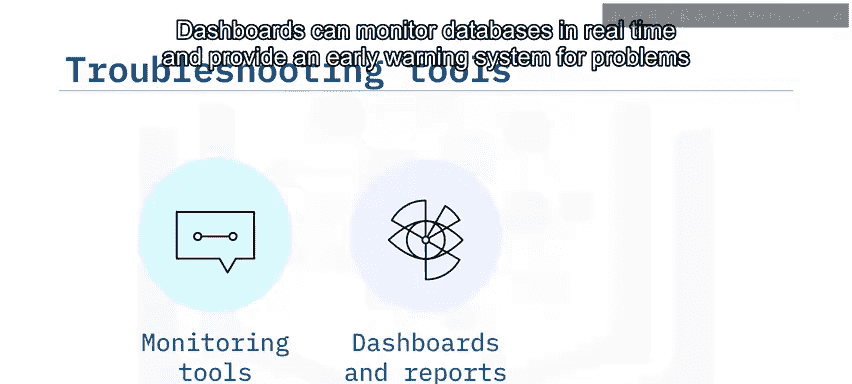

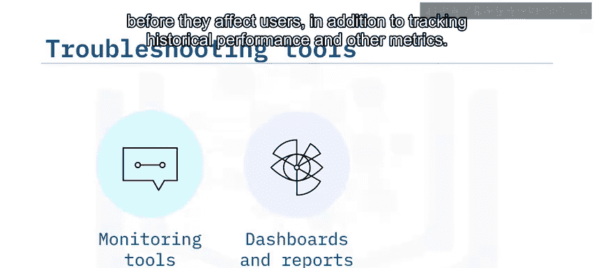

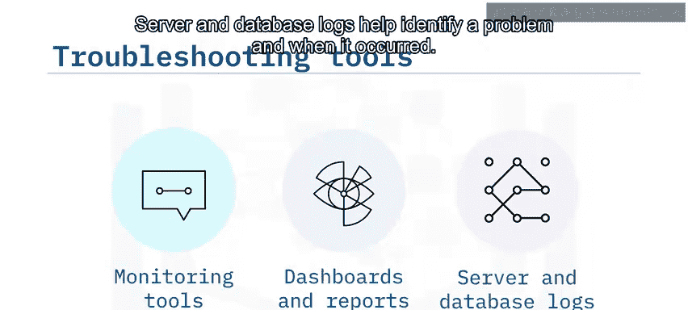

---

## 总结 📝

本节课中，我们一起学习了数据库管理中的常见问题及其解决方法。

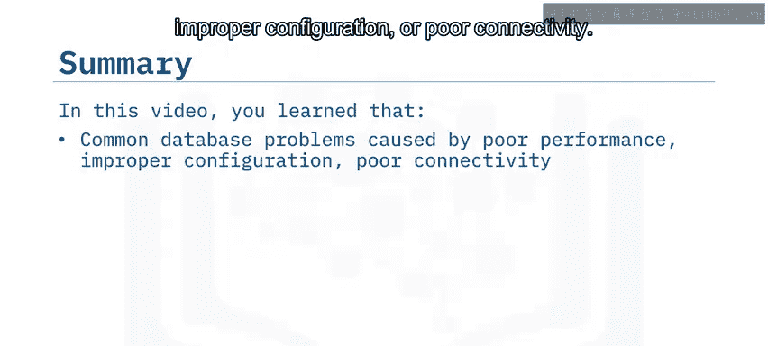

我们了解到，数据库最常见的问题是由性能低下、配置不当或连接问题引起的。性能低下通常由磁盘读写延迟高、服务器处理时间慢或客户端与服务器之间连接不畅引起。服务器配置问题（如硬件资源不足或设置配置错误）会显著影响性能。最常见的连接问题包括无法连接到数据库服务器、数据库服务器或实例未正常运行以及客户端登录凭据不正确。最后，性能监控报告以及服务器和数据库日志可以帮助识别性能瓶颈并确定最佳的纠正方法。