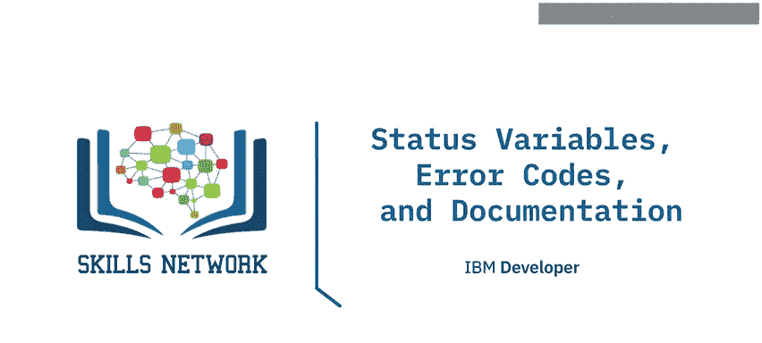
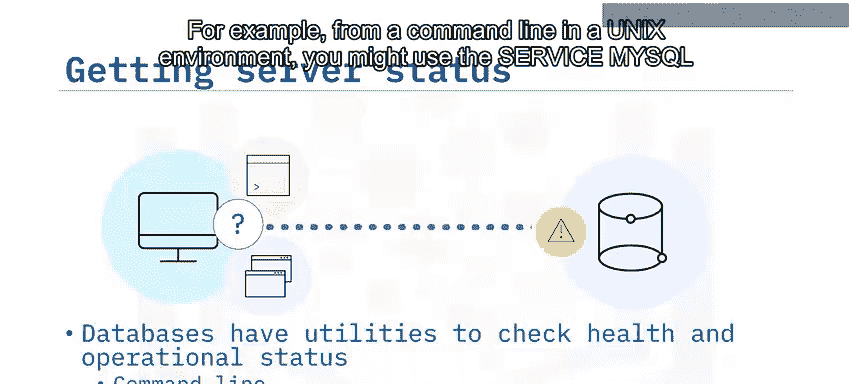
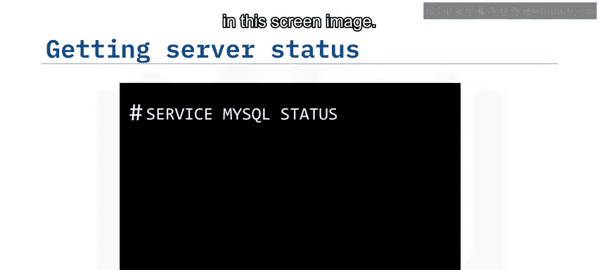
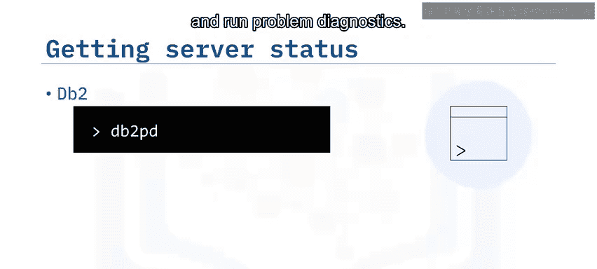
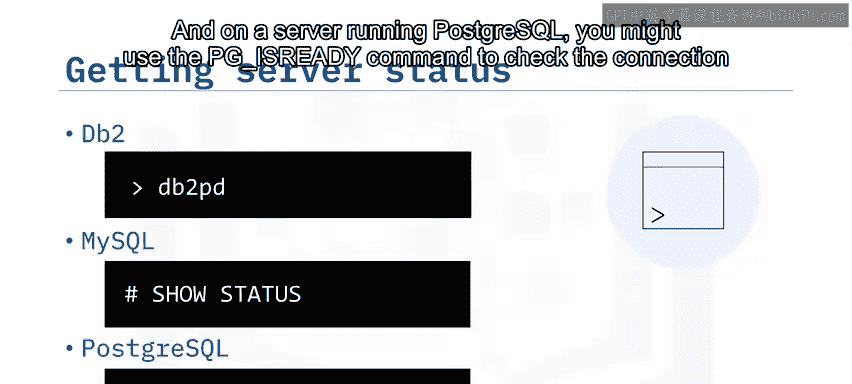
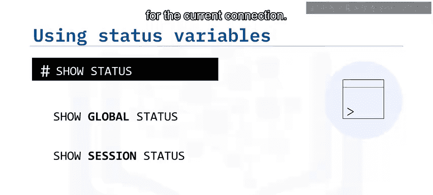
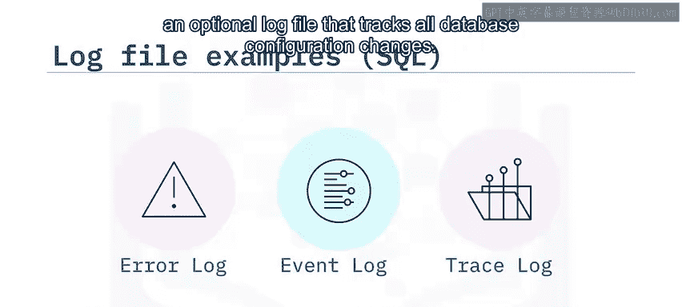
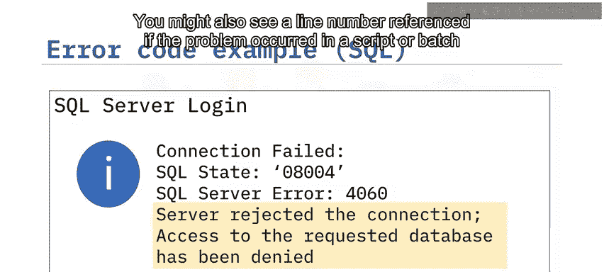
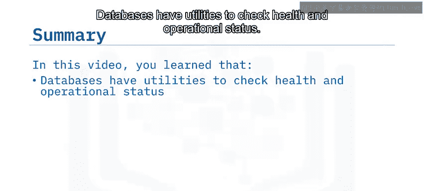

# 021：使用状态变量、错误代码与文档 📚



在本节课中，我们将学习如何获取数据库服务器的状态信息、检索错误代码，并利用官方文档进行故障排查。掌握这些技能是数据库管理员进行日常维护和问题诊断的基础。

## 检查数据库状态 🩺

当数据库出现问题时，首先需要检查其运行状态和健康状况。所有数据库都提供了一系列命令或工具，用于快速获取数据库的运行快照。这些工具可以通过命令行或图形界面访问。

例如，在Unix环境的命令行中，可以使用 `service mysql status` 命令来查看MySQL的状态。



```bash
service mysql status
```



命令输出会显示数据库服务器是“正在运行”还是“正常”，如下图所示。




可用的命令和语法因您使用的数据库（如DB2、MySQL或PostgreSQL）以及运行环境（如Unix或Windows）而异。



以下是不同数据库的示例：
*   在DB2中，可以运行 `db2pd` 命令来监控DB2实例的状态并对数据库进行问题诊断。
*   在MySQL中，可以使用 `SHOW STATUS` 命令来获取服务器状态信息。
*   在运行PostgreSQL的服务器上，可以使用 `pg_isready` 命令来检查PostgreSQL数据库服务器的连接状态。

## 理解状态变量 📊

数据库使用许多状态变量来提供其运行信息。状态变量可以是全局的，也可以是会话级的。

*   **全局状态变量**：代表服务器自身某些方面的状态（例如 `aborted_connects`），或所有连接到MySQL的会话的聚合状态（例如 `bytes_received` 和 `bytes_sent`）。如果变量没有全局值，则会显示会话值。
*   **会话状态变量**（有时称为本地状态变量）：代表当前连接的值。



您还可以在 `SHOW SESSION STATUS` 语句中使用 `LIKE` 子句和模式，来显示匹配特定模式的状态变量信息。

例如，使用以下语句将只显示名称中包含“key”的变量状态：

```sql
SHOW STATUS LIKE ‘key%’;
```

除了命令，许多数据库还提供带有仪表板和报告的图形界面，用于实时监控数据库状态和信息。

例如，在运行于Windows Server上的Microsoft SQL Server中，您可以使用“活动监视器”来获取有关SQL Server进程及其如何影响当前实例的信息，并使用“系统监视器”来验证状态和监控SQL Server性能。

## 利用日志文件定位错误 🔍

有多种日志文件可以帮助您确定错误发生的时间和位置。最常用的是服务器/操作系统日志和数据库错误日志。

*   **服务器/操作系统日志**：记录常规服务器活动、连接性以及运行数据库的服务器本身的其他方面。
*   **数据库错误日志**：记录所操作数据库（如MySQL或PostgreSQL系统）特有的信息和错误。

日志文件是发现错误发生时间及错误描述的重要工具。



例如，在典型的SQL Server中，一些最常访问的日志包括：
*   **错误日志文件**：每次启动SQL Server时创建。
*   **事件日志文件**：显示信息和错误事件。
*   **默认跟踪日志**：一个可选的日志文件，用于跟踪所有数据库配置更改。

## 解读错误代码与消息 📝

无论您是通过日志文件还是直接收到错误消息，很可能都需要解读具体的错误信息和错误代码。



错误消息或记录的错误通常包含可用于故障排除的消息和ID号。它们还可能包含其他信息，例如：
*   导致问题的存储过程名称。
*   错误发生时数据库的状态。
*   额外的描述性信息。
*   问题的严重级别。
*   如果问题发生在脚本或批处理文件中，还可能看到引用的行号。

## 查阅官方文档寻求帮助 🆘

在检查数据库状态并收集信息后，下一步是深入了解您遇到的错误。

互联网上有许多文档和帮助站点，提供了错误代码表，可以帮助您解码和纠正错误。

以下是流行的资源：
*   **IBM DB2**：相关信息可在 [ibm.com/docs/db2](https://www.ibm.com/docs/db2) 找到。
*   **PostgreSQL**：相关信息可在 [postgresql.org/docs](https://www.postgresql.org/docs/) 找到。
*   **Microsoft SQL Server**：相关信息可在 [docs.microsoft.com/sql](https://docs.microsoft.com/sql) 找到。
*   **MySQL**：相关信息可在 [dev.mysql.com/doc](https://dev.mysql.com/doc/) 找到。

## 总结 📋

本节课我们一起学习了数据库故障排查的基础知识。



我们了解到，数据库提供了多种实用程序来检查其健康状况和运行状态，可用命令及其语法因数据库类型而异。数据库使用全局或会话级的状态变量来提供运行信息，并且可能配备带有仪表板的图形界面用于实时监控。有多种日志文件可以帮助定位错误发生的时间和位置。最后，互联网上丰富的官方文档和错误代码表是解码和纠正错误的宝贵资源。掌握这些工具和方法，将使您能够更有效地管理和维护数据库系统。