# 022：用于故障排除的日志 🔍

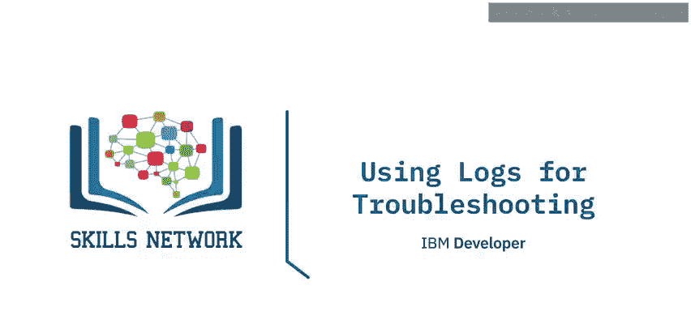

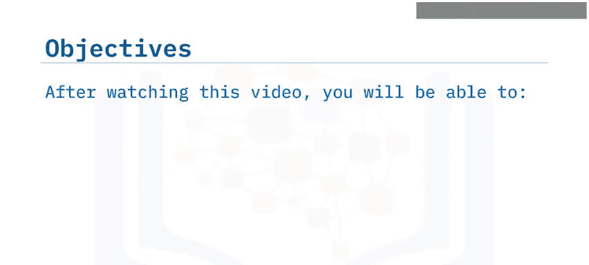

在本节课中，我们将学习诊断日志的概念、用途、类型以及如何访问和利用它们进行数据库故障排除。日志是数据库管理员定位和解决问题的关键工具。

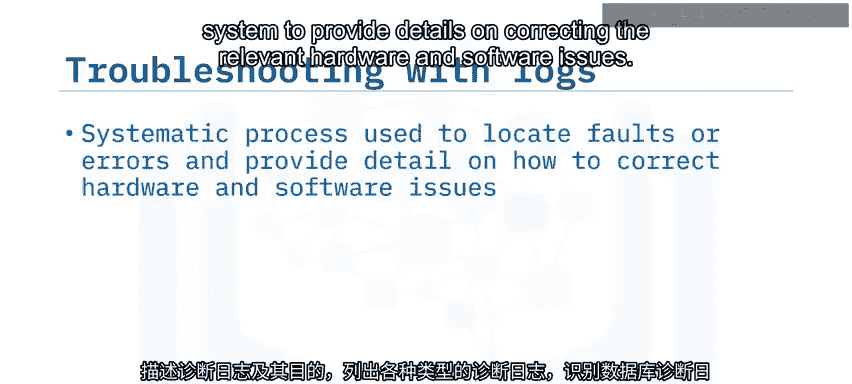

## 概述：什么是故障排除与诊断日志？

故障排除是一个系统性的过程，用于定位计算机系统中故障的原因，并提供纠正相关硬件和软件问题的详细信息。采用逻辑和系统化的方法进行故障排除对于成功解决问题至关重要。创建日志的主要原因之一就是为了故障排除。当问题发生时，你需要诊断它以理解其发生的原因和根源。

诊断日志跟踪系统组件或应用程序（如Web服务器或数据库）中正在发生的情况。它包含有关处理请求时遇到的事件或问题的信息。诊断日志是按时间顺序记录的重要事件和错误的记录，对于诊断和排除问题非常有用。例如，如果Web服务器收到加载缺失文件的请求，此错误及其详细信息可以记录到Web服务器日志中。诊断日志有时也被称为故障排除日志、错误日志或事件日志。必须认识到，它们可能包含事件、信息性消息、警告或错误及其详细信息。

## 诊断日志的类型与内容

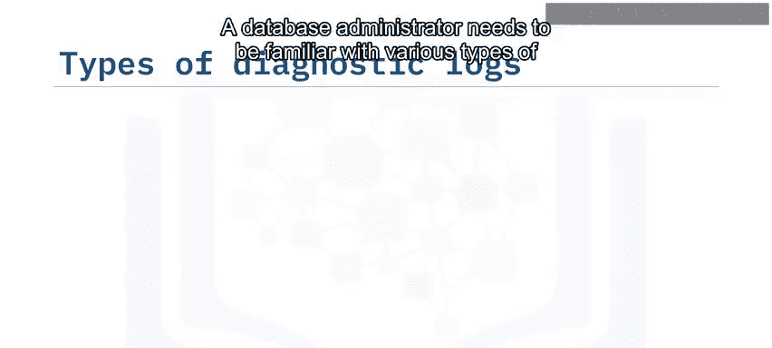

数据库管理员需要熟悉系统中的各种诊断日志类型。这些日志包括服务器组件、存储和其他硬件设备、网络、操作系统、应用程序以及数据库的日志。

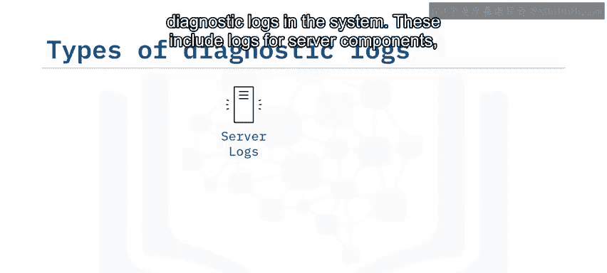

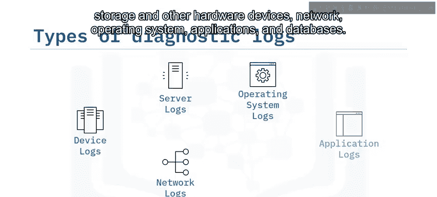

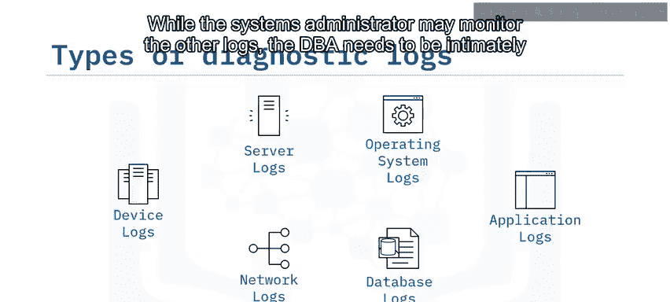

虽然系统管理员可能监控其他日志，但数据库管理员需要非常熟悉数据库诊断日志并经常查看它们。这些数据库诊断日志通常与数据库事务日志或查询日志是分开的。

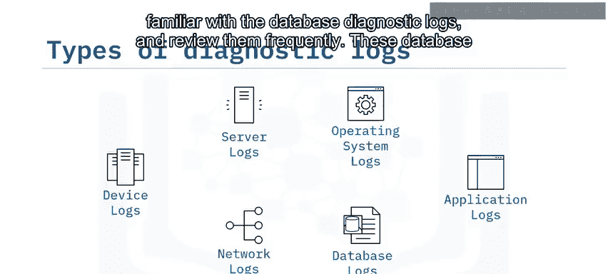

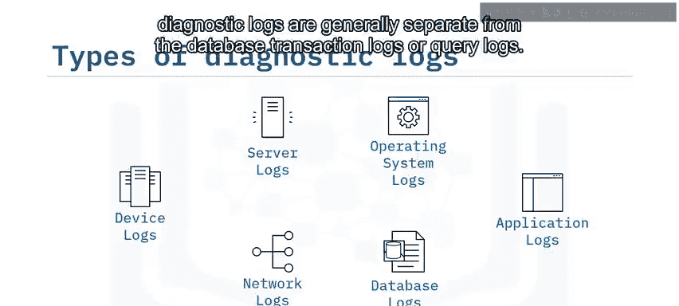

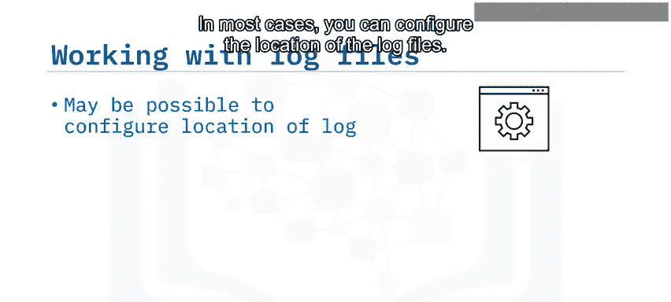

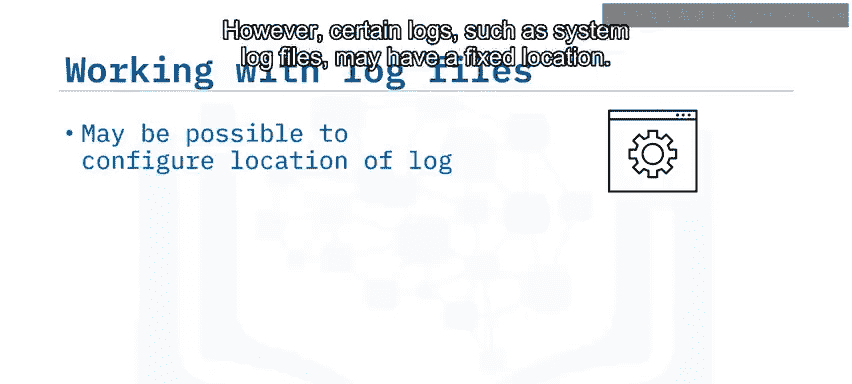

诊断日志可以包含多种信息。诊断日志中消息的一些典型组成部分包括：
*   **问题和严重性类型**：判断是事件、信息、警告还是错误。
*   **对应的错误代码和消息**。
*   **错误发生的位置、URL或子系统**。
*   **时间戳**。
*   **用户的IP地址和用户代理**。
*   **根据事件或错误而定的任何附加信息**。

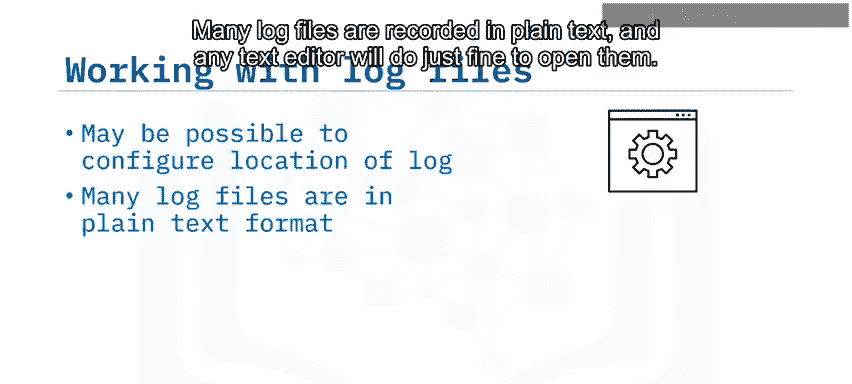

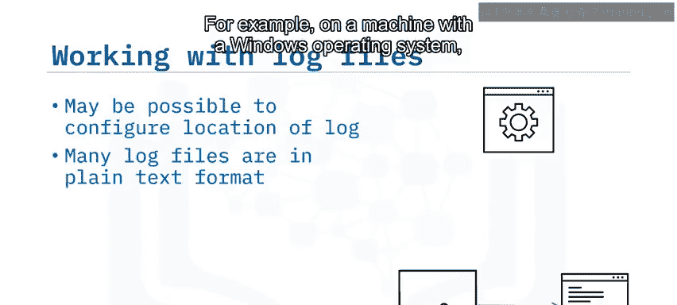

## 日志的存储与访问

在大多数情况下，你可以配置日志文件的位置。然而，某些日志（如系统日志文件）可能具有固定的位置。

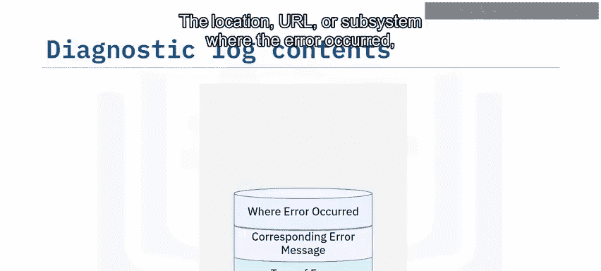

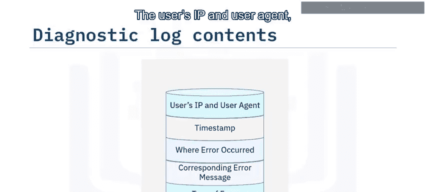

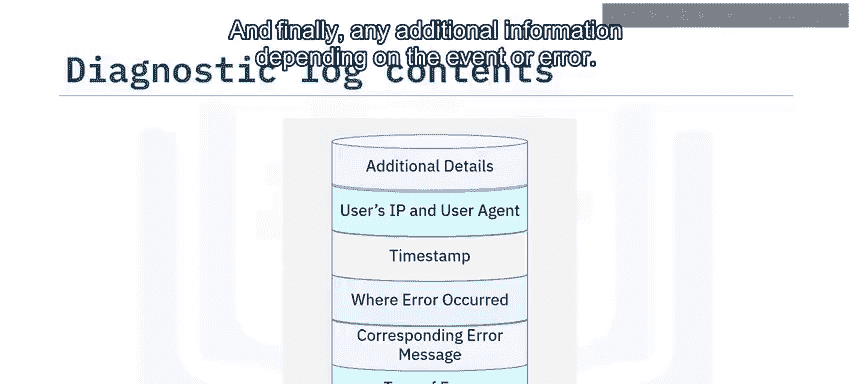

许多日志文件以纯文本格式记录，任何文本编辑器都可以打开它们。例如，在运行Windows操作系统的机器上，双击日志文件默认会使用记事本打开。但是，有些日志文件是机器可读的，可能需要特定的查看器来查看其内容。

## 主流数据库日志配置示例

上一节我们介绍了日志的通用概念，本节中我们来看看不同数据库管理系统中的具体日志配置。

### DB2 日志示例

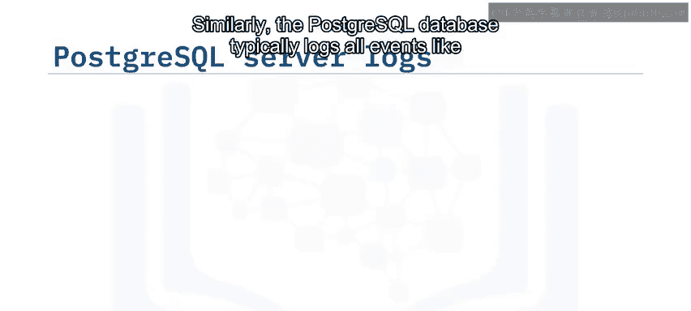

以下是DB2诊断日志文件（称为`DB2DIAG.LOG`）中的一条消息示例，该文件为ASCII或纯文本格式，可以使用文本编辑器查看。它包括消息记录的时间戳、消息类型（在本例中，是通过运行`db2start`命令启动数据库管理器相关的事件），以及诸如DB2软件修复包和操作系统级别、关于系统资源（CPU和内存）信息等附加细节。使用DB2数据库管理器配置，你可以配置DB2诊断日志的位置以及要记录的消息的严重性或诊断级别。

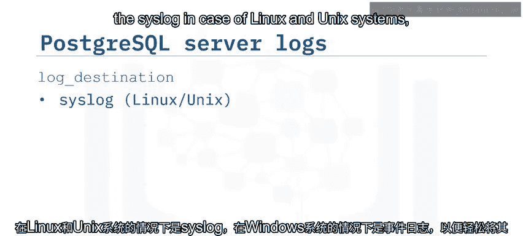

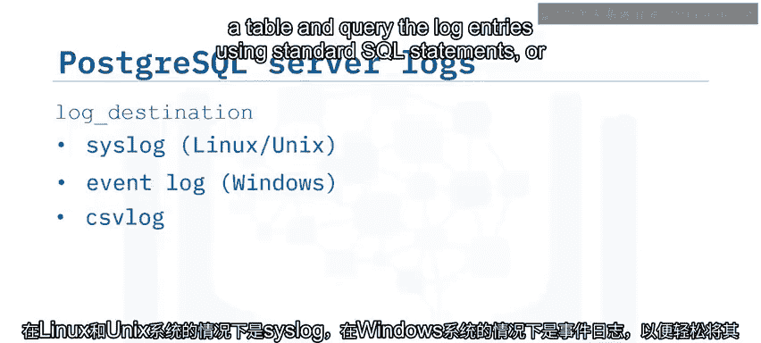

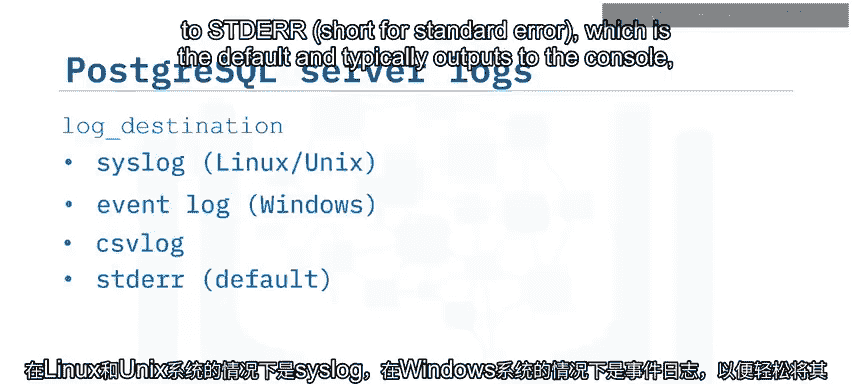

### PostgreSQL 日志配置

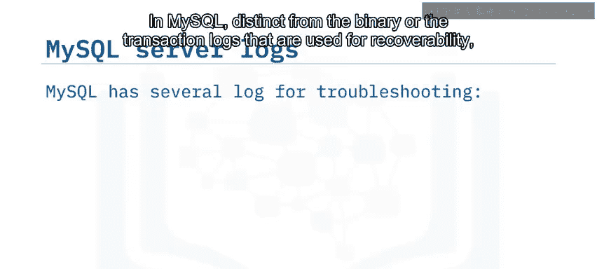

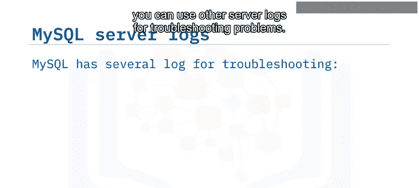

类似地，PostgreSQL数据库通常记录所有事件，如启动和关闭、错误、连接问题等。你可以使用`postgresql.conf`中的`log_destination`参数配置日志条目的存储位置：在Linux和Unix系统的情况下为`syslog`，在Windows系统的情况下为`eventlog`，到一个可以轻松导入表中并使用标准SQL语句查询日志条目的CSV日志文件，或者到`stderr`（标准错误的缩写，这是默认设置，通常输出到控制台）。可以使用`log_directory`参数指定特定位置（默认为`pg_log`）。你还可以选择日志文件名的格式，该格式基于特定的字符串模式命名日志文件，该模式可以包含时间戳。

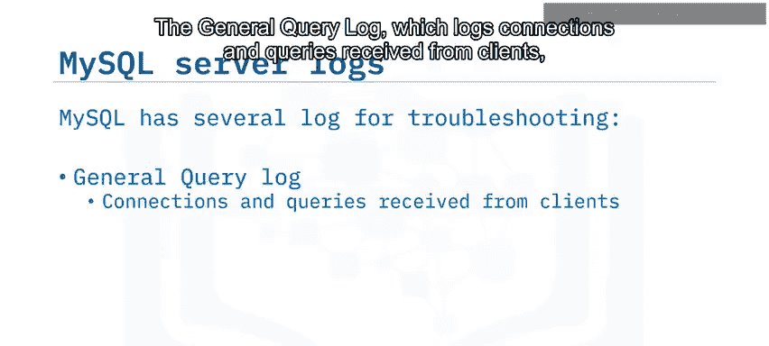

### MySQL 日志类型与配置

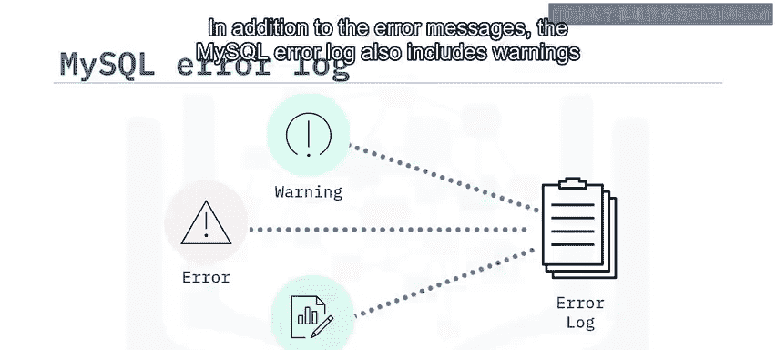

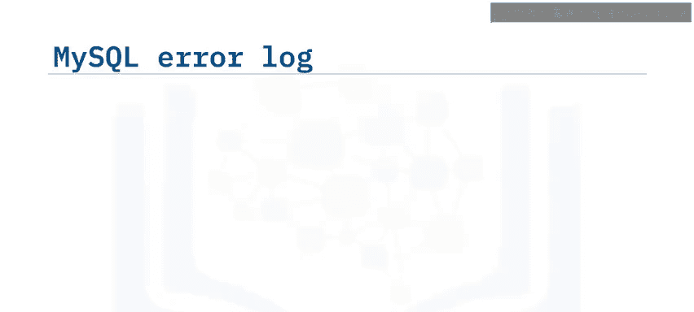

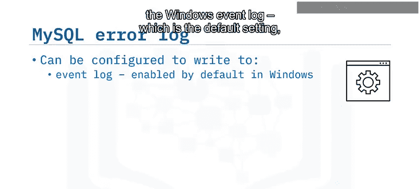

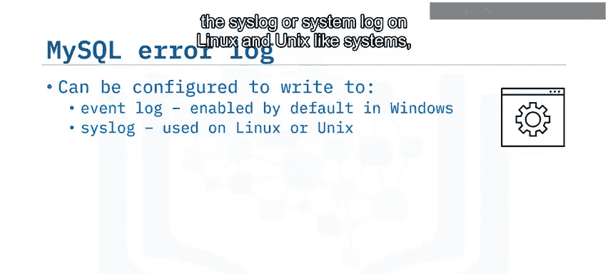

在MySQL中，区别于用于可恢复性的二进制日志或事务日志，你可以使用其他服务器日志进行故障排除。这些日志包括：
*   **通用查询日志**：记录从客户端接收到的连接和查询。
*   **慢查询日志**：顾名思义，记录执行时间超过指定时间的查询。
*   **最重要的是错误日志文件**：包含来自`mysqld`（MySQL守护进程或服务器进程）的诊断和错误消息。

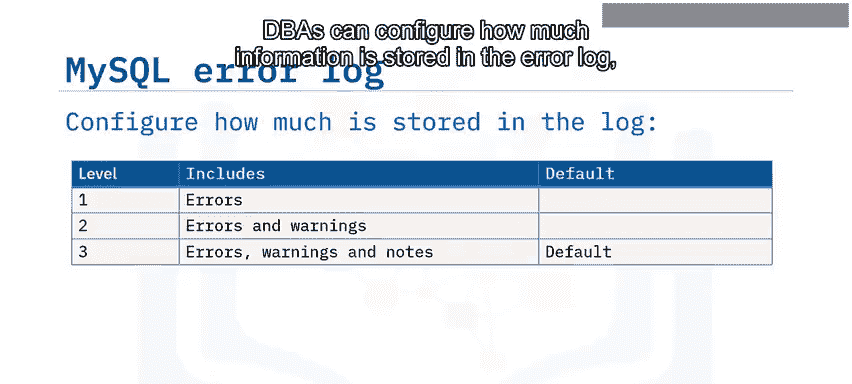

除了错误消息，MySQL错误日志还包括数据库服务器操作、启动和关闭期间的警告和注释。你可以配置MySQL将消息写入Windows事件日志（这是默认设置）、Linux和类Unix系统上的`syslog`或系统日志、`stderr`（标准错误，在Linux和Unix上是默认的）或指定的文件。你可以在`mysqld`或MySQL配置文件中使用`log_error`选项指定记录消息的文件名。

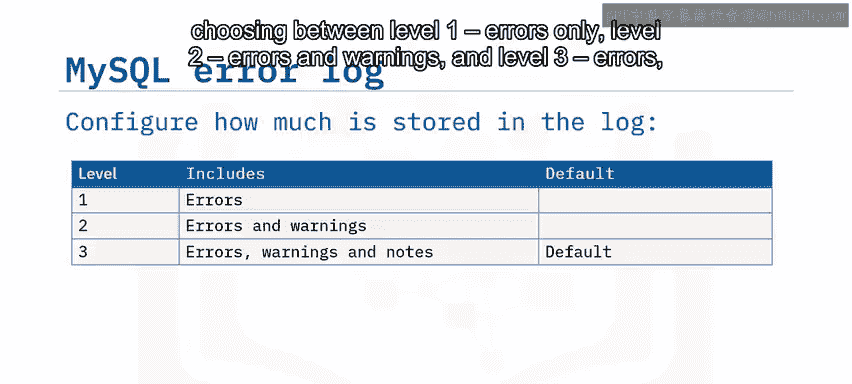

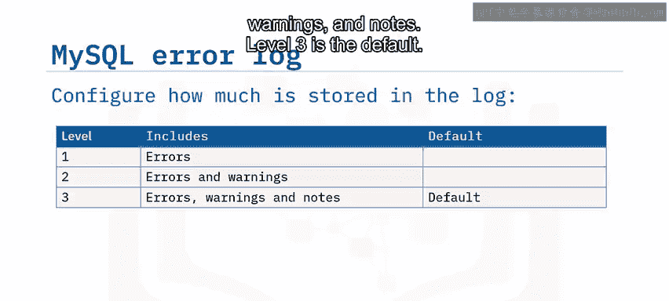

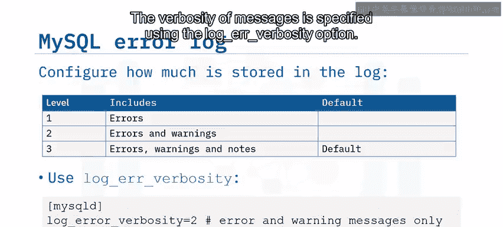

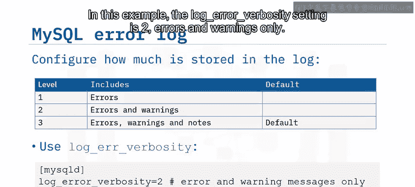

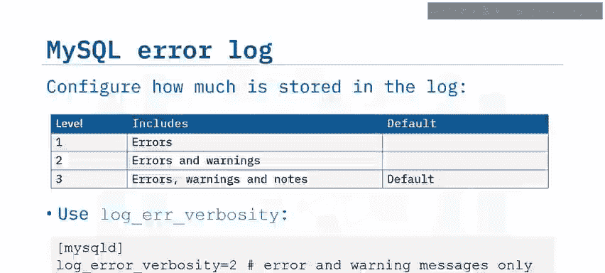

数据库管理员可以配置错误日志中存储多少信息，在级别1（仅错误）、级别2（错误和警告）和级别3（错误、警告和注释）之间选择。级别3是默认值。消息的详细程度使用`log_error_verbosity`选项指定。在此示例中，`log_error_verbosity`设置为2，即仅记录错误和警告。

## 总结

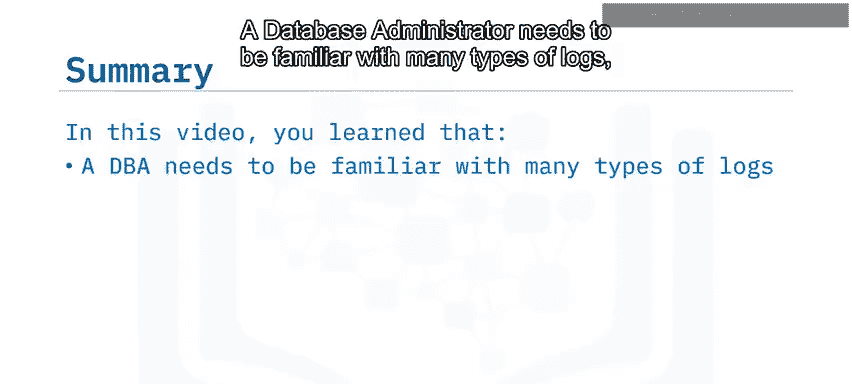

本节课中我们一起学习了数据库管理员需要熟悉多种类型的日志，尤其是数据库诊断日志。数据库诊断日志文件（也称为错误日志或故障排除日志）包含各种类型的信息性事件、警告和错误详细信息的带时间戳的消息。大多数诊断日志是基于文本的，可以在控制台或文本编辑器中查看，但有些可能需要特殊工具或查看器来查看和过滤其内容。大多数数据库提供用于启用和配置诊断及错误日志的设置，例如设置日志文件名和位置以及消息的详细程度。一些数据库（如MySQL）提供不止一种诊断日志，例如错误日志和慢查询日志。掌握日志的使用是进行有效数据库管理和故障排除的基础技能。