# 001：使用Shell、Airflow和Kafka的ETL和数据管道 🚀

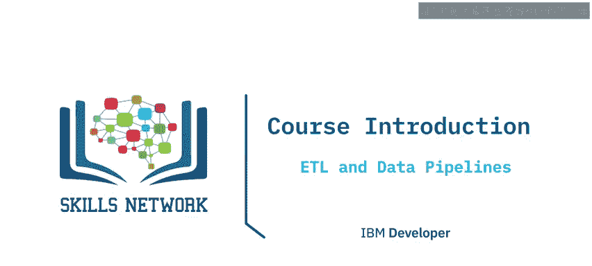

在本课程中，我们将学习如何使用Shell、Airflow和Kafka构建ETL和数据管道。本课程适合有志于成为大数据工程师、机器学习工程师、数据仓库专家以及开发者的学员。你将掌握多种ETL和数据管道工具与技术，包括使用Bash脚本，以及Apache Airflow和Apache Kafka等前沿开源工具，在数据平台的各个系统之间构建用于处理和移动数据的数据管道。每个模块都包含实践实验室，你将通过一个受现实世界启发的最终项目来展示新掌握的技能。

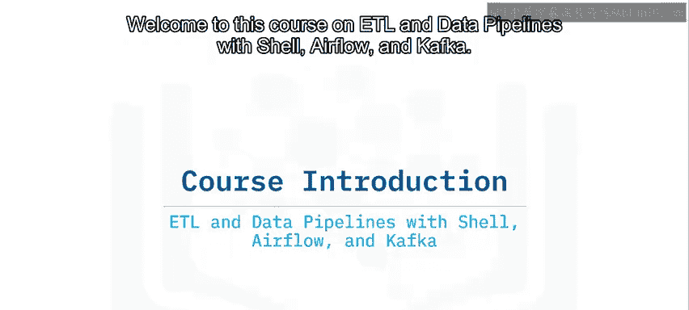

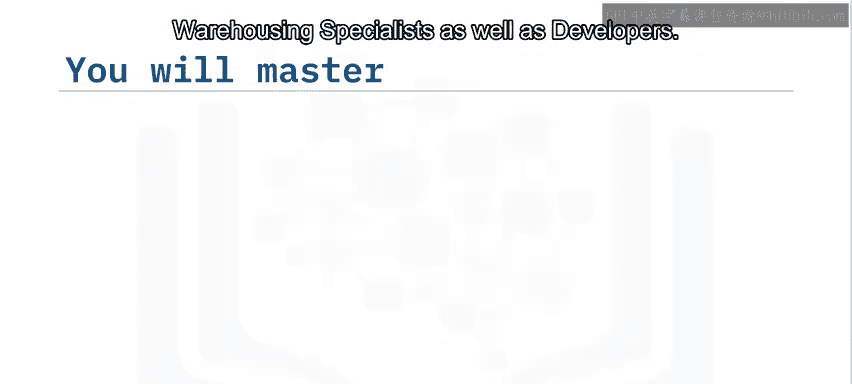

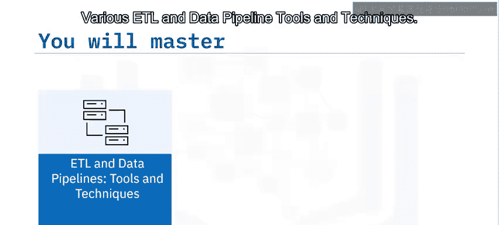

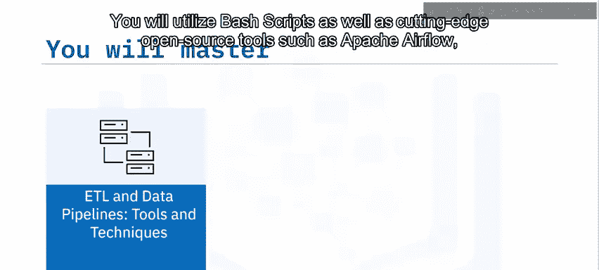

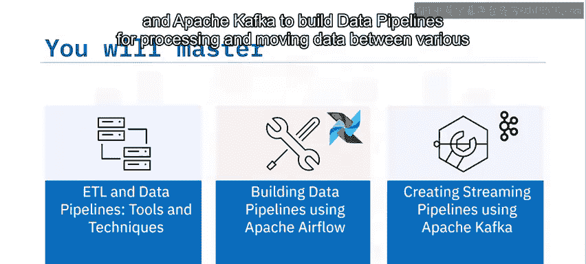

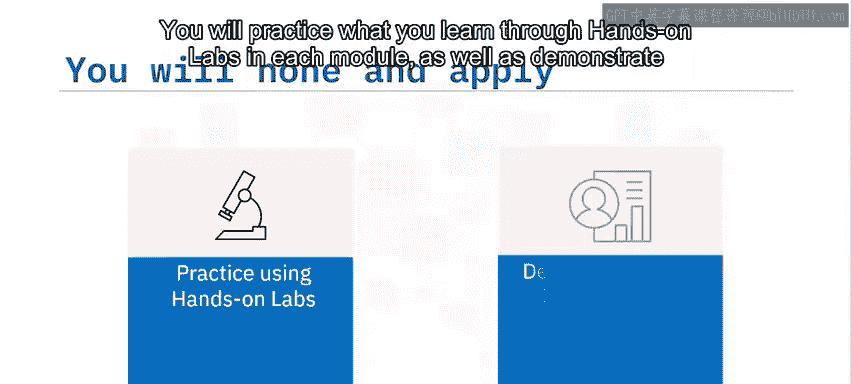

## 课程讲师介绍 👨‍🏫

本课程由四位讲师共同授课：Yanlo、Jeff Grosman、Sabrina Spilner和Rammesh Santi。

*   **Yanlo博士**是IBM加拿大的数据科学家和开发者。他曾在多个领域构建创新的AI和认知应用，例如软件仓库挖掘、个性化健康管理、无线网络和数字银行。他获得了西安大略大学的机器学习博士学位。
*   **Jeff Grosman博士**拥有纯数学、地球物理信号与图像处理、医学成像以及数据科学与工程背景。他是617 Data Solutions Inc.的创始人，并作为主题专家任职于Skill Up Technologies，开发数据相关的教育内容。他还是加拿大阿尔伯塔省Camdia Digital Forum的志愿者兼副会员。
*   **Sabrina Spilner**是Skill Up Technologies的高级教学设计师和内容开发者。在过去的18年里，她一直是一位开拓者，采用新方法和技术来创建创新的学习解决方案。她曾与Orbis、剑桥大学、毕马威英国及毕马威下海湾地区合作。
*   **Rammesh Santi**拥有Bla Institute of Technology Piolai的信息系统学士学位。他在信息技术、基础设施管理、数据管理、信息集成和自动化方面拥有25年的经验。他曾为Intergraph、GenPAact、HCL和微软等公司工作。目前，他是一名自由职业者，并致力于教学，教授数据科学、机器学习、编程和数据库。

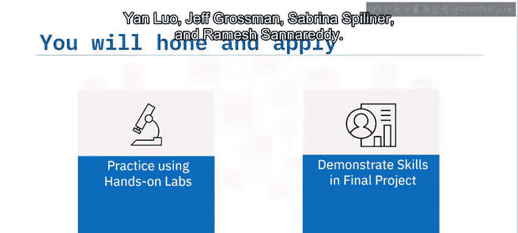

## 课程内容概述 📚

在本课程中，你将探索ETL和ELT流程背后的基本原理和技术。

### 模块1：数据处理技术 🛠️

在模块1中，你将学习数据处理的基础知识。

以下是本模块的核心学习目标：

*   描述什么是ETL管道。
*   描述为什么ELT是一种新兴趋势。
*   定义从ETL到ELT的趋势转变。
*   列举原始数据源的例子。
*   命名数据加载技术。
*   区分批量加载与流式加载。

此外，你将探索如何使用批处理Shell脚本从头开始构建一个基本的ETL数据管道，并探索数据管道工程中两种主要范式（批处理和流式数据管道）的用例。

### 模块2：ETL与数据管道工具和技术 ⚙️

上一节我们介绍了数据处理的基础概念，本节中我们来看看具体的工具和技术。

在模块2中，你将深入学习数据管道的实现。

以下是本模块的核心学习目标：

*   定义如何使用Shell脚本来实现ETL管道。
*   定义什么是数据管道。
*   描述用于缓解数据流瓶颈的数据管道解决方案。
*   区分批处理与流式数据管道。
*   讨论数据管道技术。

你还将通过探索和应用一个名为Kafka的流行开源数据管道工具来进一步巩固这些知识。

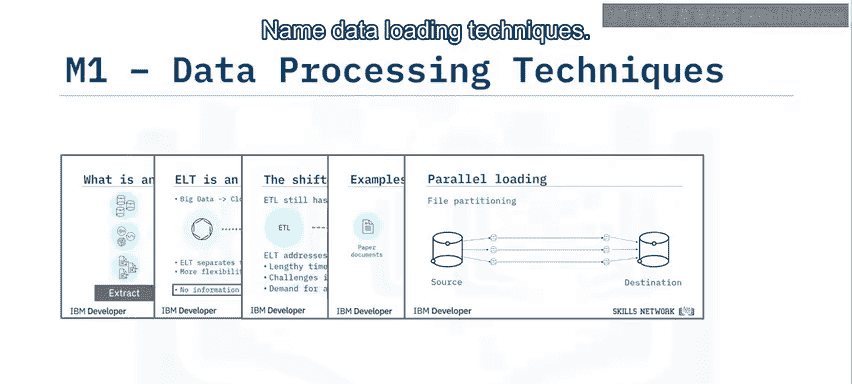

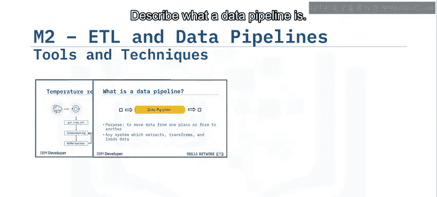

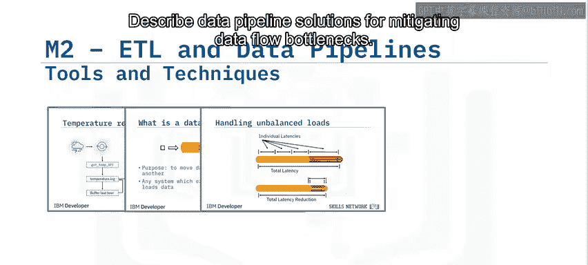

### 模块3：使用Airflow构建数据管道 🪂

了解了基础工具后，我们将进入更高级的编排工具。

在模块3中，你将学习使用Apache Airflow来编排复杂的工作流。

以下是本模块的核心学习目标：

*   列举Apache Airflow的主要原则。
*   将Airflow管道解释为Python脚本，以定义Airflow DAG对象。
*   列举将工作流定义为代码的关键优势。
*   识别你环境中的当前DAG。
*   在任务之间设置依赖关系。
*   使用日志记录功能来监控任务状态并诊断DAG运行中的问题。

### 模块4：使用Kafka构建流式管道 🌊

上一节我们学习了如何编排批处理任务，本节中我们来看看如何处理实时数据流。

在模块4中，你将专注于构建实时数据流管道。

以下是本模块的核心学习目标：

*   列举事件流平台的主要组件。
*   将Apache Kafka识别为一个事件流平台。
*   定义一个端到端的事件流管道示例。
*   描述Kafka Streams API是什么。

### 模块5：最终项目 🏆

最后，你将通过一个综合项目来测试你的实践知识。

你的任务将是完成一个项目，使用Airflow DAG创建一个ETL管道，并使用Kafka构建一个流式ETL管道。

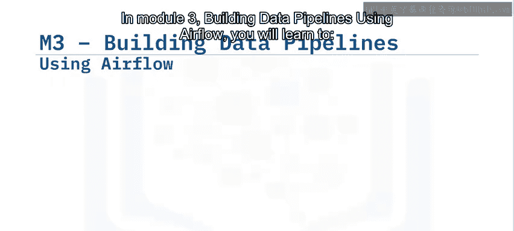

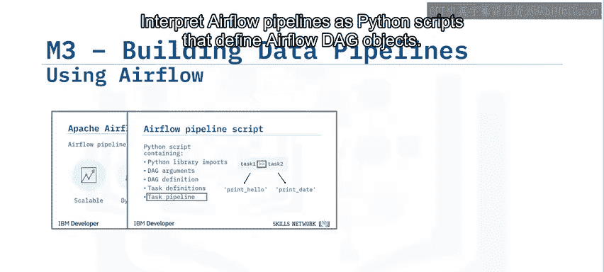

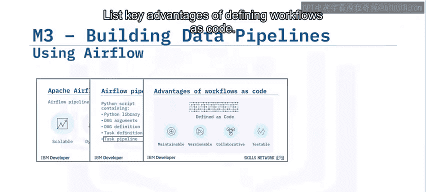

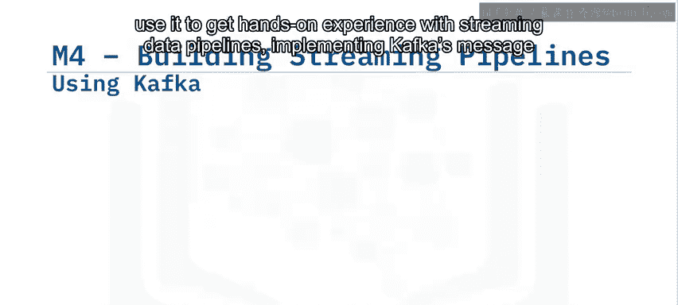

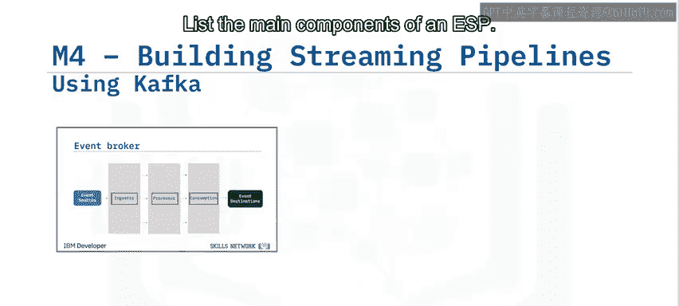

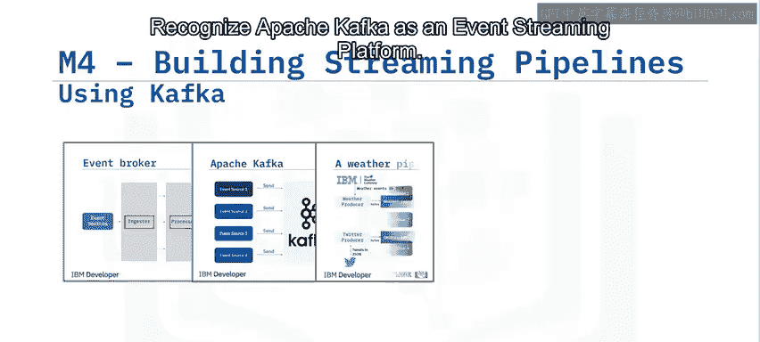

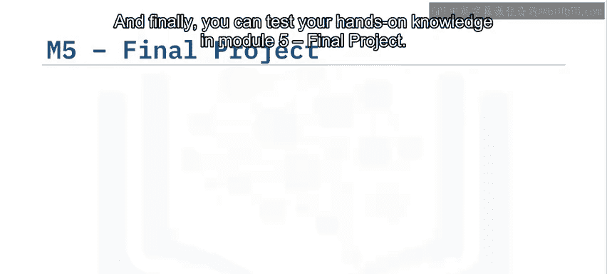

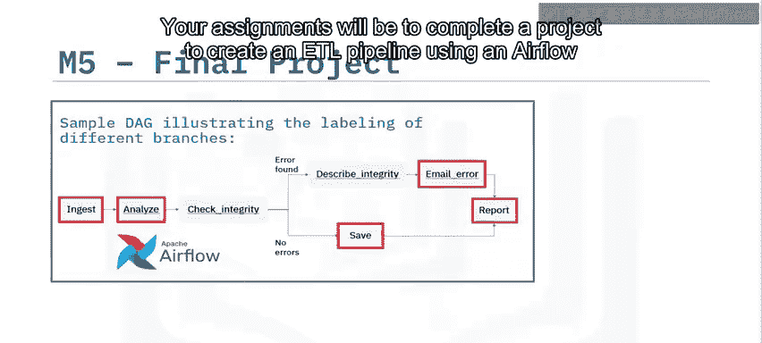

## 学习建议 💡

为了从本课程中获得最大收益，请观看每一段视频并通过完成所有测验来检查学习效果。使用讨论论坛与同学和助教交流。最重要的是，确保你完成实践实验室，以练习新技能并展示你的能力。

祝贺你踏上这段激动人心的旅程的下一步，祝你好运！

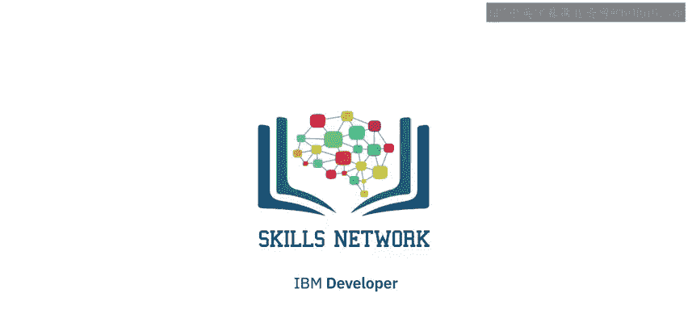

## 总结 ✨

本节课中我们一起学习了《使用Shell、Airflow和Kafka的ETL和数据管道》课程的总体介绍。我们了解了课程目标、四位讲师的背景、五个核心模块的主要内容（从数据处理基础到使用Airflow和Kafka构建复杂的批处理及流式管道），以及最终的综合实践项目。课程强调动手实践，旨在帮助你掌握构建现代数据管道的关键技能。现在，你已经为开始这段学习之旅做好了准备。