# 002：ETL与数据管道基础 🧱

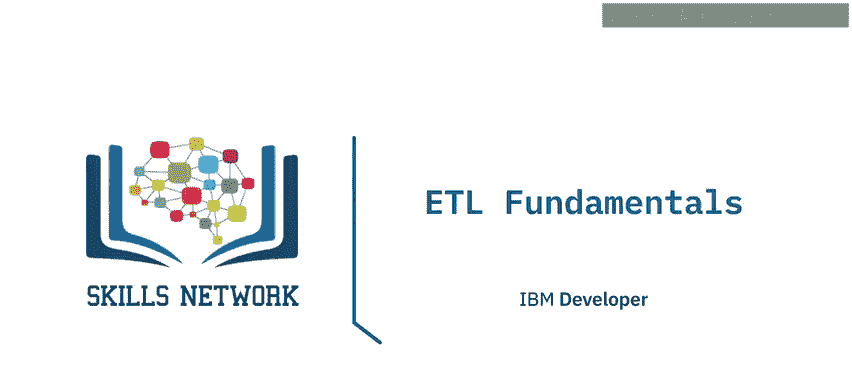

在本节课中，我们将要学习ETL（提取、转换、加载）过程的基础知识。我们将了解ETL是什么，以及它的三个核心阶段：数据提取、数据转换和数据加载各自意味着什么。最后，我们还会探讨ETL管道的常见应用场景。

## 什么是ETL过程？ 🔄

ETL是**提取（Extract）、转换（Transform）、加载（Load）**的缩写。它是一种自动化的数据管道工程方法，通过该方法获取数据并为其在分析环境（如数据仓库或数据集市）中的后续使用做好准备。

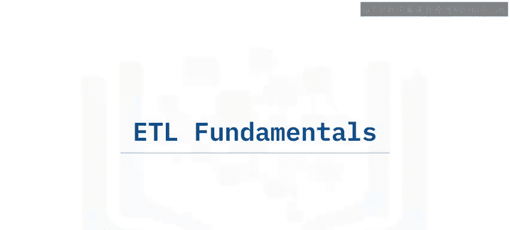

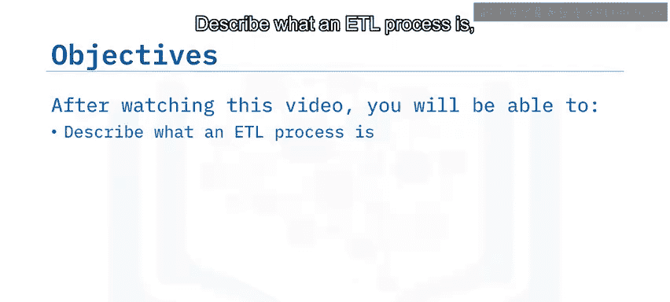

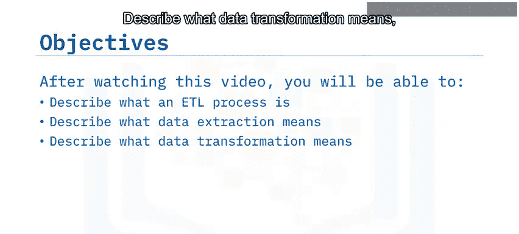

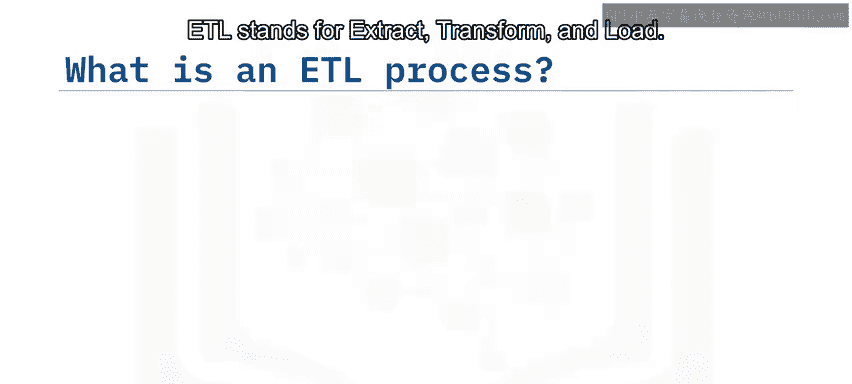

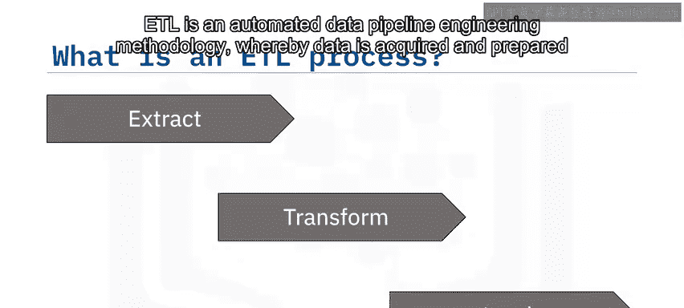

ETL指的是从多个来源整理数据，使其符合统一的数据格式或结构，然后将转换后的数据加载到新环境中的过程。

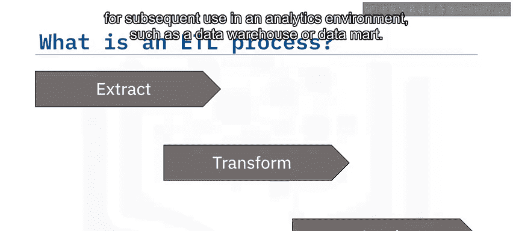

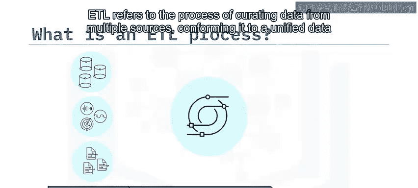

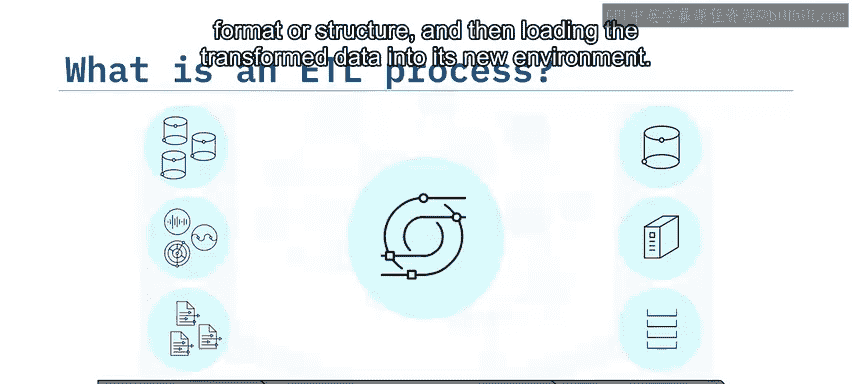

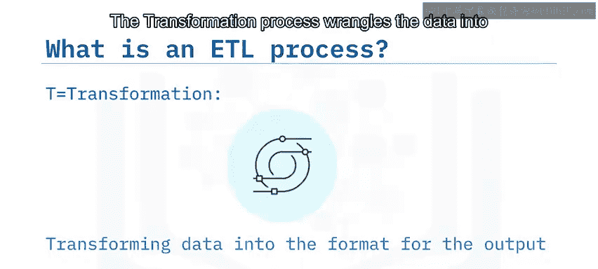

*   **提取过程**从一个或多个来源获取或读取数据。
*   **转换过程**将数据整理成适合其**目标环境**和**预期用途**的格式。
*   最后的**加载过程**将转换后的数据加载到其新环境中，为可视化、探索、进一步转换和建模做好准备。整理后的数据也可用于支持自动化和决策制定。

## 什么是数据提取？ 📥

提取数据意味着配置对数据的访问权限，并将其读入应用程序。这通常是一个自动化过程。

以下是数据提取的一些常见方法：
*   **网络爬取**：使用Python或R等应用程序解析底层HTML代码，从网页中提取数据。
*   **使用API**：通过编程方式连接到数据并进行查询。

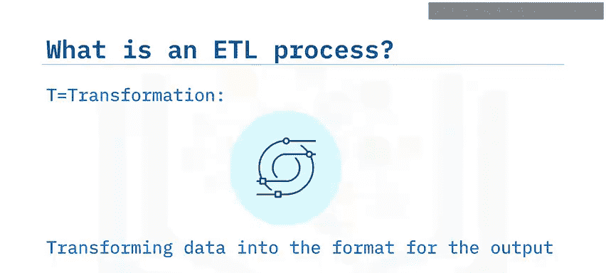

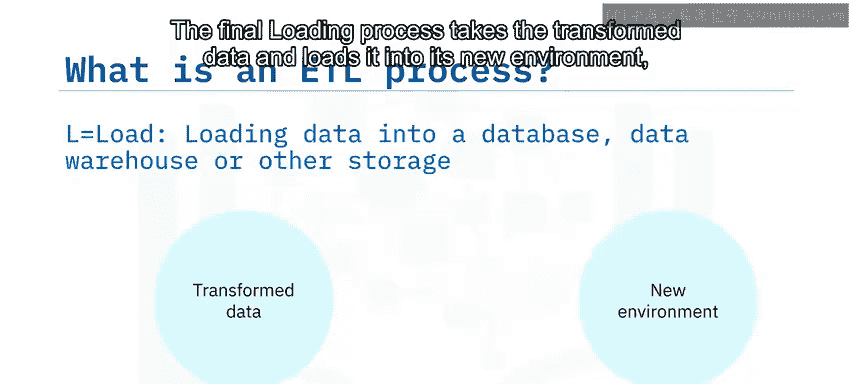

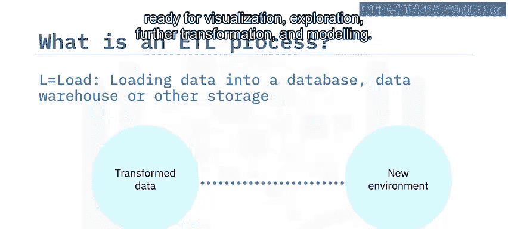

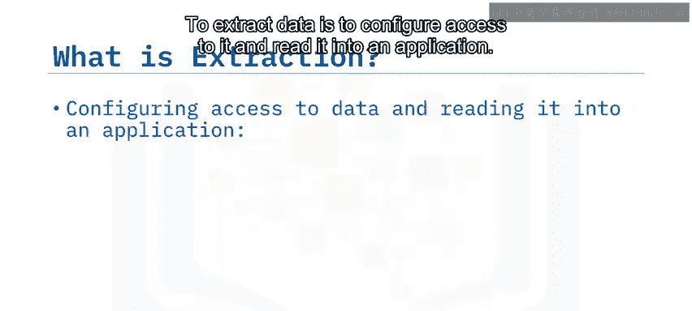

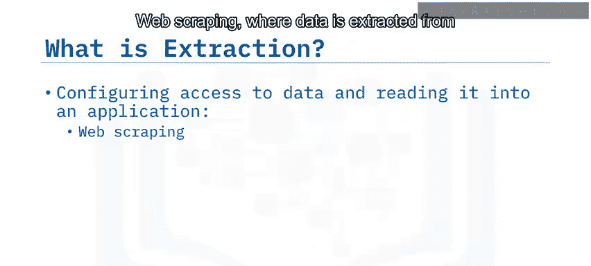

源数据可能是相对静态的，例如数据存档，在这种情况下，提取步骤将是批处理流程中的一个阶段。另一方面，数据也可能是实时流式传输的，并且来自许多位置。例子包括气象站数据、社交网络信息流和物联网设备数据。

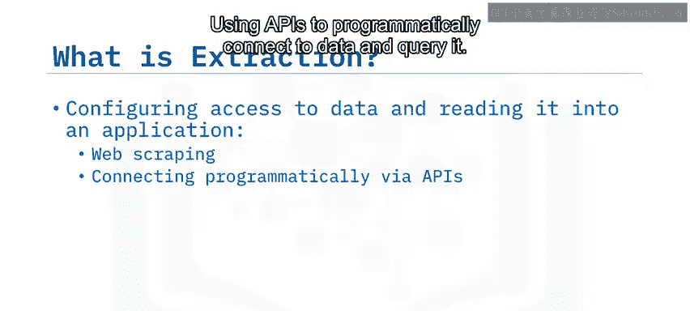

## 什么是数据转换？ 🛠️

数据转换，也称为数据整理，是指处理数据以使其符合目标系统和整理数据预期用例的要求。

转换可以包括以下任何一种处理过程：
*   **数据清洗**：修复错误或填补缺失值。
*   **数据过滤**：仅选择所需的数据。
*   **数据连接**：合并来自不同来源的相关数据。
*   **特征工程**：例如为仪表板或机器学习创建关键绩效指标。
*   **格式化和数据类型转换**：使数据与其目标环境兼容。

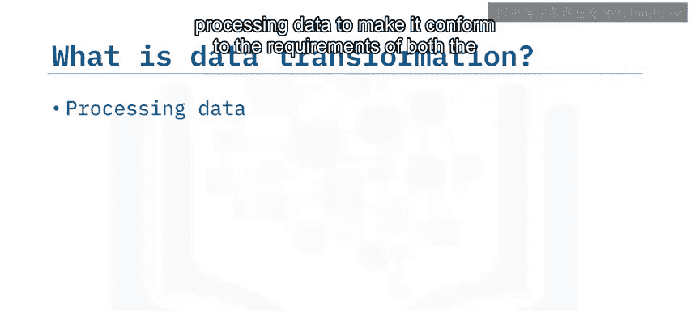

## 什么是数据加载？ 📤

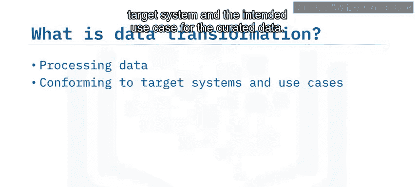

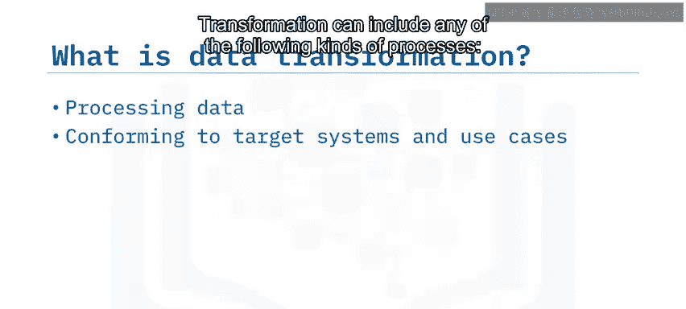

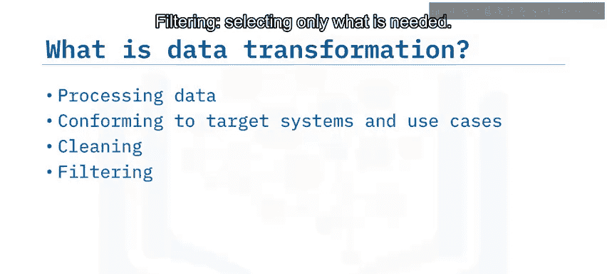

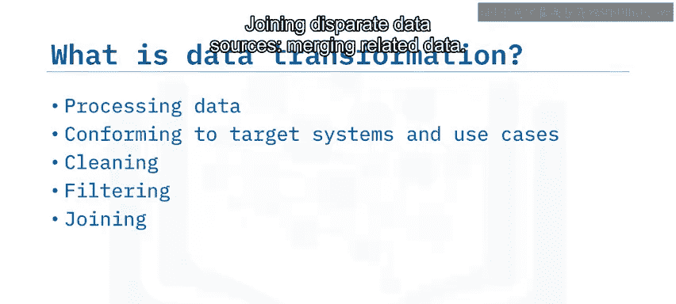

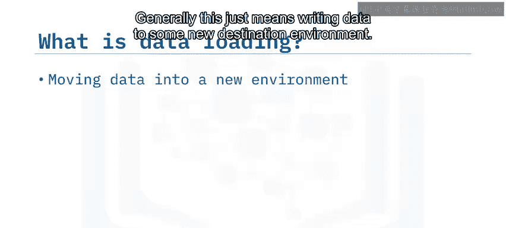

数据加载通常意味着将数据写入某个新的目标环境。典型的目标包括数据库、数据仓库和数据集市。

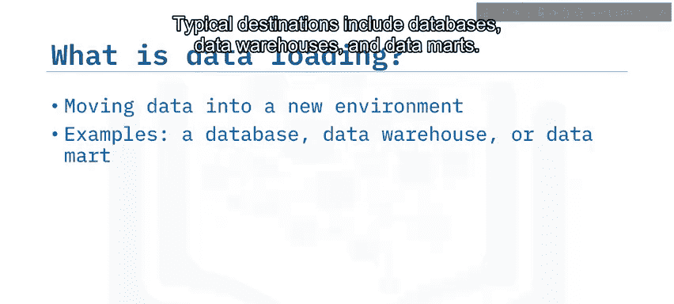

数据加载的关键目标是使数据能够随时被分析应用程序**摄取**，以便最终用户能够从中获得价值。这些应用程序包括仪表板、报告以及高级分析（如预测和分类）。

## ETL管道的应用场景 📊

ETL管道有许多应用场景。有大量信息要么已被记录，要么正在生成，但尚未被捕获或作为数字文件访问。例子包括纸质文档、照片和插图以及模拟音频和录像带。数字化模拟数据包括通过某种形式的扫描进行提取、模拟到数字的转换，最后存储到存储库中。

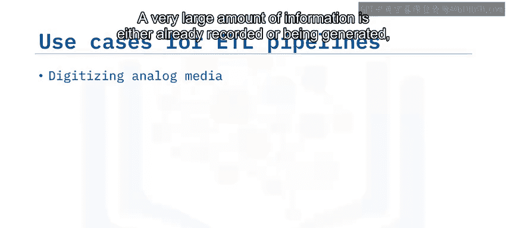

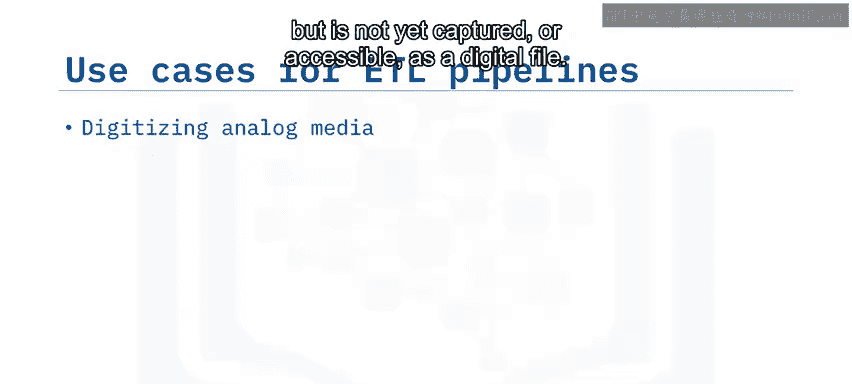

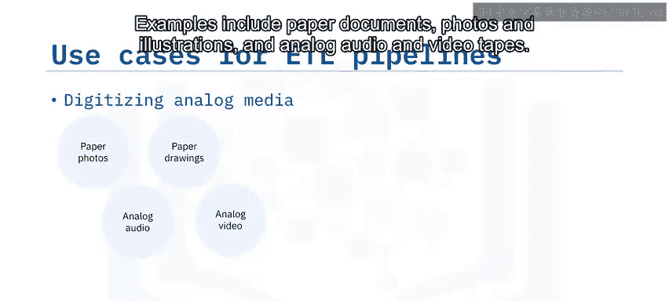

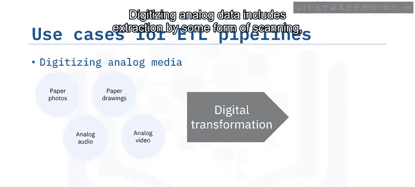

在线事务处理系统不保存历史数据。因此，ETL过程捕获交易历史，并为其在在线分析处理系统中的后续分析做好准备。

其他应用场景包括：
*   从数据源中**设计特征或关键绩效指标**，为运营、销售和市场营销、客户和高管使用的仪表板摄取数据做准备。
*   **训练和部署机器学习模型**，用于预测和增强决策制定。

## 总结 📝

本节课中，我们一起学习了ETL的基础知识。

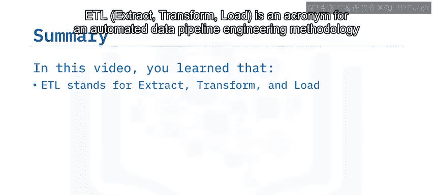

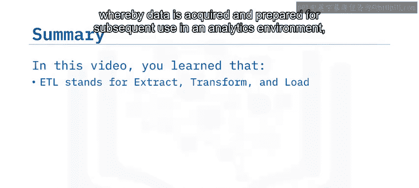

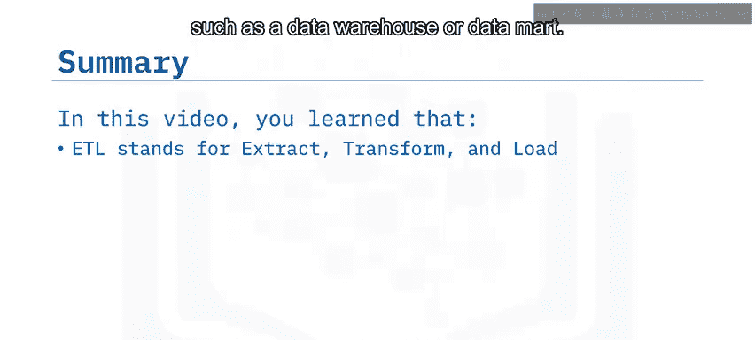

我们了解到，ETL是一种自动化的数据管道工程方法，用于获取数据并为其在分析环境中的使用做好准备。其核心是三个步骤：**提取**数据、**转换**数据以符合目标要求，以及**加载**数据到新环境。

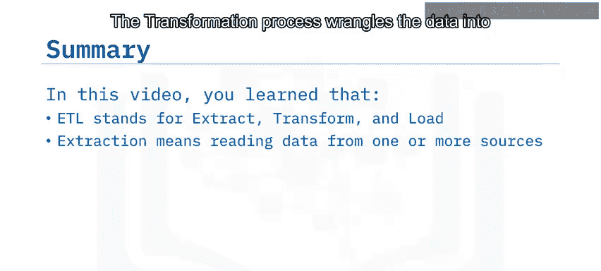

最后，ETL用于整理数据并使其可供最终用户访问，例如训练和部署用于预测和增强决策制定的机器学习模型。