# 003：ELT基础知识

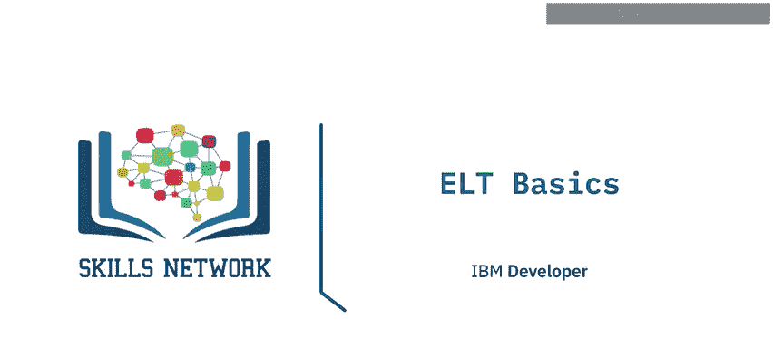

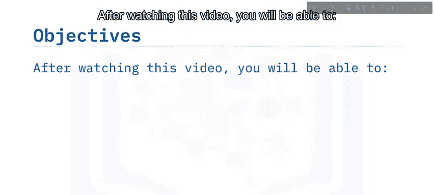

在本节课中，我们将要学习**ELT**（提取、加载、转换）流程的基础知识。我们将了解ELT是什么，它与ETL的区别，以及它为何在现代数据工程中成为一种新兴趋势。

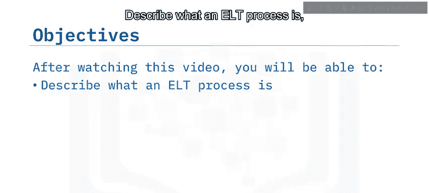

## 什么是ELT流程？🔍

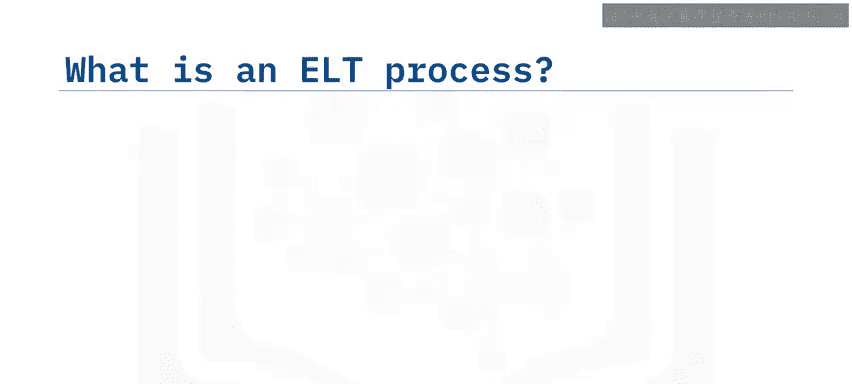

上一节我们介绍了数据管道的基本概念，本节中我们来看看ELT流程的具体定义。

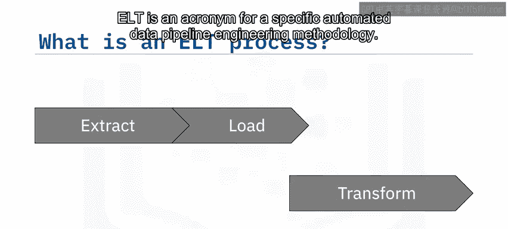

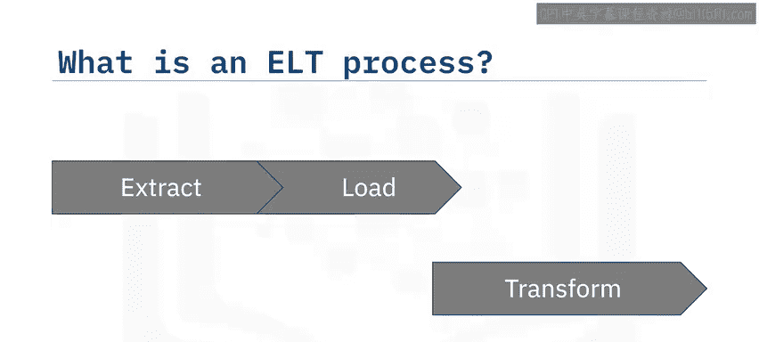

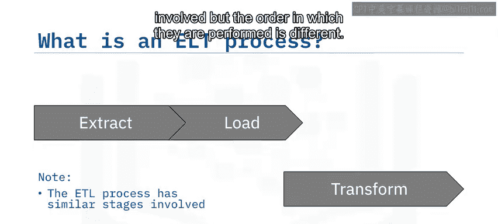

**ELT** 是 **提取（Extract）、加载（Load）、转换（Transform）** 的缩写。它是一种特定的自动化数据管道工程方法。

ELT与ETL类似，都涉及相似的阶段，但**执行顺序不同**。

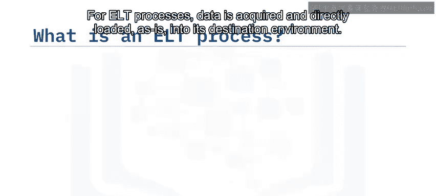

## ELT流程详解 ⚙️

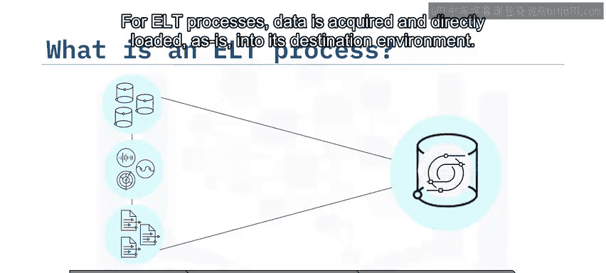

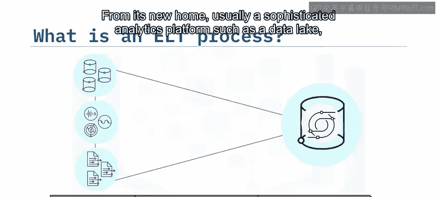

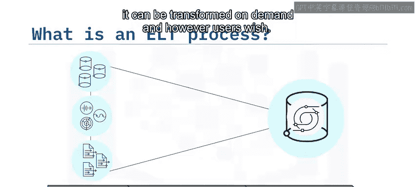

了解了ELT的基本定义后，我们来详细分解它的三个核心阶段。

对于ELT流程，数据被获取后，会**直接以其原始形式**加载到目标环境（通常是像数据湖这样的复杂分析平台）中。然后，数据可以根据用户的需求按需进行转换。

*   **提取阶段**：此过程从所有数据源获取数据，并通常以异步方式将数据读入应用程序。
*   **加载阶段**：此过程获取原始数据，并将其**原样**加载到新的环境中，之后现代分析工具可以直接使用这些数据。
*   **转换阶段**：ELT的转换过程比传统的ETL**动态得多**。目标环境中的现代分析工具支持对数据进行交互式、按需的探索和可视化，包括建模和预测等高级分析。

## ELT的适用场景 📈

现在我们已经清楚了ELT的工作流程，接下来看看它在哪些场景下最能发挥优势。

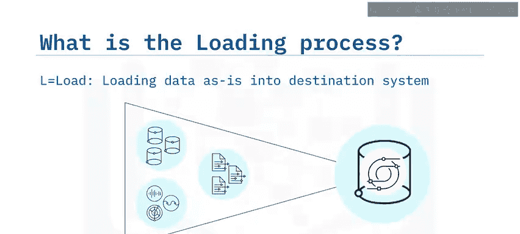

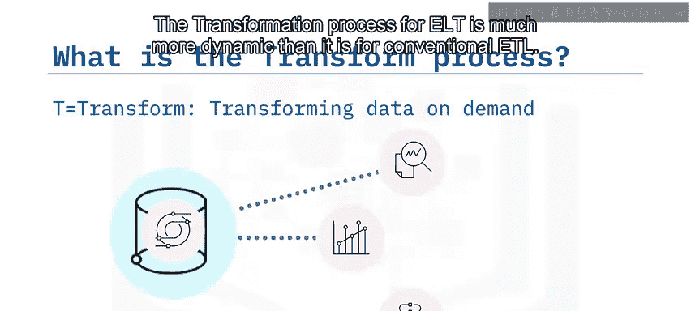

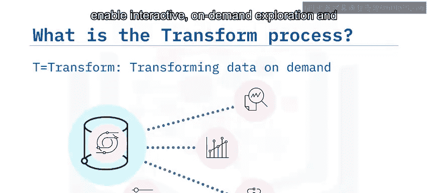

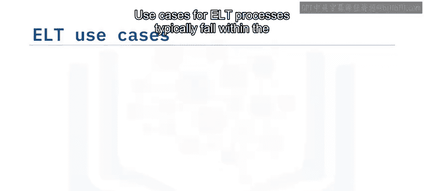

ELT流程的典型用例通常属于**高性能计算和大数据领域**。

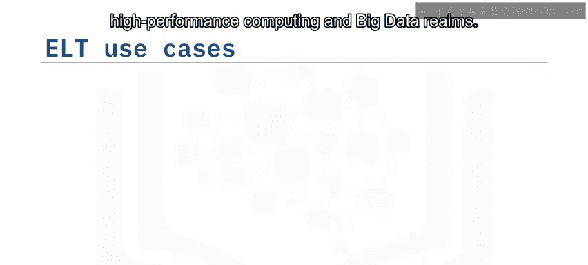

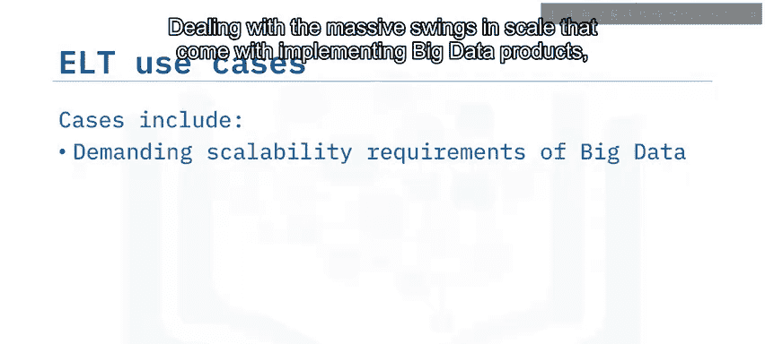

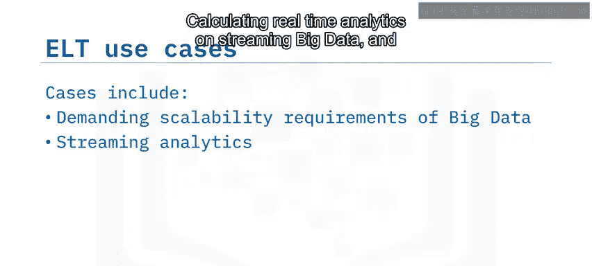

以下是ELT的主要应用场景：
*   处理实施大数据产品时带来的**大规模波动和扩展**。
*   对海量流数据进行**实时分析计算**。
*   整合**全球范围内高度分布式**的数据源。

在速度方面，**移动数据通常比处理数据更易成为瓶颈**，因此移动得越少越好。所以，当你想从相同的数据源灵活构建一系列数据产品时，ELT可能是最佳选择。

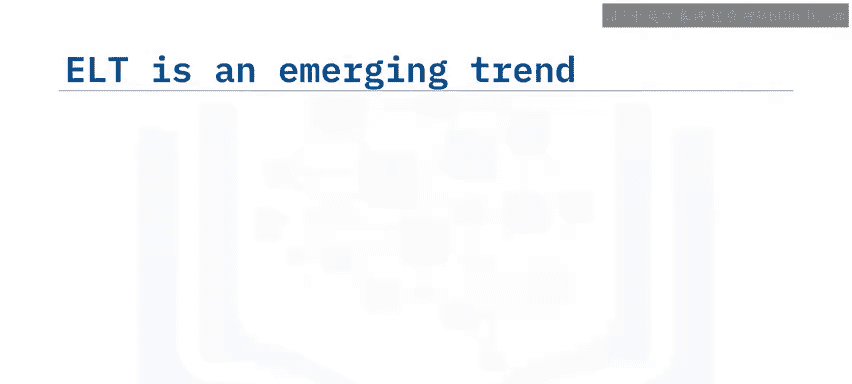

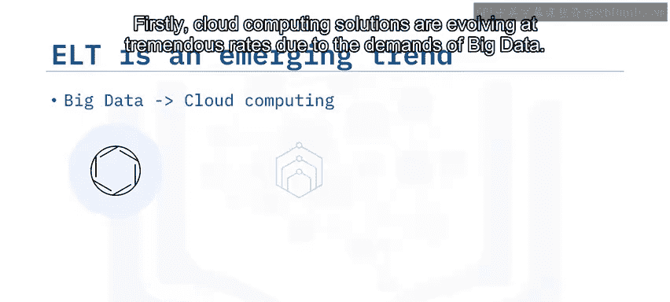

## ELT为何成为新兴趋势？☁️

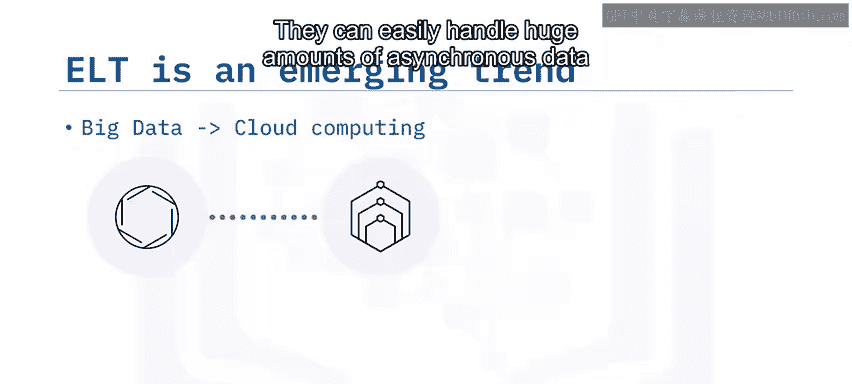

我们看到了ELT的诸多优势，那么推动它成为趋势的背后力量是什么呢？主要是云计算的发展。

首先，由于大数据的需求，**云计算解决方案正在以惊人的速度发展**。它们可以轻松处理海量的异步数据，这些数据可能分布在世界各地。

其次，云计算资源**几乎是无限的**，并且可以按需扩展。与传统的本地硬件不同，你只需为使用的计算资源付费，不必担心资源利用率不足或设备上的过度支出。

使用ELT，你可以在**移动数据**和**处理数据**之间实现清晰的分离。当然，云计算同样有能力处理这两项任务中最具挑战性的情况。

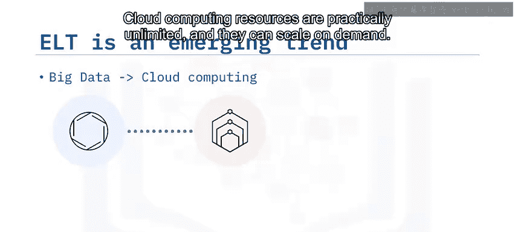

最后，ELT提供了**灵活性**。转换数据的原因和方式可能有很多种。因此，ELT是一种灵活的选择，能够从同一数据源支持多种应用。因为你处理的是源数据的副本，所以**没有信息丢失**。许多类型的转换都可能导致信息丢失，如果这种情况发生在管道上游，可能需要很长时间才能提出变更请求。更糟糕的是，如果原始数据没有被存储，信息可能会永远丢失。

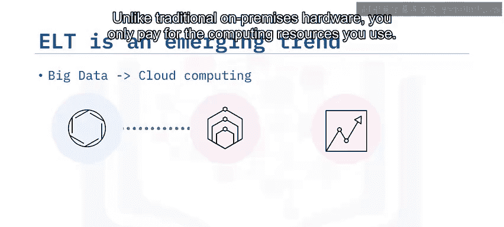

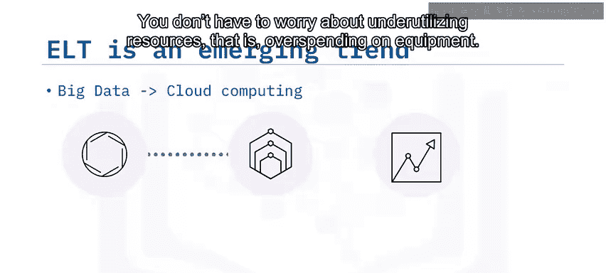

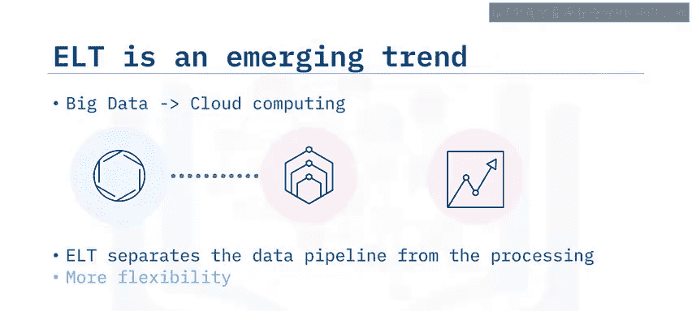

## 总结 📝

本节课中我们一起学习了ELT流程的核心知识。

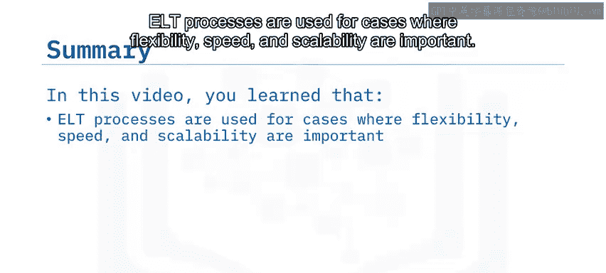

你了解到：
*   ELT流程适用于**灵活性、速度和可扩展性**至关重要的场景。
*   基于云的分析平台非常适合以**经济高效**的方式处理大数据和ELT流程。
*   ELT之所以成为新兴趋势，主要是因为**云平台技术**正在推动它成为可能。