# 004：ETL与ELT比较详解

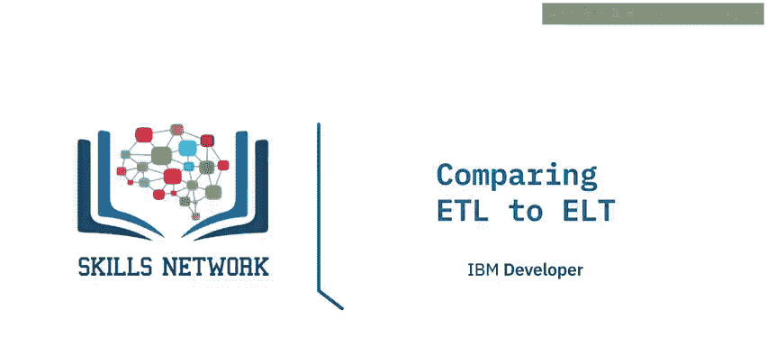

在本节课中，我们将学习ETL（提取、转换、加载）与ELT（提取、加载、转换）这两种数据处理架构的核心区别。我们将探讨ELT如何作为ETL的演进，并分析当前从ETL向ELT转变的趋势。

## 🔍 ETL与ELT的关键区别

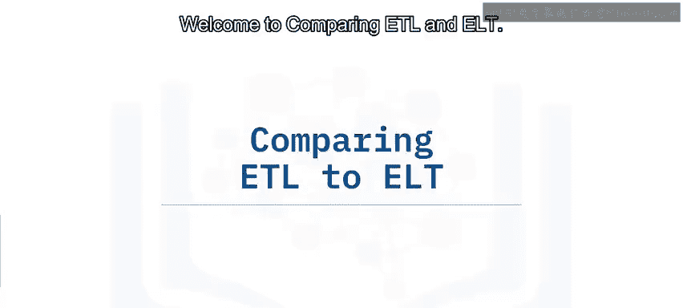

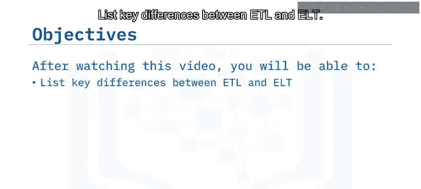

ETL和ELT在数据处理流程上存在几个根本性的差异。

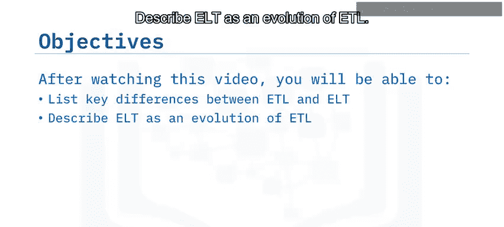

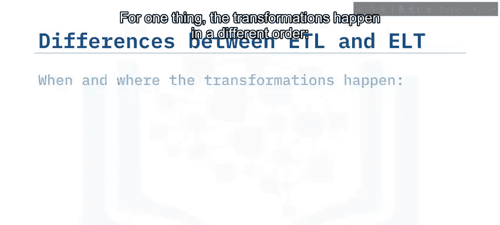

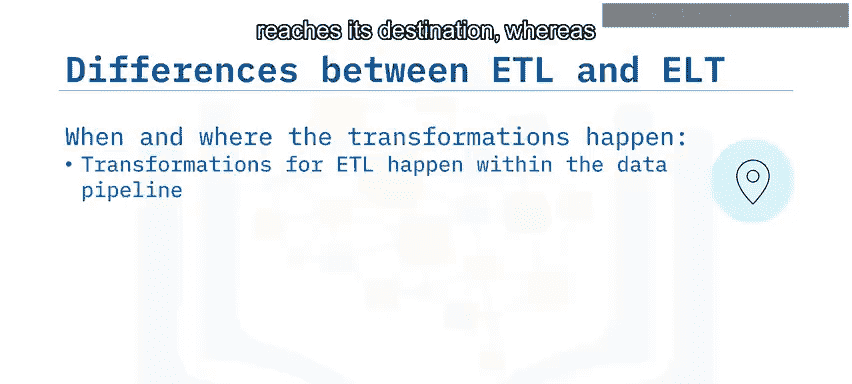

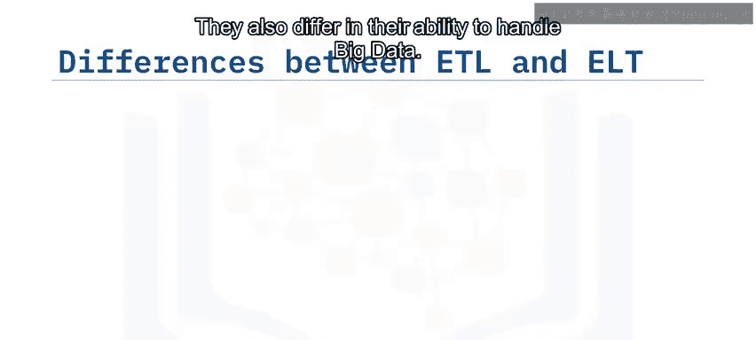

以下是它们之间的主要区别：

*   **转换发生的顺序不同**：在ETL流程中，数据转换发生在数据管道内部，**在数据到达目标存储之前**完成。而在ELT流程中，转换与数据管道解耦，**在目标存储环境中**按需进行。
*   **使用灵活性不同**：ETL通常是一个固定的流程，旨在服务于非常特定的功能。ELT则更为灵活，使数据能够随时可用于自助式分析。
*   **处理大数据的能力不同**：传统的ETL流程处理**结构化的关系型数据**，并依赖**本地计算资源**来处理工作流，因此可扩展性可能成为问题。相比之下，ELT可以处理**任何类型的数据**（结构化和非结构化），并利用**云计算服务**提供的按需扩展能力来解决大数据带来的可扩展性挑战。
*   **数据发现与洞察速度不同**：修改ETL管道需要时间和精力，这意味着用户必须等待开发团队实施所请求的更改。ELT则提供了更高的敏捷性，用户经过一些现代分析应用的培训后，可以轻松连接并试验原始数据、创建自己的仪表板并自行运行预测模型。

## 🚀 ELT：ETL的自然演进

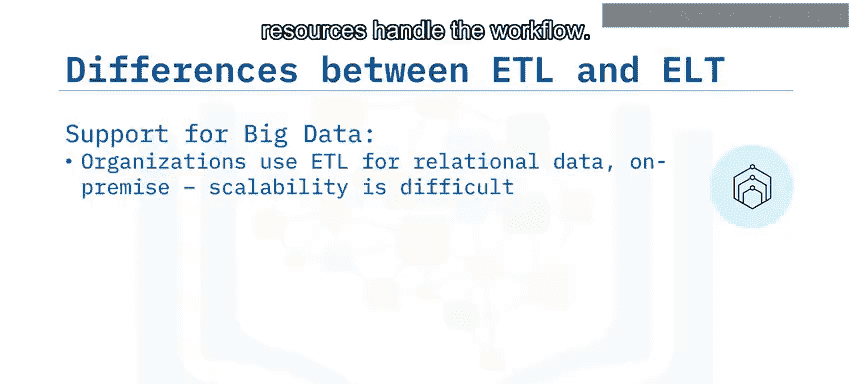

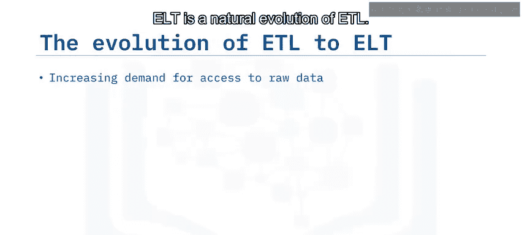

上一节我们介绍了ETL与ELT的核心区别，本节中我们来看看ELT如何成为ETL的自然演进。

推动这一演进的主要因素是企业需要将原始数据释放给更广泛的用户群体使用。传统上，ETL流程包含一个称为“暂存区”的中间存储设施。这是一个存放原始提取数据的区域，在将转换后的结果数据加载到数据仓库或数据集市之前，可以在此运行处理过程。

这听起来很像ELT流程，而暂存区也符合**数据湖**的描述——数据湖是一个用于存储和操作原始数据的现代自助式存储库。然而，传统的暂存区通常不是在公司范围内共享的。它是一个私有的、孤立的区域，专门用于开发、监控和性能调优数据管道及其内置的转换。

随着分析工具的使用和连接能力日益便捷，原始数据源对技术背景较弱的终端用户来说变得更容易访问。因此，范式正在向自助式数据平台转变。

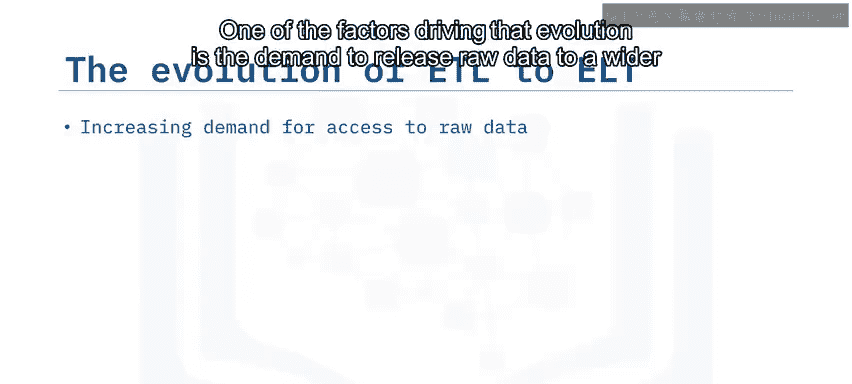

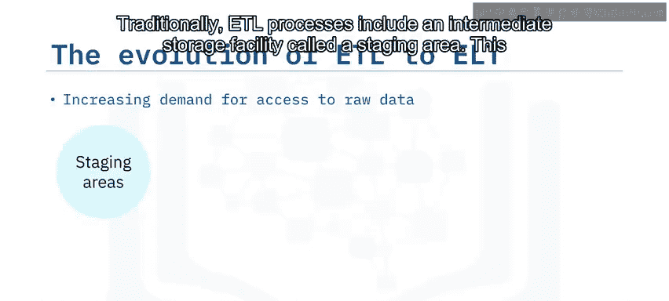

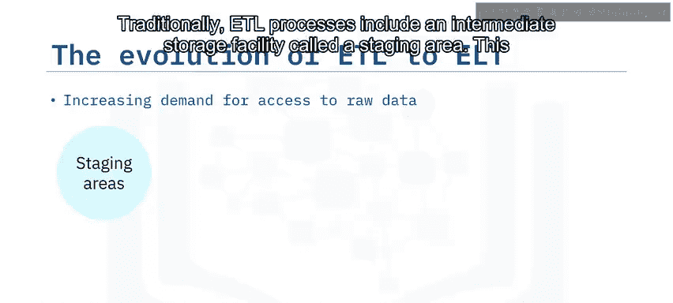

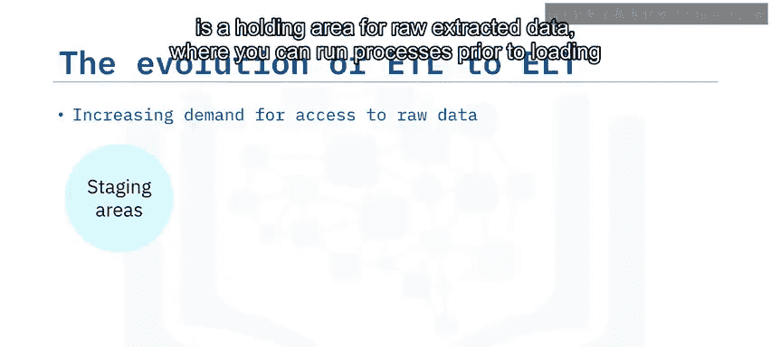

## 📈 当前趋势：从ETL到ELT

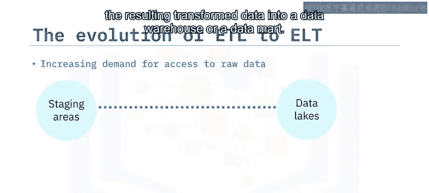

尽管传统的ETL在开发数据管道中仍有一席之地，不会很快消失，但目前存在一个趋势，即现代ELT正逐渐超越传统ETL。

这一趋势是由ELT所解决的痛点所驱动的，主要包括：
*   获取洞察的周期漫长
*   大数据带来的挑战（例如可扩展性）
*   数据传统的孤岛性质

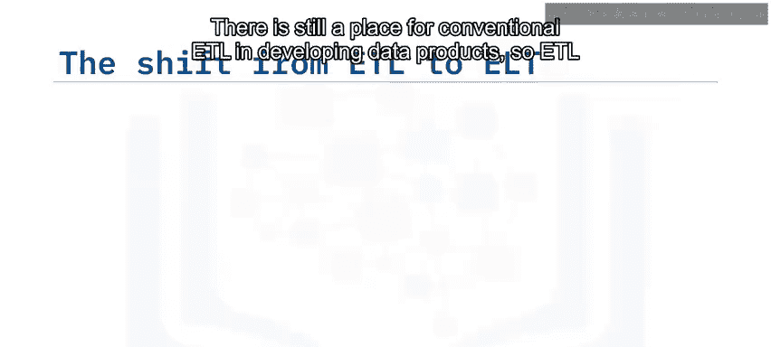

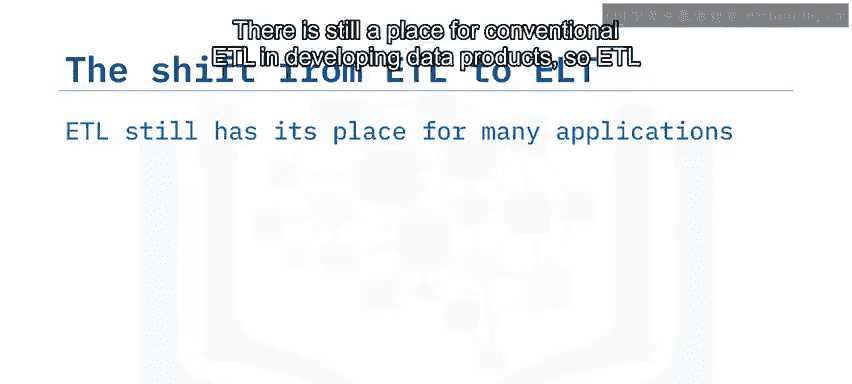

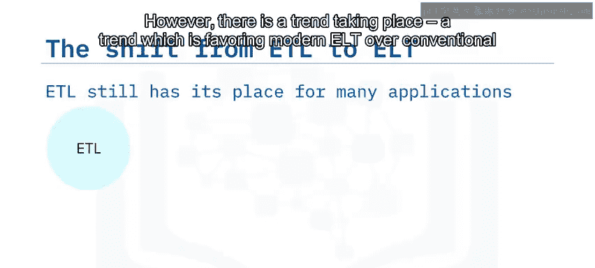

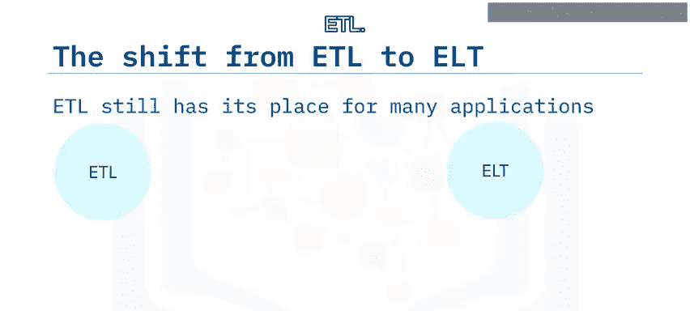

## ✅ 课程总结

本节课中，我们一起学习了ETL与ELT的核心知识。

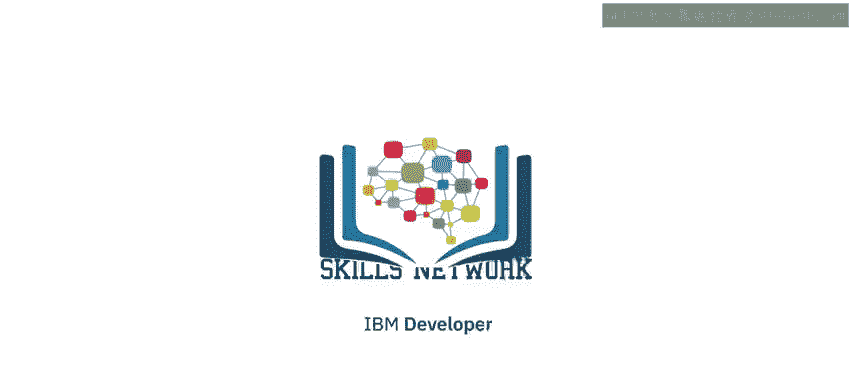

我们了解到，ETL与ELT的关键区别在于**转换发生的位置、灵活性、对大数据支持以及获取洞察的速度**。推动从ETL向ELT演进的因素之一，是**企业需要向更广泛的用户群提供原始数据**。传统ETL仍有许多应用场景并保有它的地位，而ELT比ETL更灵活，**使终端用户能够实时执行临时的、自助式的数据分析**。