# 006：数据转换技术介绍 📊

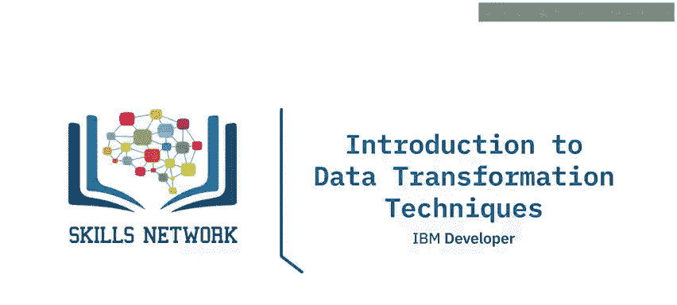

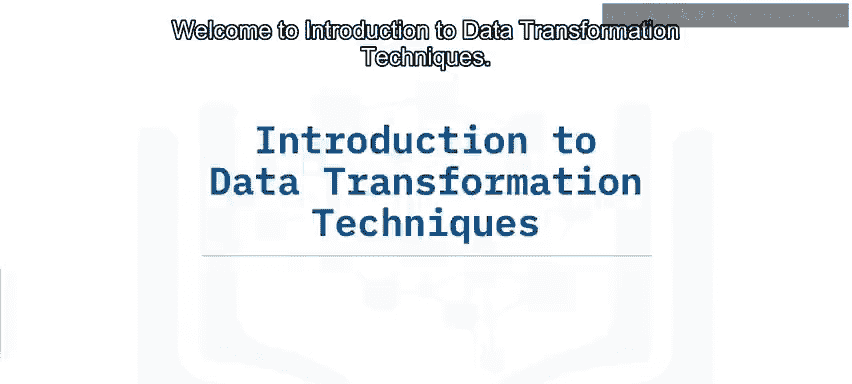

在本节课中，我们将要学习数据转换技术。我们将了解数据转换的主要类型，比较“写时模式”与“读时模式”这两种不同的数据处理理念，并列举在转换过程中可能导致信息丢失的几种方式。

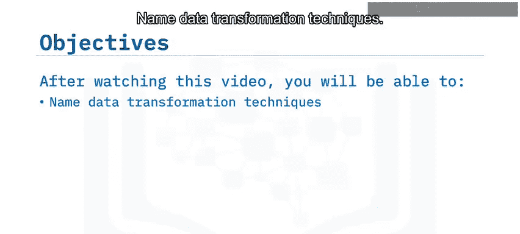

## 什么是数据转换？🔄

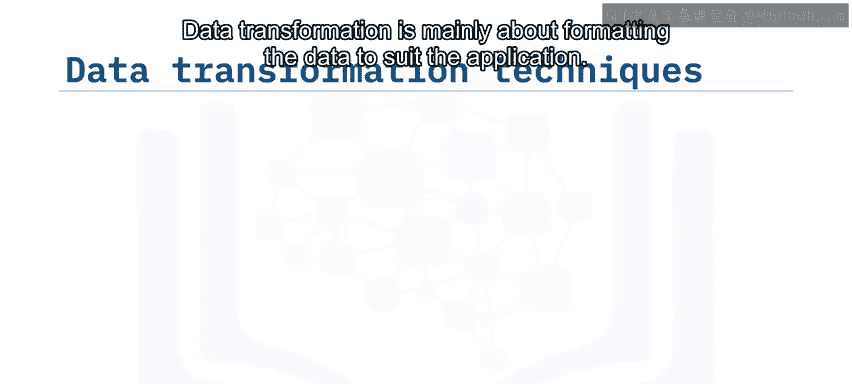

数据转换的核心目的是将数据格式化为适合目标应用程序使用的形式。这涉及到多种操作。

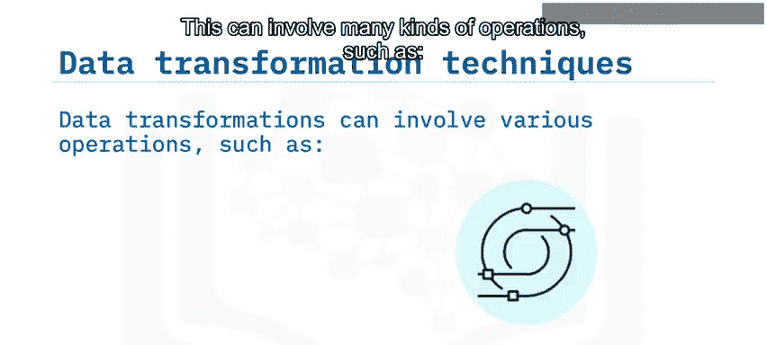

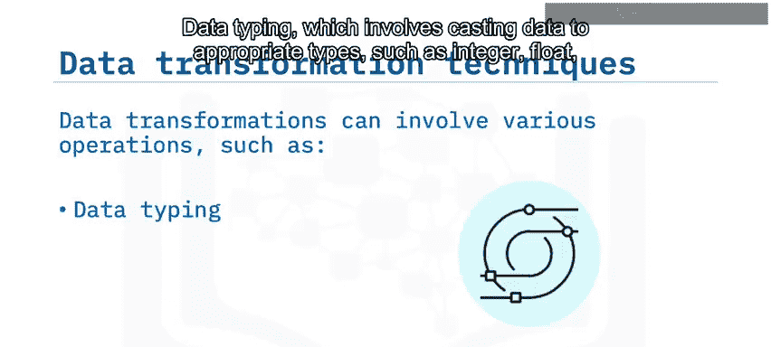

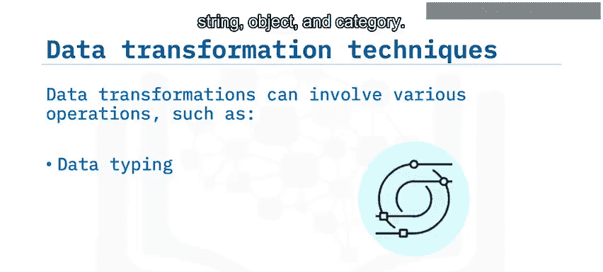

以下是常见的数据转换类型：

*   **数据类型转换**：将数据转换为适当的类型，例如整数（`int`）、浮点数（`float`）、字符串（`str`）、对象或类别。
*   **数据结构化**：将一种数据格式转换为另一种格式，例如将 JSON、XML 或 CSV 文件转换为数据库表。
*   **匿名化与加密**：对数据进行处理以保护隐私和安全。
*   **数据清洗**：包括删除重复记录和填充缺失值等操作。
*   **数据规范化**：确保数据单位具有可比性，例如将所有货币金额统一为一种通用货币。
*   **数据筛选、排序、聚合与分箱**：这些操作用于在合适的细节层次和合理的顺序下访问正确的数据。
*   **数据连接或合并**：将来自不同来源的数据整合在一起。

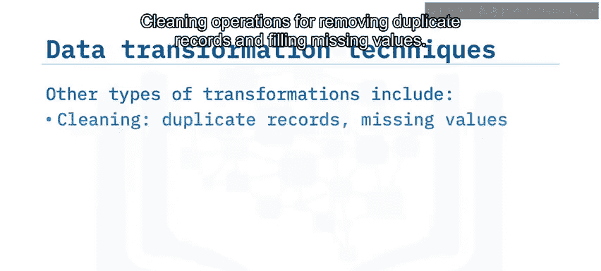

## 写时模式 vs. 读时模式 ⚖️

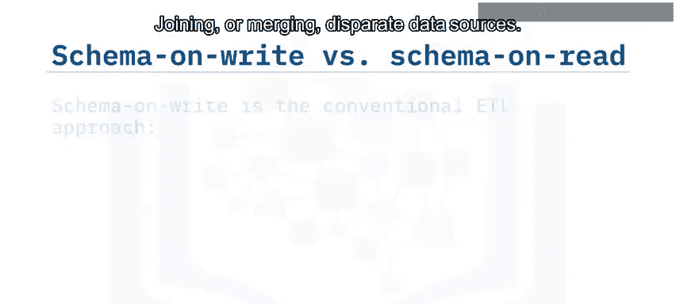

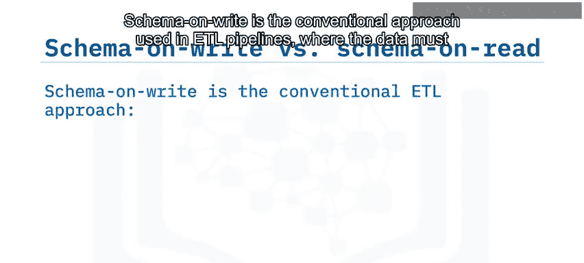

上一节我们介绍了数据转换的常见操作，本节中我们来看看两种不同的数据处理策略。

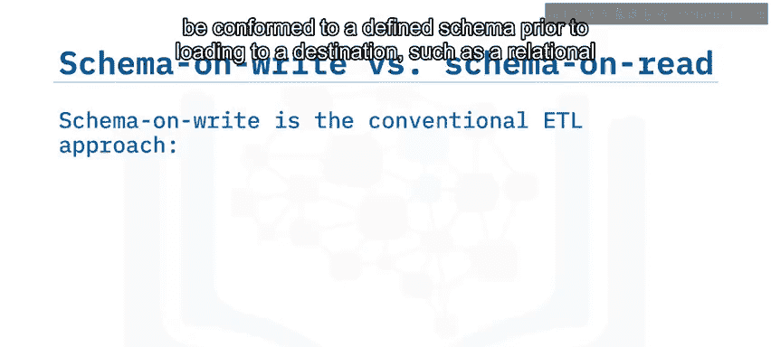

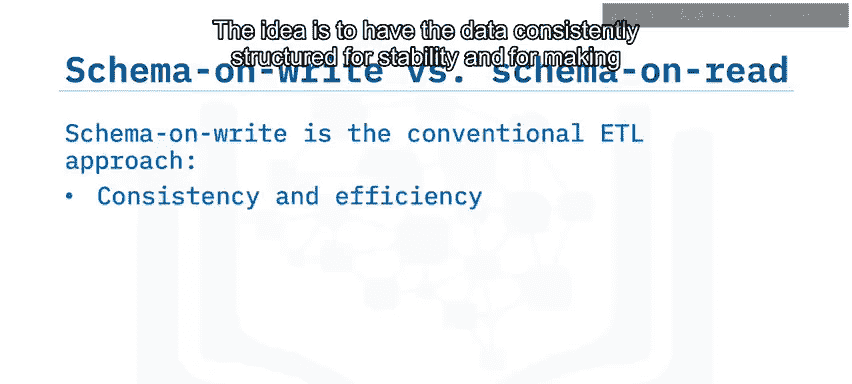

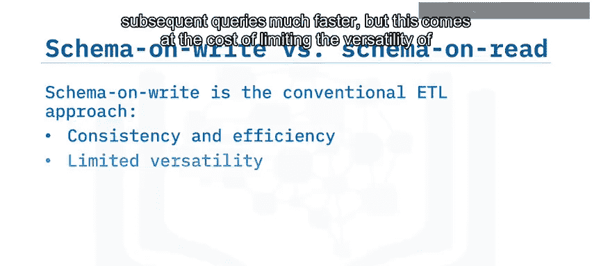

**写时模式** 是传统 ETL（提取、转换、加载）管道中使用的方法。在这种方法中，数据在加载到目标系统（如关系型数据库）之前，必须符合预先定义好的模式。这种做法的优势在于数据结构一致，系统稳定，且后续查询速度更快。但其代价是限制了数据的多样性和灵活性。

**读时模式** 则与现代的 ELT（提取、加载、转换）方法相关。在这种方法中，模式是在从原始数据存储中读取数据之后才应用的。这种方法非常灵活，因为它可以使用临时定义的模式从同一源数据中获得多种视图。同时，由于数据不需要经过严格的预处理步骤，用户有可能访问到更多的原始数据。

## 转换中的信息丢失 ⚠️

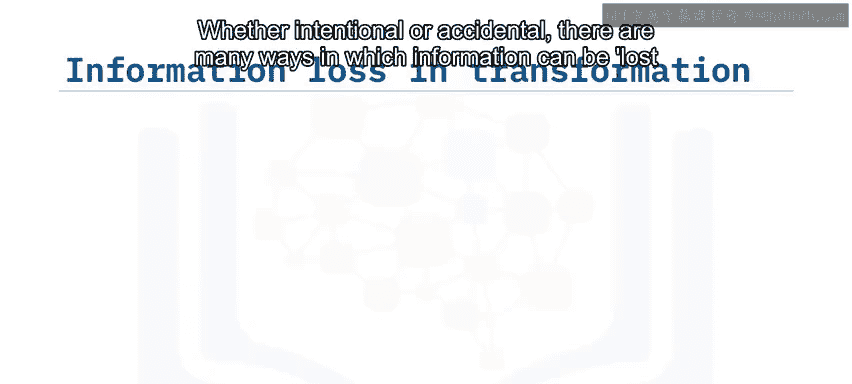

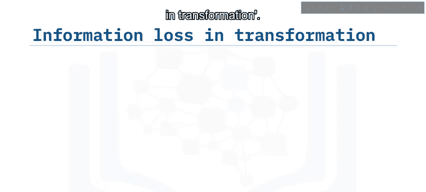

无论是写时模式还是读时模式，数据转换都可能导致信息丢失。接下来，我们探讨信息是如何在转换过程中丢失的。

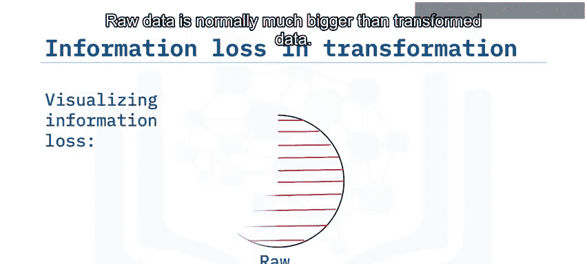

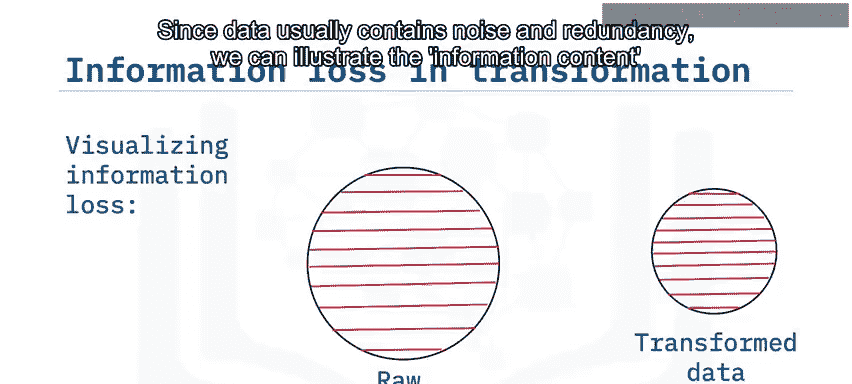

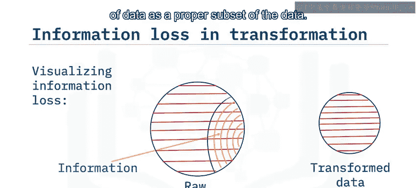

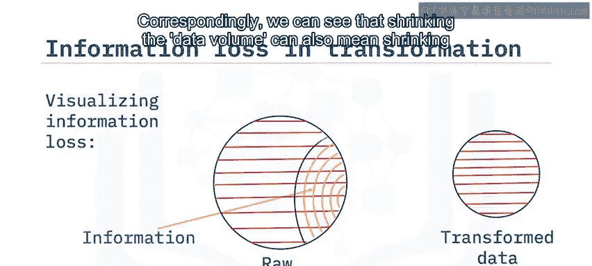

无论是故意还是无意，在转换过程中信息都可能以多种方式丢失。我们可以将这种丢失可视化如下：原始数据通常比转换后的数据大得多，因为数据通常包含噪声和冗余。我们可以将数据的信息内容视为数据本身的一个真子集。相应地，我们可以看到，缩小数据量也可能意味着缩小信息内容。

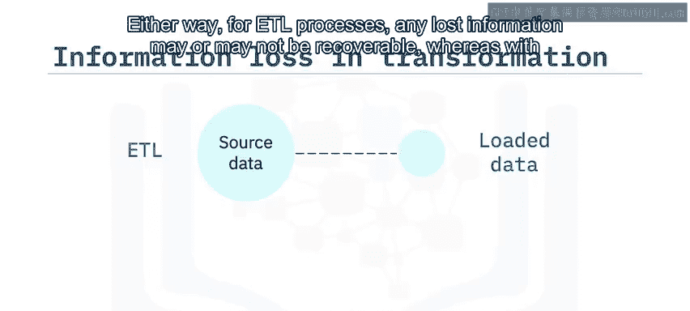

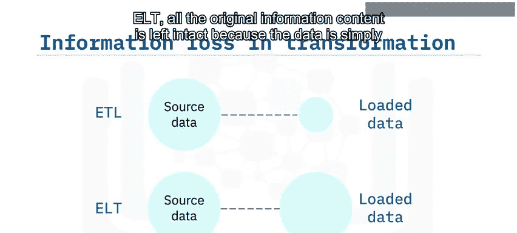

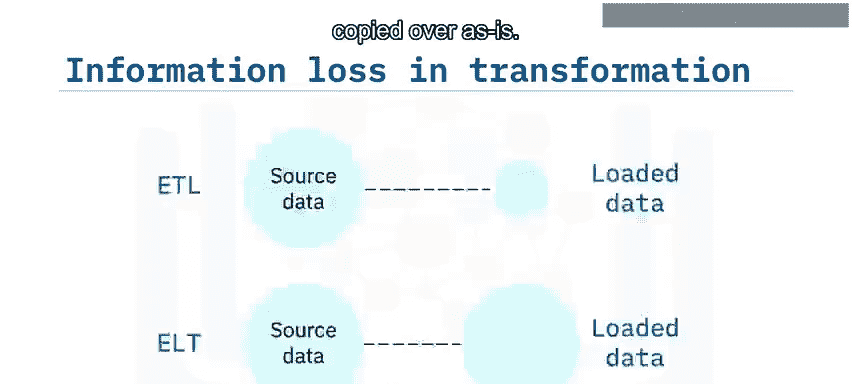

对于 ETL 过程，任何丢失的信息可能无法恢复。而对于 ELT，所有原始信息内容都保持完整，因为数据是按原样复制的。

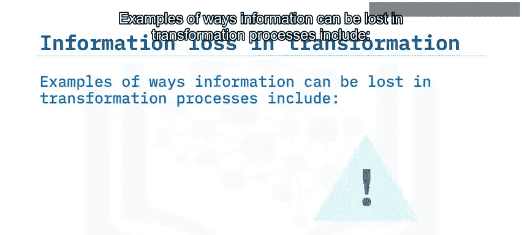

以下是在转换过程中可能导致信息丢失的几种方式：

*   **有损数据压缩**：例如，将浮点数值转换为整数，或降低音频、视频的比特率。
*   **数据筛选**：筛选通常是临时选择数据子集，但当筛选是永久性时，信息很容易被丢弃。
*   **数据聚合**：例如，使用年平均销售额代替日或月平均销售额。
*   **边缘计算设备**：例如，某些监控设备设计为仅流式传输警报信号，而不传输原始数据，这可能导致漏报（假阴性）。

## 总结 📝

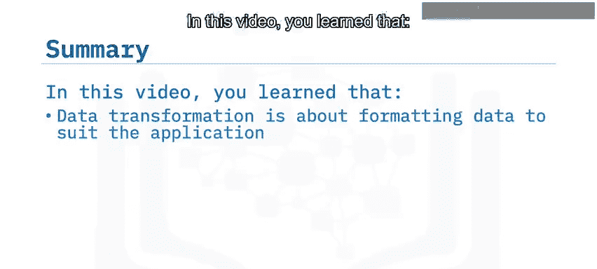

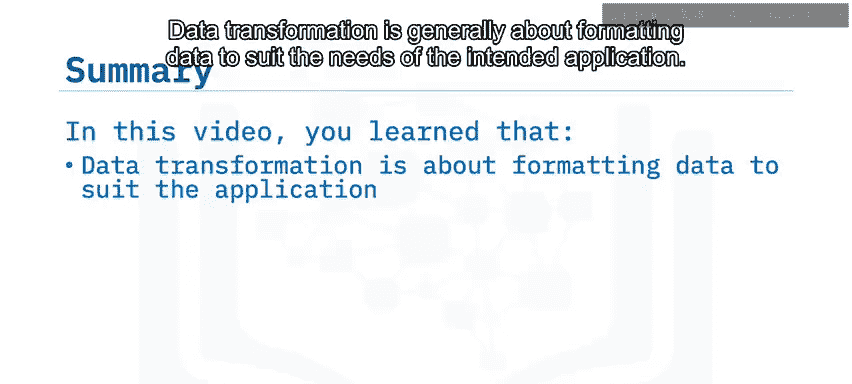

本节课中我们一起学习了数据转换技术。我们了解到，数据转换主要是为了将数据格式化为满足目标应用的需求。常见的转换技术包括类型转换、结构化、规范化、聚合和清洗。

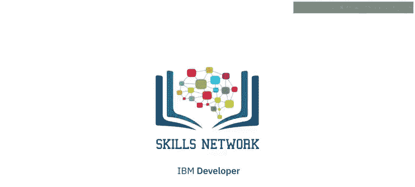

我们比较了 **写时模式**（传统 ETL 方法）和 **读时模式**（现代 ELT 方法）。最后，我们列举了在转换过程中可能导致信息丢失的几种方式，包括筛选、聚合、使用边缘计算设备和有损数据压缩。