# 007：数据加载技术

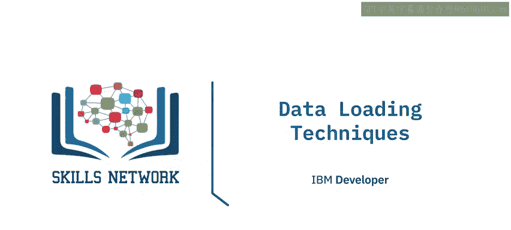

在本节课中，我们将学习数据加载的各种技术。我们将探讨批量加载与流式加载的区别，解释推送与拉取模式，并描述并行加载的概念。掌握这些技术对于设计和实施高效的数据管道至关重要。

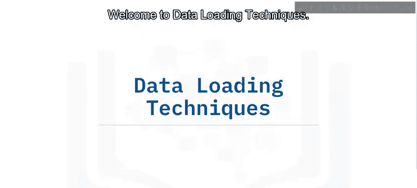

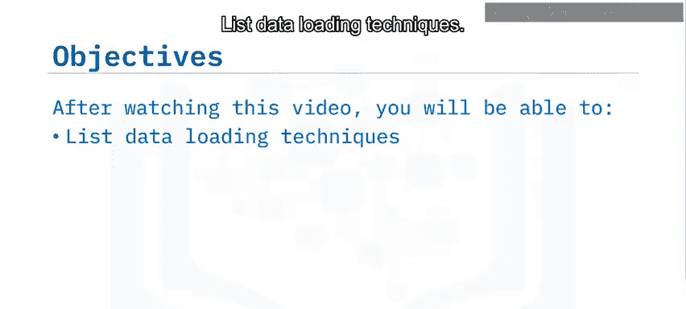

## 🎯 概述

数据加载是将数据从源系统移动到目标存储系统的过程。有多种技术可以实现这一目标，每种技术都有其适用的场景和优势。理解这些技术有助于我们根据数据的特点和业务需求选择最合适的加载策略。

## 📦 数据加载技术概览

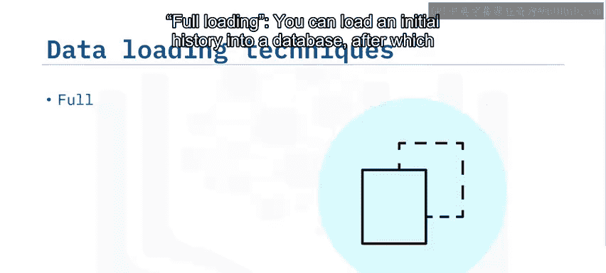

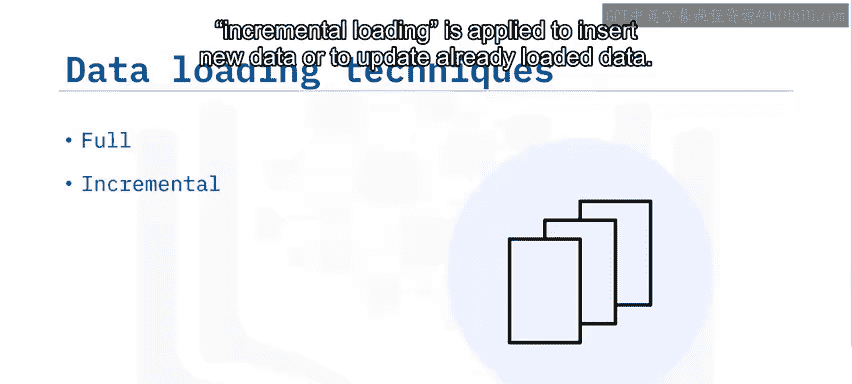

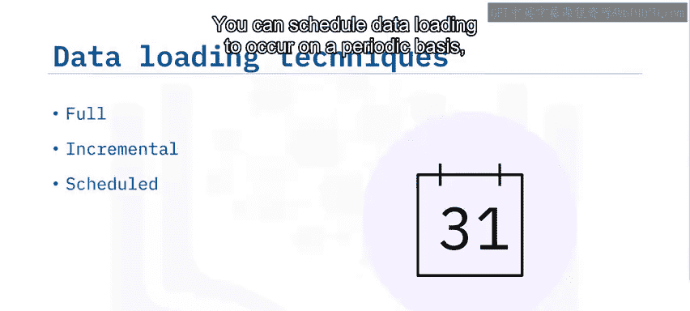

有多种数据加载技术。其中一些是**全量加载**。你可以将初始历史数据加载到数据库中，之后应用**增量加载**来插入新数据或更新已加载的数据。你可以安排数据加载定期进行，也可以根据需要按需加载。数据可以批量加载，也可以持续流式传输到目的地。数据可以被推送到服务器，也可以由服务器推送到客户端。数据通常串行加载，但也可以并行加载。

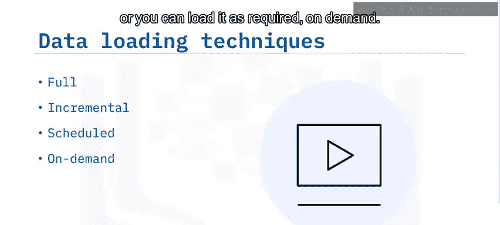

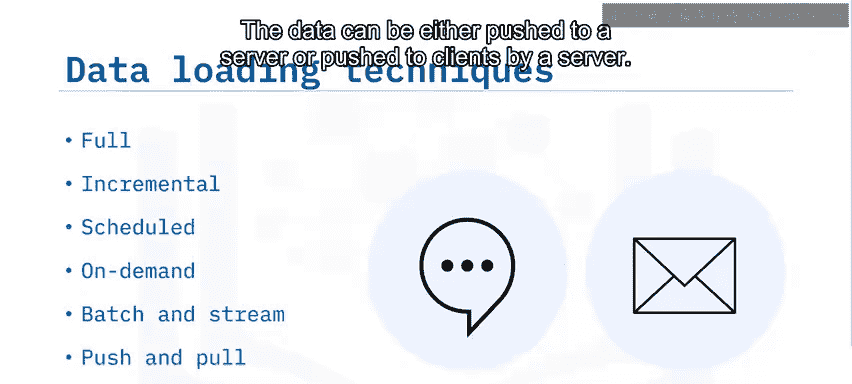

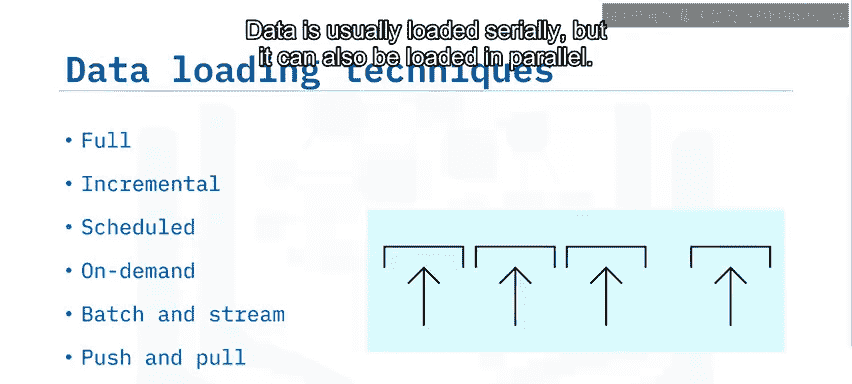

## 🔄 全量加载与增量加载

**全量加载**指的是将数据一次性大批量加载。例如，当组织希望在新的数据仓库中开始跟踪交易时，他们会将现有交易历史从旧系统复制到新系统。之后，随着新交易的出现，以增量方式加载交易，从而确保交易历史被跟踪。

对于**增量加载**，目标数据存储会被追加，只加载变更部分。这对于累积历史数据（如交易记录、天气和浏览历史）非常有用。

数据的**量级、速度和需求**决定了数据是批量加载还是实时流式加载。

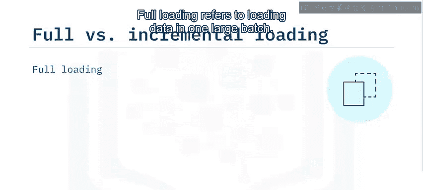

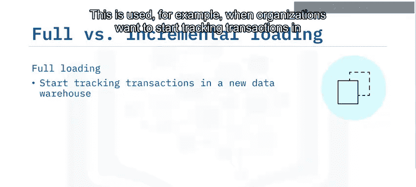

## ⏰ 计划加载与按需加载

数据加载过程可以按计划执行，也可以按需启动。数据通常按计划加载。例如，每日的销售点交易可以在每天非高峰时段结束时加载到数据库中。加载任务可以使用诸如Windows任务计划程序或类Unix系统上的Cron等工具进行调度。

按需加载也非常常见，它依赖于触发机制，例如：
*   当源数据达到指定大小时。
*   当源系统检测到事件时（如运动、声音或温度变化）。
*   当用户请求数据时（如在线视频、音乐或网页）。

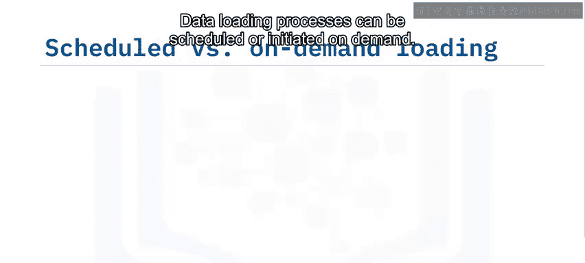

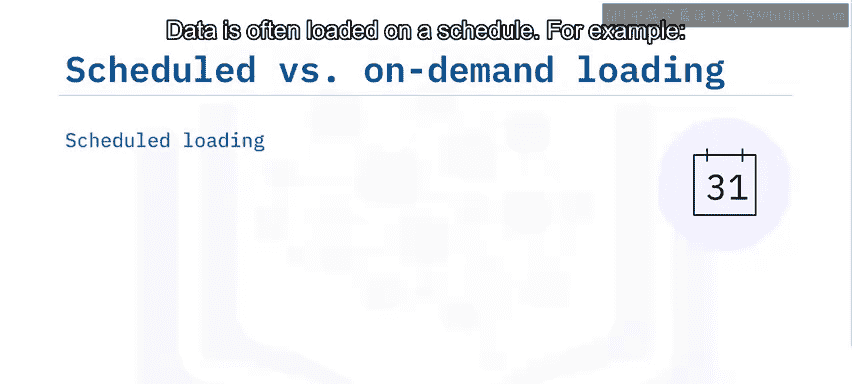

## 📊 批量加载与流式加载

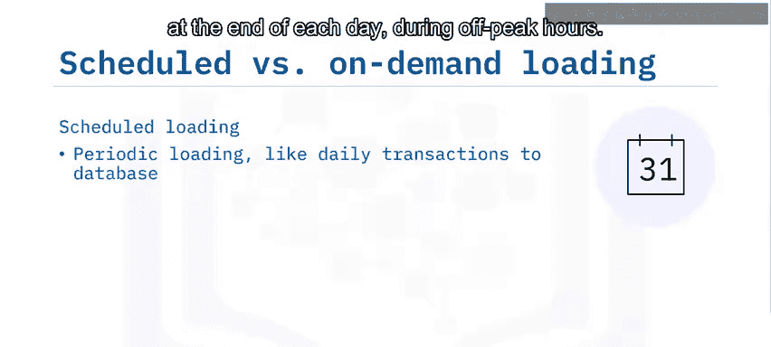

批量加载和流式加载是加载方法频谱的两个端点。**批量加载**指的是按照数据源积累的某个时间窗口（通常是数小时到数天）定义的数据块进行加载。

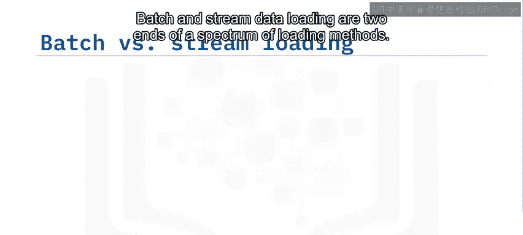

在频谱的另一端，我们有**流式加载**，它在数据可用时实时加载数据。

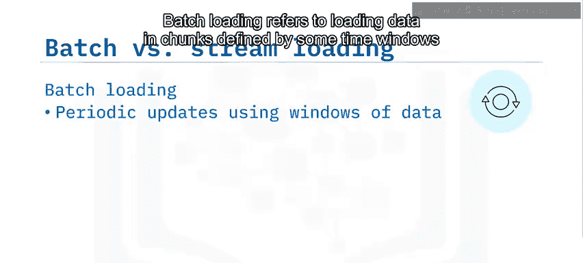

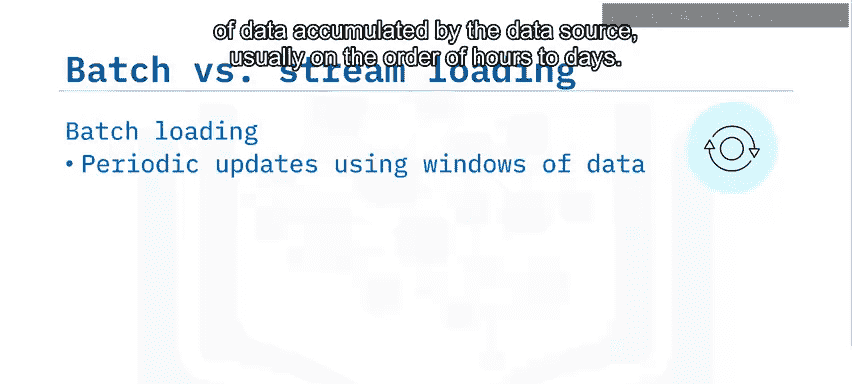

在批量加载和流式加载之间，我们还有**微批量加载**。当紧急处理过程需要访问一小段近期数据窗口时，会使用这种方法。

## 📡 推送与拉取加载

推送和拉取数据加载方法基于客户端-服务器模型。**拉取**指的是客户端发起从服务器请求数据。服务器随后响应客户端的请求并交付数据。拉取技术的例子包括RSS订阅和电子邮件。

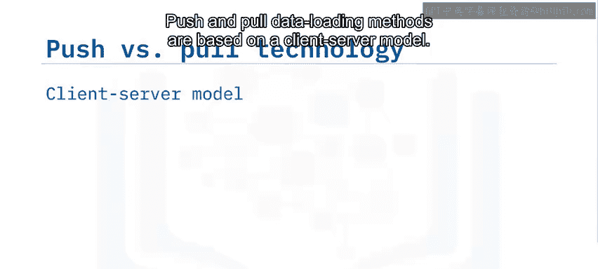

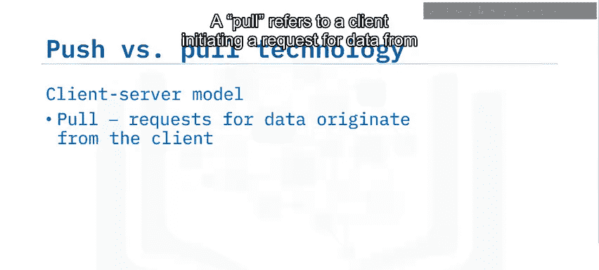

对于**推送技术**，客户端订阅服务器提供的服务，以便服务器在数据可用时将其推送给客户端。例子包括推送通知和即时消息服务。

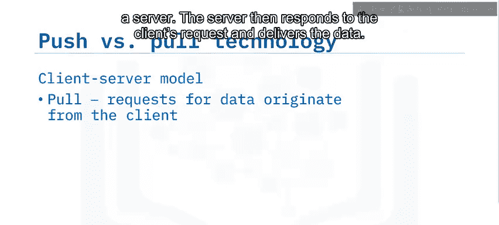

## ⚡ 并行加载

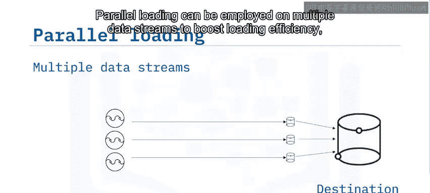

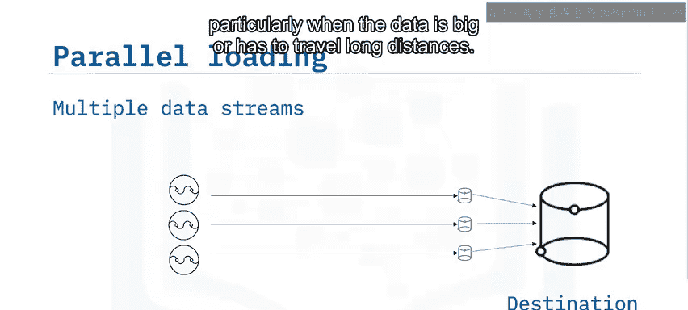

可以在多个数据流上采用**并行加载**来提高加载效率，特别是在数据量大或需要长距离传输时。

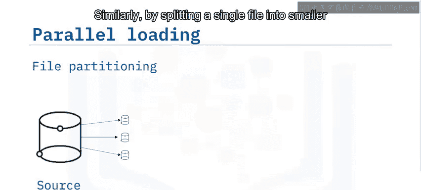

类似地，通过将单个文件分割成更小的块，这些块可以同时加载。

## 📝 总结

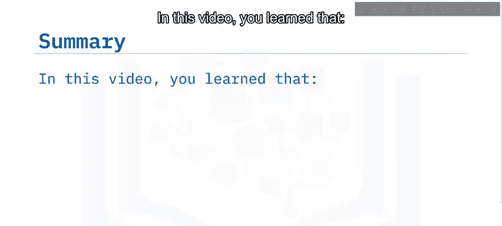

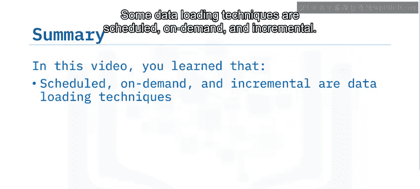

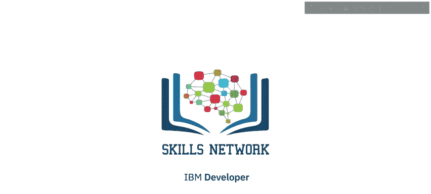

本节课我们一起学习了多种数据加载技术。我们了解到数据加载可以是计划的或按需的、增量的。数据可以批量加载，也可以持续流式传输到目的地。服务器可以在数据可用时将其推送给订阅者，客户端也可以发起从服务器拉取数据的请求。此外，我们可以采用并行加载来提高大数据量的加载效率。