# 008：使用Shell脚本进行ETL 🛠️


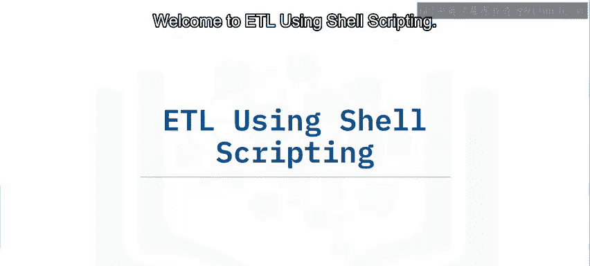

在本节课中，我们将学习如何使用Shell脚本构建一个ETL（提取、转换、加载）数据管道，并了解如何通过调度任务使其自动化运行。

## 概述

我们将通过一个具体场景来学习：从一个远程传感器获取温度读数，计算每小时的平均、最低和最高温度，并将结果加载到报告系统中。整个过程将使用Bash Shell脚本实现，并通过Cron调度器每分钟自动执行。

---

## 工作流程设计

上一节我们介绍了课程目标，本节中我们来看看如何设计ETL管道的工作流程。

工作流程始于气象站及其数据接口。提取步骤涉及使用提供的 `GetTemp` API 从传感器获取当前温度读数。您可以将读数追加到一个日志文件中，例如 `temperature.log`。由于只需要保留最近一小时的读数，因此可以缓冲最后60个读数，然后用缓冲的读数覆盖日志文件。

接下来，调用一个程序（例如，一个名为 `get_stats.py` 的Python脚本）。该脚本从60分钟的日志中计算温度统计数据，并使用 `load_stats` API 将结果统计信息加载到报告系统中。然后，这些统计数据可用于显示实时图表，展示每小时的最低、最高和平均温度。您还需要将工作流程安排为每分钟运行一次。

---

## 创建Shell脚本

现在，我们开始创建实现上述流程的Shell脚本。

首先，创建一个名为 `temperature_etl.sh` 的Shell脚本。您可以使用 `touch` 命令创建该文件。

```bash
touch temperature_etl.sh
```

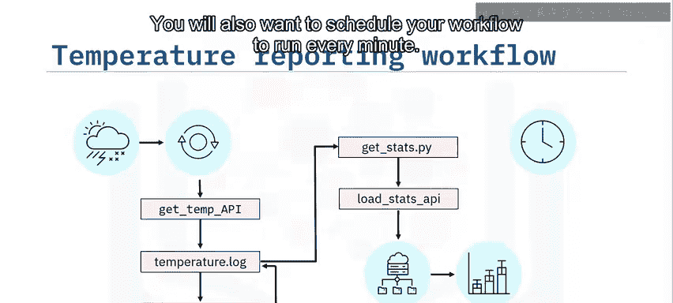

接下来，使用任何文本编辑器（如 `gedit`）打开该文件。在编辑器中，键入 `#!/bin/bash` 将您的文件转变为Bash Shell脚本。

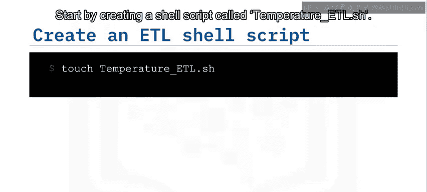

现在，您可以添加以下注释来帮助概述您的任务：
*   使用提供的 `get_temp` API 从传感器提取温度读数。
*   将读数追加到日志文件，例如 `temperature.log`。
*   您只需要保留最近一小时的读数，因此缓冲最后60个读数。
*   调用一个程序，例如名为 `get_stats.py` 的Python脚本，该脚本从60分钟的日志中计算温度统计数据，并使用提供的API将结果统计信息加载到报告系统中。

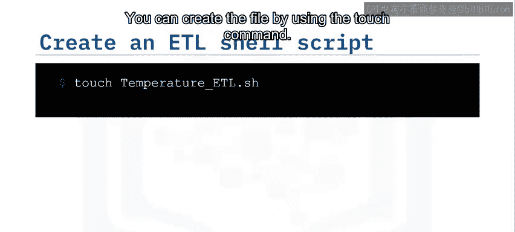

编写完ETL Bash脚本后，您需要将其调度为每分钟运行一次。

---

## 填充脚本细节

上一节我们创建了脚本框架，本节中我们来填充具体的实现细节。

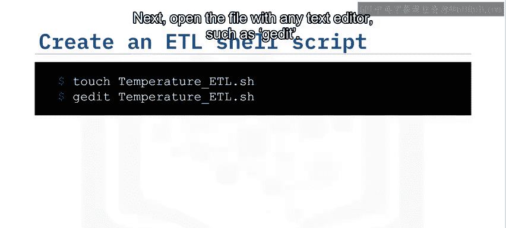

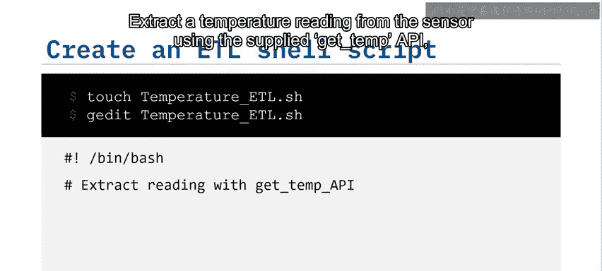

首先，在命令行中使用 `touch` 命令初始化您的温度日志文件。

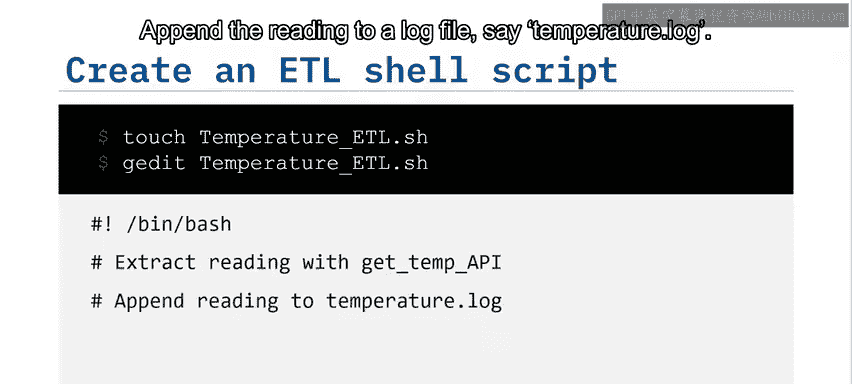


```bash
touch temperature.log
```

在文本编辑器中，输入命令以调用API读取温度，并将读数追加到 `temperature.log` 中。

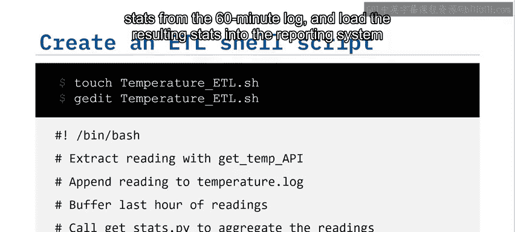

```bash
# 调用API获取温度并追加到日志
get_temp >> temperature.log
```


现在，通过用其最后60行覆盖 `temperature.log`，仅保留最后一小时（或60行）的日志文件。这完成了数据提取步骤。

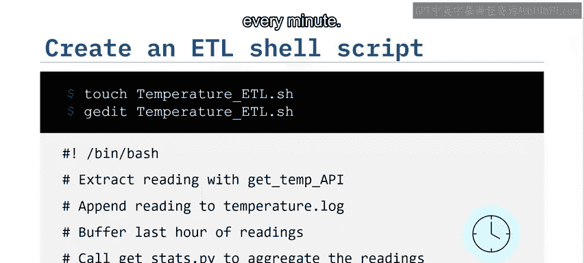

```bash
# 仅保留最后60行数据
tail -n 60 temperature.log > temp_buffer.log
mv temp_buffer.log temperature.log
```

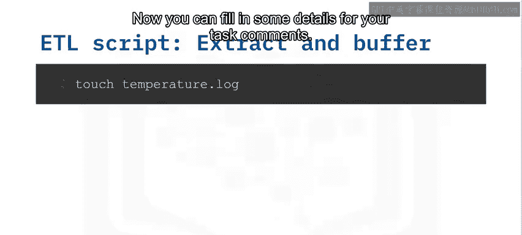

假设您已经编写了一个名为 `get_stats.py` 的Python脚本，该脚本从日志文件读取温度，计算温度统计数据，并将结果写入输出文件。输入和输出文件名被指定为命令行参数。

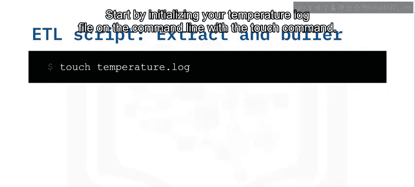

您可以在ETL脚本中添加以下行，该行调用Python 3并调用您的Python脚本 `get_stats.py`，使用 `temperature.log` 中的读数，并将温度统计数据写入名为 `temperature_stats.csv` 的CSV文件。这完成了ETL脚本的转换组件。

```bash
# 调用Python脚本进行数据转换
python3 get_stats.py temperature.log temperature_stats.csv
```

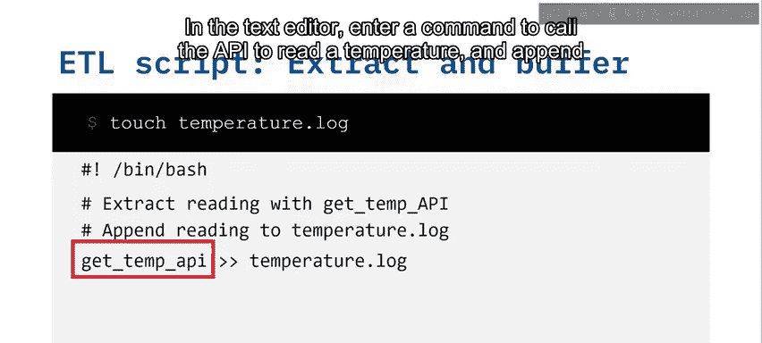

最后，您可以通过调用API并指定温度统计CSV作为命令行参数，将结果统计信息加载到报告系统中。

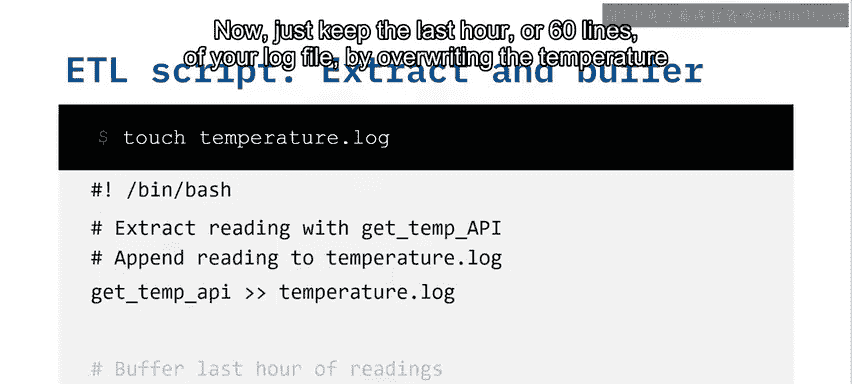

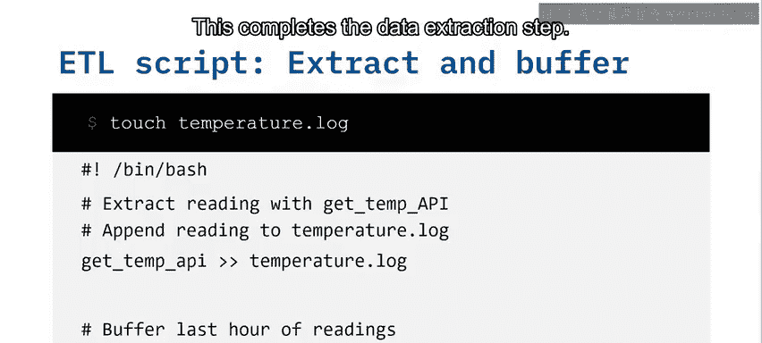

```bash
# 调用API加载数据
load_stats temperature_stats.csv
```

接下来，不要忘记设置权限以使您的Shell脚本可执行。

```bash
chmod +x temperature_etl.sh
```

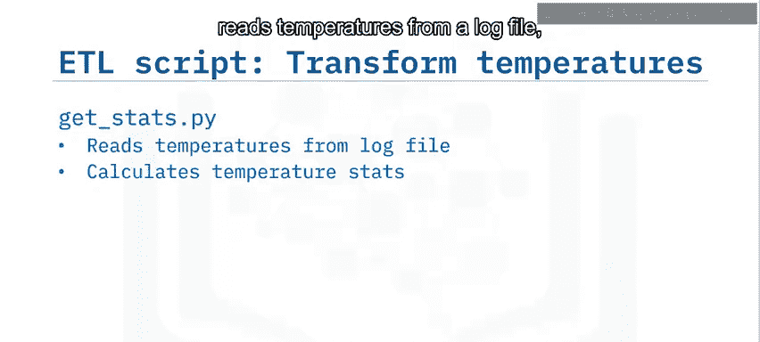

---

## 调度ETL任务

脚本编写完成后，我们需要让它自动运行。

现在，是时候调度您的ETL作业了。打开Cron选项卡编辑器。

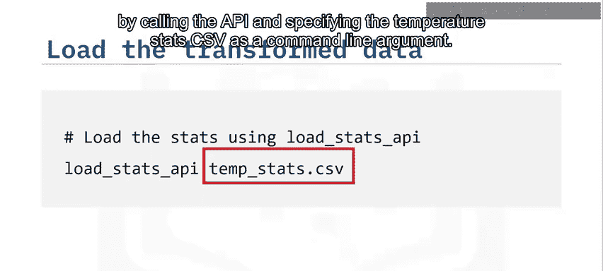

```bash
crontab -e
```

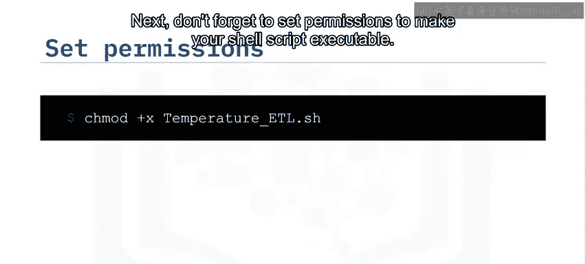

将您的作业调度为每天每分钟运行。

```cron
* * * * * /path/to/your/temperature_etl.sh
```


关闭编辑器并保存您的编辑。您的新ETL作业现在已被调度并在生产环境中运行。

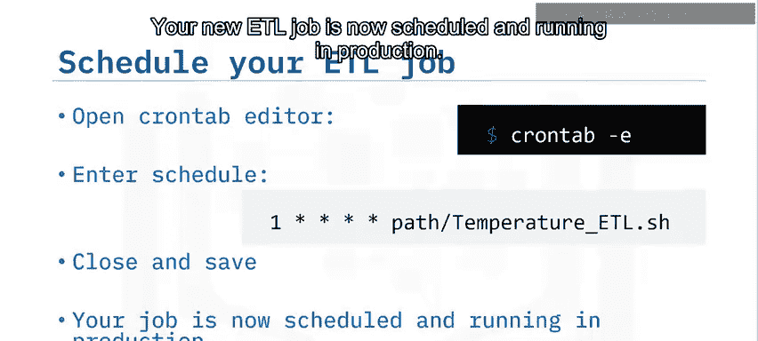

---

## 总结

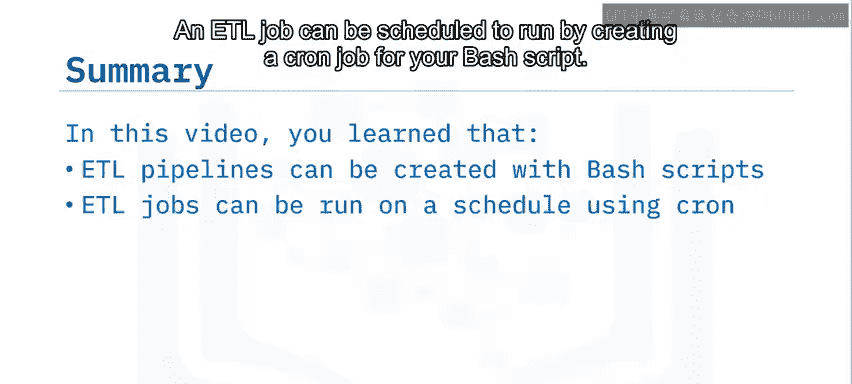


本节课中我们一起学习了如何使用基本的Bash脚本构建ETL管道，以及如何通过为您的Bash脚本创建Cron作业来调度ETL任务运行。通过这个实践，您掌握了实现自动化数据流程的核心步骤。