# 009：数据流水线简介 📊

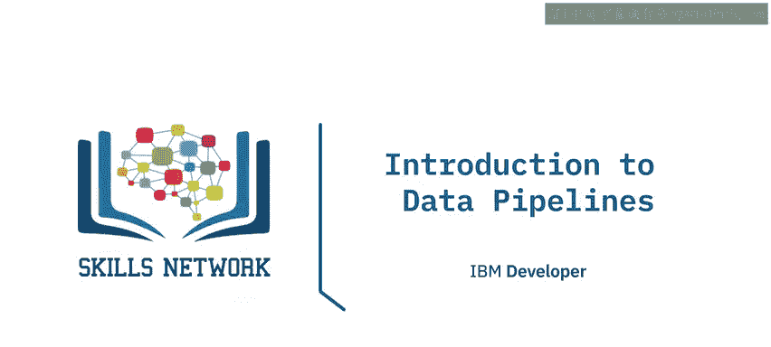

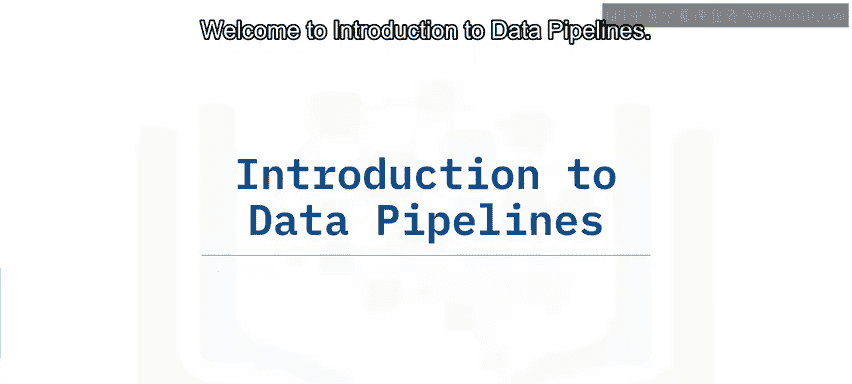

在本节课中，我们将要学习数据流水线的基本概念、性能指标以及常见应用场景。通过本课，你将能够理解数据流水线如何工作，并掌握评估其性能的关键因素。

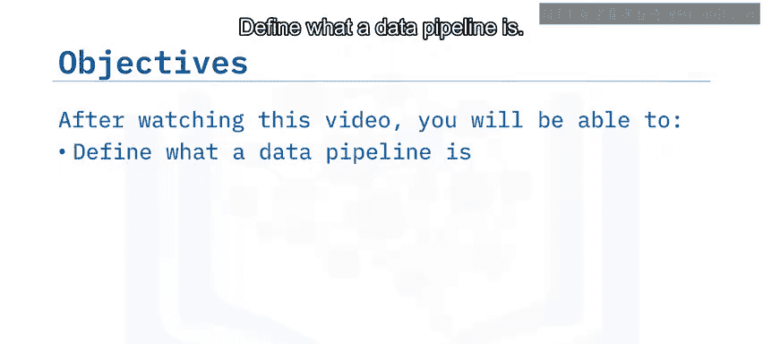

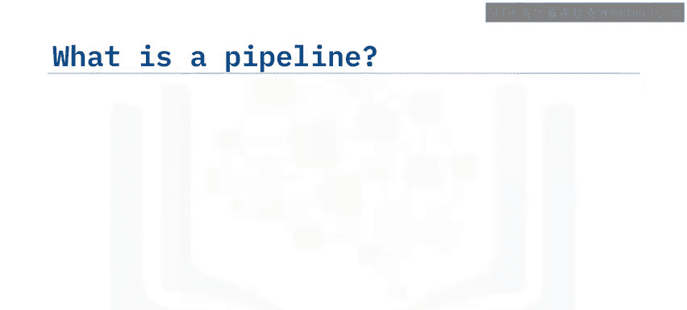

## 什么是流水线？ 🔄

流水线的概念广泛适用于任何一组按顺序连接的过程。这意味着一个过程的输出会作为链中下一个过程的输入传递下去。

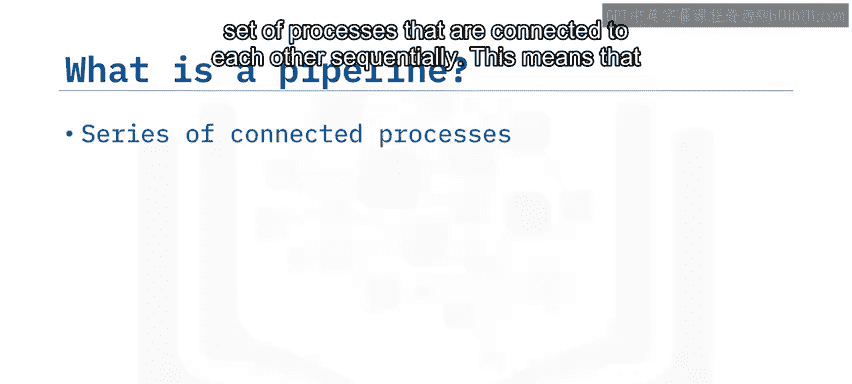

例如，将箱子从一个地方搬到另一个地方的一种方法是让一群朋友排成一列，每个人将箱子一个接一个地传递给最近的下一个人。

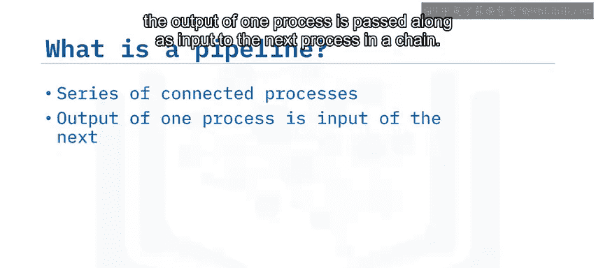

## 数据流水线 📈

数据流水线是专门用于移动或修改数据的流水线。数据流水线的目的是将数据从一个地方或形式移动到另一个地方或形式。一个数据流水线是一个系统，它提取数据并将其传递到可选的转换阶段，最终进行加载。

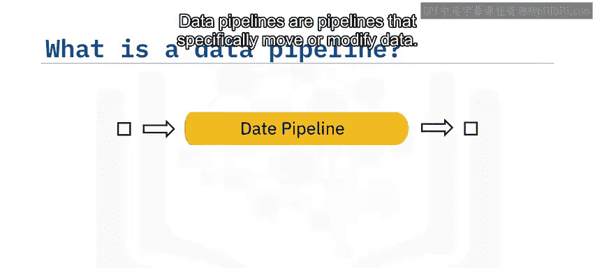

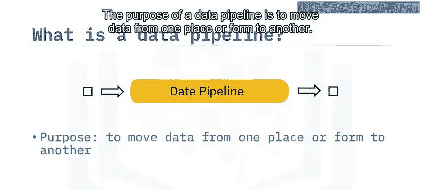

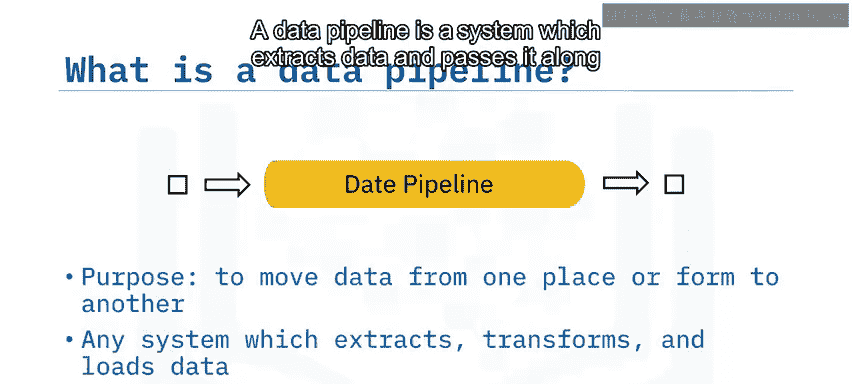

这包括低层次的硬件架构，但我们在这里的重点是由软件进程驱动的数据流水线架构，例如命令、程序和处理线程。Linux中简单的bash管道命令可以用作连接这些进程的“粘合剂”。

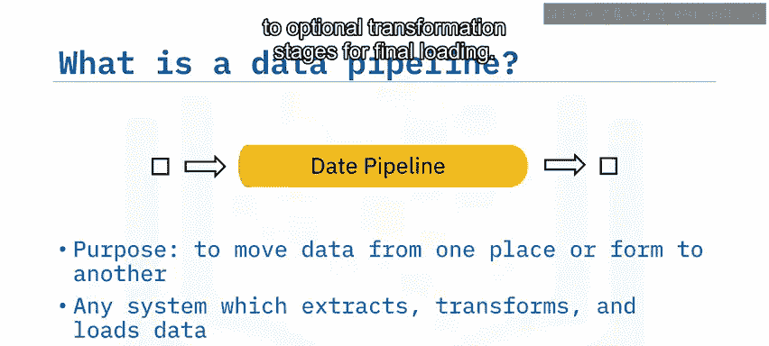

## 数据包与流动 📦

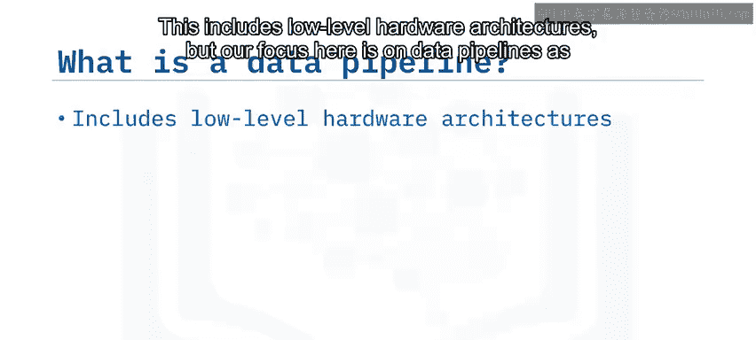

我们可以将流经流水线的数据视为数据包的形式。“数据包”这个术语我们将广泛地用来指代数据的单位。数据包的大小范围可以从单个记录或事件到大型数据集合。

在这里，我们有数据包排队等待被流水线摄取。

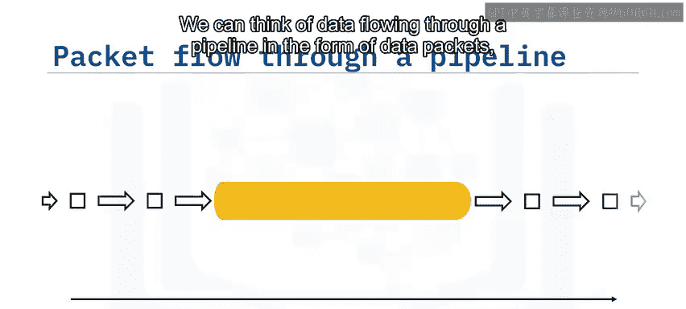

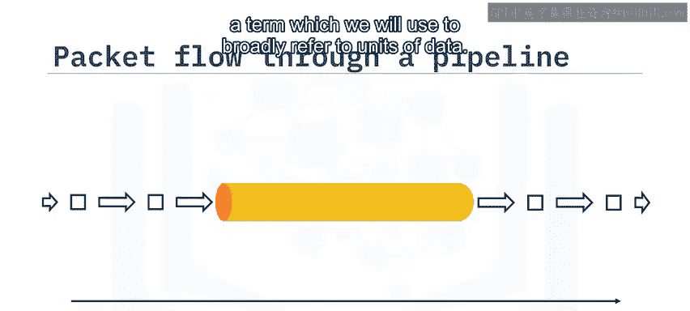

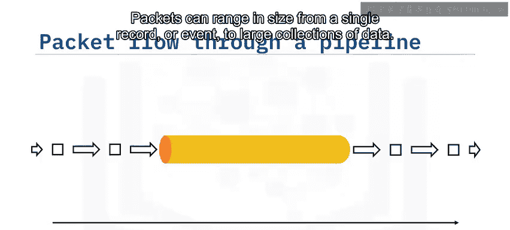

## 流水线性能指标 ⚙️

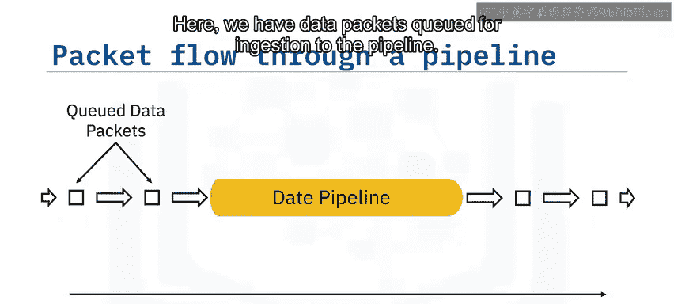

数据流水线的长度代表单个数据包遍历整个流水线所需的时间。数据包之间的箭头代表吞吐量延迟，即连续数据包到达之间的时间间隔。

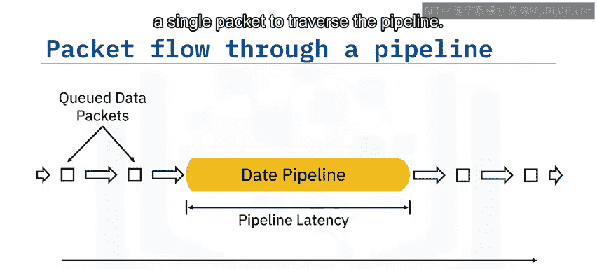

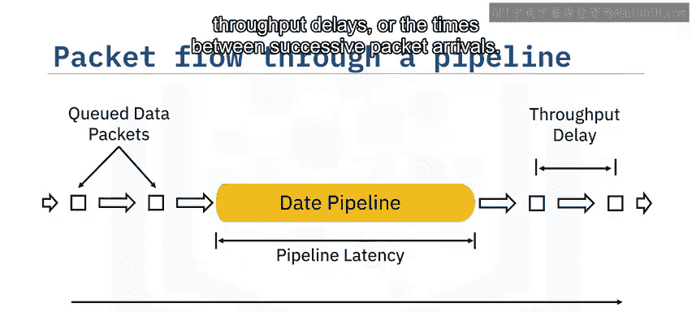

### 延迟

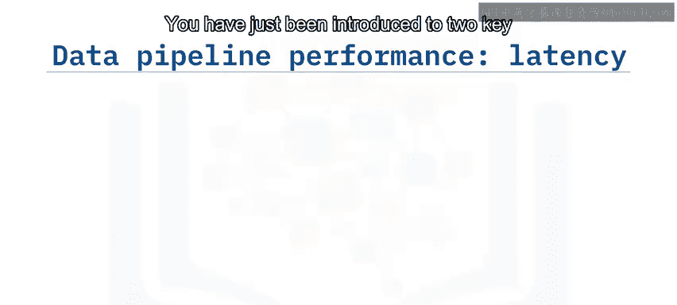

你刚刚了解了关于数据流水线的两个关键性能考量。第一个是**延迟**，它是指单个数据包通过整个流水线所需的总时间。

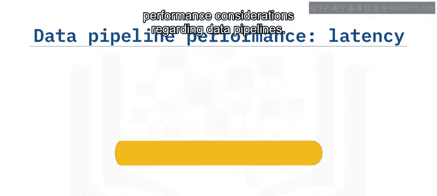

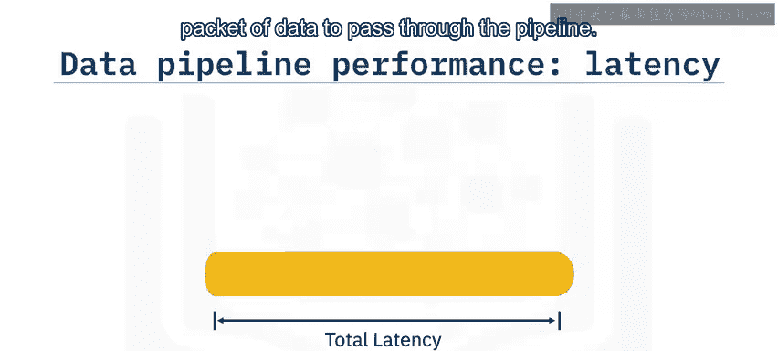

等效地说，延迟是数据包在流水线内每个处理阶段所花费的个体时间的总和。因此，总体延迟受限于流水线中最慢的进程。

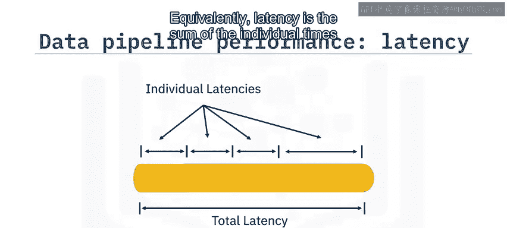

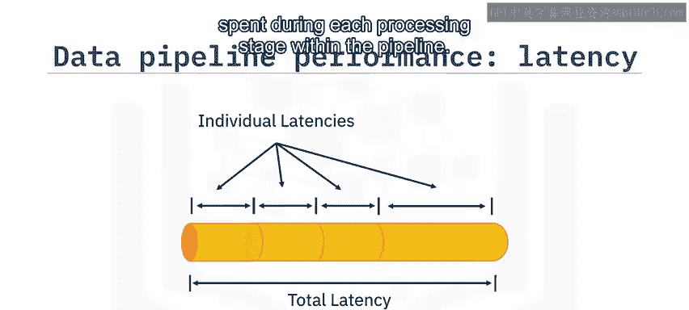

例如，无论你的互联网服务有多快，加载网页的时间将由服务器的速度决定。

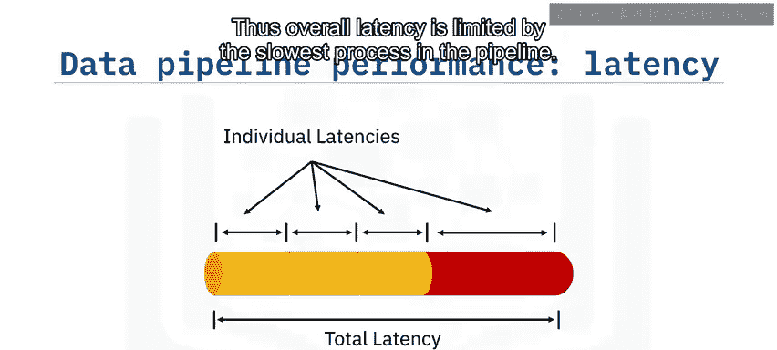

### 吞吐量

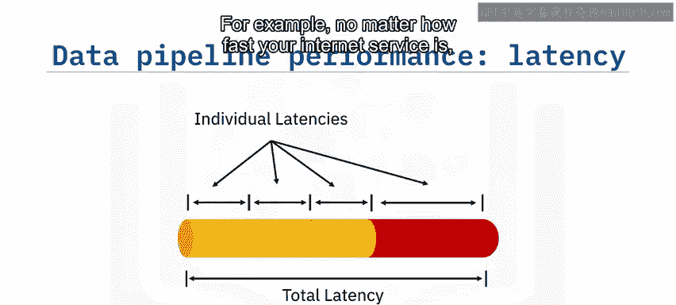

第二个性能考量称为**吞吐量**。它指的是单位时间内可以通过流水线传输的数据量。单位时间内处理更大的数据包可以提高吞吐量。

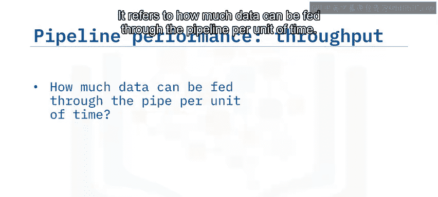

回到我们朋友传递箱子的例子，我们可以在右侧的图片中看到，在限度内，传递更大的箱子可以提高生产力。

## 数据流水线的应用场景 🌐

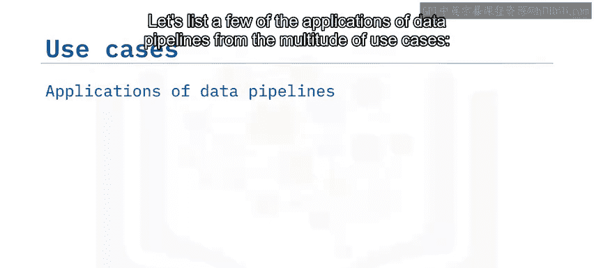

让我们从众多的用例中列举一些数据流水线的应用。

以下是一些常见的应用场景：

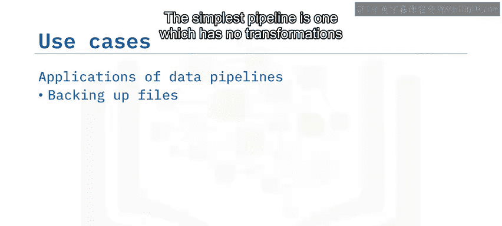

*   **数据备份**：最简单的流水线没有转换步骤，仅用于将数据从一个位置复制到另一个位置，例如文件备份。
*   **数据湖集成**：将不同的原始数据源集成到一个数据湖中。
*   **数据仓库迁移**：将事务记录移动到数据仓库。
*   **物联网数据流**：将来自物联网设备的数据流式传输，以便以仪表板或警报系统的形式提供信息。
*   **机器学习数据准备**：为机器学习开发或生产准备原始数据。
*   **消息传递**：例如电子邮件、短信或在线视频会议中的消息发送和接收。

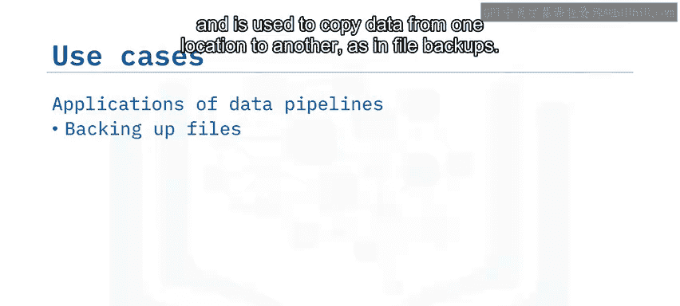

## 总结 📝

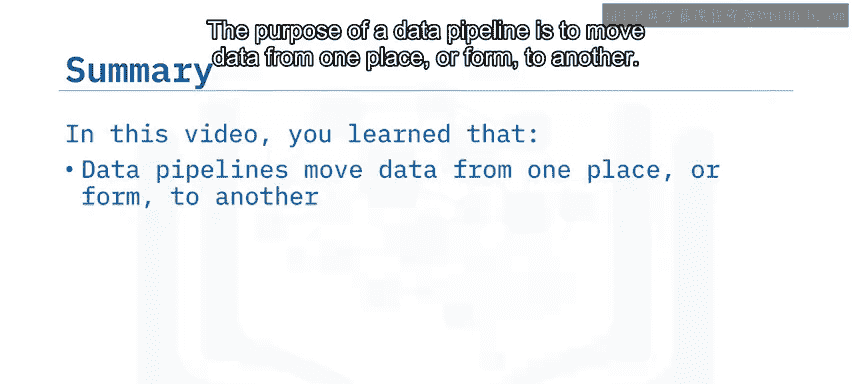

本节课中我们一起学习了数据流水线的基础知识。我们了解到，数据流水线的目的是将数据从一个地方或形式移动到另一个地方或形式。我们可以将流经流水线的数据可视化为一系列逐个流入和流出的数据包。

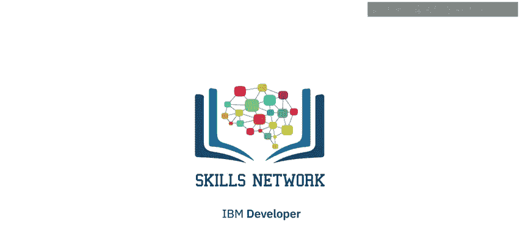

延迟和吞吐量是设计数据流水线时的关键考量因素。数据流水线的用例非常多，范围从简单的复制粘贴式数据备份到在线视频会议。