# 011：批处理与流式数据流水线的用例 📊

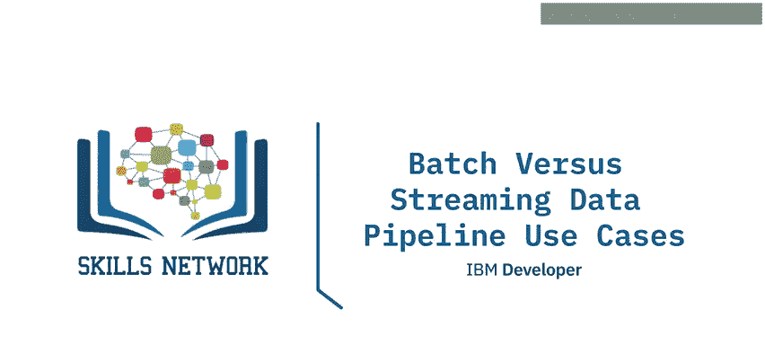

在本节课中，我们将学习批处理与流式数据流水线的核心概念、区别以及各自的典型应用场景。我们还将了解微批处理和Lambda架构这两种混合模式。

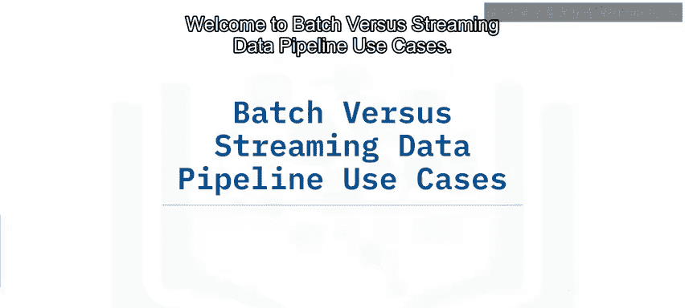

## 概述

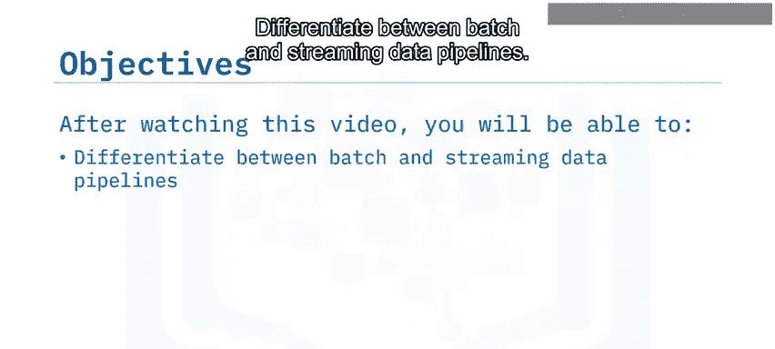

数据流水线根据数据处理和传输的时效性，主要分为**批处理**和**流式处理**两种模式。选择哪种模式取决于业务对数据**准确性**和**延迟**的不同要求。本节课程将详细解析这两种模式及其变体。

## 批处理数据流水线

上一节我们介绍了数据流水线的基本概念，本节中我们来看看批处理流水线。

当数据集需要作为一个完整的单元被提取和操作时，会使用批处理数据流水线。批处理过程通常按固定周期运行，间隔时间从几小时到几周不等。它也可以基于触发器启动，例如当源端积累的数据达到特定大小时。

批处理适用于不依赖数据最新性的场景。当**准确性至关重要**但对延迟要求不高时，通常会采用批处理数据流水线。尽管关键任务的流式技术正在迅速成熟，但批处理在需要高精度的场景中依然占有一席之地。

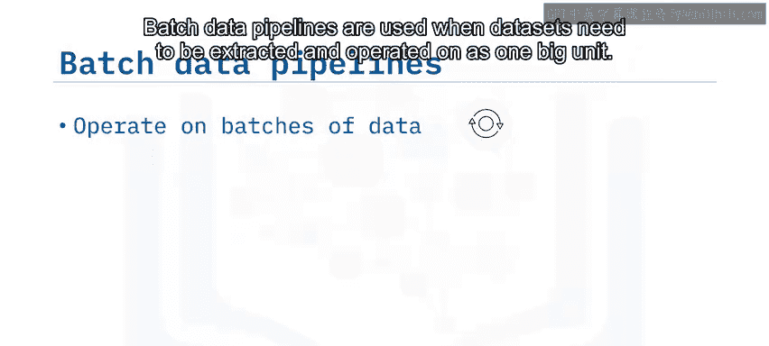

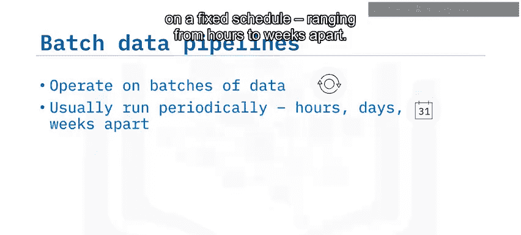

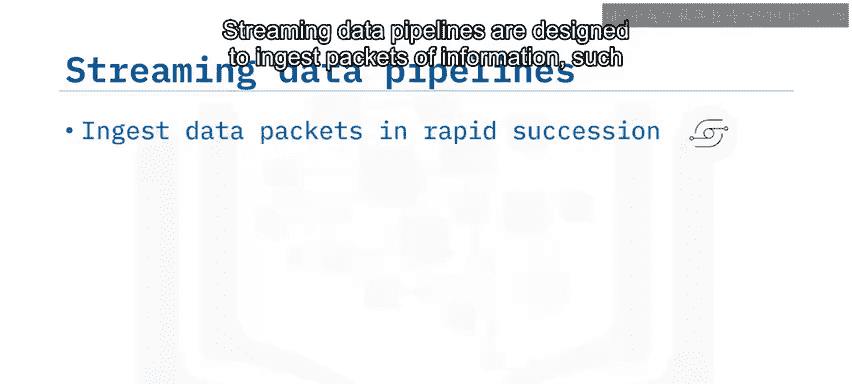

## 流式数据流水线

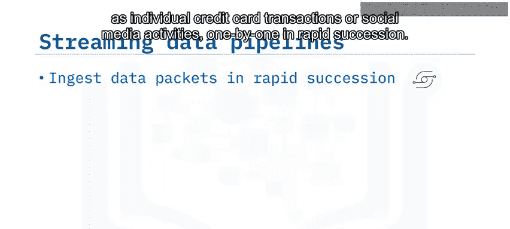

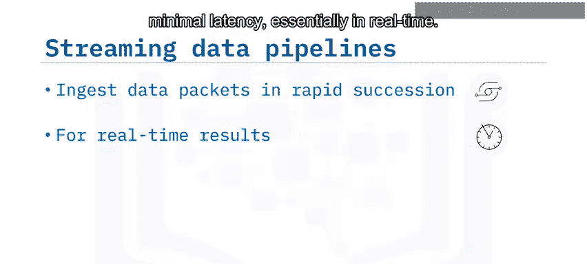

了解了批处理之后，我们再来看看它的对应模式——流式处理。

流式数据流水线旨在快速、连续地逐个摄取信息包，例如单笔信用卡交易或社交媒体活动。当业务要求结果具有**最低延迟**（本质上是实时）时，会使用流式处理。

在流式流水线中，记录或事件在发生时立即被处理。这些事件流也可以被追加到存储中，以构建历史记录供后续使用。其他软件系统可以发布（或写入）和订阅（或读取）这些事件流。

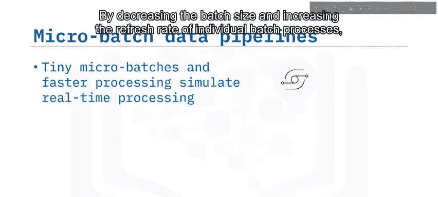

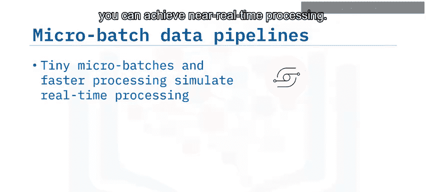

## 微批处理：一种混合方法

有时，我们希望在批处理的可靠性和流式处理的低延迟之间取得平衡。微批处理就是这样一种折中方案。

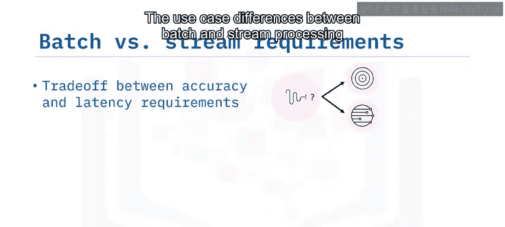

通过减小批处理的大小并提高单个批处理过程的刷新频率，可以使用**微批处理**来实现近实时处理。微批处理也可能有助于负载均衡，从而降低整体延迟。这在转换仅需要非常短时间窗口的数据时非常有用。

批处理和流式处理在用例上的差异，归根结底是**准确性**和**延迟**要求之间的权衡。例如，批处理可以对数据进行清洗，从而获得更高质量的输出，但这是以增加延迟为代价的。如果你要求低延迟，那么你对错误的容忍度可能就必须提高。

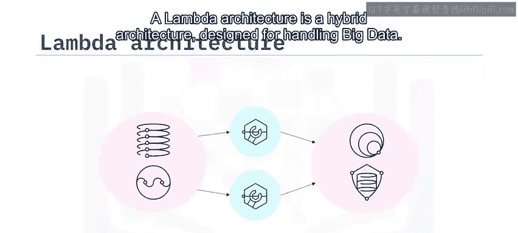

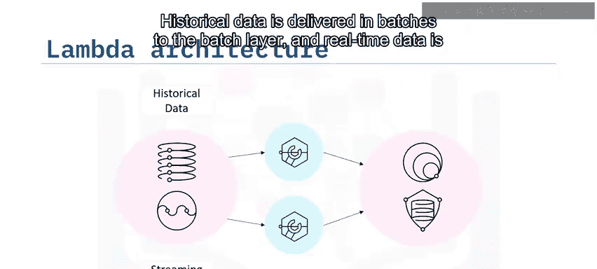

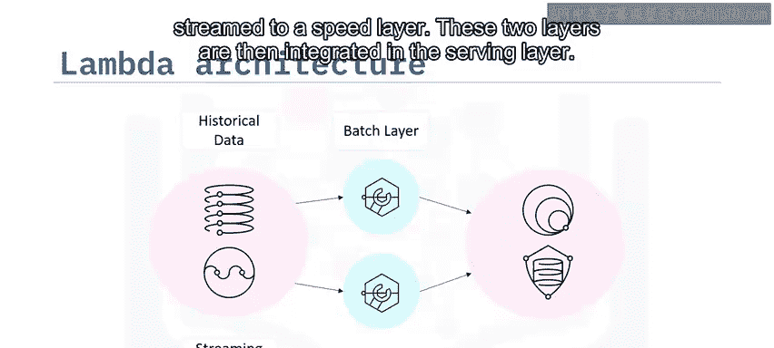

## Lambda架构

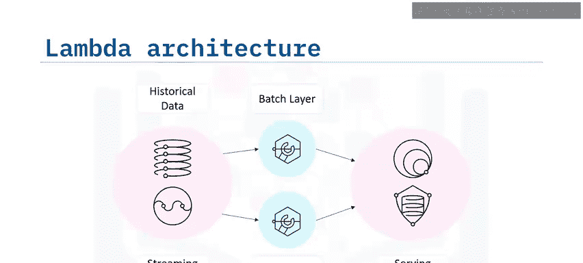

为了同时利用批处理和流式处理的优势，业界提出了Lambda架构。

**Lambda架构**是一种为处理大数据而设计的混合架构。Lambda架构结合了批处理和流式数据流水线方法：历史数据以批处理形式交付给**批处理层**，实时数据则流式传输到**速度层**。然后，这两层在**服务层**进行集成。

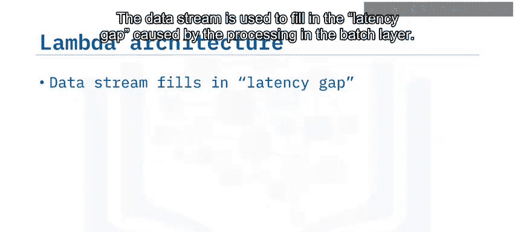

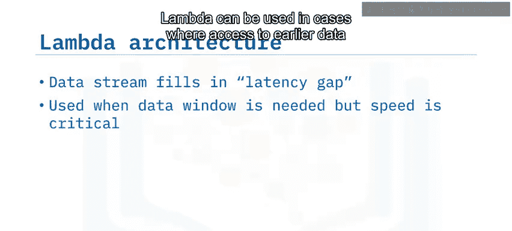

数据流用于填补批处理层处理所造成的延迟间隙。Lambda架构可用于需要访问早期数据但同时速度也很重要的场景。这种方法的缺点在于设计上的复杂性。当你追求**准确性和速度**时，通常会选择Lambda架构。

## 批处理流水线用例

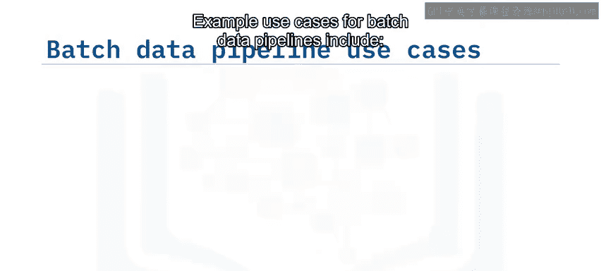

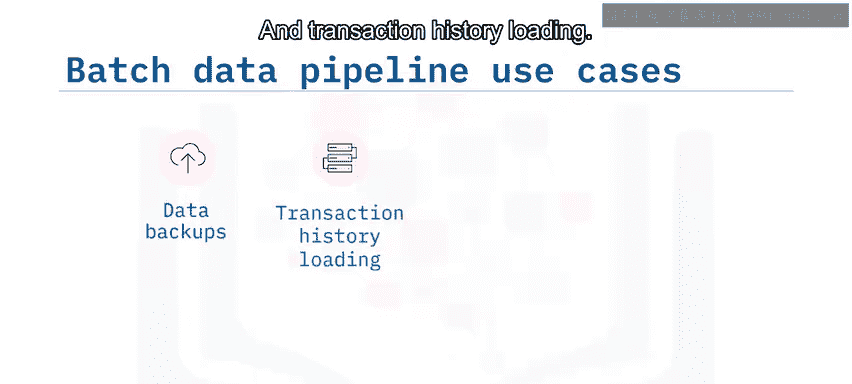

以下是批处理数据流水线的一些典型用例：

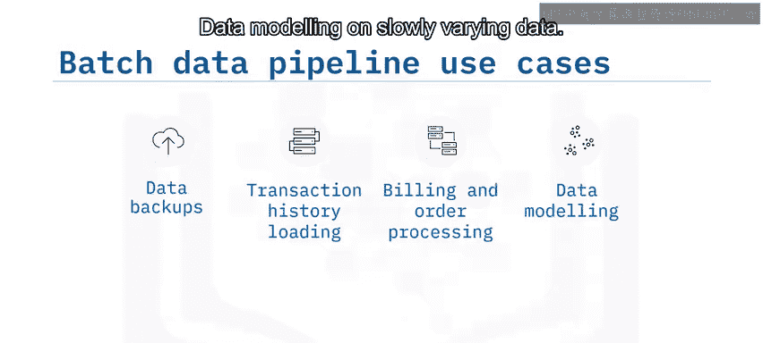

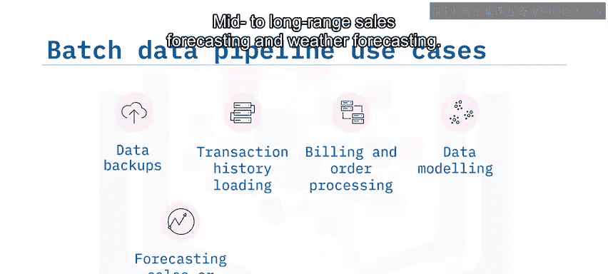

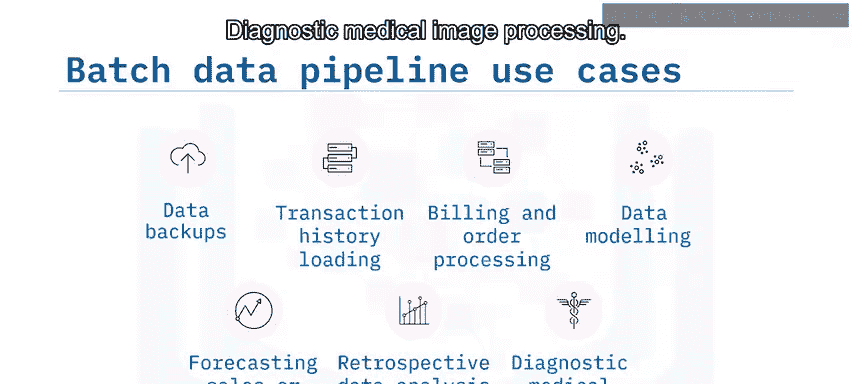

*   **定期数据备份**和交易历史加载。
*   客户订单和账单的**处理**。
*   对缓慢变化的数据进行**数据建模**，用于长期销售预测和天气预报。
*   **历史数据分析**和诊断性医学图像处理。

## 流式处理流水线用例

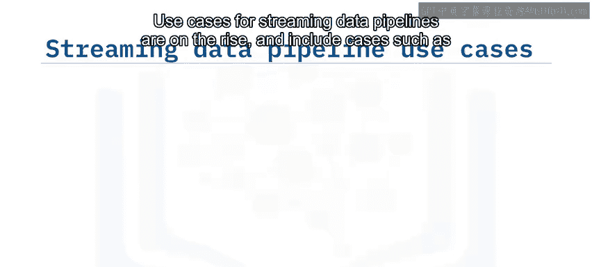

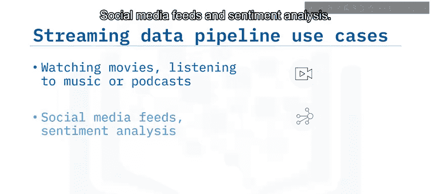

流式数据流水线的用例正在不断增长，以下是一些例子：

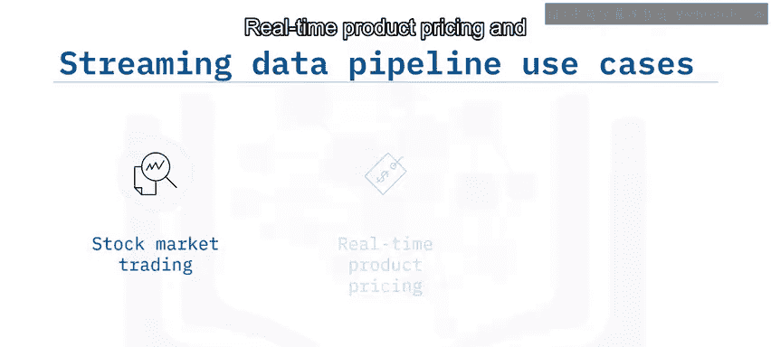

*   观看电影、听音乐或播客等**媒体流**。
*   **社交媒体信息流**和情感分析。
*   **欺诈检测**。
*   **用户行为分析**和定向广告。
*   **股票市场交易**。
*   **实时产品定价**。
*   **推荐系统**。

## 总结

本节课中，我们一起学习了数据流水线的两种核心模式。

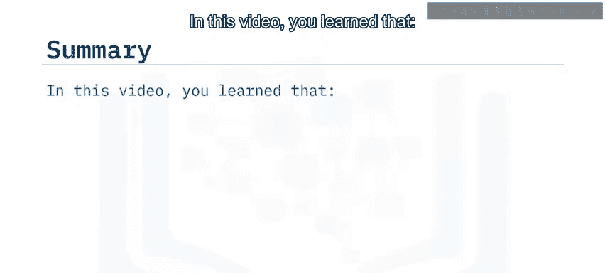

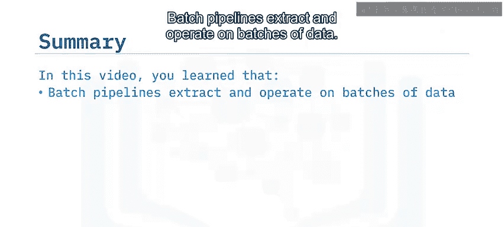

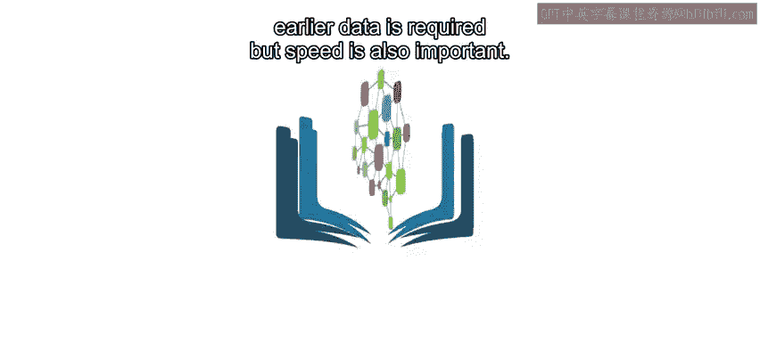

你了解到，**批处理流水线**提取并操作批量数据。当准确性至关重要或不需要最新数据时，会使用批处理。**流式数据流水线**则快速连续地逐个摄取数据包。当需要最新数据时，会使用流式流水线。**微批处理**可用于模拟实时数据流。而**Lambda架构**可用于需要访问早期数据但同时速度也很重要的场景。