# 012：数据流水线工具与技术 🛠️


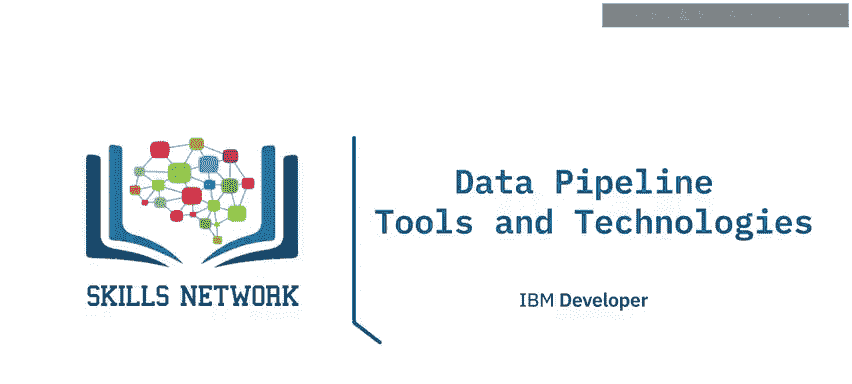

在本节课中，我们将学习数据流水线相关的工具与技术。我们将探讨现代企业级数据流水线工具的特点，并列举一系列开源和商业的ETL、ELT工具以及流数据处理工具。

---

## 🎯 概述

观看本视频后，你将能够：
*   讨论数据流水线技术。
*   列举开源和企业级的ETL与ELT工具。
*   列举流数据流水线工具。

---

## 🔧 现代企业级数据流水线工具特点

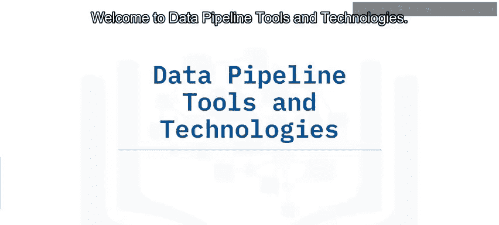

市面上有许多开源和商业的数据流水线工具及云服务可供选择。现代企业级ETL和ELT产品的典型特点包括以下方面：

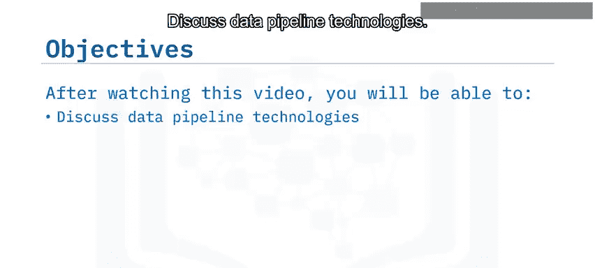

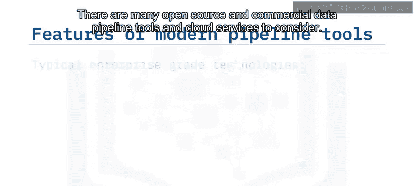

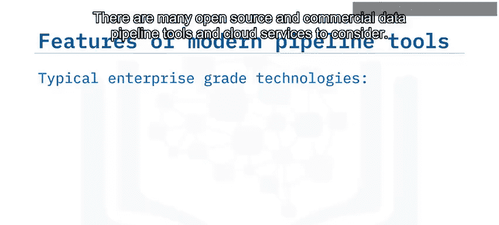

以下是其主要特点列表：

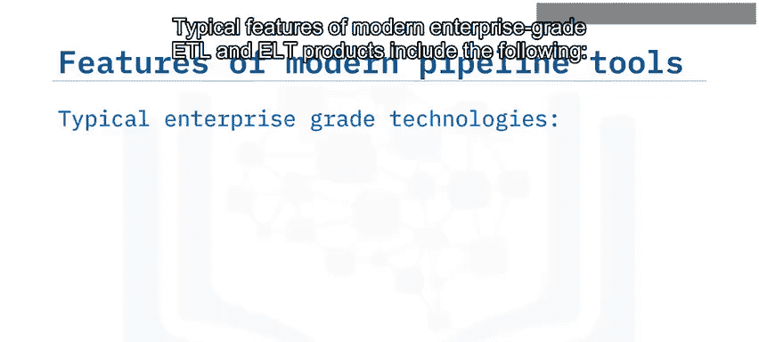

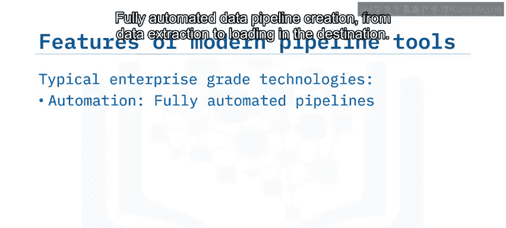

*   **全自动化流水线创建**：支持从数据提取到加载至目标端的全流程自动化。
*   **易于使用**：提供用于提取、转换和加载数据的规则建议。部分工具甚至能自动探查你的数据。
*   **拖拽式图形用户界面**：用于指定规则和数据流水线流程，也称为“无代码ETL”。
*   **复杂转换支持**：支持并协助完成复杂的数据转换，例如流操作、计算和数据合并。
*   **安全与合规**：现代工具会对传输中和静态的数据进行加密，并符合行业和政府法规（如HIPAA和GDPR）的认证要求。

---

## 🐍 开源工具：Python与Pandas

上一节我们介绍了企业级工具的特点，本节中我们来看看一些流行的开源工具。Python及其`pandas`库是一个非常流行且功能强大的编程环境，用于构建数据流水线。

`pandas`使用一种名为**数据框**的数据结构来处理类似Excel或CSV的表格数据。其核心概念可以表示为：

```python
import pandas as pd
# 创建一个数据框
df = pd.DataFrame(data)
# 进行数据转换操作
df_transformed = df[df['column'] > value]
```

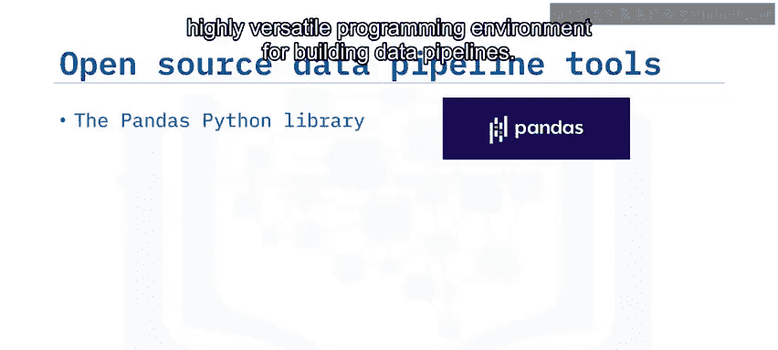

它是一个用于原型设计ETL流水线和进行探索性数据分析的优秀工具。但由于数据框操作必须在内存中进行，要扩展到大数据场景可能具有挑战性。

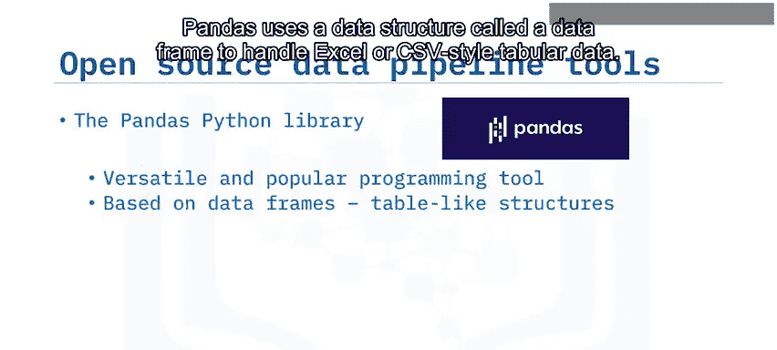

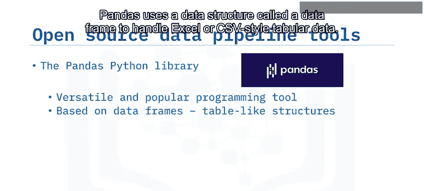

具有类似数据框API的库包括**Dask**、**Vaex**和**Apache Spark**，它们都能帮助你扩展到大数据处理。为了获得更好的可扩展性，也可以考虑使用类似SQL的替代方案，例如**PostgreSQL**。

---

## ✈️ 开源工具：Apache Airflow

另一个基于Python编程语言的包是**Apache Airflow**，它是一个功能极为丰富且知名的“代码即配置”开源数据流水线平台范例。

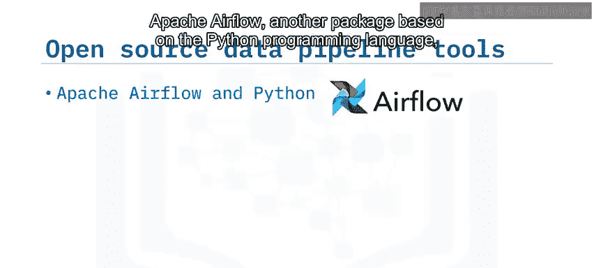

Apache Airflow由Airbnb开源，旨在通过编程方式编写、调度和监控数据流水线工作流。它被设计为可扩展的，能够处理任意数量的并行计算节点。Airflow与大多数云平台集成，包括AWS、IBM Cloud、Google Cloud和Microsoft Azure。

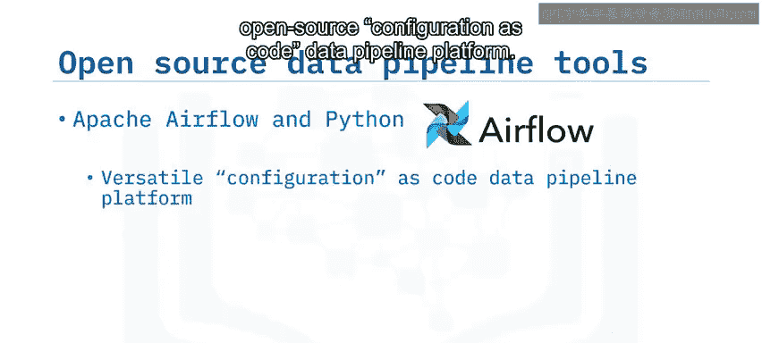

---

## 🎨 开源工具：Talend Open Studio

**Talend Open Studio**是另一个开源的数据流水线开发和部署平台。它支持大数据迁移、数据仓库和分析，并包含协作、监控和调度功能。

它同样拥有一个交互式的拖拽式图形用户界面，允许你创建ETL流水线，无需编写代码，因为Java代码会自动生成。它还能连接到许多数据仓库，如Google Sheets、RDBMS、IBM DB2和Oracle。

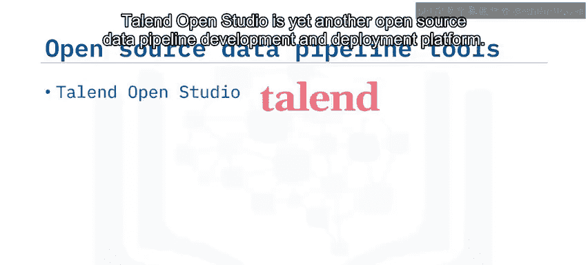

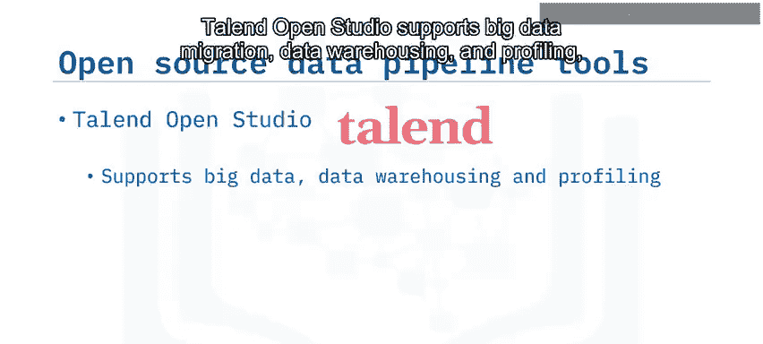

---

## ☁️ 企业级工具：AWS Glue

在众多企业级数据流水线工具中，**AWS Glue**是一项完全托管的ETL服务，可让你轻松准备和加载数据以进行分析。

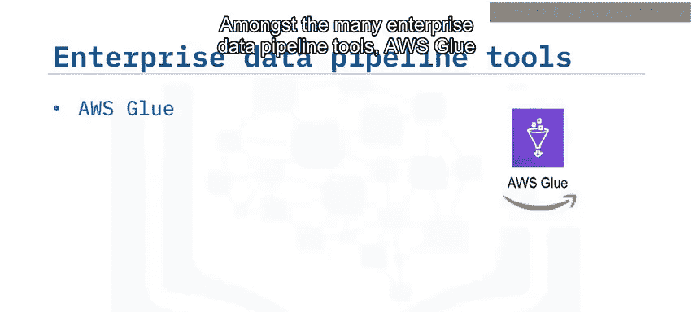

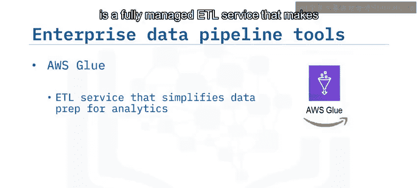

AWS Glue会探查你的数据源以发现数据格式，并建议存储数据的模式。你可以使用AWS控制台快速创建并运行ETL作业。

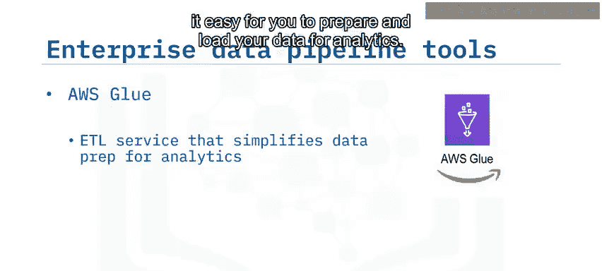

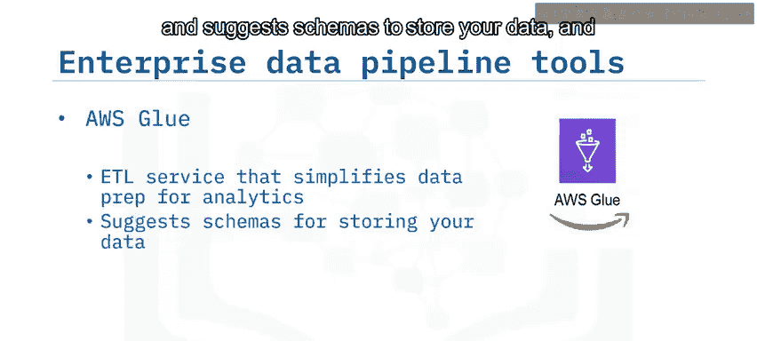

---

## 🔄 企业级工具：Panoply

**Panoply**是另一个企业级解决方案，但其侧重点在于ELT而非ETL。它无需代码即可处理数据连接和集成，并自带SQL功能，因此你可以生成数据的视图。这使你能够将时间专注于数据分析，而非优化数据流水线。

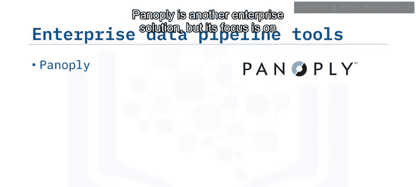

Panoply还与许多仪表板和商业智能工具集成，包括Tableau和Power BI。

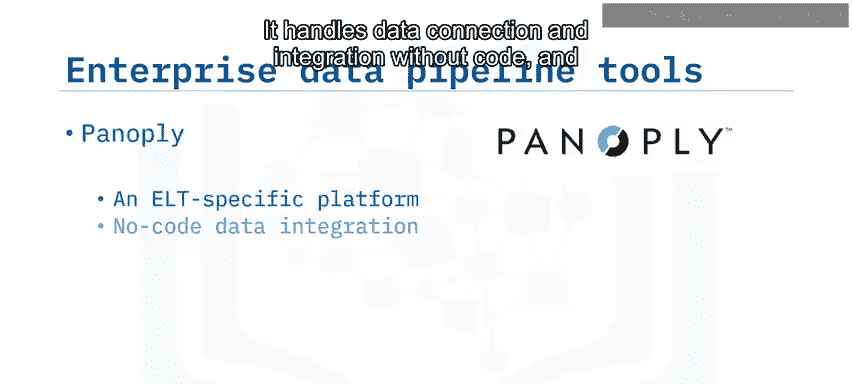

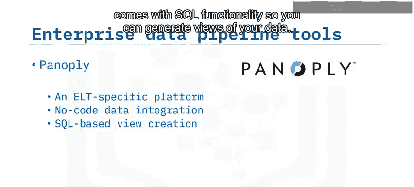

---

## 📊 企业级工具：Alteryx

**Alteryx**是另一个知名的商业数据流水线工具。它也是一个功能丰富的自助式数据分析平台，拥有多款产品。

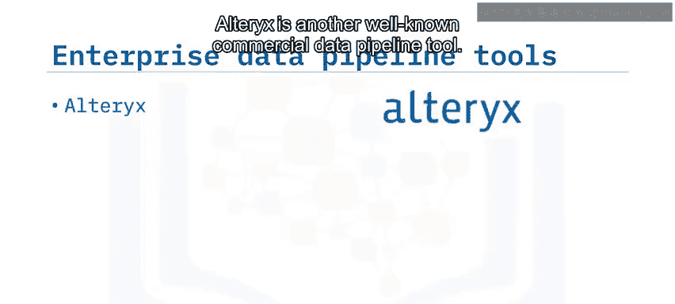

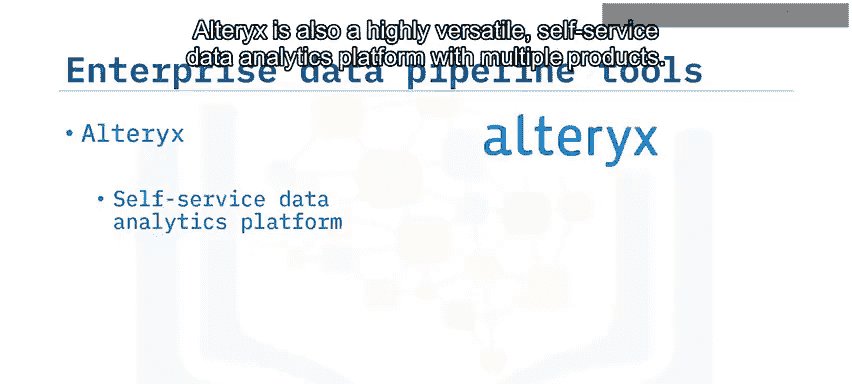

它提供拖拽式访问内置的ETL工具，你无需了解SQL或编程即可创建和维护复杂的数据流水线。

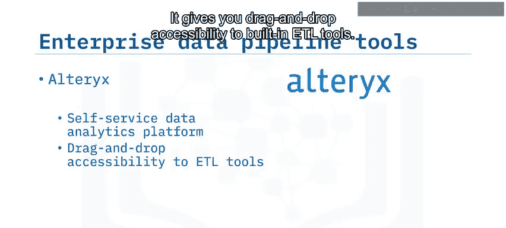

---

## 💼 企业级工具：IBM InfoSphere DataStage

**IBM InfoSphere DataStage** 是一款数据集成工具，用于设计、开发和运行ETL及ELT流水线。它是IBM InfoSphere Information Server的数据集成组件。

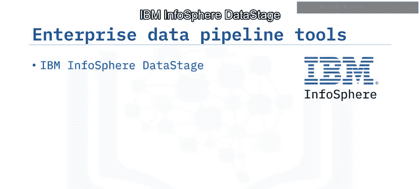

与许多其他平台一样，它也提供了一个用于开发工作流的拖拽式框架。InfoSphere DataStage还利用并行处理和企业级连接性，提供了一个真正可扩展的平台。

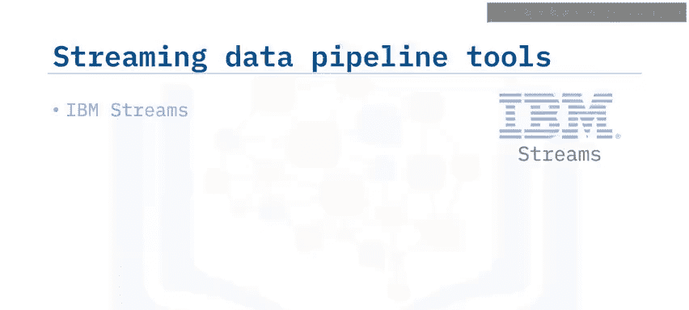

---

## 🌊 流处理工具：IBM Streams

上一节我们介绍了批处理工具，本节我们转向实时数据处理。**IBM Streams** 是一种流数据流水线技术，使你能够使用流处理语言（SPL）以及Java、Python或C++构建实时分析应用程序。

你可以用它来混合动态数据和静态数据，以实时提供持续的情报分析。Streams驱动着一项流分析服务，允许你以亚毫秒级的延迟每秒摄取和分析数百万个事件。

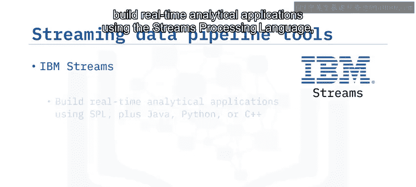

IBM Streams还附带了**IBM Streams Flows**工具，它允许你将操作符拖放到画布上，并通过内置的设置面板修改参数。

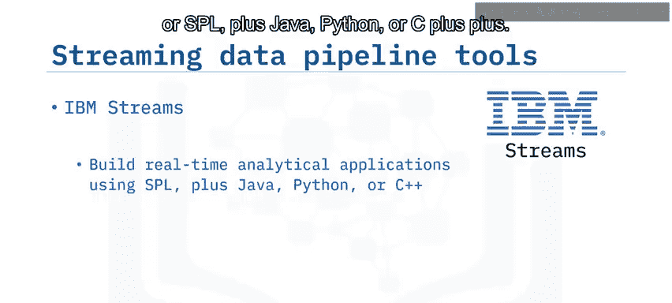

---

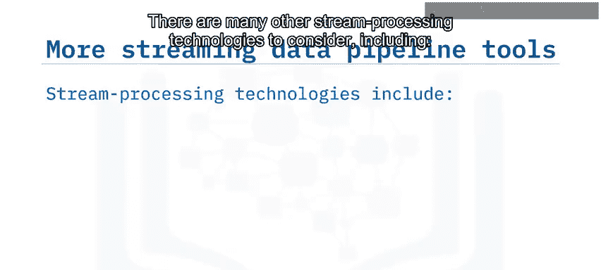

## ⚡ 其他流处理技术

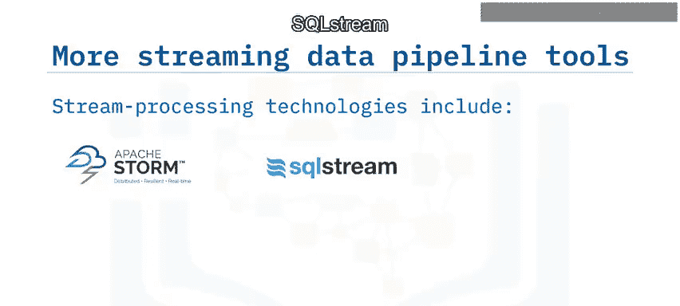

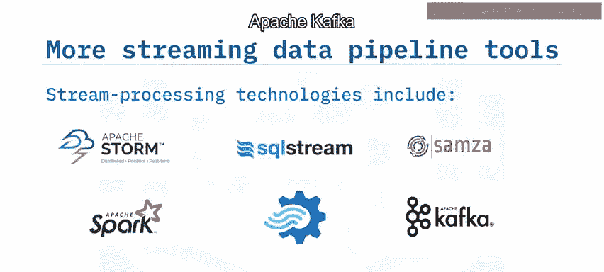

还有许多其他流处理技术值得考虑，包括：

以下是部分主流流处理技术列表：

*   Apache Storm
*   SQL Stream
*   Apache Samza
*   Apache Spark
*   Azure Stream Analytics
*   Apache Kafka

---

## 📝 总结

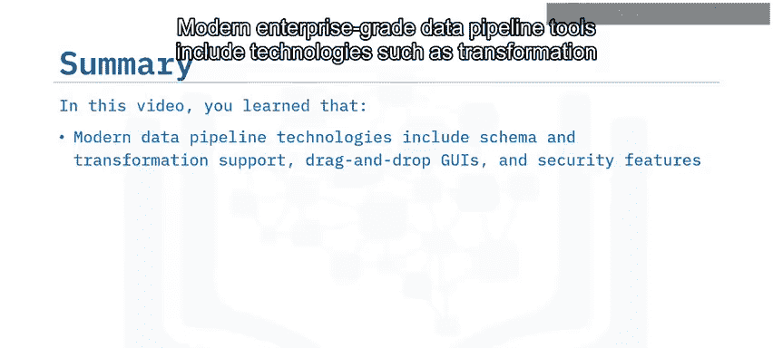

本节课中，我们一起学习了以下内容：

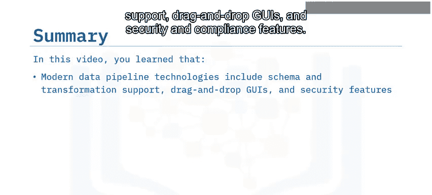

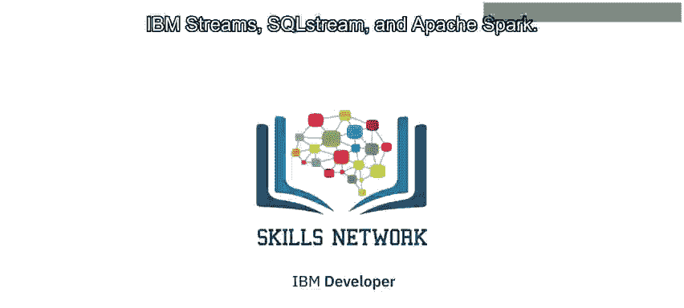

*   现代企业级数据流水线工具包含诸如转换支持、拖拽式图形界面以及安全与合规等功能。
*   Pandas、Vaex和Dask是用于原型设计和构建数据流水线的有用开源Python库。
*   Apache Airflow和Talend Open Studio允许你以编程方式编写、调度和监控大数据工作流。
*   Panoply专门用于ELT流水线，而像Alteryx和IBM InfoSphere DataStage这样的工具可以处理ETL和ELT两种工作流。
*   流处理技术包括Apache Kafka、IBM Streams、SQL Stream和Apache Spark。