# 013：Apache Airflow 概述 🚀

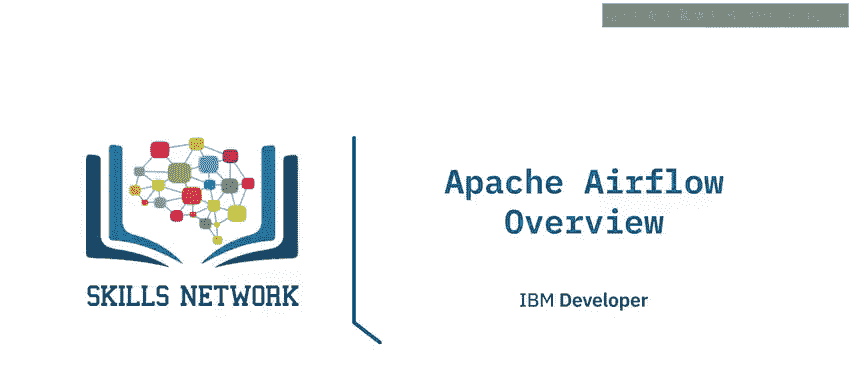

在本节课中，我们将学习 Apache Airflow 这一强大的工作流编排平台。我们将了解它的核心概念、主要组件、工作原理、关键特性以及常见应用场景。

---

## 什么是 Apache Airflow？ 🤔

Apache Airflow 是一个由活跃社区支持的开源工作流编排工具。它是一个平台，允许你以编程方式创建、调度和监控工作流，例如批处理数据管道。

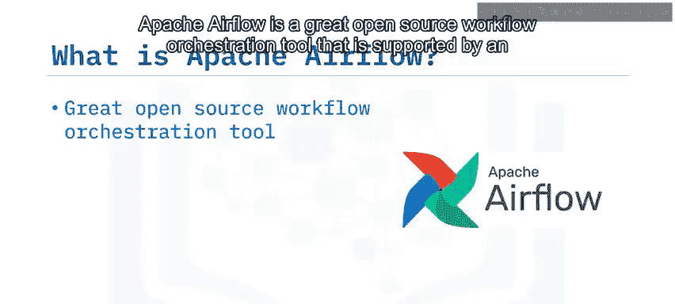

在 Apache Airflow 中，一个工作流被表示为一个 **DAG**，即有向无环图。DAG 包含称为“任务”的独立工作单元，这些任务按照依赖关系排列。

**请注意**：与 Apache Kafka、Apache Storm、Apache Spark 或 Flink 等大数据工具不同，Apache Airflow **不是** 数据流处理解决方案。它主要是一个工作流管理器。

---

## Apache Airflow 核心组件 🧩

上一节我们介绍了 Apache Airflow 的基本概念，本节中我们来看看它的核心架构组件。以下是 Apache Airflow 基本组件的简化概述：

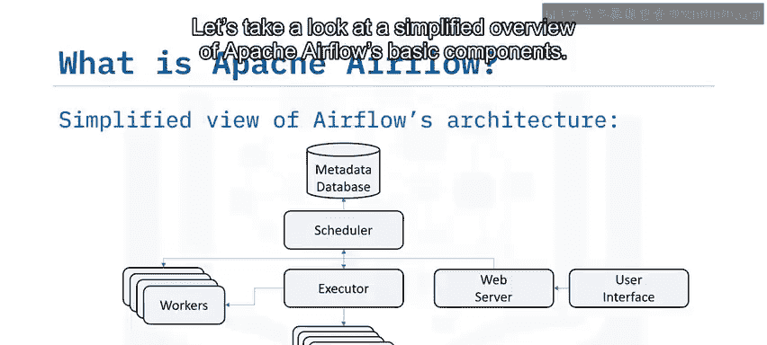

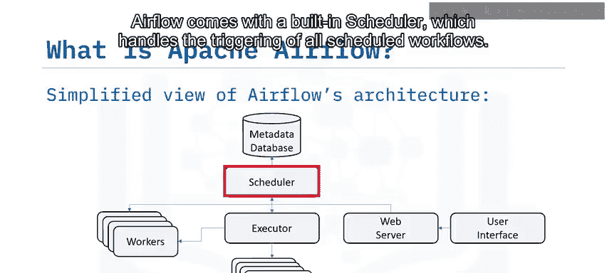

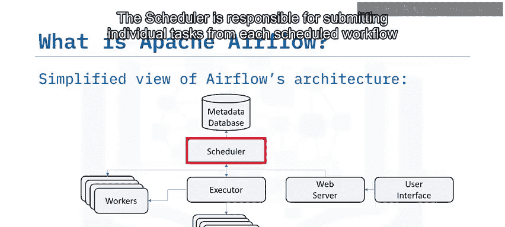

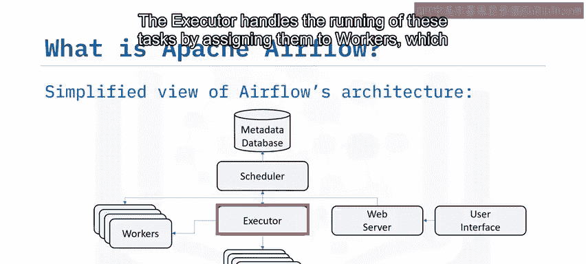

*   **调度器**：Airflow 内置了一个调度器，负责触发所有已调度的工作流。它判断任务依赖关系是否满足，并将任务提交给执行器。
*   **执行器**：执行器负责运行任务，它将任务分配给工作节点。
*   **工作节点**：工作节点是实际运行任务的计算单元。
*   **Web 服务器**：Web 服务器提供 Airflow 强大的交互式用户界面。通过此 UI，你可以检查、触发和调试你的 DAG 及其任务。
*   **DAG 目录**：该目录包含你所有的 DAG 文件，供调度器、执行器及其工作节点访问。
*   **元数据数据库**：Airflow 使用一个元数据数据库，供调度器、执行器和 Web 服务器存储每个 DAG 及其任务的状态。

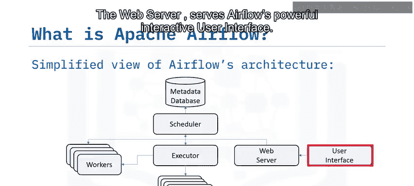

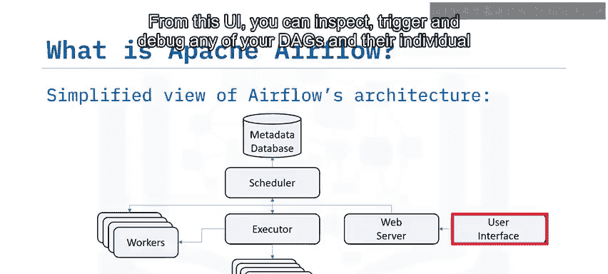

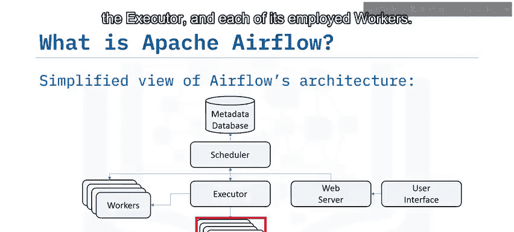

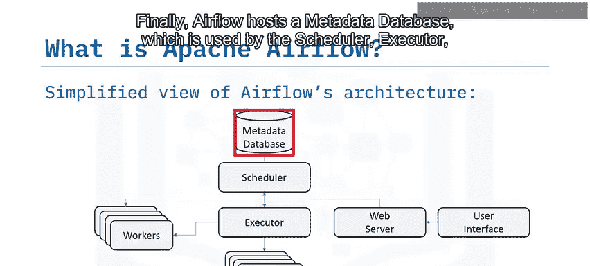

---

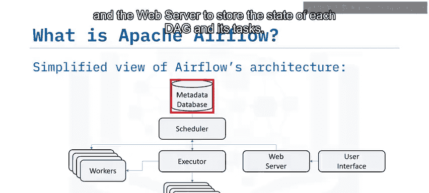

## DAG 与任务生命周期 🔄

一个 DAG 规定了任务之间的依赖关系和执行顺序，而任务本身则描述了要执行的具体操作。例如，一个 DAG 中的任务可能包括数据摄取、数据分析、保存数据、生成报告以及通过电子邮件触发错误报告等系统。

现在，让我们了解一下任务在其生命周期中可能经历的状态变化。下图展示了 Apache Airflow 如何为任务分配状态：

*   **无状态**：任务尚未排队等待执行。
*   **已调度**：调度器已确定任务依赖关系满足，并已安排其运行。
*   **已移除**：由于某些原因，任务在 DAG 运行开始后消失了。
*   **上游失败**：一个上游任务失败了。
*   **已排队**：任务已分配给执行器，正在等待可用的工作节点。
*   **运行中**：任务正在由工作节点运行。
*   **成功**：任务运行完成，没有错误。
*   **失败**：任务在执行过程中出错，运行失败。
*   **重试中**：任务失败，但仍有重试次数，将被重新调度。

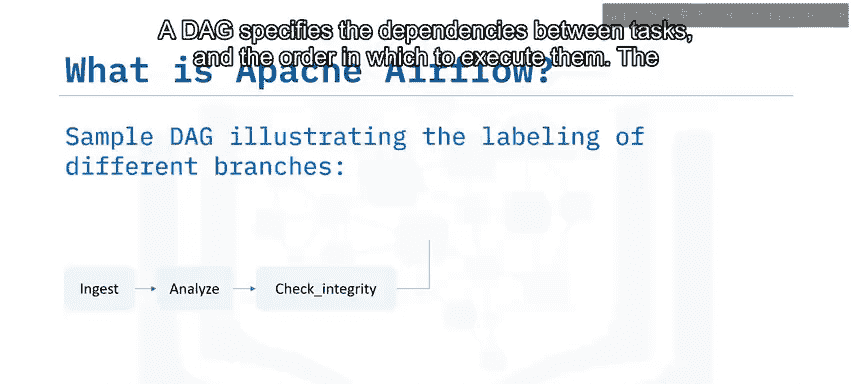

理想情况下，一个任务应该从“无状态”流经“已调度”、“已排队”、“运行中”，最终到达“成功”状态。

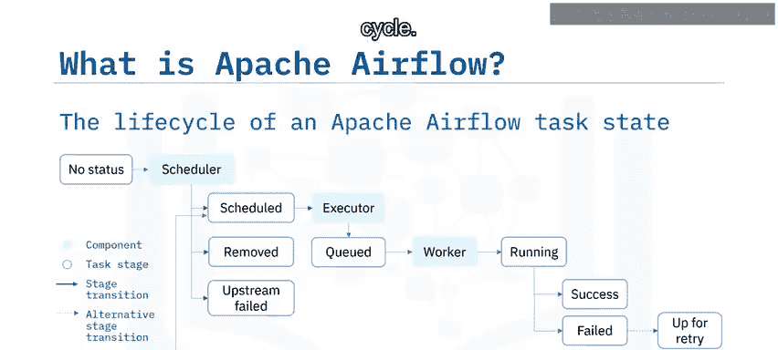

---

## Apache Airflow 的五大特性与优势 ✨

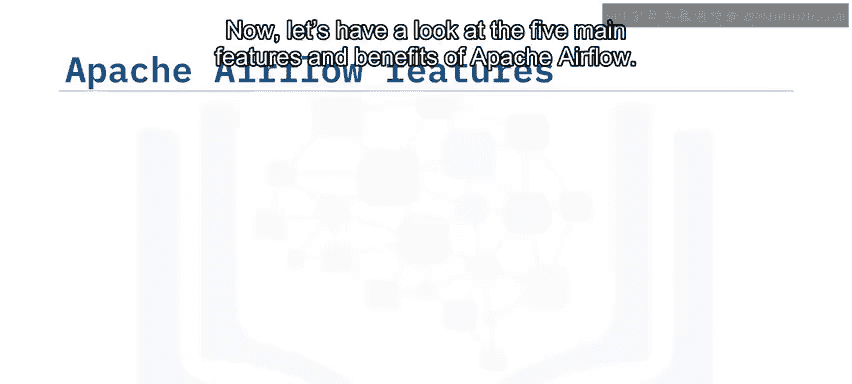

了解了任务的生命周期后，我们来看看 Apache Airflow 广受欢迎的五大主要特性和优势：

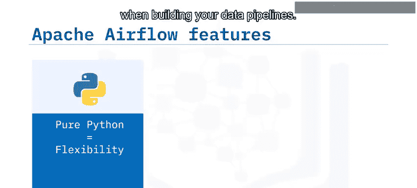

以下是 Apache Airflow 的五大核心优势：

1.  **纯 Python**：使用标准 Python 创建你的工作流。这使你在构建数据管道时能保持完全的灵活性。核心概念可以表示为：`workflow = Python_Code()`
2.  **实用的 UI**：通过一个功能完善的 Web 应用程序监控、调度和管理你的工作流，让你能全面了解任务状态。
3.  **丰富的集成**：Apache Airflow 提供了许多即插即用的集成（如 IBM Cloudant），可以随时执行你的任务。
4.  **易于使用**：任何具备 Python 知识的人都可以部署工作流。Airflow 不限制你管道的范围。
5.  **开源**：当你想要分享你的改进时，可以通过提交拉取请求来实现。Airflow 拥有许多活跃用户，他们在 Apache Airflow 社区中分享经验。

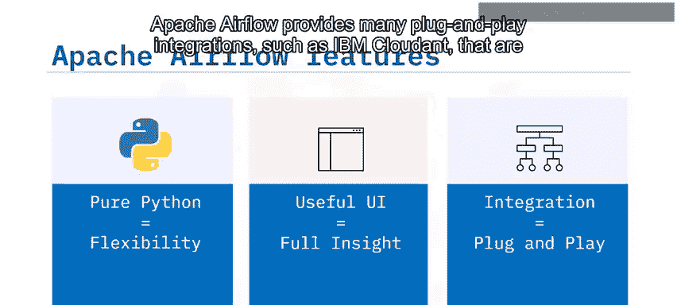

---

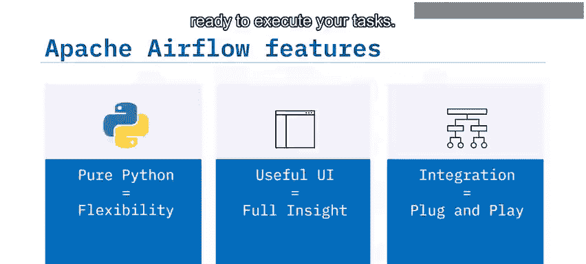

## Apache Airflow 的设计原则 🏗️

Apache Airflow 管道建立在四个主要原则之上：

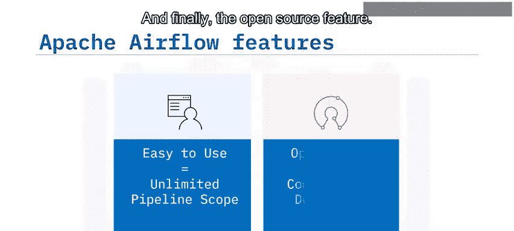

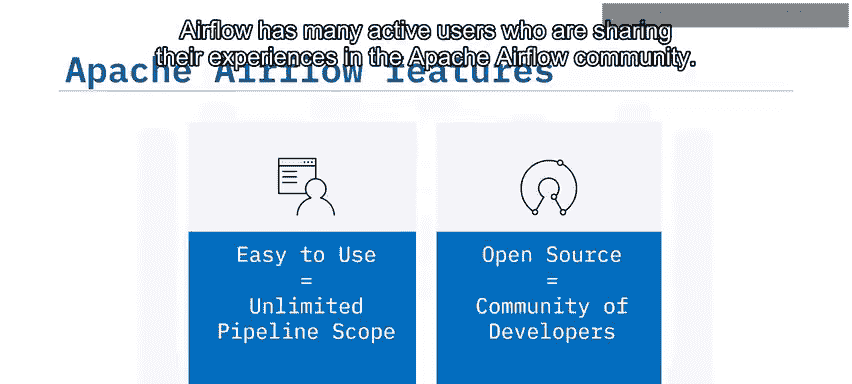

1.  **可扩展**：Airflow 采用模块化架构，并使用消息队列来协调任意数量的工作节点，可以轻松扩展到极大规。
2.  **动态**：Airflow 管道使用 Python 定义，允许动态生成管道。因此，你的管道可以包含多个同时执行的任务。
3.  **可扩展**：你可以轻松定义自己的操作符并扩展库，以适应你的特定环境需求。
4.  **简洁**：Airflow 管道简洁而明确。参数化是其核心功能，通过强大的 Jinja 模板引擎实现。

---

## Apache Airflow 常见用例 🏢

Apache Airflow 已帮助许多公司实现了目标，以下是一些常见用例：

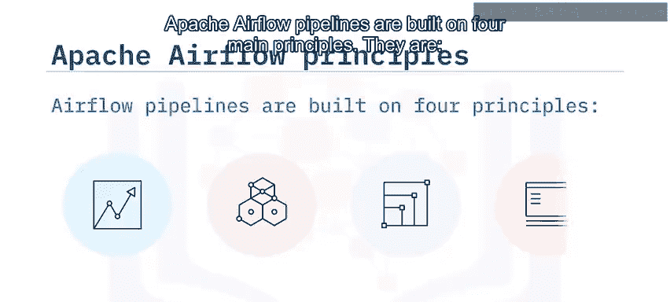

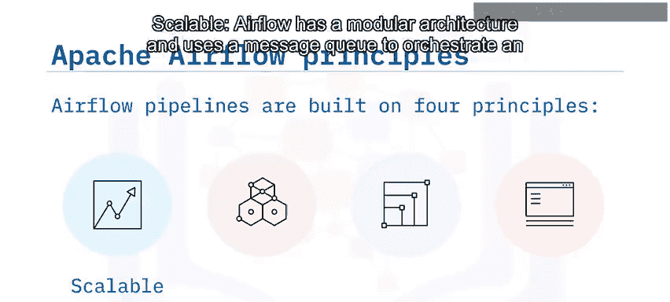

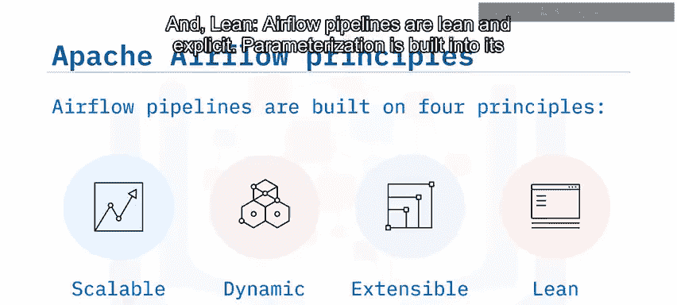

*   **Shopify**：使用 Airflow 定义和组织机器学习管道依赖关系。
*   **SeniorLink**：提高了其批处理流程的可见性，并实现了解耦。
*   **Xperity**：将 Airflow 部署为企业级调度工具。
*   **One Football**：使用 Airflow 协调数据仓库中的 SQL 转换，并发送每日分析邮件。

---

## 总结 📝

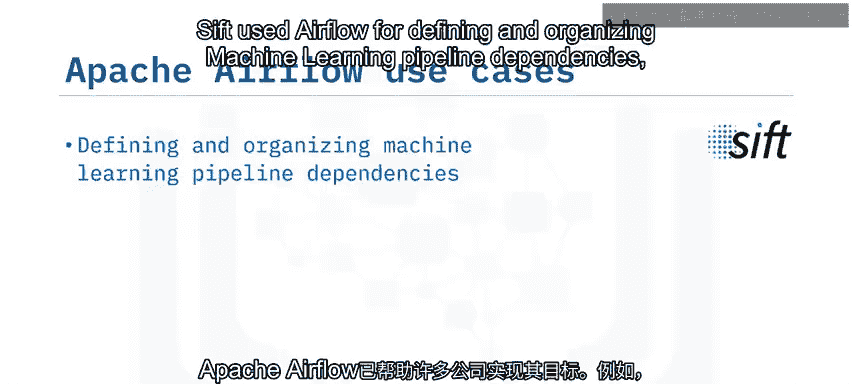

本节课中我们一起学习了 Apache Airflow 的核心知识。我们了解到 Apache Airflow 是一个用于以编程方式创建、调度和监控工作流的平台。

其五大主要特性包括：使用 Python、直观实用的用户界面、丰富的即插即用集成、易于使用以及开源性质。

我们还学习了 Apache Airflow 的四大设计原则：可扩展性、动态性、可扩展性和简洁性。

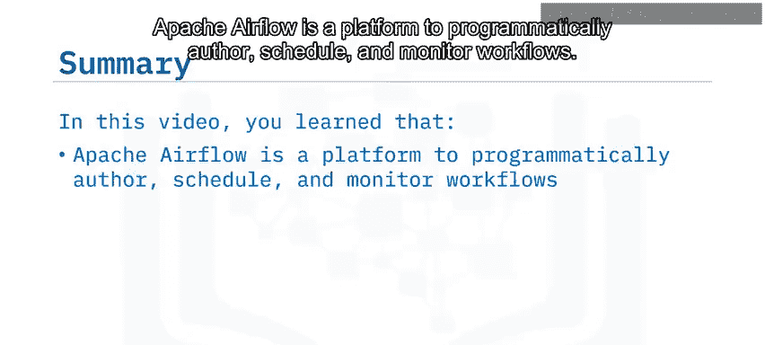

最后，我们看到了使用 Apache Airflow 定义和组织机器学习管道依赖关系是其常见用例之一。