# 015：Apache Airflow UI 详解 🖥️

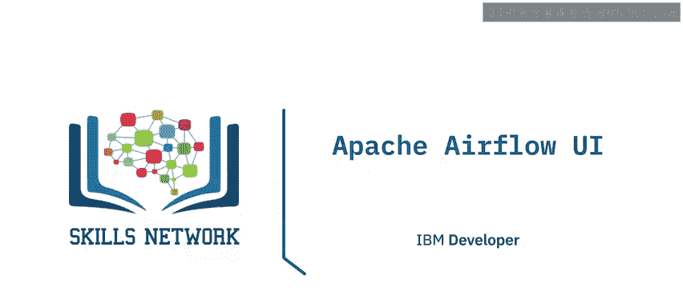

在本节课中，我们将学习Apache Airflow用户界面的核心功能。你将了解如何识别环境中的DAG，通过多种方式可视化DAG，审查定义DAG的代码，分析任务在多轮运行中的持续时间，以及查看任务实例的上下文元数据。

## 欢迎来到Apache Airflow用户界面

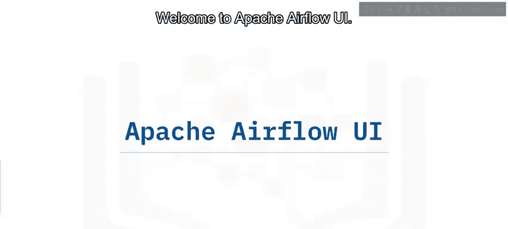

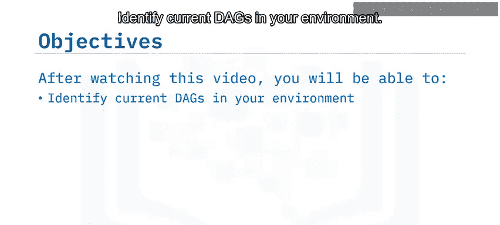

观看本视频后，你将能够识别环境中的当前DAG，列出可视化特定DAG的不同方法，审查定义DAG的代码，分析DAG中每个任务在多轮运行中的持续时间，并为任何任务实例选择上下文元数据。

## DAGs视图概览 📊

Apache Airflow用户界面的默认登录页面是DAGs视图。这是一个表格，包含环境中每个DAG的数据。

以下是DAGs视图中每一行显示的信息：

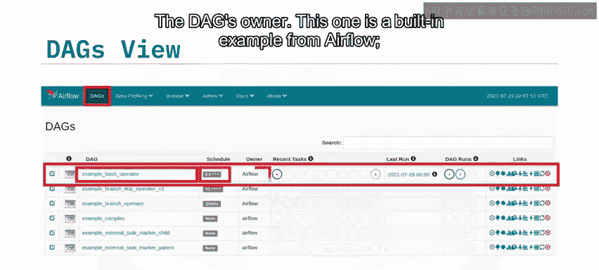

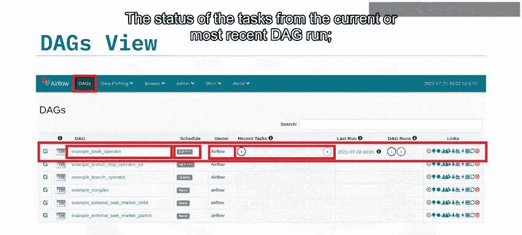

*   **DAG名称**：DAG的唯一标识。
*   **运行计划**：DAG的运行调度时间，通常以Cron格式显示。
*   **所有者**：DAG的创建者或负责人。
*   **任务状态**：当前或最近一次DAG运行中各个任务的状态。
*   **历史运行状态**：所有先前DAG运行的状态概览。
*   **快速链接**：最左侧的列提供了一系列快速链接，可以深入查看与该DAG相关的更多信息。
*   **暂停/启动开关**：在下一列，你可以通过开关来暂停或启动一个DAG。目前，这里显示的所有DAG都处于未运行状态。

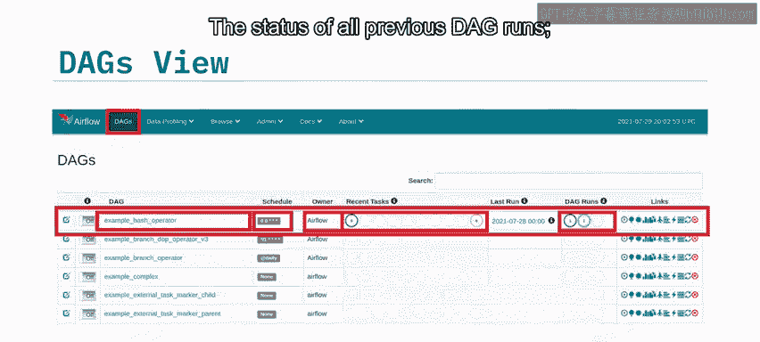

## 可视化DAG的多种方式

你可以通过以下几种方式可视化DAG。首先，点击你想要查看的DAG名称。例如，这个名为“simple example”的DAG目前正在生产环境中运行，你可以通过其旁边的“开启”按钮确认这一点。

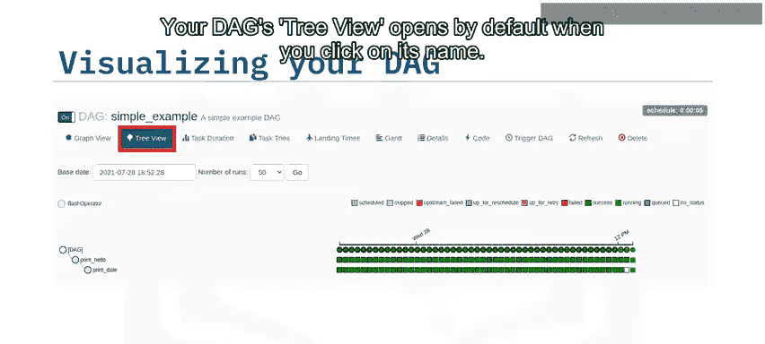

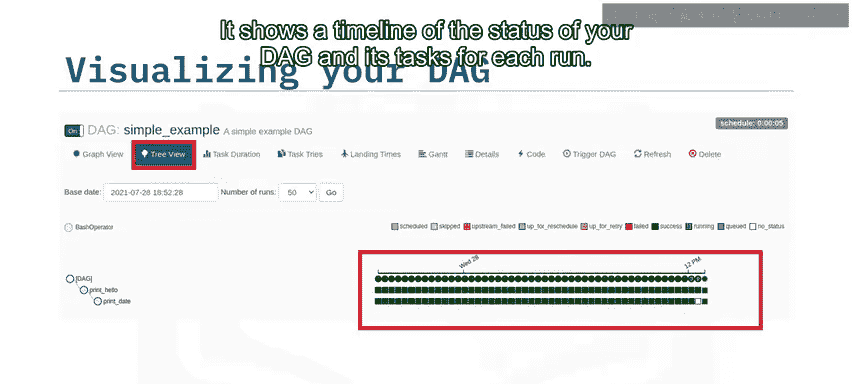

### 树状视图

点击DAG名称后，默认会打开该DAG的树状视图。它按时间线显示了你的DAG及其任务在每次运行中的状态。

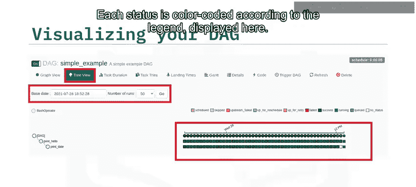

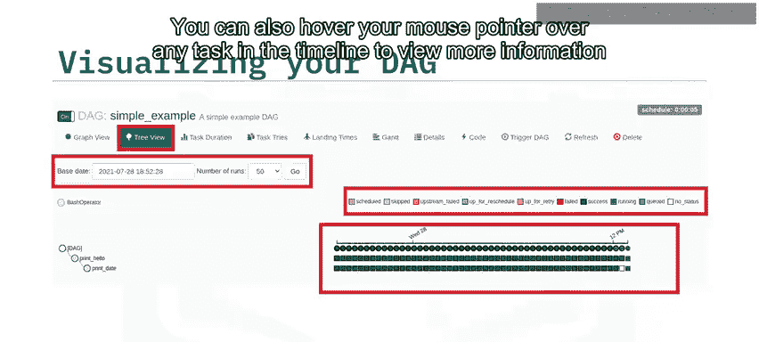

在树状视图中，你可以选择基准状态和要显示的运行次数。每种状态都根据此处显示的图例进行了颜色编码。你还可以将鼠标指针悬停在时间线上的任何任务上，以查看更多相关信息。

### 图形视图

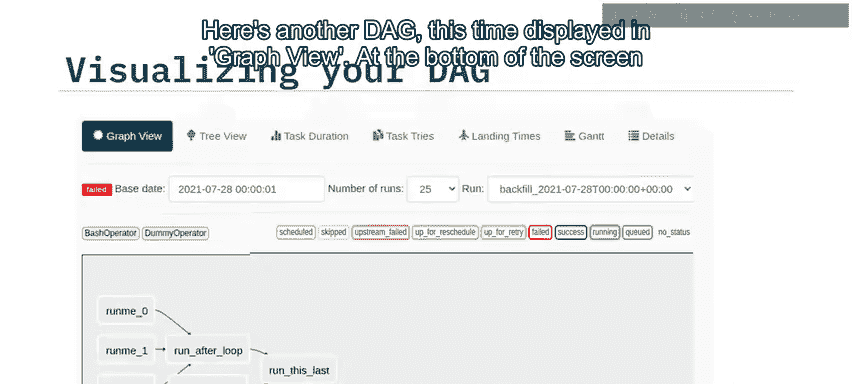

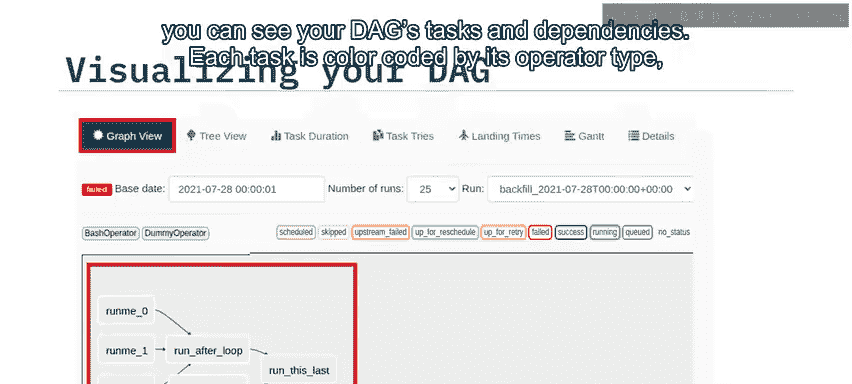

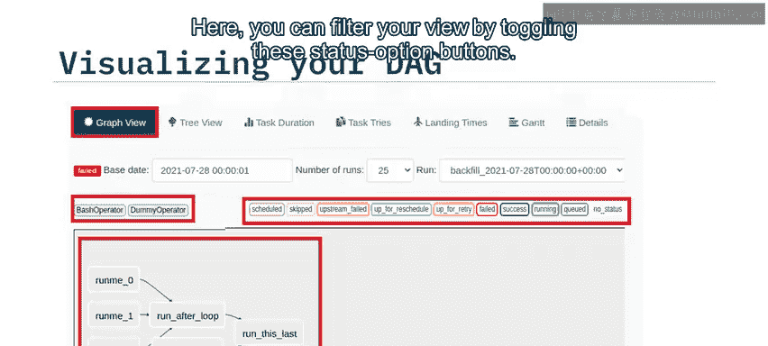

接下来，我们看看另一个以图形视图显示的DAG。在屏幕底部，你可以看到DAG的任务及其依赖关系。每个任务根据其操作符类型，按照此处的图例进行颜色编码。你可以通过切换这些状态选项按钮来过滤视图。

## 任务实例上下文菜单

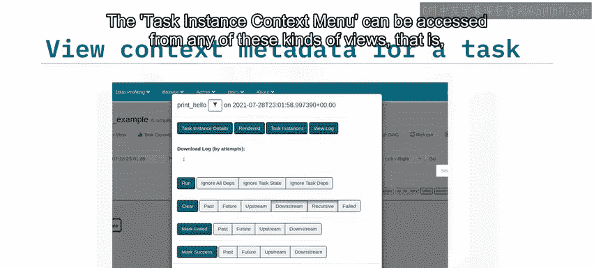

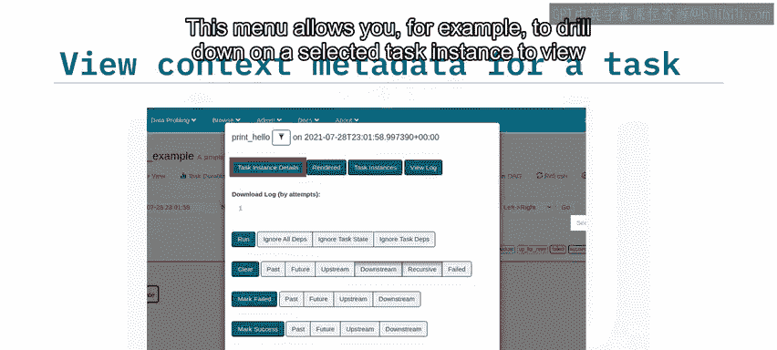

任务实例上下文菜单可以从任何显示DAG任务实例的视图中访问。例如，在树状视图或图形视图中右键点击任务即可。

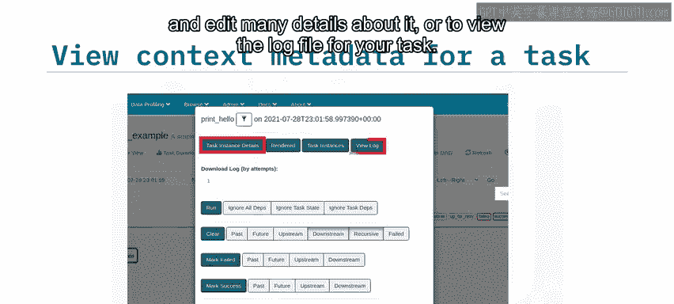

这个菜单允许你深入查看选定的任务实例，以查看和编辑其许多详细信息，或者查看该任务的日志文件。

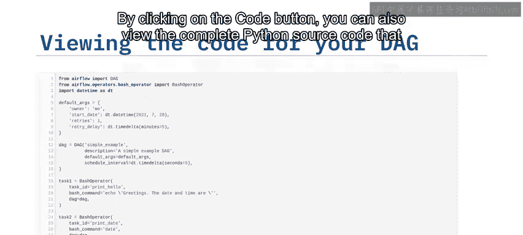

## 查看DAG定义代码

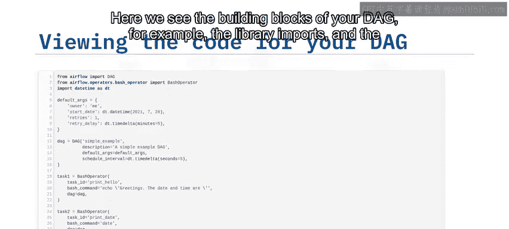

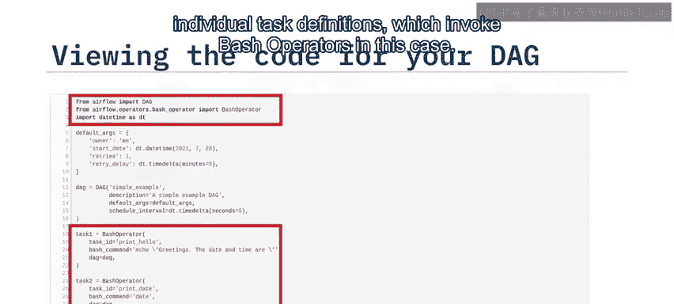

通过点击“代码”按钮，你还可以查看定义DAG的完整Python源代码。在这里，我们可以看到DAG的构建模块，例如库的导入和各个任务的定义。在这个例子中，任务定义调用了Bash操作符。

## 分析任务持续时间

通过点击“任务持续时间”，你可以查看DAG任务持续时间的时间线图表，以了解它们的性能表现。在这里，你可以切换选择希望高亮显示的任务。

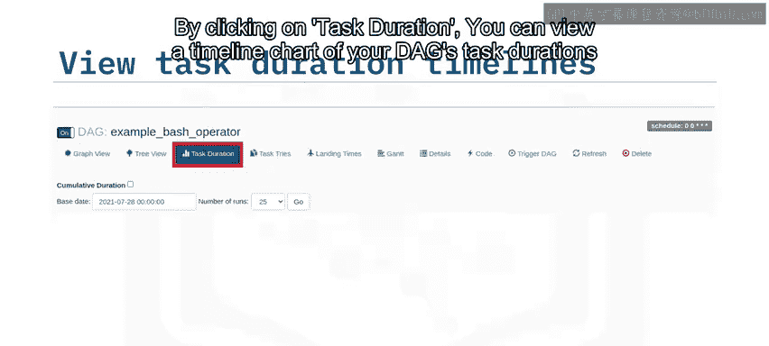

## 课程总结

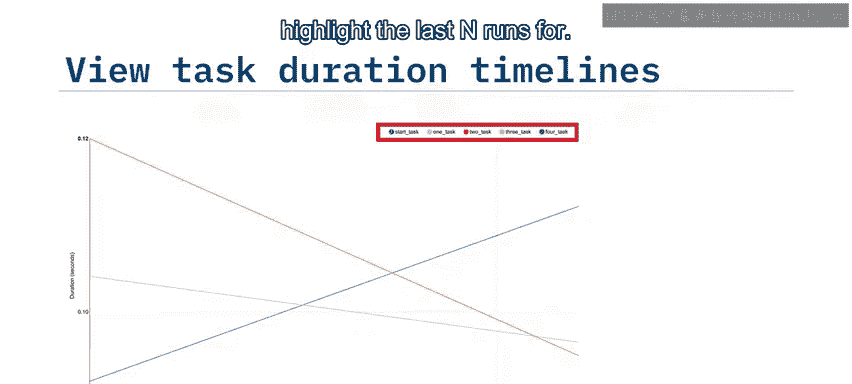

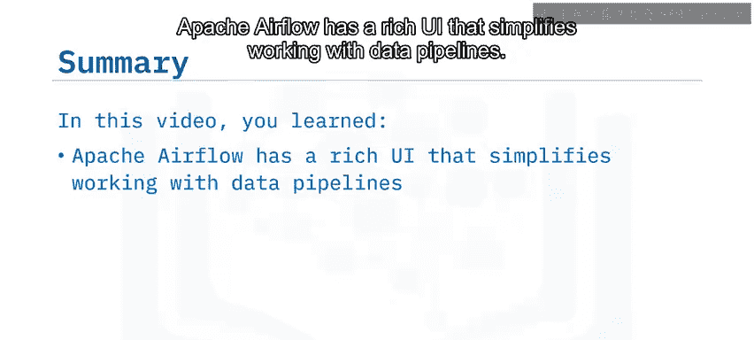

在本节课中，我们一起学习了Apache Airflow拥有一个功能丰富的用户界面，它简化了数据管道的工作流程。你可以通过多种信息丰富的方式可视化你的DAG，包括图形模式和树状模式。你还可以审查最初定义DAG的Python代码，分析DAG中每个任务在多轮运行中的持续时间，最后，你可以为任何任务实例选择上下文元数据。