# 017：Airflow监控与日志记录 📊


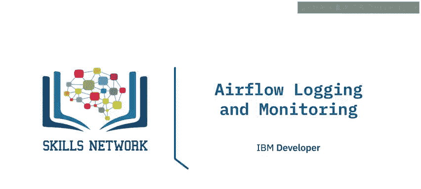

在本节课中，我们将学习如何使用Airflow的日志记录功能来监控任务状态、诊断问题，并了解如何访问Airflow发出的各类指标，如计数器、测量器和计时器。掌握这些技能对于管理和维护高效、可靠的数据管道至关重要。

## 日志记录功能概述

日志记录功能是开发者监控DAG运行中任务状态、诊断和调试问题的必备工具。默认情况下，Airflow的日志会以文件形式保存在本地文件系统中。这种方式便于开发者在开发环境中快速查阅日志。

对于生产环境的Airflow部署，日志文件也可以发送到云存储服务（如IBM Cloud、AWS或Azure）以便远程访问。此外，日志还可以发送到搜索引擎和仪表板进行进一步的检索与分析。Airflow推荐使用Elasticsearch和Splunk这两种流行的文档数据库和搜索引擎来索引、搜索和分析日志文件。

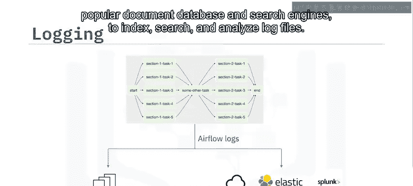

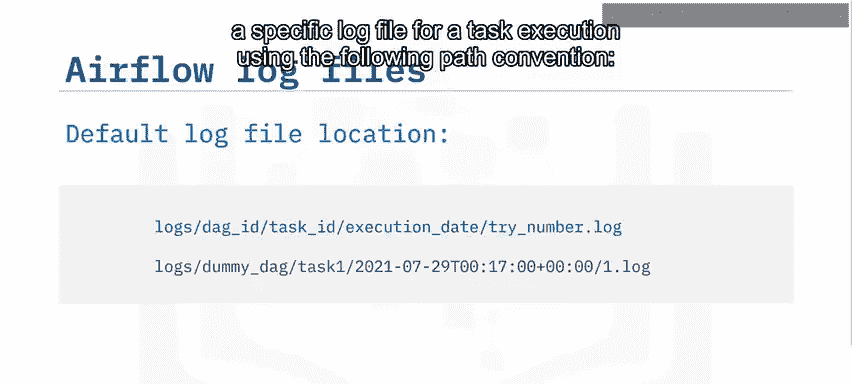

## 日志文件组织结构

默认情况下，日志文件按照DAG ID和任务ID进行组织。你可以使用以下路径约定来查找特定任务执行的日志文件：

```
logs/{DAG_ID}/{TASK_ID}/{EXECUTION_DATE}/{TRY_NUMBER}.log
```

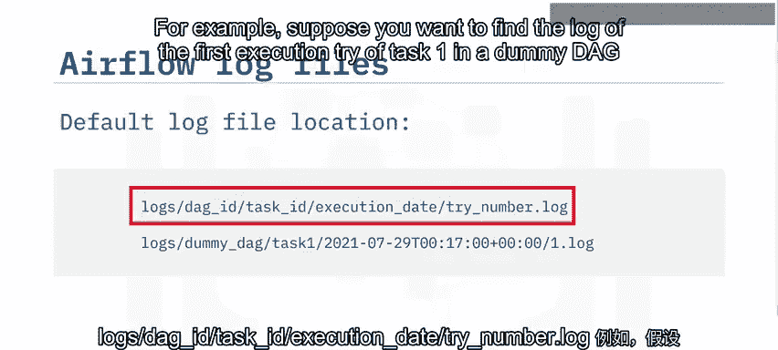

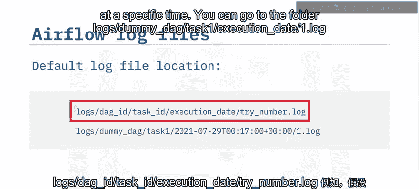

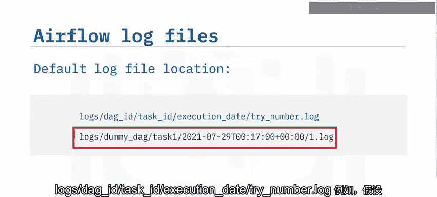

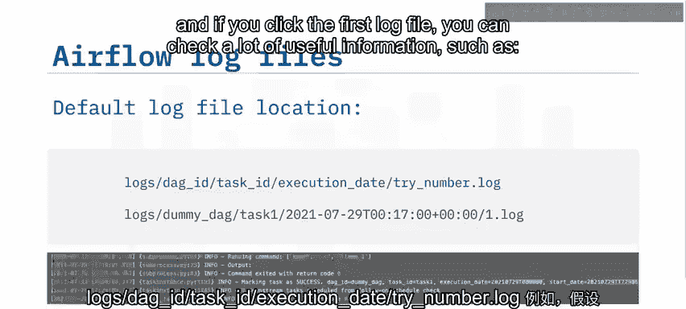

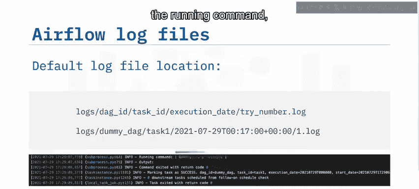

例如，假设你想查找在特定时间执行的`dummy_dag`中任务`task1`的第一次执行尝试日志，你可以定位到文件夹 `logs/dummy_dag/task1/{execution_date}/1.log`。打开这个日志文件，你可以查看大量有用信息，例如运行的命令、命令结果、任务结果等。

## 通过Web UI查看任务事件

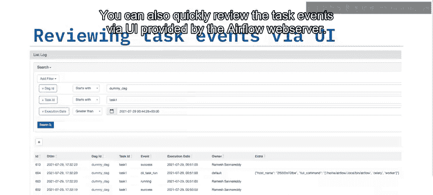

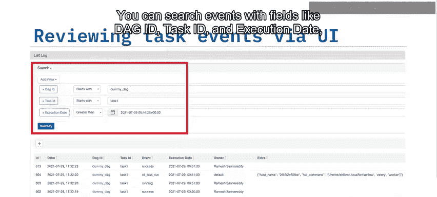

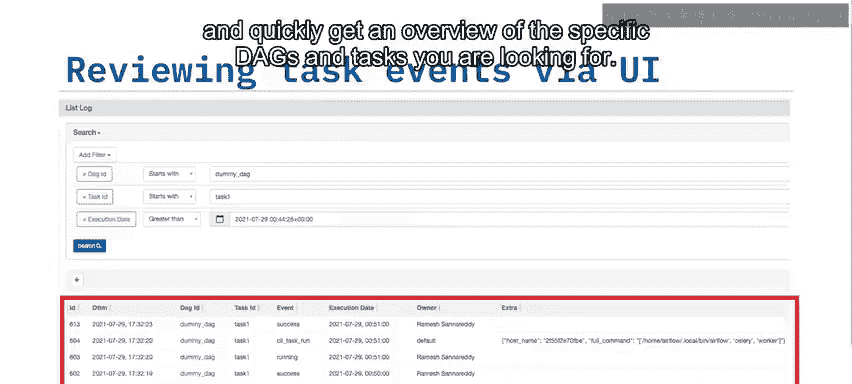

除了直接查看日志文件，你还可以通过Airflow Web服务器提供的用户界面快速回顾任务事件。在UI中，你可以使用DAG ID、任务ID和执行日期等字段搜索事件，快速获取你所关注的特定DAG和任务的概览信息。

## Airflow的指标类型

Airflow会生成三种不同类型的指标，用于检查和监控组件的健康状况。它们分别是：


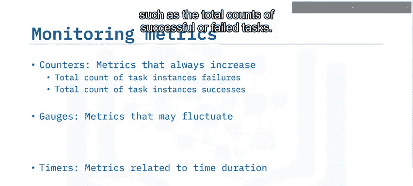

*   **计数器**：这类指标的值总是递增的。例如，成功或失败任务的总计数。
*   **测量器**：这类指标的值可能会波动。例如，当前正在运行的任务数量或DAG包的大小。
*   **计时器**：这类指标与时间长度相关。例如，完成任务所需的时间，或任务达到成功或失败状态所需的时间。

## 生产环境中的指标处理


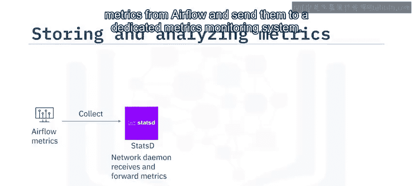

与日志类似，在生产环境部署中生成的指标也应该发送到专门的存储库和工具进行分析。Airflow推荐使用**StatsD**，这是一个网络守护进程，可以从Airflow收集指标并将其发送到专用的指标监控系统。

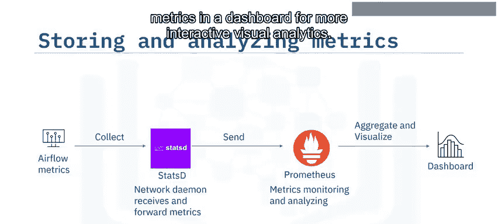

对于指标监控和分析，Airflow推荐使用**Prometheus**，这是一个流行的指标监控与分析系统。Prometheus还可以在仪表板中聚合和可视化指标，以进行更具交互性的可视化分析。

## 课程总结

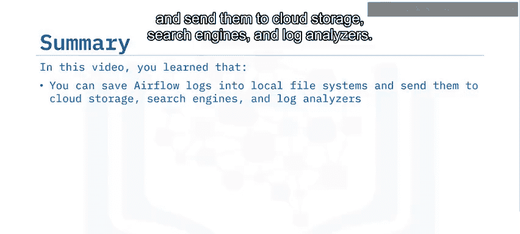


本节课我们一起学习了Airflow的监控与日志记录。你了解到可以将Airflow日志保存到本地文件系统，也可以发送到云存储、搜索引擎和日志分析器。Airflow建议将生产部署的日志发送给Elasticsearch或Splunk进行分析。通过Airflow的Web UI，你可以轻松查看DAG和任务事件。我们还学习了Airflow的三种指标类型：计数器、测量器和计时器。最后，Airflow建议通过StatsD将生产部署的指标发送给Prometheus进行分析。掌握这些监控手段，能帮助你更好地维护数据管道的稳定运行。