# 018：分布式事件流平台组件

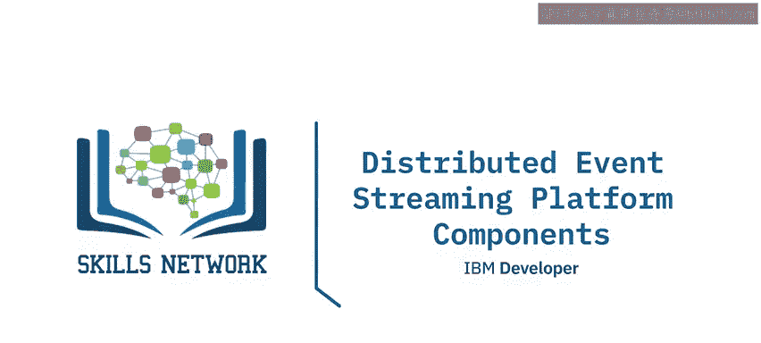

在本节课中，我们将要学习分布式事件流平台的核心概念与组件。我们将了解什么是事件、常见的事件格式，以及事件流平台的作用和主要构成部分。课程内容旨在为初学者提供一个清晰、直观的理解框架。

---

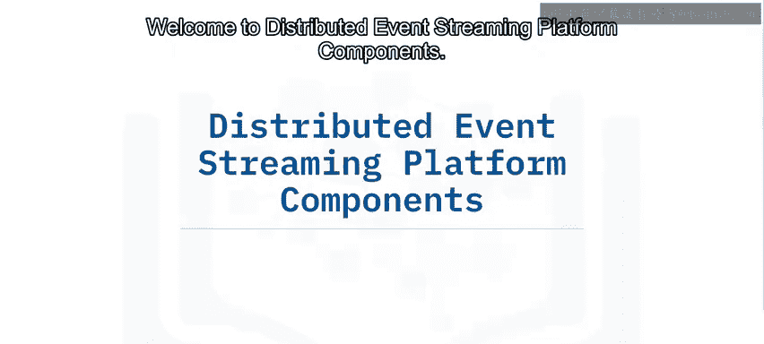

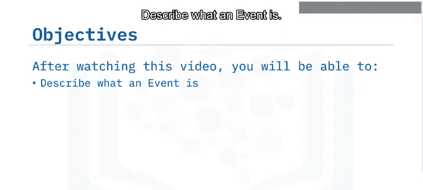

## 🎯 什么是事件？

在事件流处理的上下文中，**事件** 指的是一种特殊类型的数据，它描述了实体随时间推移发生的、值得关注的状态更新。

例如：
*   一辆移动汽车的GPS坐标。
*   一个房间的温度。
*   一位病人的血压测量值。
*   一个运行中应用程序的RAM使用情况。

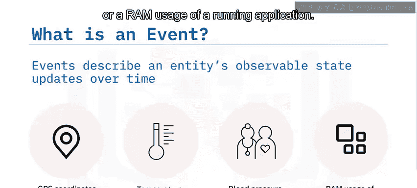

---

## 📝 事件的常见格式

事件作为特殊的数据类型，具有不同的格式。以下是三种最常见的格式：

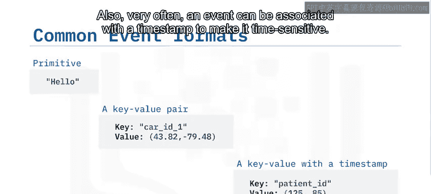

1.  **基本类型**：事件可以是一个基本数据类型，例如纯文本、数字或日期。
    *   示例：`42`， `"error"`， `2023-10-27`

2.  **键值对格式**：事件可以是键值对格式。其值可以是基本数据类型，也可以是复杂数据类型（如列表、元组、JSON、XML甚至字节）。
    *   示例：`{"car_id": 1, "coordinates": (39.9042, 116.4074)}`

3.  **带时间戳的键值对**：事件通常还会关联一个时间戳，使其具有时间敏感性。
    *   示例：`{"sensor_id": "temp_01", "value": 22.5, "timestamp": "2023-10-27T10:30:00Z"}`

---

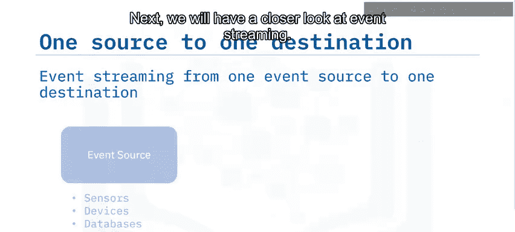

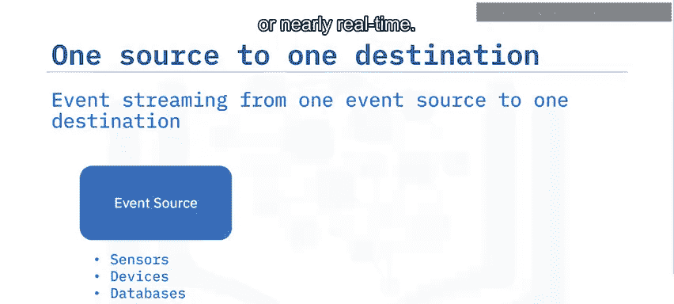

## 🌊 什么是事件流？

假设我们有一个事件源（例如一组传感器、监控设备、数据库或运行中的应用程序）。这个事件源可能会在短时间内隔或近乎实时地持续产生大量事件。

这些实时事件需要被恰当地传输到一个事件目的地（例如文件系统、另一个外部数据库或应用程序）。事件源和事件目的地之间这种持续的事件传输过程，就称为**事件流**。

---

## 🏗️ 为什么需要事件流平台？

根据我们目前所学的ETL知识，你可能会认为在单一事件源和单一目的地之间实现这样的ETL过程是直接的。

然而，如果我们有多个不同的事件源和目的地呢？在现实场景中，事件流可能非常复杂，涉及多个分布式的事件源和目的地。因为数据传输管道可能基于不同的通信协议，例如FTP、HTTP、JDBC、SCP等。

此外，一个事件目的地也可以同时是另一个事件源。例如，一个应用程序可以接收事件流并进行处理，然后将处理结果作为新的事件流传输给另一个目的地。

为了克服处理不同事件源和目的地的挑战，我们需要使用**事件流平台**。

ESP在各种事件源和目的地之间充当中间层，为基于事件的ETL处理提供统一接口。这样一来，所有事件源只需将事件发送给ESP，而无需分别发送给每个事件目的地。另一方面，事件目的地只需订阅ESP，并消费来自ESP的事件，而无需对接每个单独的事件源。

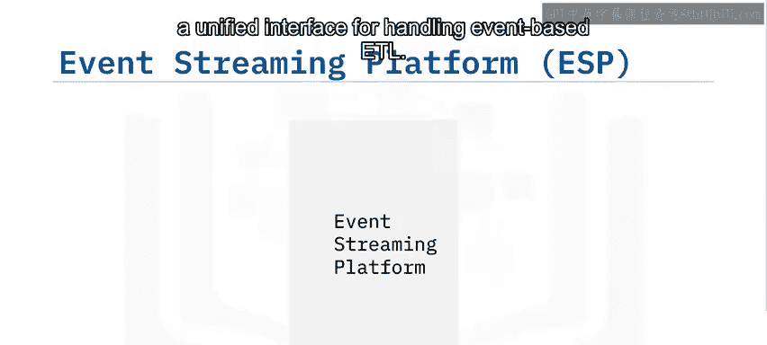

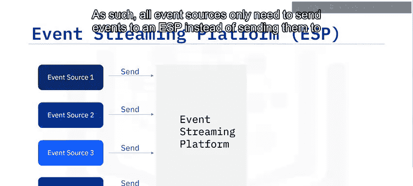

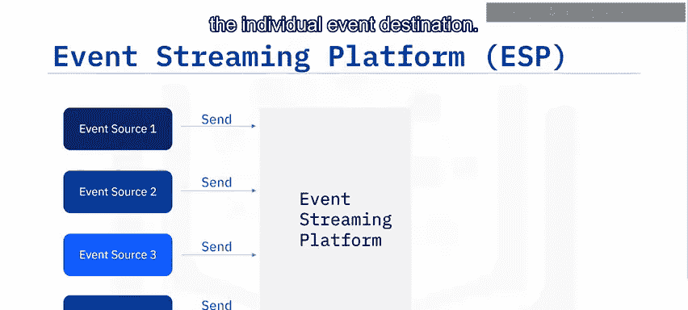

---

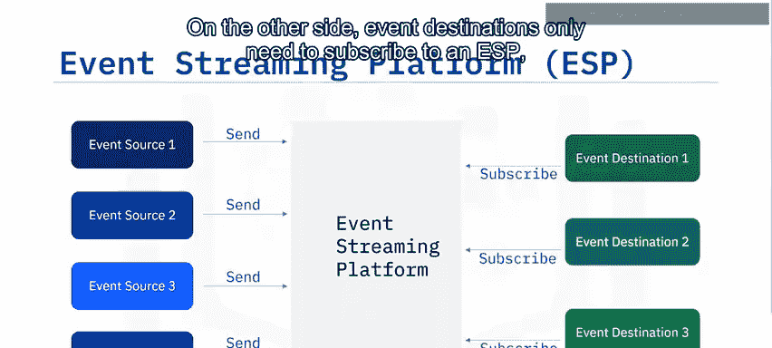

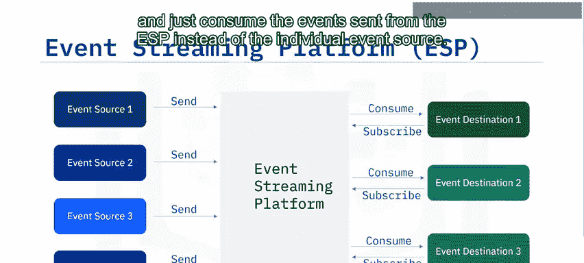

## ⚙️ 事件流平台的主要组件

不同的ESP可能有不同的架构和组件。这里我们介绍大多数ESP系统中包含的一些常见组件。

以下是ESP的主要组件：

1.  **事件代理**：这是ESP的核心组件，设计用于接收和消费事件。我们将在下一部分详细解释。
2.  **事件存储**：用于存储从事件源接收的事件。据此，事件目的地无需与事件源同步，存储的事件可以随时被检索。
3.  **分析与查询引擎**：用于查询和分析存储的事件。

---

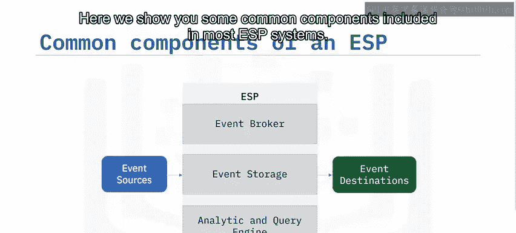

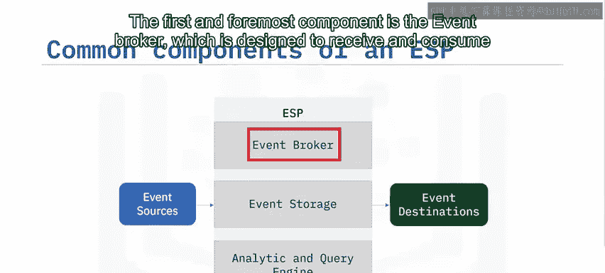

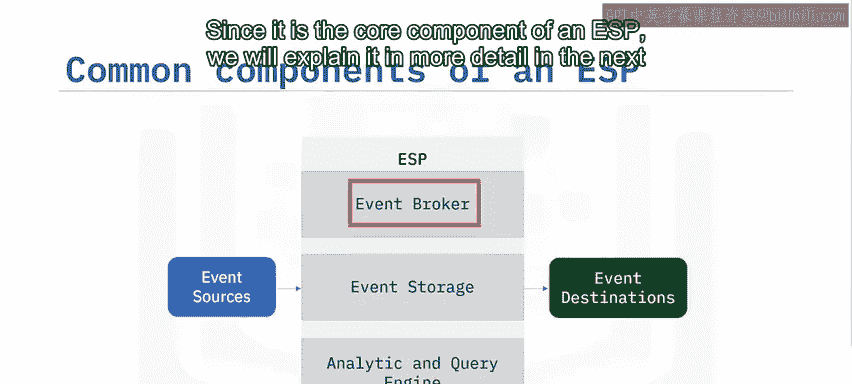

## 🔧 深入理解事件代理

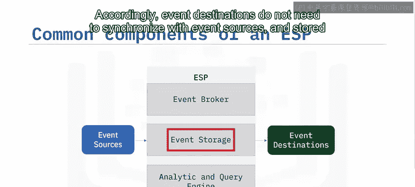

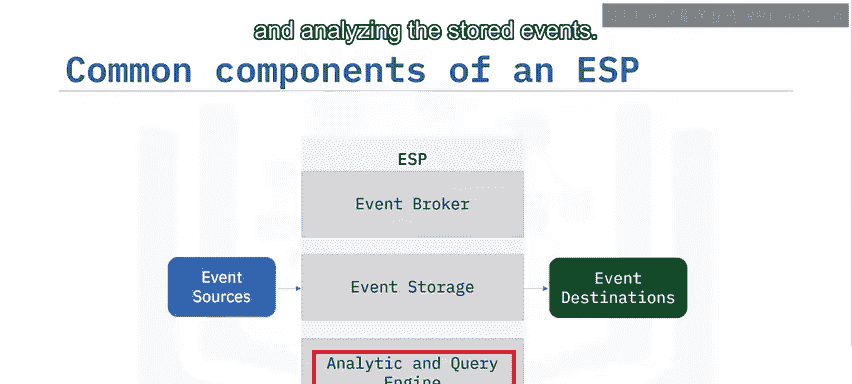

事件代理是ESP的核心组件。它通常包含三个子组件：**摄取器**、**处理器**和**分发器**。

*   **摄取器**：设计用于高效地从各种事件源接收事件。
*   **处理器**：对数据执行操作，例如序列化与反序列化、压缩与解压缩、加密与解密等。
*   **分发器**：从事件存储中检索事件，并高效地分发给已订阅的事件目的地。

---

## 🌍 流行的事件流平台

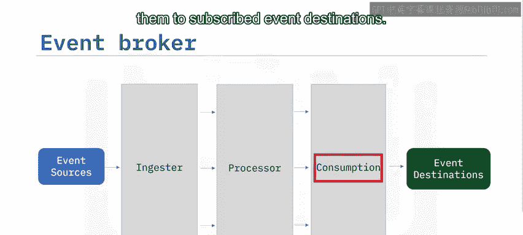

市场上有许多ESP解决方案，每种都有其独特的功能和应用场景。

流行的ESP包括：
*   **Apache Kafka**（可能是最流行的开源ESP）
*   Amazon Kinesis
*   Apache Flink
*   Apache Spark
*   Apache Storm
*   其他，如Elastic Stack中的Logstash等。

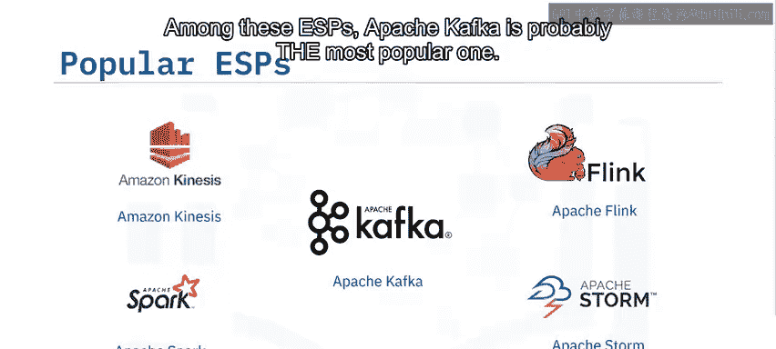

---

## 📖 课程总结

本节课中，我们一起学习了分布式事件流平台的基础知识。

我们了解到：
*   事件流代表了实体状态随时间的变化。
*   常见的事件格式包括基本数据类型、键值对以及带时间戳的键值对。
*   当存在多个事件源和目的地时，尤其需要ESP。
*   ESP的主要组件包括事件代理、事件存储、以及分析与查询引擎。
*   Apache Kafka是最流行的开源ESP之一。
*   其他流行的ESP还包括Amazon Kinesis、Apache Flink、Apache Spark、Apache Storm等。

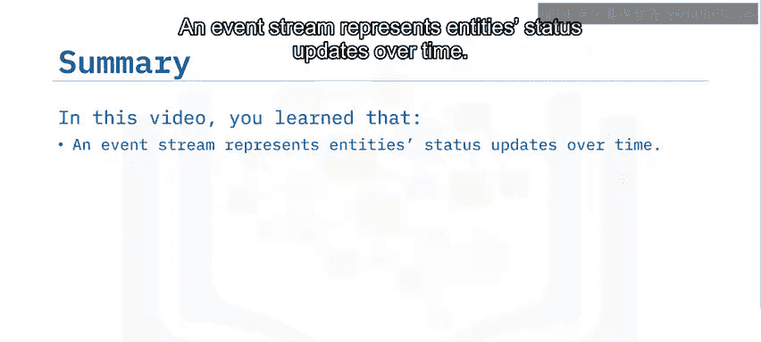

通过掌握这些核心概念和组件，你为理解和构建高效、可扩展的实时数据管道奠定了坚实的基础。