# 001：数据仓库概述

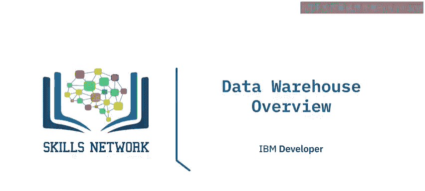

在本节课中，我们将要学习数据仓库的基本概念。我们将定义什么是数据仓库，了解其典型应用场景，并列举使用数据仓库为组织带来的主要好处。

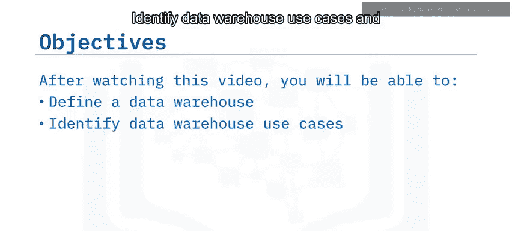

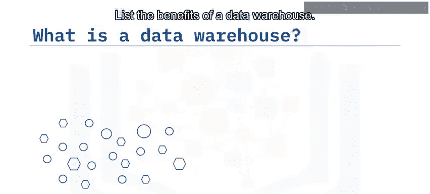

## 🏗️ 什么是数据仓库？

数据仓库是一个系统，它**将来自一个或多个来源的数据聚合到一个单一的、集中的、一致的数据存储中**，以支持各种数据分析需求。

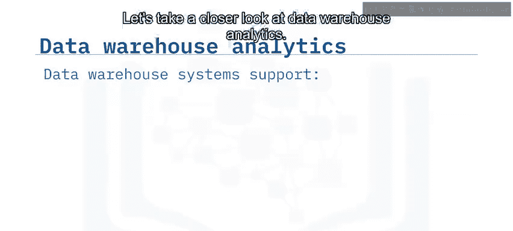

其核心公式可以概括为：
**数据仓库 = 数据聚合 + 数据存储 + 数据分析支持**

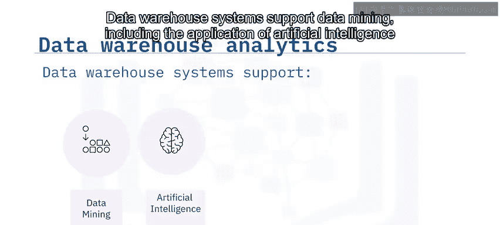

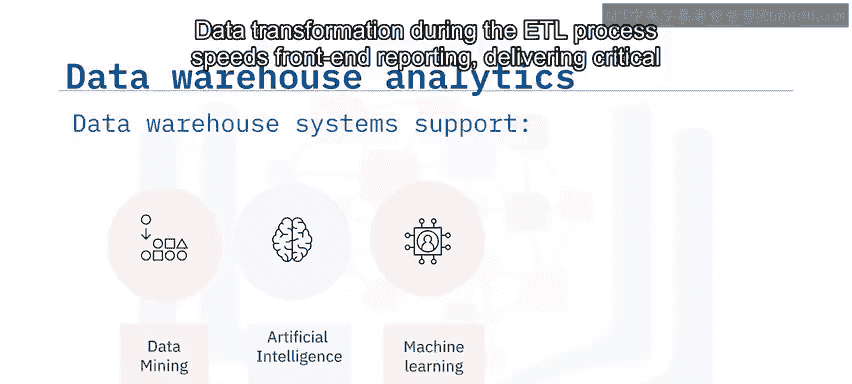

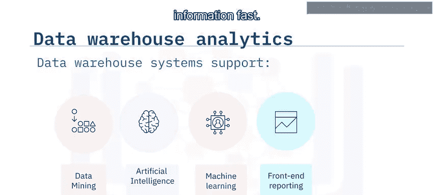

## 🔍 数据仓库支持的分析类型

上一节我们定义了数据仓库，本节中我们来看看数据仓库具体支持哪些类型的分析活动。

数据仓库系统支持多种高级分析功能：

*   **数据挖掘**：包括应用人工智能（AI）和机器学习（ML）技术从数据中发现模式和知识。
*   **前端报告**：在ETL（提取、转换、加载）过程中进行的数据转换，可以加速前端报告生成，从而快速交付关键信息。
*   **在线分析处理（OLAP）**：数据仓库支持OLAP，为商业智能和决策支持应用提供快速、灵活的多维数据分析。

## 📈 数据仓库的演进历程

了解了数据仓库的功能后，我们来看看它的部署方式是如何随着技术发展而演变的。

以下是数据仓库部署模式的主要发展阶段：

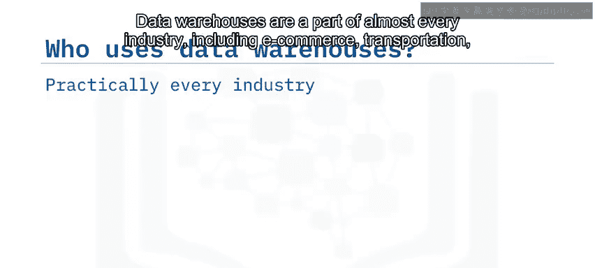

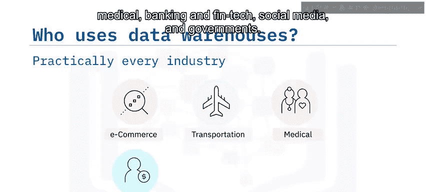

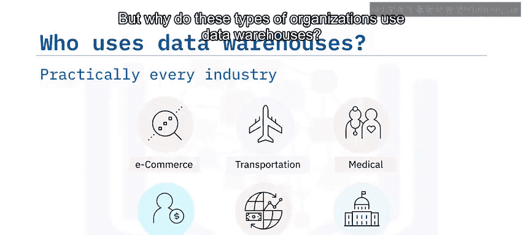

*   **本地部署**：传统上，数据仓库部署在企业数据中心的本地服务器上，最初是大型机，后来是Unix、Windows和Linux系统。
*   **数据仓库一体机**：随着21世纪初数据量的增长，出现了数据仓库一体机。它由预先集成的专用硬件和优化的数据仓库软件捆绑而成，降低了大规模数据仓库的管理开销。
*   **云数据仓库**：在过去十年左右，随着海量数据在云中生成和存储，云数据仓库（CDW）日益流行。组织无需购买硬件或安装仓库软件，而是可以按需使用可扩展的、按使用量付费的服务。

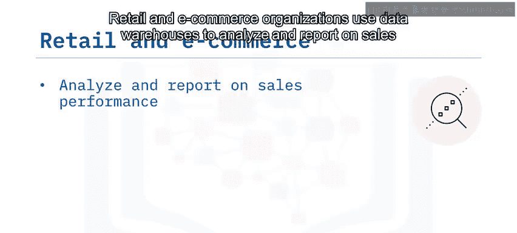

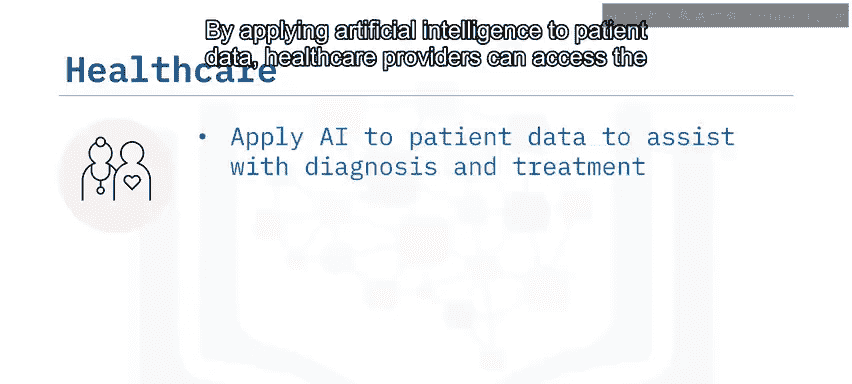

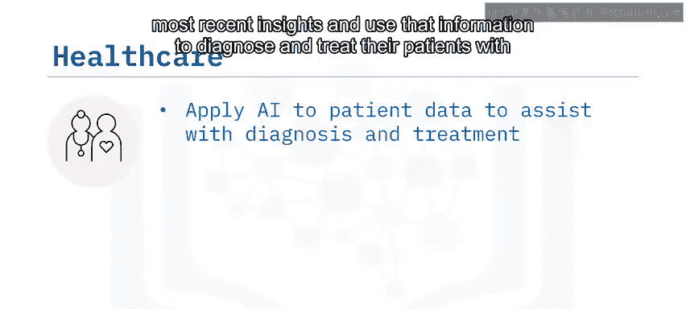

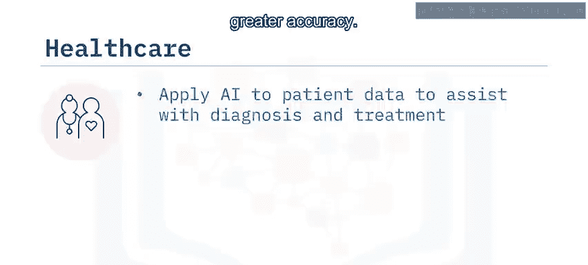

## 🏢 数据仓库的应用行业

现在我们已经了解了数据仓库是什么及其部署方式，接下来让我们看看哪些类型的组织会使用数据仓库。

数据仓库的应用几乎遍及所有行业，包括电子商务、交通运输、医疗、银行与金融科技、社交媒体以及政府机构。

以下是这些行业使用数据仓库的具体原因：

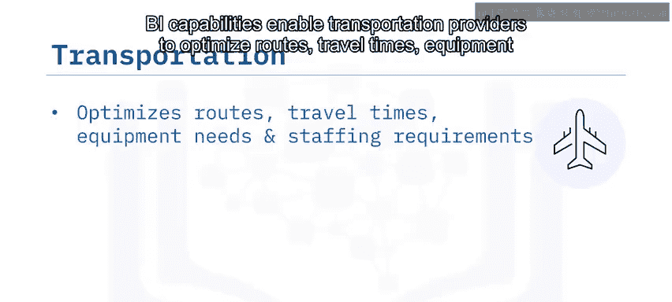

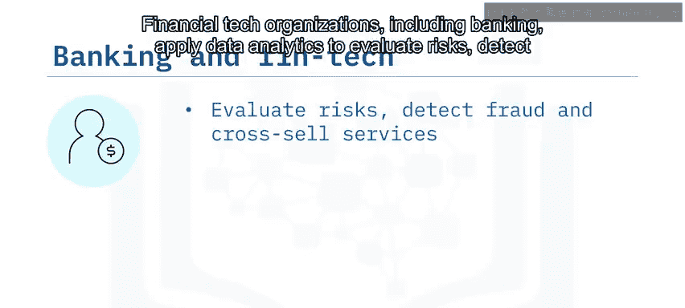

*   **零售与电子商务**：用于分析和报告销售业绩，并应用机器学习辅助购物，通过人工智能为购物者提供相关推荐以推动额外销售。
*   **医疗保健**：通过对患者数据应用人工智能，医疗保健提供者可以获取最新洞察，并利用这些信息更准确地进行诊断和治疗。
*   **交通运输**：商业智能能力使运输提供商能够优化路线、行程时间、设备需求和人员配置要求。
*   **金融科技与银行业**：应用数据分析来评估风险、检测欺诈和交叉销售服务。
*   **社交媒体**：需要能够快速衡量不断变化的客户情绪并预测产品销售的分析能力。
*   **政府机构**：应用商业智能来分析和评估以公民为中心的项目，并协助政策变更决策。

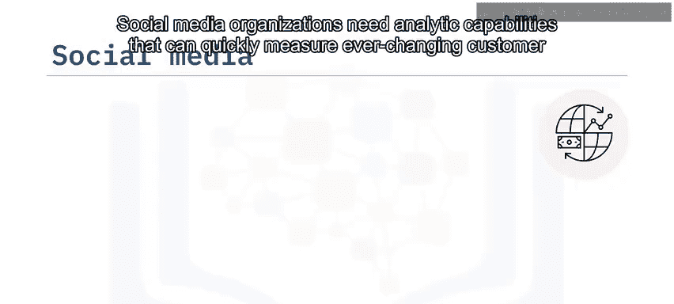

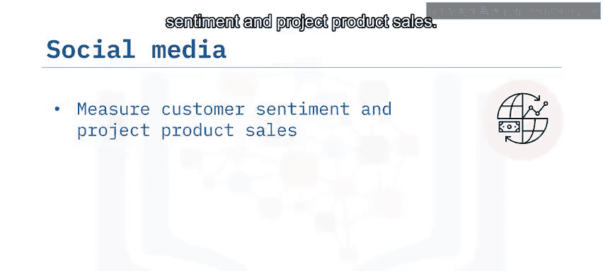

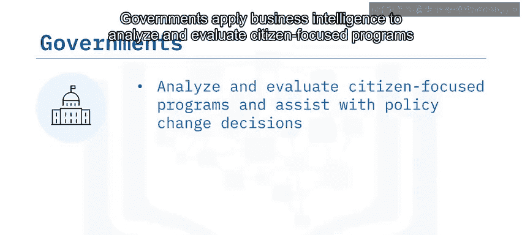

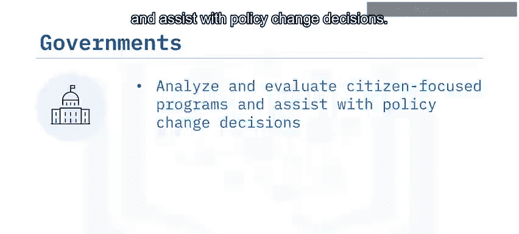

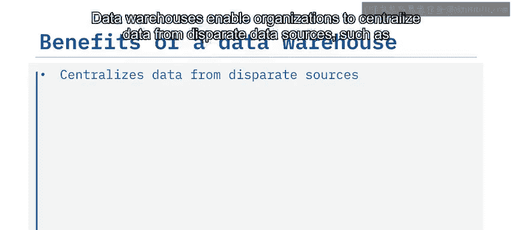

## ✅ 数据仓库的核心优势

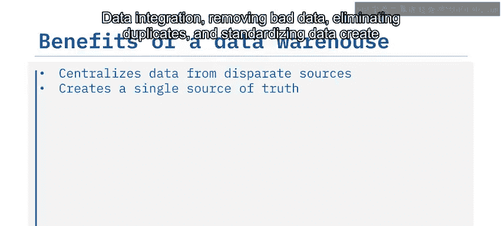

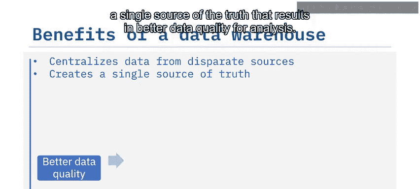

在探讨了广泛的应用场景后，我们来总结一下数据仓库能为组织带来的具体好处。

使用数据仓库主要能带来以下几方面优势：

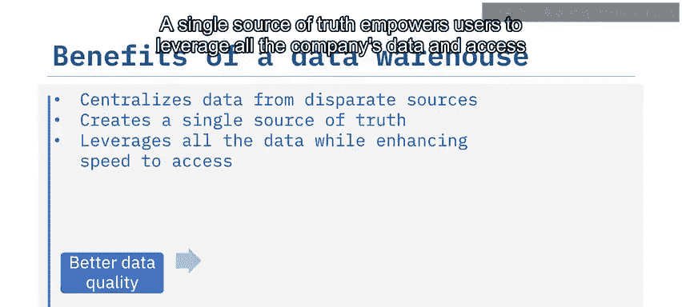

*   **数据集中化**：能够将来自不同数据源（如事务处理系统、操作型数据库和平面文件）的数据集中起来。
*   **提升数据质量**：通过数据集成、清除坏数据、消除重复项和标准化数据，创建**单一事实来源**，从而为分析提供更高质量的数据。
*   **提高访问效率**：单一事实来源使用户能够利用公司的所有数据，并更高效地访问这些数据。此外，将数据库操作与数据分析分离，通常能提高数据访问性能，从而带来更快的商业洞察。
*   **赋能高级分析与决策**：大规模商业智能功能，如数据挖掘、人工智能和机器学习工具，有助于数据专业人员和业务领导者做出更明智的决策。这些能力相互叠加，使组织有方法和机会实现竞争优势和收益增长。

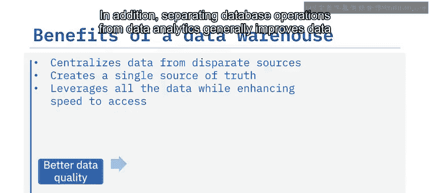

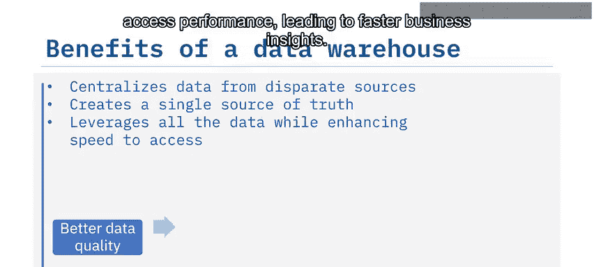

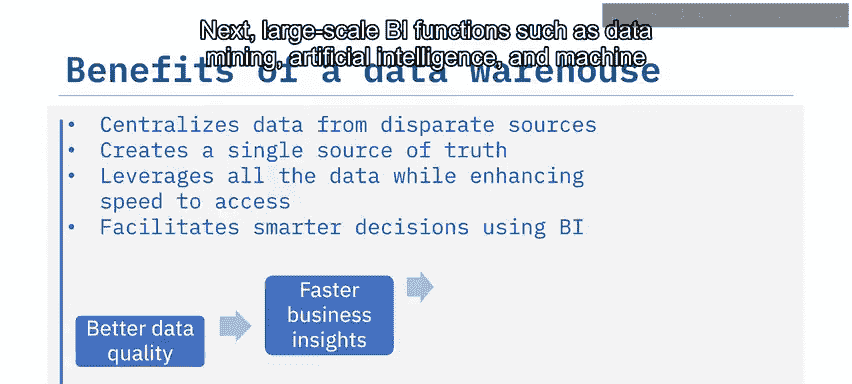

## 📝 课程总结

本节课中我们一起学习了数据仓库的核心概念。

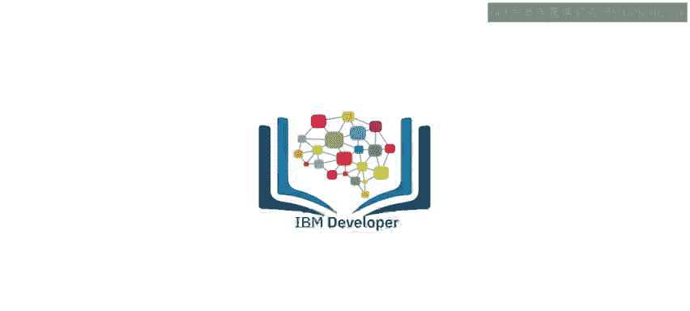

我们了解到：
1.  数据仓库是一个将来自多源的数据聚合到单一、一致存储中以支持数据分析的系统。
2.  数据仓库支持数据挖掘、人工智能与机器学习、OLAP以及前端报告等多种分析。
3.  数据仓库和商业智能帮助组织提升数据质量、加速商业洞察并改进决策制定，所有这些都可能带来竞争优势。