# 003：选择数据仓库系统

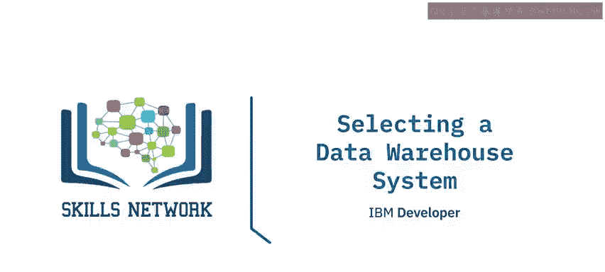

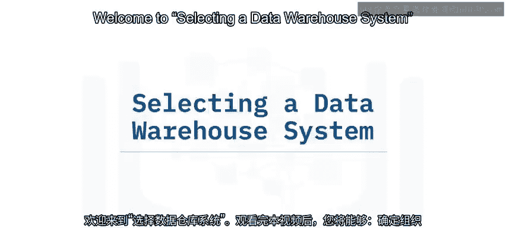

在本节课中，我们将学习组织如何评估和选择数据仓库系统。我们将探讨评估的关键标准，包括功能、兼容性、易用性、支持和成本，并了解在本地部署与公有云部署之间做出决策的考量。

---

## 🎯 评估数据仓库系统的标准

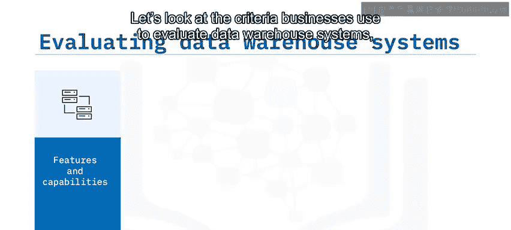

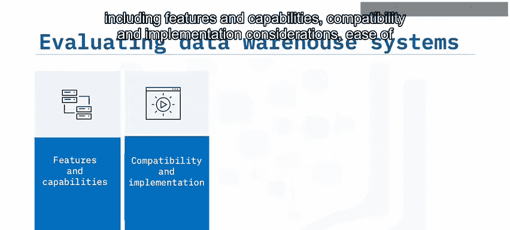

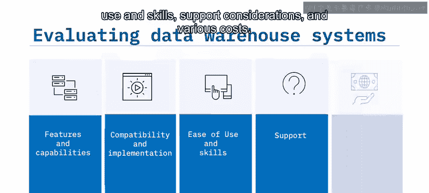

组织在评估数据仓库系统时，会依据一系列标准进行考量。以下是主要的评估维度：

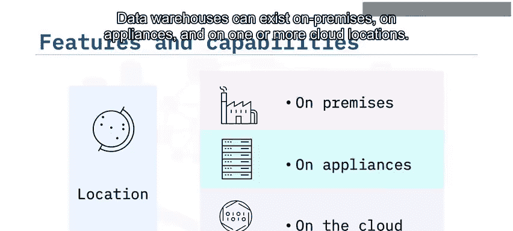

*   **功能与能力**
*   **兼容性与实施考量**
*   **易用性与技能要求**
*   **支持考量**
*   **各类成本**

接下来，我们将逐一详细探讨这些标准。

---

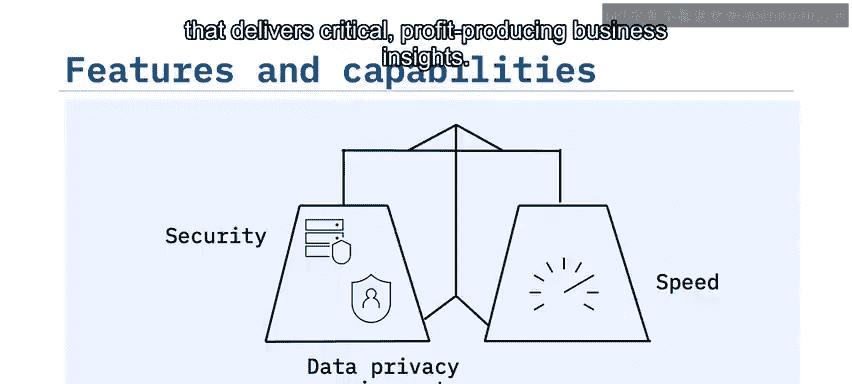

## 🏢 功能与能力：位置与架构

首要的考量因素是数据仓库的**位置**。数据仓库可以部署在本地、专用设备上，或是一个或多个云环境中。

为了选择合适的位置，组织必须平衡与数据摄取、存储和访问相关的多种需求。对于一些组织而言，数据安全是最高优先级，这要求必须采用本地解决方案。那些面临数据隐私法规（如CCPA或GDPR）挑战的多地点企业，则需要本地或特定地理区域的数据仓库位置。每个组织都需要在安全、数据隐私需求与获取关键业务洞察的速度之间取得平衡。

组织还需要考虑与**架构和结构**相关的功能。例如，组织是否准备好采用特定供应商的架构？是否需要多云部署（如在多个地点部署多个数据仓库）？解决方案能否扩展以满足预期的未来需求？系统支持哪些数据类型？如果组织目前分析暗数据，或计划使用半结构化或非结构化数据，就需要一个支持这些数据类型的系统。处理大数据的组织则需要一个同时支持批处理和流处理能力的系统。

影响实施便利性的能力包括数据治理、数据迁移和数据转换。在数据仓库系统就位后，组织如何随着需求变化轻松地优化和重新优化系统性能，是另一个考量点。

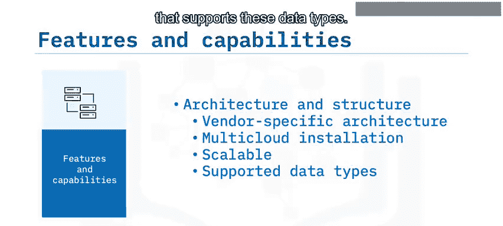

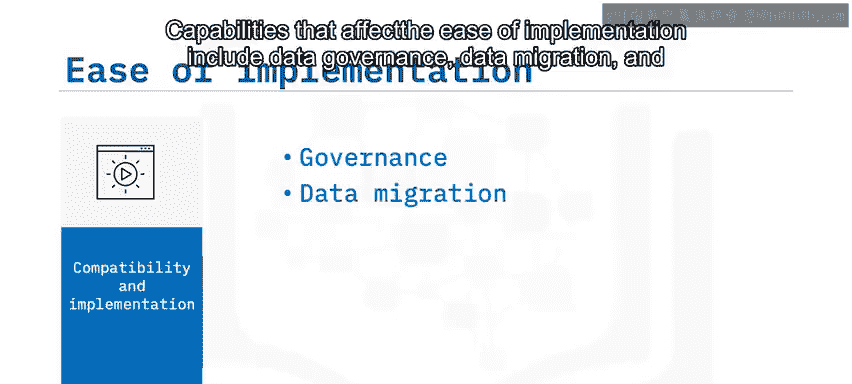

用户管理也是一个重要考虑因素。由于代价高昂的数据泄露事件，越来越多的组织实施零信任安全策略，因此管理和验证系统用户的程序是强制性的。通知和报告对于组织在微小问题演变成大问题之前纠正错误和降低风险至关重要。

---

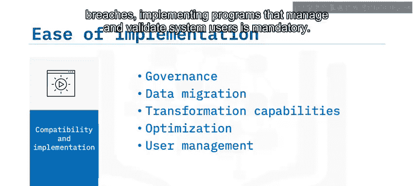

## 👨‍💻 易用性与技能要求

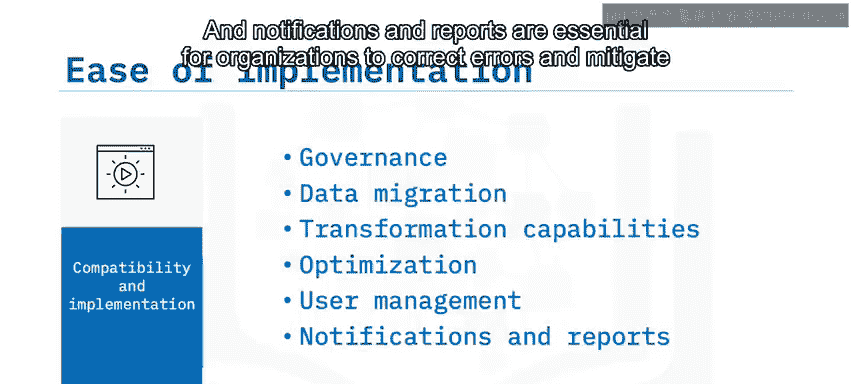

现在，我们来探讨易用性与技能要求。您的组织员工是否具备实施特定数据仓库供应商技术所需的技能？如果不具备，他们能以多快多容易的速度获得这些技能？

复杂的大型数据仓库部署可能需要您的实施合作伙伴付出额外工作，因此他们的专业知识也至关重要。最后，负责架构、部署和管理前端查询、报告及可视化工具的技术和工程人员，是否具备快速配置新系统所需的技能？

---

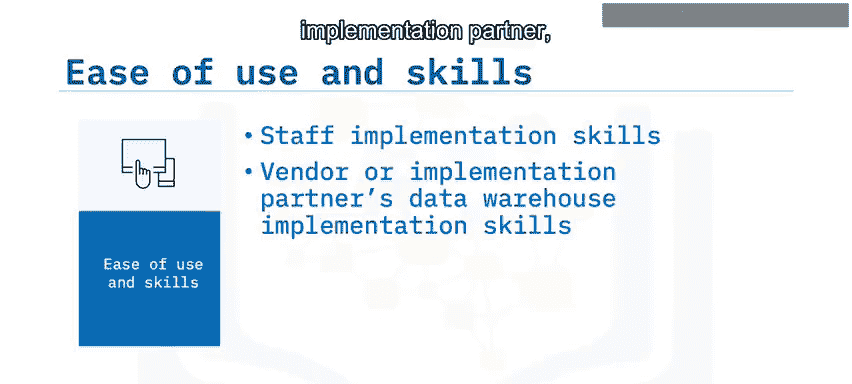

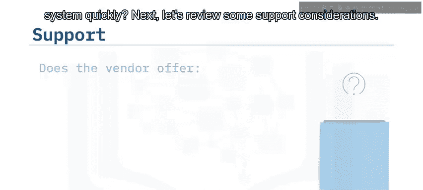

## 🛠️ 支持考量

支持至关重要，如果规划不当，可能会变得令人沮丧且成本高昂。您可能会发现，通过使用单一供应商，您可以依赖一个高度负责的来源，从而可能节省时间、金钱并减少挫折感。

您还需要核实供应商是否提供关于正常运行时间、安全性、可扩展性等问题的服务级别协议。确认供应商的支持时间和渠道，例如电话、电子邮件、聊天或短信。最后，供应商是否提供自助服务解决方案以及一个活跃、丰富的用户社区？

---

## 💰 成本评估

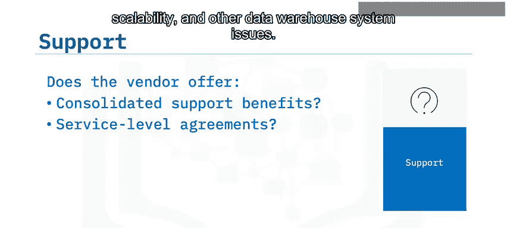

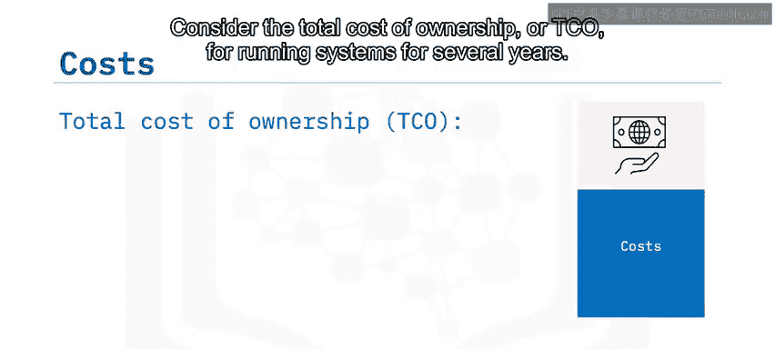

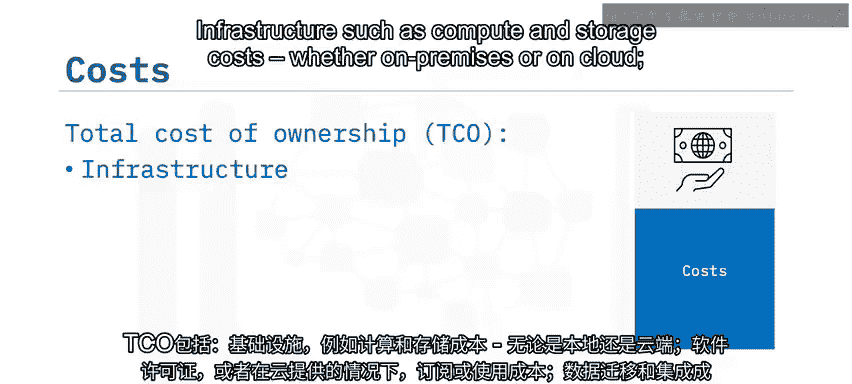

在完成上述所有分析后，是时候评估和比较成本了。在计算数据仓库系统的成本时，需要考虑的不仅仅是初始成本。应考虑运行系统数年的**总拥有成本**。

总拥有成本包括：
*   **基础设施成本**：如计算和存储成本（无论是在本地还是云端）。
*   **软件许可成本**：对于云服务，则是订阅或使用成本。
*   **数据迁移与集成成本**：用于将数据移入仓库，以及按要求进行数据修剪和清理。
*   **管理成本**：与系统管理和人员培训相关。
*   **持续的支持和维护成本**：支付给数据仓库供应商或实施合作伙伴。

---

## 📝 总结

本节课中，我们一起学习了企业如何基于功能与能力、兼容性与实施、易用性与所需技能、支持质量与可用性以及多重成本考量来评估数据仓库系统。

组织可能需要传统的本地部署来遵守数据安全和隐私要求。公有云站点则为组织提供了规模经济的优势，包括强大的计算能力和可扩展的存储，从而带来灵活的性能价格比选项。

在选择数据仓库系统时，请务必在计算中考虑总拥有成本，包括基础设施、计算与存储、数据迁移、管理和数据维护成本。