# 004：IBM DB2 Warehouse 简介 🏢

在本节课中，我们将要学习 IBM DB2 Warehouse 的核心特性、适用场景以及其强大的工具集成能力。IBM DB2 Warehouse 是一个完整的数据仓库解决方案，为用户提供了对数据和应用程序的高级控制能力。

## 概述

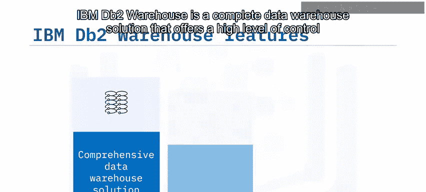

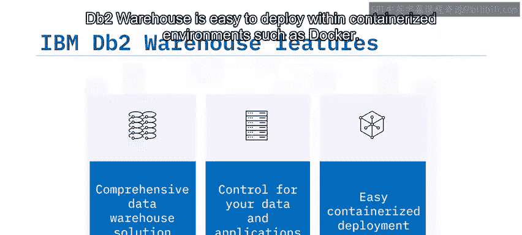

IBM DB2 Warehouse 是一个易于在容器化环境（如 Docker）中部署的完整数据仓库解决方案。它为用户提供了对数据和应用程序的高级控制能力。

上一节我们介绍了数据仓库的基本概念，本节中我们来看看一个具体的产品实现——IBM DB2 Warehouse。

## 核心特性与架构 🚀

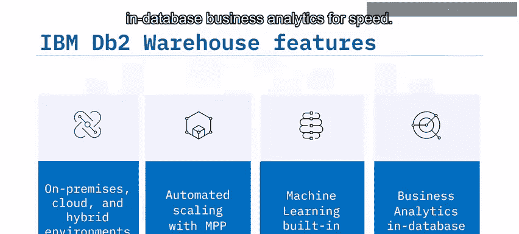

DB2 Warehouse 是一个高度灵活的数据仓库，支持客户管理的本地部署、云部署和混合环境。它通过被称为 **MPP（大规模并行处理）** 的技术自动扩展，以支持容器化部署。DB2 Warehouse 预装了机器学习算法访问权限，并利用库内商业分析来提升速度。

其核心加速技术 **BLU Acceleration** 包含以下组件：
*   **列式内存处理**
*   **数据跳过技术**
*   **大规模并行处理器集群架构**

这些技术共同作用，显著加快了复杂查询的速度。

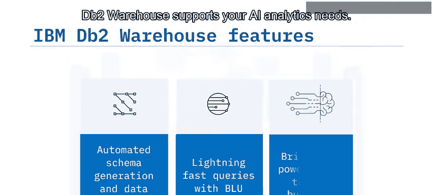

## 监控与管理仪表板 📊

DB2 Warehouse 配备了用于监控性能和报告问题的仪表板。这些仪表板提供了系统运行状态的全面视图。

以下是仪表板中包含的一些示例小组件：
*   硬件和软件问题计数
*   数据库警报
*   已使用的分配存储量

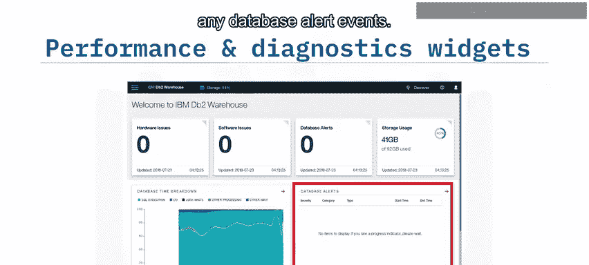

你还可以查看在不同状态（如等待锁、执行SQL查询的时间）下花费的时间细分，以及有关任何数据库警报事件的详细信息表。此外，还有许多其他可用的小组件，例如系统和数据库服务历史、CPU使用历史等。

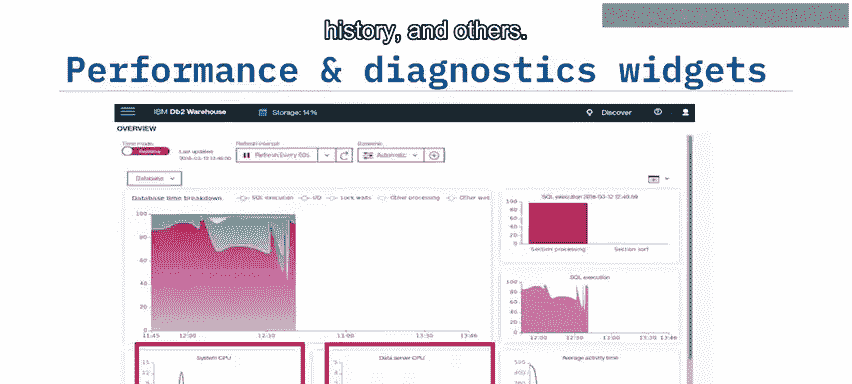

## 主要适用场景 🎯

DB2 Warehouse 非常适合多种使用场景，能够满足不同的业务需求。

以下是一些它特别适用的用例：
*   需要弹性或高可扩展性的场景
*   云、本地或混合托管需求
*   整合不同数据源
*   快速开发业务线分析产品（如数据集市）
*   管理敏感或受监管的数据
*   存储较旧、访问频率较低的结构化SQL数据

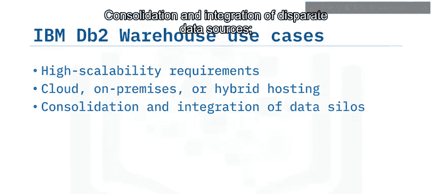

## 客户端支持与工具集成 🔌

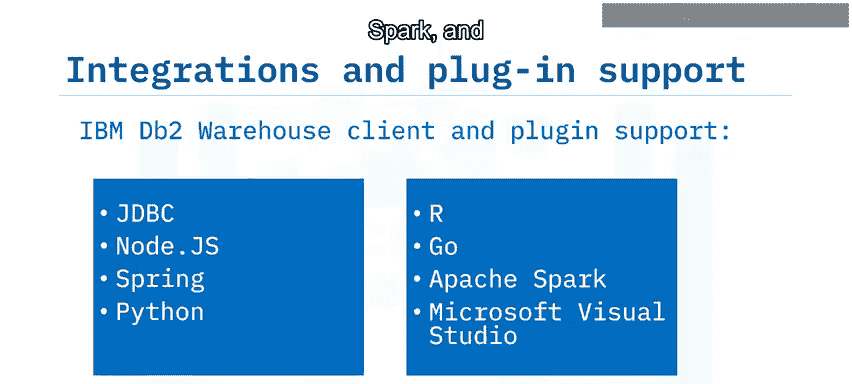

DB2 Warehouse 支持广泛的客户端和插件，便于与各种开发生态系统集成。

它支持的工具和语言包括：
*   **Java数据库连接**
*   **Node.js**
*   **Spring框架**
*   **Python**
*   **R语言**
*   **Go语言**
*   **Apache Spark**
*   **Microsoft Visual Studio**

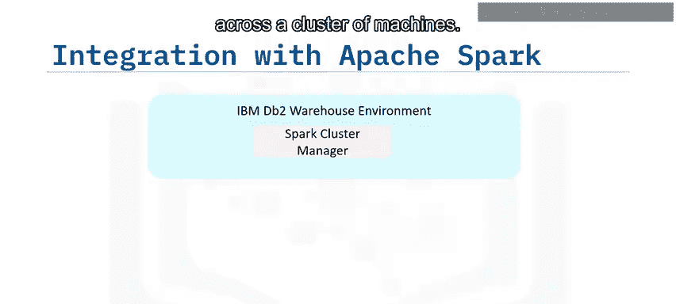

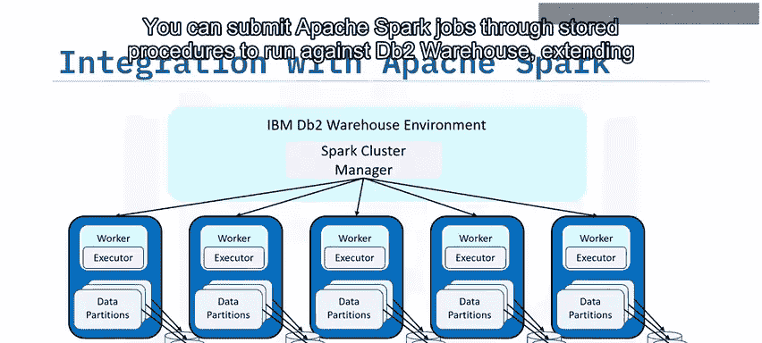

### 与 Apache Spark 集成

凭借其集成的 Apache Spark 集群，DB2 Warehouse 可以跨机器集群进行分区和部署。你可以通过存储过程提交 Apache Spark 作业，在 DB2 Warehouse 上运行，从而扩展你的分析范围。

### 与 RStudio 集成

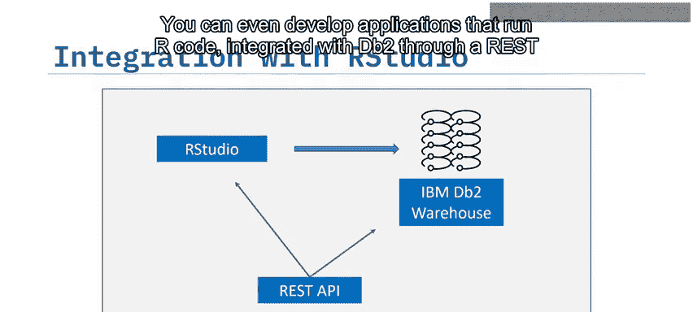

你可以使用 **RStudio** 连接 DB2 Warehouse 来分析、整理、建模和可视化数据。例如，你可以创建自己的 Docker 镜像，其中包含 RStudio 以及连接 DB2 Warehouse 所需的所有软件包和驱动程序。你甚至可以开发通过 **REST API** 与 DB2 集成的、运行 R 代码的应用程序。

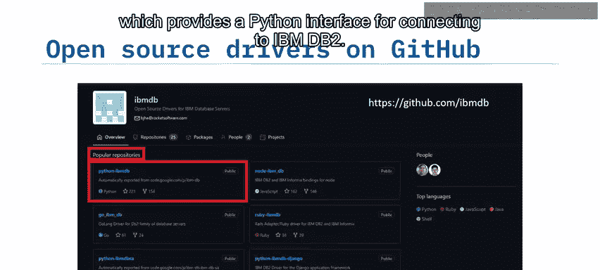

### 开源驱动程序

DB2 Warehouse 在 GitHub 的 **IBMDB2** 代码仓库中提供了一系列常用的开源驱动程序。例如，在热门仓库中，你可以找到 **`ibm_db`** Python 包，它提供了连接 IBM DB2 的 Python 接口。

## 总结

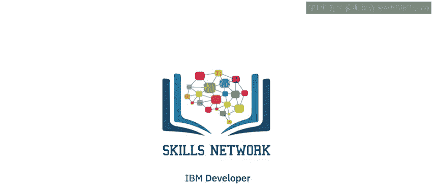

本节课中我们一起学习了 IBM DB2 Warehouse 的核心知识。我们了解到 IBM DB2 Warehouse 是一个云就绪、高度灵活的数据仓库平台。其关键特性包括**高速查询**、**弹性扩展**、**自动化模式生成**和**内置机器学习**功能。其主要适用场景包括**数据集成**和**数据集市的快速开发**。此外，DB2 Warehouse 能够与 **JDBC**、**Apache Spark**、**Python** 和 **RStudio** 等主流工具和框架深度集成。