# 005：数据集市概览 📊


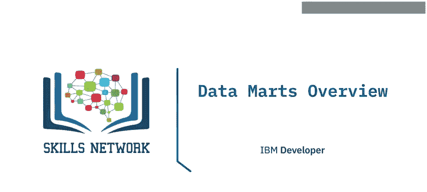

在本节课中，我们将要学习**数据集市**的核心概念。我们将了解数据集市是什么，它与事务型数据库和企业数据仓库有何不同，以及数据如何被加载到数据集中。

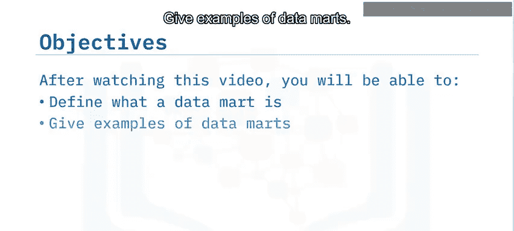

---

## 什么是数据集市？ 🎯

一个**数据集市**是大型企业数据仓库中一个独立的部分，它专门为特定的业务功能、目的或用户群体而构建。

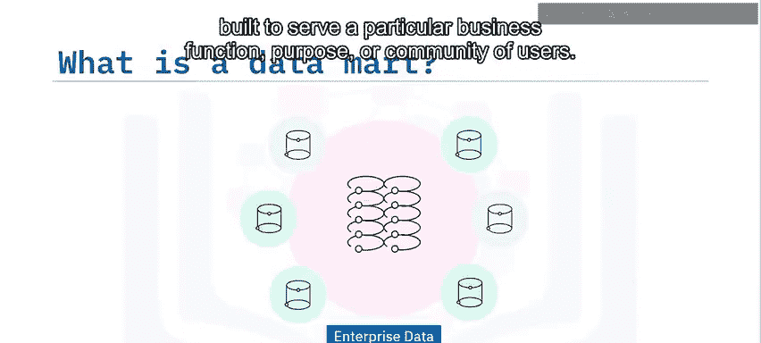

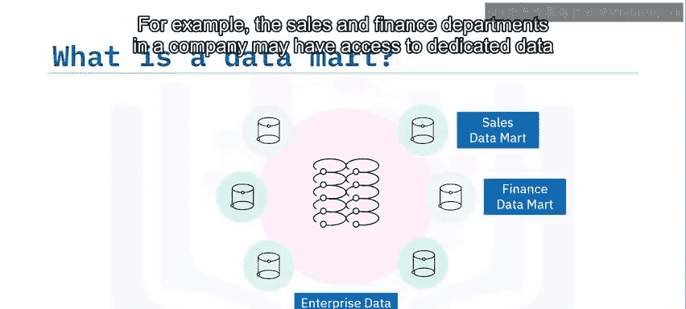

例如，公司的销售和财务部门可能有权访问专门的数据集市，这些数据集市为其季度销售报告和预测提供所需数据。营销团队可能使用数据集市来分析客户行为数据，而运输、制造和保修部门也可能拥有自己的数据集市。

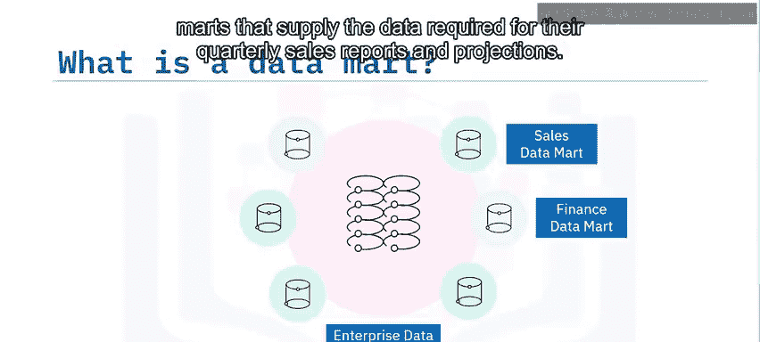

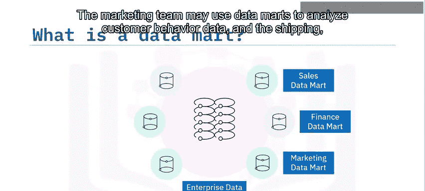

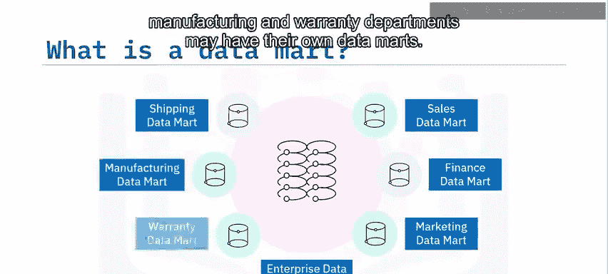

---

## 数据集市的用途与结构

上一节我们介绍了数据集市的定义，本节中我们来看看它的核心用途和典型结构。

数据集市旨在为制定战术决策提供特定的、及时的支持。因此，数据集市只关注最相关的数据，这为用户节省了在数据仓库中搜索洞察所需的时间和精力。

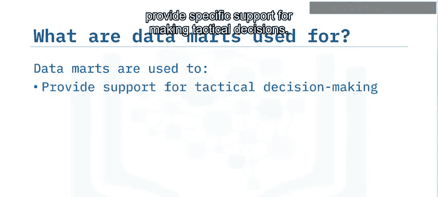

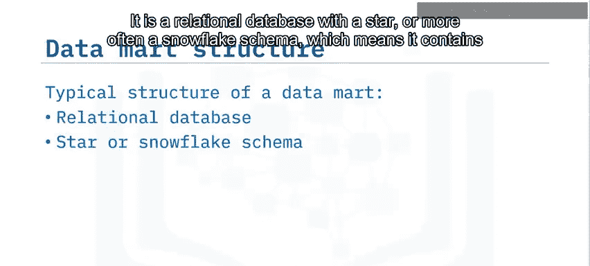

数据集市的典型结构如下：
它是一个采用**星型模式**或更常见的**雪花模式**的关系数据库。这意味着它包含一个中心**事实表**，该表由与业务流程相关的业务指标组成，周围环绕着提供事实背景的**维度表**层次结构。

**核心结构公式**：
```
数据集市 = 事实表 + 维度表（星型/雪花型模式）
```

---

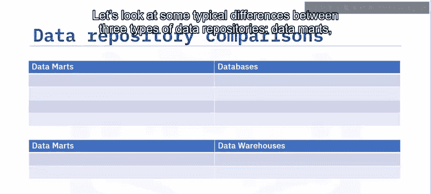

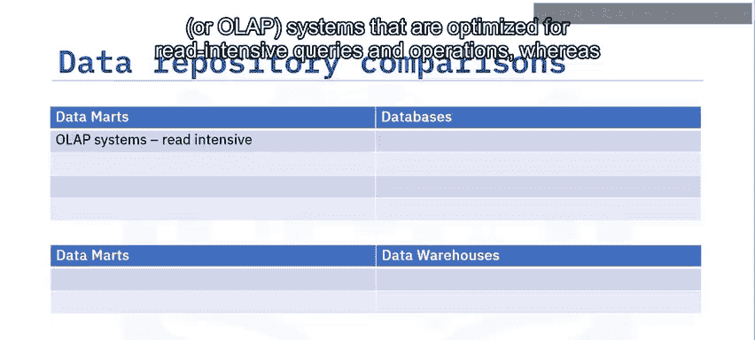

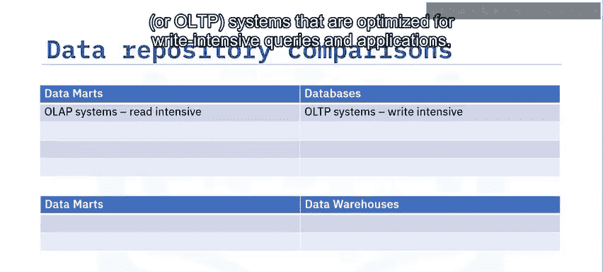

## 数据集市 vs. 事务型数据库 vs. 数据仓库

了解了数据集市的基本构成后，我们来比较三种常见的数据存储库：数据集市、事务型数据库和数据仓库。

以下是它们之间的主要区别：

*   **系统类型**：数据集市和数据仓库都属于**在线分析处理**系统，针对读取密集型查询和操作进行了优化。而事务型数据库属于**在线事务处理**系统，针对写入密集型查询和应用进行了优化。
*   **数据源**：数据集市使用事务型数据库或数据仓库作为数据源。事务型数据库的数据源则是销售点系统等运营应用程序。
*   **数据状态**：数据集市存储经过验证、转换和清理的数据。而数据库通常包含尚未清理的原始数据。
*   **数据历史**：数据集市积累可用于趋势分析的历史数据。事务型数据库可能并不总是存储旧数据。
*   **范围与性能**：数据集市类似于数据仓库，但战术范围更小。数据仓库广泛支持企业的战略需求。与可能非常庞大且因此较慢的数据仓库相比，数据集市更精简、更快速。

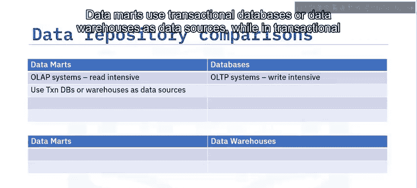

---

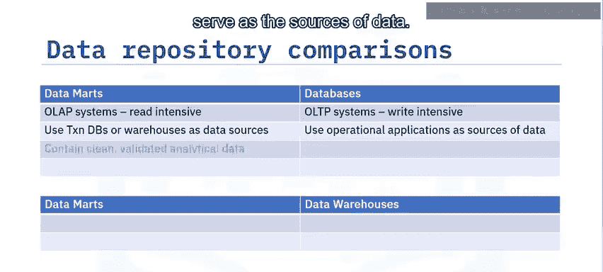

## 数据集市的类型

根据其与数据仓库的关系以及数据来源，数据集市可以分为三种基本类型。

以下是三种主要的数据集市类型：

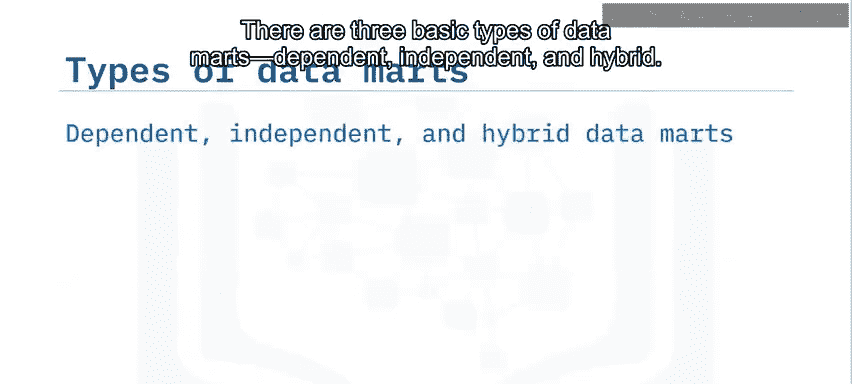

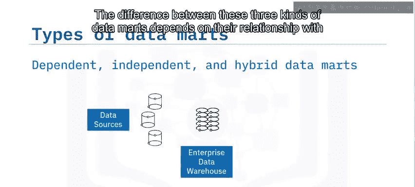


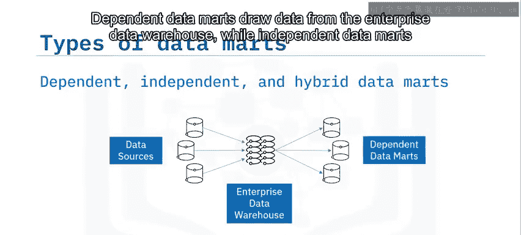

1.  **依赖型数据集市**：从企业数据仓库中提取数据。
2.  **独立型数据集市**：绕过数据仓库，直接从源系统（包括内部运营系统或来自供应商等企业外部的数据）创建。
3.  **混合型数据集市**：仅部分依赖于企业数据仓库。它们结合了来自数据仓库的输入以及来自运营系统和其他仓库外部系统的数据。

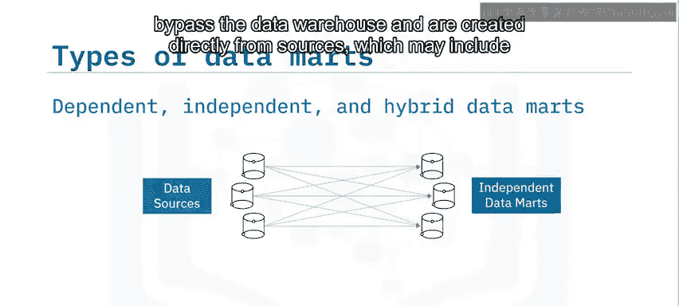

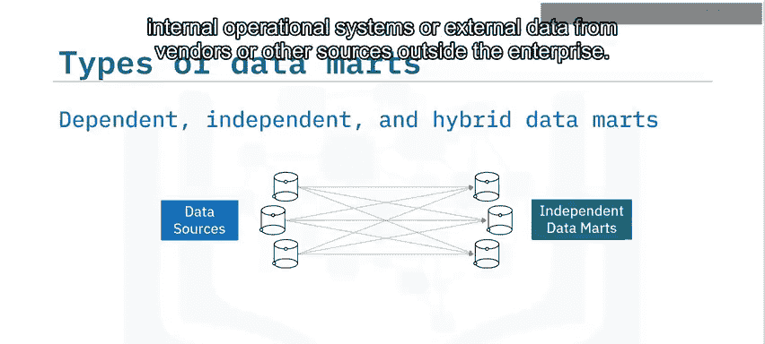

---

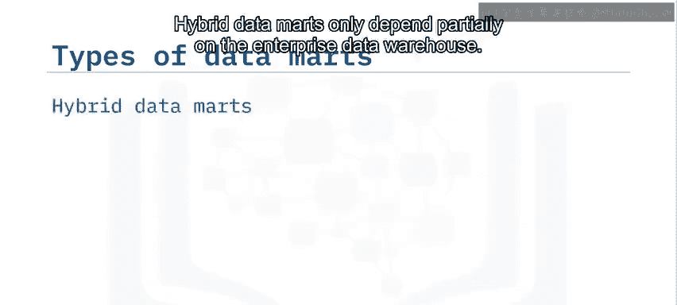

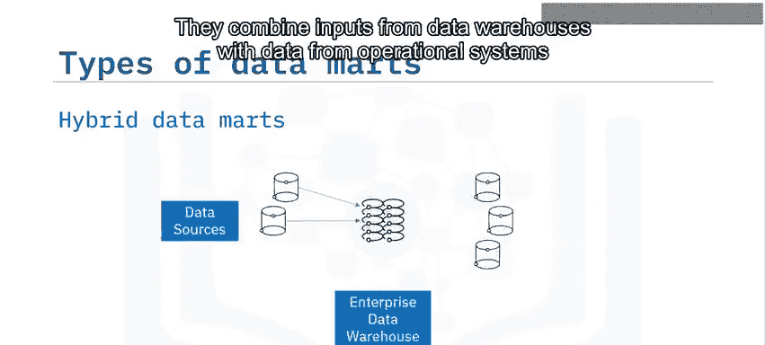

### 依赖型与独立型数据集市的特点

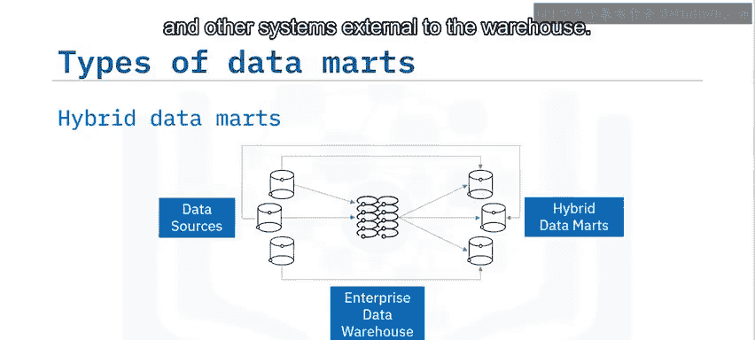

上一节我们列出了数据集市的类型，本节我们来详细看看依赖型和独立型的特点。

*   **依赖型数据集市**：在企业数据仓库的受限区域内提供分析能力，因此继承了企业数据仓库的安全性。由于依赖型数据集市直接从数据仓库（数据已在此清理和转换）提取数据，它们的数据管道往往比独立型数据集市更简单。
*   **独立型数据集市**：与依赖型不同，它们需要自定义的**提取、转换、加载**数据管道来对源数据执行转换和集成过程，因为数据直接来自运营系统和外部源。独立型数据集市可能还需要单独的安全措施。

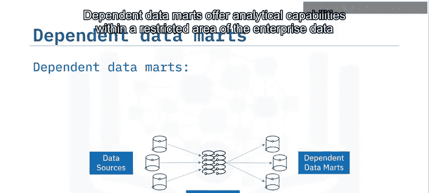

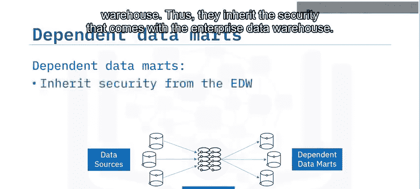

**数据管道代码示例（概念）**：
```python
# ETL 过程概览
extract(data_source) -> transform(clean, validate, integrate) -> load(data_mart)
```

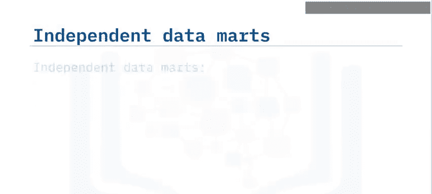

---

## 数据集市的核心价值

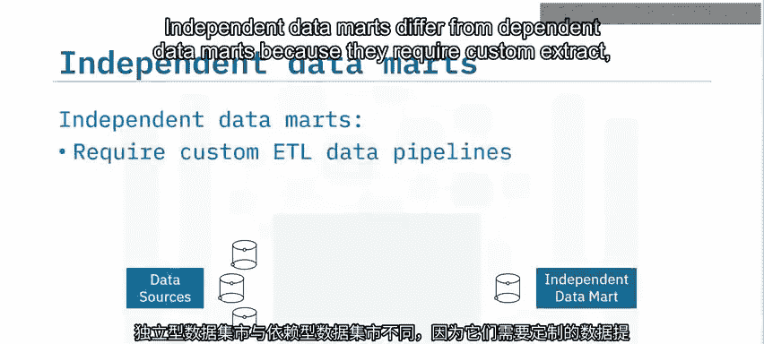

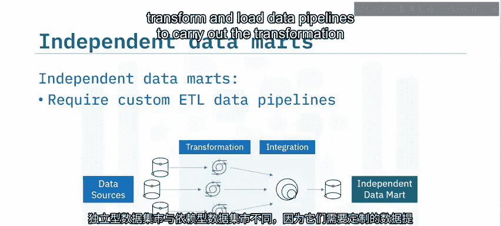

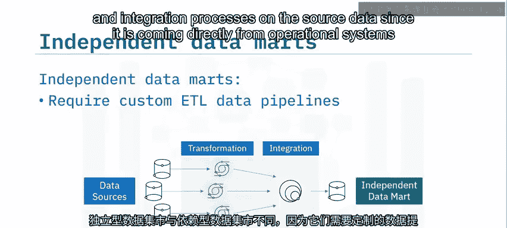

无论您拥有何种类型的数据集市，其目的都包含以下几点：

*   **提供相关数据**：在需要时为最终用户提供相关数据。
*   **加速业务流程**：通过提供高效的查询响应时间来加速业务流程。
*   **支持数据驱动决策**：提供一种经济高效的方法来支持数据驱动的决策。
*   **确保数据安全**：确保对数据的安全访问和控制。

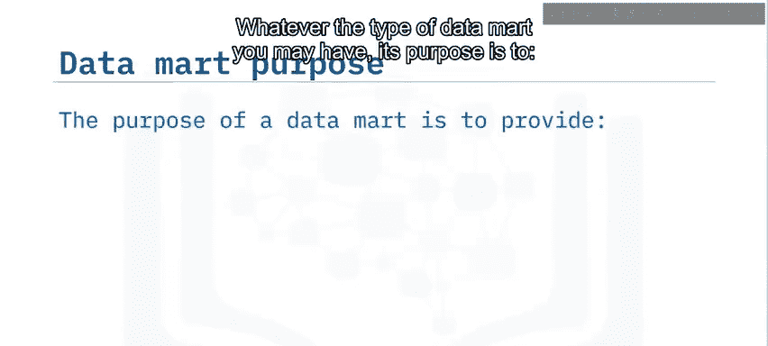

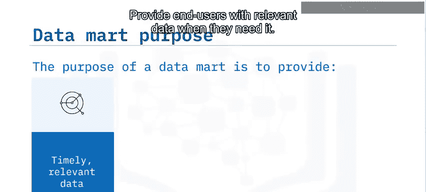

---

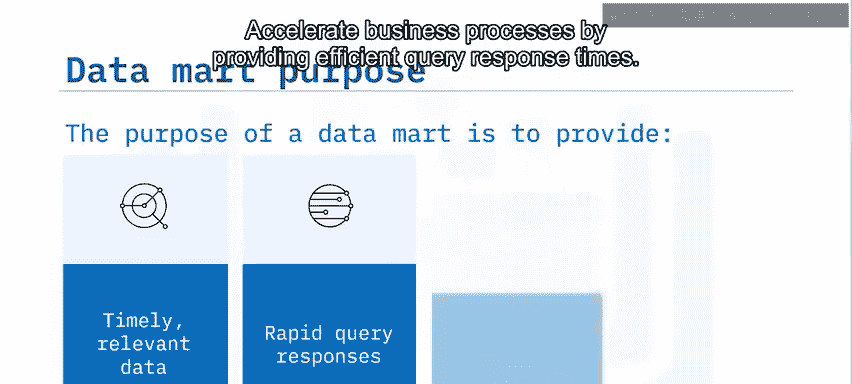

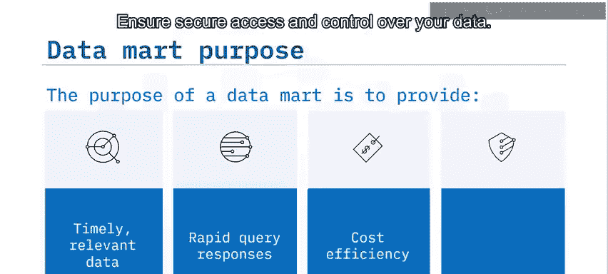

## 总结

本节课中我们一起学习了数据集市的核心知识。

我们了解到，**数据集市**是企业数据仓库中专门为特定业务功能、目的或用户群体构建的独立部分，旨在为战术决策提供特定、及时和快速的支持，通常采用星型或雪花型模式。

我们还了解到，与OLTP数据库不同，OLAP数据集市存储干净、已验证的数据并积累历史数据。


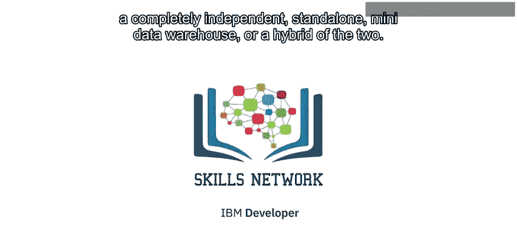

最后，我们可以根据数据集市对企业数据仓库的依赖程度对其进行分类：数据集市可以完全依赖于数据仓库（依赖型），可以是完全独立的独立迷你数据仓库（独立型），也可以是两者的混合体（混合型）。